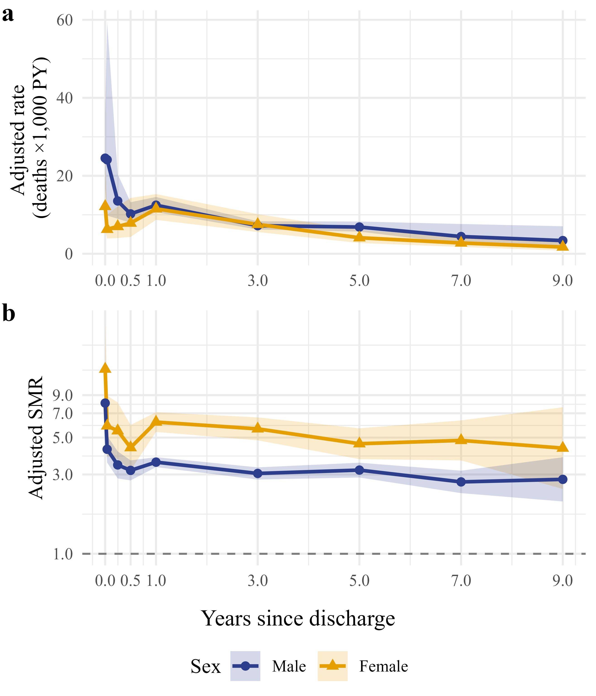

class: title-slide, middle, right, animated fadeOut


```{css, echo = F}
/* -------------------------------------------------------
 *
 *     !! This file was generated by xaringanthemer !!
 *
 *  Changes made to this file directly will be overwritten
 *  if you used xaringanthemer in your xaringan slides Rmd
 *
 *  Issues or likes?
 *    - https://github.com/gadenbuie/xaringanthemer
 *    - https://www.garrickadenbuie.com
 *
 *  Need help? Try:
 *    - vignette(package = "xaringanthemer")
 *    - ?xaringanthemer::style_xaringan
 *    - xaringan wiki: https://github.com/yihui/xaringan/wiki
 *    - remarkjs wiki: https://github.com/gnab/remark/wiki
 *
 *  Version: 0.4.2
 *
 * ------------------------------------------------------- */
@import url(https://fonts.googleapis.com/css?family=Arial:400,400i&display=swap);
@import url(https://fonts.googleapis.com/css?family=Arial+Narrow&display=swap);
@import url(https://fonts.googleapis.com/css?family=Arial+Narrow&display=swap);
@import url(https://fonts.googleapis.com/css?family=Arial+Narrow&display=swap);

:root {
  /* Fonts */
  --text-font-family: Arial;
  --text-font-is-google: 1;
  --text-font-family-fallback: -apple-system, BlinkMacSystemFont, avenir next, avenir, helvetica neue, helvetica, Ubuntu, roboto, noto, segoe ui, arial;
  --text-font-base: Arial;
  --header-font-family: 'Arial Narrow';
  --header-font-is-google: 1;
  --header-font-family-fallback: Arial;
  --code-font-family: 'Arial Narrow';
  --code-font-is-google: 1;
  --base-font-size: 20px;
  --text-font-size: 1rem;
  --code-font-size: 53%;
  --code-inline-font-size: 1em;
  --header-h1-font-size: 2.75rem;
  --header-h2-font-size: 2.25rem;
  --header-h3-font-size: 1.75rem;

  /* Colors */
  --text-color: #2f353b;
  --header-color: #666666;
  --background-color: #E6E6E6;
  --link-color: #003891;
  --text-bold-color: #D3771F;
  --code-highlight-color: rgba(255,255,0,0.5);
  --inverse-text-color: #E6E6E6;
  --inverse-background-color: #003891;
  --inverse-header-color: #E6E6E6;
  --inverse-link-color: #003891;
  --title-slide-background-color: #E6E6E6;
  --title-slide-text-color: #666666;
  --header-background-color: #003891;
  --header-background-text-color: #E6E6E6;
  --primary: #E6E6E6;
  --secondary: #003891;
}
/*lo agregué yo*/

html {
  font-size: var(--base-font-size);
}

body {
  font-family: var(--text-font-family), var(--text-font-family-fallback), var(--text-font-base);
  font-weight: 400;
  color: var(--text-color);
}
h1, h2, h3 {
  font-family: var(--header-font-family), var(--header-font-family-fallback);
  font-weight: 600;
  color: var(--header-color);
}
.remark-slide-content {
  background-color: var(--background-color);
  font-size: 1rem;
  background-image: url("https://raw.githack.com/AGSCL/DSPUCH/2ea0a44ec27a2ba516eb8639289645f106917631/_figs/2025PPT_ESP/Diapositiva2.SVG"); /* ./_figs/2025PPT_ESP/Diapositiva2.svg */
  background-size: contain  !important;  /* Ensures the entire image is visible : cover era la anterior */
  background-position: center !important;
  background-repeat: no-repeat !important;
  /*padding: 0.4em 2.4em 0.4em 2.4em;*/
  /*height: 100vh;  /* Ensures the slide takes full viewport height */
  /*width: 100vh;*/
  /*height: 100%;*/
}
.remark-slide-content h1 {
  font-size: var(--header-h1-font-size);
}
.remark-slide-content h2 {
  font-size: var(--header-h2-font-size);
}
.remark-slide-content h3 {
  font-size: var(--header-h3-font-size);
}
.remark-code, .remark-inline-code {
  font-family: var(--code-font-family), Menlo, Consolas, Monaco, Liberation Mono, Lucida Console, monospace;
}
.remark-code {
  font-size: var(--code-font-size);
}
.remark-inline-code {
  font-size: var(--code-inline-font-size);
  color: #003891;
}
.remark-slide-number {
  color: #2f353b;
  opacity: 1;
  font-size: 0.9rem;
}
strong {
  font-weight: bold;
  color: var(--text-bold-color);
}
a, a > code {
  color: var(--link-color);
  text-decoration: none;
}
.footnote {
  position: absolute;
  bottom: 60px;
  padding-right: 4em;
  font-size: 0.9em;
}
.remark-code-line-highlighted {
  background-color: var(--code-highlight-color);
}
.inverse {
  background-color: var(--inverse-background-color);
  color: var(--inverse-text-color);
  
}
.inverse h1, .inverse h2, .inverse h3 {
  color: var(--inverse-header-color);
}
.inverse a, .inverse a > code {
  color: var(--inverse-link-color);
}
.title-slide, .title-slide h1, .title-slide h2, .title-slide h3 {
  color: var(--title-slide-text-color);
}
.title-slide {
  background-color: var(--title-slide-background-color);
  background-image: url("https://raw.githack.com/AGSCL/DSPUCH/2ea0a44ec27a2ba516eb8639289645f106917631/_figs/2025PPT_ESP/Diapositiva1.SVG"); /* ./_figs/2025PPT_ESP/Diapositiva1.SVG */
  background-size: 100% auto !important; /* Ensures the entire image is visible : cover era la anterior */
  /*background-position: center top !important; */
  background-repeat: no-repeat;
  /*padding: 0.4em 2.4em 0.4em 2.4em;*/
  width: 100% !important;
  height: 100vh; 
}
.title-slide .remark-slide-number {
  display: none;
}
/* Two-column layout */
.left-column {
  width: 20%;
  height: 92%;
  float: left;
}
.left-column h2, .left-column h3 {
  color: #00389199;
}
.left-column h2:last-of-type, .left-column h3:last-child {
  color: #003891;
}
.right-column {
  width: 75%;
  float: right;
  padding-top: 1em;
}
.pull-left {
  float: left;
  width: 47%;
}
.pull-right {
  float: right;
  width: 47%;
}
.pull-right + * {
  clear: both;
}
img, video, iframe {
  max-width: 100%;
}
blockquote {
  border-left: solid 5px #00389180;
  padding-left: 1em;
}
.remark-slide table {
  margin: auto;
  border-top: 1px solid #666;
  border-bottom: 1px solid #666;
}
.remark-slide table thead th {
  border-bottom: 1px solid #ddd;
}
th, td {
  padding: 5px;
}
.remark-slide table:not(.table-unshaded) thead,
.remark-slide table:not(.table-unshaded) tfoot,
.remark-slide table:not(.table-unshaded) tr:nth-child(even) {
  background: #FCFCFC;
}
table.dataTable tbody {
  background-color: var(--background-color);
  color: var(--text-color);
}
table.dataTable.display tbody tr.odd {
  background-color: var(--background-color);
}
table.dataTable.display tbody tr.even {
  background-color: #FCFCFC;
}
table.dataTable.hover tbody tr:hover, table.dataTable.display tbody tr:hover {
  background-color: rgba(255, 255, 255, 0.5);
}
.dataTables_wrapper .dataTables_length, .dataTables_wrapper .dataTables_filter, .dataTables_wrapper .dataTables_info, .dataTables_wrapper .dataTables_processing, .dataTables_wrapper .dataTables_paginate {
  color: var(--text-color);
}
.dataTables_wrapper .dataTables_paginate .paginate_button {
  color: var(--text-color) !important;
}

/* Horizontal alignment of code blocks */
.remark-slide-content.left pre,
.remark-slide-content.center pre,
.remark-slide-content.right pre {
  text-align: start;
  width: max-content;
  max-width: 100%;
}
.remark-slide-content.left pre,
.remark-slide-content.right pre {a
  min-width: 50%;
  min-width: min(40ch, 100%);
}
.remark-slide-content.center pre {
  min-width: 66%;
  min-width: min(50ch, 100%);
}
.remark-slide-content.left pre {
  margin-left: unset;
  margin-right: auto;
}
.remark-slide-content.center pre {
  margin-left: auto;
  margin-right: auto;
}
.remark-slide-content.right pre {
  margin-left: auto;
  margin-right: unset;
}

/* Slide Header Background for h1 elements */
.remark-slide-content.header_background > h1 {
  display: block;
  position: absolute;
  top: 0;
  left: 0;
  width: 100%;
  background: var(--header-background-color);
  color: var(--header-background-text-color);
  /*padding: 2rem 2.4em 1.5rem 2.4em;*/
  margin-top: 0;
  box-sizing: border-box;
}
.remark-slide-content.header_background {
  padding-top: 7rem;
}

@page { margin: 0; }
@media print {
  .remark-slide-scaler {
    width: 100% !important;
    height: 100% !important;
    transform: scale(1) !important;
    top: 0 !important;
    left: 0 !important;
  }
}

.primary {
  color: var(--primary);
}
.bg-primary {
  background-color: var(--primary);
}
.secondary {
  color: var(--secondary);
}
.bg-secondary {
  background-color: var(--secondary);
}

.remark-slide-container {
  transition: transform 0.5s ease;
}

/* Extra CSS */
.remark-slide-scaler {
  overflow-y: auto;
}
.gray {
  color: #aaaaaa;
}
.red {
  color: #A4222B;
}
.darkgreen {
  color: #45503B;
}
.darkred {
  color: #591F0A;
}
.small {
  font-size: 90%;
}
.pull_c {
  float: center;
  width: 30%;
  height: 50%;
  padding-left: 40%;
}
.pull_c_title {
  height: 90%;
}
.pull_l_70 {
  float: left;
  width: 72%;
  font-size: 90%;
}
.pull_r_30 {
  float: right;
  width: 23%;
  font-size: 90%;
}
.pull_l_30 {
  float: left;
  width: 23%;
  font-size: 90%;
}
.pull_r_70 {
  float: right;
  width: 72%;
  font-size: 90%;
}
.pull_left {
  float: left;
  width: 47%;
  height: 100%;
  padding-right: 2%;
}
.pull_right {
  float: right;
  width: 47%;
  height: 100%;
  padding-left: 2%;
}
.small_left {
  float: left;
  width: 47%;
  height: 50%;
  padding-right: 2%;
}
.small_right {
  float: right;
  width: 47%;
  height: 50%;
  padding-left: 2%;
}
.algo_right {
  float: right;
  padding-left: 2%;
}
.left_code {
  float: left;
  width: 47%;
  height: 100%;
  padding-right: 2%;
  font: Roboto;
}
.code_out {
  float: right;
  width: 47%;
  height: 100%;
  padding-left: 2%;
  font: Roboto;
}
.text_180 {
  font-size: 180%;
}
.text_170 {
  font-size: 170%;
}
.text_160 {
  font-size: 160%;
}
.text_150 {
  font-size: 150%;
}
.text_140 {
  font-size: 140%;
}
.text_130 {
  font-size: 130%;
}
.text_120 {
  font-size: 120%;
}
.text_110 {
  font-size: 110%;
}
.text_110 {
  font-size: 110%;
}
.text_100 {
  font-size: 100%;
}
.code_10 {
  code-inline-font-size: 60%;
  overflow-y: scroll !important;
  overflow-x: scroll !important;
  max-height: 50vh !important;
  line-height: 0.75em;
}
.code_10_pre {
  code-inline-font-size: 60%;
  overflow-y: scroll !important;
  overflow-x: scroll !important;
  max-height: 15vh !important;
  line-height: 0.75em;
  min-height: 0.5em;
}
.code_15 {
  code-inline-font-size: 15%;
  overflow-y: scroll !important;
  overflow-x: scroll !important;
  max-height: 10vh !important;
}
.text_90 {
  font-size: 90%;
}
.text_80 {
  font-size: 80%;
}
.text_75 {
  font-size: 75%;
}
.text_70 {
  font-size: 70%;
}
.text_65 {
  font-size: 65%;
}
.text_62 {
  font-size: 62%;
}
.text_60 {
  font-size: 60%;
}
.text_50 {
  font-size: 50%;
}
.text_40 {
  font-size: 40%;
}
.text_30 {
  font-size: 30%;
}
.text_20 {
  font-size: 20%;
}
.line_space_15 {
  line-height: 1.5em;;
}
.line_space_13 {
  line-height: 1.3em;;
}
.line_space_11 {
  line-height: 1.1em;;
}
.line_space_15 {
  line-height: 1.5em;;
}
.line_space_09 {
  line-height: 0.9em;;
}
.line_space_07 {
  line-height: 0.7em;;
}
.line_space_05 {
  line-height: 0.5em;;
}
.largest {
  font-size: 2.488em;;
}
.larger {
  font-size: 2.074em;;
}
.large {
  font-size: 1.44em;;
}
.small {
  font-size: 0.833em;;
}
.smaller {
  font-size: 0.694em;;
}
.smallest {
  font-size: 0.579em;;
}
.limity150 {
  max-height: 150px;;
  overflow-y: auto;;
}
.tiny_text {
  font-size: 70%;
}
.large_text {
  font-size: 150%;
}
.slide_blue {
  background-color: #FEDA3F;
  color: #3C3C3B;
}
.bottom_center {
  margin: 0;
  position: absolute;
  top: 90%;
  left: 50%;
  -ms-transform: translate(-50%, -50%);
  transform: translate(-50%, -50%);
}
.bottom_center2 {
  margin: 0;
  position: fixed; /* Cambiar a 'fixed' para fijar la posición */
  bottom: 80px; /* Ajustar el valor para posicionarlo desde la parte inferior de la pantalla */
  left: 50%; /* Asegurar que esté centrado horizontalmente en la pantalla */
  transform: translateX(-50%); /* Centrarse horizontalmente */
}

.down_center {
  margin: 0;
  position: absolute;
  top: 80%;
  left: 50%;
  -ms-transform: translate(-50%, -50%);
  transform: translate(-50%, -50%);
}
.down_center2 {
  margin: 0;
  position: absolute;
  top: 98%;
  left: 50%;
  -ms-transform: translate(-50%, -50%);
  transform: translate(-50%, -50%);
}
.center_image {
  margin: 0;
  position: absolute;
  top: 50%;
  left: 50%;
  -ms-transform: translate(-50%, -50%);
  transform: translate(-50%, -50%);
}
.down_left {
  margin: 0;
  position: absolute;
  top: 80%;
  left: 22%;
  -ms-transform: translate(-50%, -50%);
  transform: translate(-50%, -50%);
}
.down_right {
  margin: 0;
  position: absolute;
  top: 80%;
  left: 72%;
  -ms-transform: translate(-50%, -50%);
  transform: translate(-50%, -50%);
}
slides > slide {
  overflow-x: auto !important;
  overflow-y: auto !important;
}
.superbigimage {
  white-space: nowrap;
  overflow-y: scroll;
}
/* https://www.garrickadenbuie.com/blog/better-progressive-xaringan/*/
.bold-last-item > ul > li:last-of-type,
.bold-last-item > ol > li:last-of-type {
  font-weight: bold;
}

.section{
  background-image: linear-gradient(#003891 90%, : #EF9D2F !important;/* background-color: #ff7f50; */
  background-size: contain  !important;  /* Ensures the entire image is visible : cover era la anterior */
  background-position: center !important;
  background-repeat: no-repeat !important;
}
.gradient-slide {
  background: linear-gradient(45deg, #003891, #EF9D2F); /* Adjust the colors and direction as needed */
  color: var(--background-color); /* Adjust text color for better contrast */
}

.scrollable-slide {
  overflow-y: auto;
  max-height: 80vh;
}

/* Incluye aquí el CSS proporcionado anteriormente */
table {
  width: 100%;
  border-collapse: collapse;
  font-size: 10px;
}

th, td {
  border: 1px solid #000;
  padding: 3px;
  margin: 0;
}

th {
  background-color: #e0e0e0;
}

th:nth-child(1), td:nth-child(1) {
  width: 20%;
}
th:nth-child(2), td:nth-child(2) {
  width: 15%;
}
th:nth-child(3), td:nth-child(3) {
  width: 65%;
}

.table-container {
  max-width: 100%;
  max-height: 500px;
  overflow-x: auto;
  overflow-y: auto;
}

.move-right {
  padding-left: 50px !important; /* Adjust the value as needed */
  padding-top: -20px !important;
  /* Alternatively, you can use margin-left */
  /* margin-left: 50px; */
}

.footnote2 {
/*  bottom: 60px;*/
  padding-right: 4em !important;
  font-size: 2.4px !important;
  font-style: italic !important;
}
/*https://pkg.garrickadenbuie.com/xaringanExtra/panelset/#1*/
.panelset {
  --panel-tab-foreground: currentColor;
  --panel-tab-active-foreground: #0051BA;
  --panel-tab-hover-foreground: #8b0000;
  --panel-tabs-border-bottom: #ddd;
  --panel-tab-inactive-opacity: 0.5;
  --panel-tab-font-family: Arial;\
}
.left-column2 {
    width: 30%;
    height: 92%;
    float: left;
}
.right-column2 {
  width: 69%;
  float: right;
  padding-top: 1em;
}
</style>

```

```{r setup_theme0, include = FALSE}
rm(list=ls());gc()
unlink("*_cache", recursive = TRUE)
if(!grepl("4.4.1",R.version.string)){stop("Different version (must be 4.4.1)")}
#, 'libs/my-theme.css'
#load(paste0(sub("$\\/","",sub("2019 \\(github\\)/SUD_CL","2022 \\(github\\)",here::here())),"/11_pres.RData"))
options(servr.daemon = TRUE)
```


```{r setup, include = FALSE}
local({r <- getOption("repos")
       r["CRAN"] <- "http://cran.r-project.org" 
       options(repos=r)
})
pacman::p_unlock(lib.loc = .libPaths()) #para no tener problemas reinstalando paquetes

if(!require(pacman)){install.packages("pacman")}
pacman::p_load(devtools, here, showtext, ggpattern, RefManageR, pagedown, magick, bibtex, DiagrammeR, xaringan, xaringanExtra, xaringanthemer, fontawesome, tidyverse, psych, cowplot, pdftools, compareGroups, tableone, ggiraph, distill, qrcode, pdftools, htmlwidgets, widgetframe, ggpubr, ggrepel, DiagrammeRsvg, rsvg, plotly, install=F)

#if(!require(xaringanBuilder)){devtools::install_github("jhelvy/xaringanBuilder",upgrade = "never")}
if(!require(renderthis)){devtools::install_github("jhelvy/renderthis",upgrade = "never")}
if(!require(icons)){remotes::install_github("mitchelloharawild/icons",upgrade = "never")}

test_fontawesome<- function(x="github"){
tryCatch({
  invisible(fontawesome::fa(name = x))
  return(message("fontawesome installed"))
},
# ... but if an error occurs, tell me what happened: 
error=function(error_message) {
  message("Installing fontawesome")
  icons::download_fontawesome()  
})
}

if(!require(emo)){devtools::install_github("hadley/emo");library(emo)} #https://github.com/hadley/emo

ok <- tryCatch({
  magick::magick_config()
  TRUE
}, error = function(e) FALSE)

if (!ok) {
  message("❗ magick not working — installing system dependencies...")
  system("sudo apt install -y libmagick++-dev imagemagick", intern = TRUE)
}


options(scipen=2) #display numbers rather scientific number

#:#:#:#:#:#:#:#:#:#:#:#:#:#:#:#:#:#:#:#:#:#:#:#:#:#:#:#:#:#:#:#:#:#:#:#:#:#:#:#:#:#:#:#:#:#:#:#:#:#:#:#:#:#:#:
#:#:#:#:#:#:#:#:#:#:#:#:#:#:#:#:#:#:#:#:#:#:#:#:#:#:#:#:#:#:#:#:#:#:#:#:#:#:#:#:#:#:#:#:#:#:#:#:#:#:#:#:#:#:#:

  vec_col<-c("#660600","#6F3930","#745248","#786B60","#E6E6E6","#738FBC","#003891","#3C5279","#786B60","#B48448","#EF9D2F","#D99155","#E3D1C2","#E0BC9E","#ABB0BF","#835F69","#5A0D13")
plot_prueba<-barplot(1:length(vec_col), col=vec_col)

options(htmltools.preserve.raw = FALSE)

#knitr::opts_chunk$set(comment = NA) # lo saqué pa probar por si
knitr::opts_chunk$set(dpi=720)
#options(htmltools.preserve.raw = FALSE)#A recent update to rmarkdown (in version 2.6) changed how HTML widgets are included in the output file to use pandoc's raw HTML blocks. Unfortunately, this feature isn't compatible with the JavaScript markdown library used by xaringan. You can disable this feature and resolve the issue with htmlwidgets in xaringan slides by setting
#https://stackoverflow.com/questions/65766516/xaringan-presentation-not-displaying-html-widgets-even-when-knitting-provided-t/65768952#65768952

xaringanExtra::use_scribble() #son los lapices
xaringanExtra::use_tile_view()
xaringanExtra::use_panelset()
xaringanExtra::use_editable(expires = 1)
#xaringanExtra::use_fit_screen()

check_code <- function(expr, available){
  if(available){
    eval(parse(text = expr))
  } else {
    expr
  }
}
path2<-getwd()
```
```{r, load_refs, include=F, eval=T, cache=FALSE}
Sys.setlocale("LC_ALL", "Spanish_Spain.1252")  # en Windows
library(RefManageR)
BibOptions(check.entries = FALSE,
           bib.style = "numeric",
           cite.style = "numeric",
           style = "markdown",
           super = TRUE,
           hyperlink = FALSE,
           dashed = FALSE)
warning(paste0("libreria_generica_utf8.bib"))

myBib <- ReadBib("libreria_generica_utf8.bib", check = FALSE,  .Encoding="UTF-8")
```

.move-right[
.line_space_15[ 
## .text_60[Predicción del tiempo a la readmisión y mortalidad en adultos<br>en tratamiento por trastornos por uso de sustancias en Chile:<br>Un estudio de cohorte retrospectivo de 10 años]
]

.line_space_11[

.bg-text[

.text_80[Director de tesis: Jay S. Kaufman<br>Co-director de tesis: Álvaro Castillo-Carniglia<br>Estudiante: Andrés González-Santa Cruz]

.text_50[gonzalez.santacruz.andres@gmail.com] [`r fontawesome::fa(name = "github")`](https://github.com/AGSCL) [`r fontawesome::fa(name = "orcid", fill="green")`](https://orcid.org/0000-0002-5166-9121)
]
]
]

???
*#_#_#_#_#_#_#_#_#_#_
**NOTA**
*#_#_#_#_#_#_#_#_#_#_

Muy Buenos días

A continuación, les voy a presentar el estado de avance de mi proyecto de tesis doctoral.

Acompañantes en este Proceso

- Tutor: el profesor Jay kaufman
- Co-Tutor: Álvaro Castillo

---
layout: true
class: animated fadeIn 
---
class: animated fadeIn 
## Índice

<br>

0. Objetivos actualizados

1. Primer Artículo

2. Segundo Artículo

3. Otras dimensiones

4. Plan de trabajo

5. Consideraciones

???
*#_#_#_#_#_#_#_#_#_#_
**NOTA INDICE**
*#_#_#_#_#_#_#_#_#_#_
A continuación mostraré la estructura de mi presentación: 

0) 1 diapo; 1) 3 ; 2) 2 ; 3) 3 ; 4) 2 ; 5) 2

0. Revisitar **Objetivos**, actualización

1. **Primer Artículo**: Métodos, Resultados Clave, Implicancias, Limitaciones, Estado

2. **Segundo Artículo**: Descriptivos, EPVs, One-hot encoding

3. Otras dimensiones de **avance**: Coordinación, infraestructura reproducible, documentación

4. **Plan de trabajo**: Rectificación a CEISH (OCT), Tiempo al evento por separado (OCT-NOV), Modelo multiestado (DIC-ENE), Redacción 2do artículo (FEB-MAR)   

5. **Reflexiones/Dudas/Instancia de conversación**: Primer artículo y truncamiento administrativo, Factibilidad de estratificar por sustancia ppal. de ingreso, Predictores y categorías con <5%, 

---
class: animated fadeIn 
## Objetivos

...desde 2010 a <span style="color:darkred"><strong>2020</strong></span>

.small[
- Tasa de incidencia mortalidad ✅

- Identificar un conjunto de factores predictores a la primera readmisión.

- Identificar un conjunto de factores predictores a la mortalidad.

- Predecir de manera concatenada y conjunta readmisión y mortalidad.
]

???
*#_#_#_#_#_#_#_#_#_#_
**NOTA**
*#_#_#_#_#_#_#_#_#_#_
A continuación mostraré la estructura de mi presentación: 

Evaluar el rol predictivo de la duración de la estadía y el resultado del tratamiento inicial, junto con otros factores pronósticos y predictivos de predisposición, necesidad percibida y facilitadores de atención, en la predicción del riesgo y el tiempo transcurrido a la primera readmisión y mortalidad por todas las causas en pacientes entre 18 y 64 años admitidos a tratamientos por TUS en Chile, desde 2010 a 2020.

**CLAVE**= Cambio a 2020 por dificultades para obtener información de fallecimientos en 2021 y 2022.

---
class: animated fadeIn 
## Exceso de mortalidad tras el<br>tratamiento por TUS en Chile (2010–2020)

.pull-left[
```{r diagrama-join, echo=F, echo=FALSE, fig.align="left", message=FALSE, warning=FALSE, dev.args=list(bg = 'transparent'), out.width=450, out.height=70}
grViz("
digraph {
  graph [rankdir = LR, splines=false, bgcolor=transparent, fontname = Helvetica]
  # quitar margen interno de nodos
  node [margin=0.03]
  # Usar rankdir TB pero organizar manualmente en horizontal
  node [shape = cylinder, style = filled, fillcolor = transparent, color = '#00389160']
  TTO [label = 'Tratamiento adultos\\npoblación general', width=3, height=1.2, fontsize = 28]
  MORT [label = 'Mortalidad', width=3, height=1.2, fontsize = 28]
  node [shape = box, style = filled, fillcolor = transparent, color = '#E6F2FF',
        fontname = Helvetica, fontsize = 28, width=3, height=1.2]
  JOIN [label = '⟕\\nID/RUN \nencriptado']
  # Forzar disposición horizontal con subgraphs
  subgraph cluster_horizontal {
    style=invis
    TTO -> JOIN -> MORT [style=invis, weight=10]
  }
  # Conexiones reales
  edge [color = '#2F6FBA', arrowsize = 0.95]
  TTO -> JOIN
  MORT -> JOIN
}
", width = 500, height = 70) # fontname = Helvetica, 
```

```{r lexis-paper1, echo=FALSE, fig.align="center", message=FALSE, warning=FALSE, error=T, dev.args=list(bg = 'transparent'), out.width=350, out.height=350, dpi=600}
library(Epi)
set.seed(2025)
n <- 10
# --- Simulación con restricciones ---
repeat {
  birth <- sample(1950:2002, n, replace = TRUE)        # años de nacimiento
  entry_min <- pmax(2010, birth + 18)
  entry_max <- pmin(2019.5, birth + 64 - 0.25)         # margen para duración > 0
  ok <- entry_min < entry_max
  if (all(ok)) break
}
entry    <- runif(n, entry_min, entry_max)
exit_cap <- pmin(2020, birth + 64)                     # no pasar de 64 años ni de 2020
exit     <- pmin(entry + runif(n, 0.5, 6), exit_cap)   # seg. ~0.5 a 6 años, con tope
fail     <- rbinom(n, 1, 0.4)                          # 1=evento, 0=censura
id       <- sprintf("P%02d", seq_len(n))
# --- SEXO (ejemplo) ---
sex <- factor(sample(c("hombre","mujer"), n, replace = TRUE),
              levels = c("hombre","mujer"))
# --- Edades (años) ---
age_in  <- entry - birth
age_out <- exit  - birth
# --- Estados de entrada/salida (para evitar el NOTE) ---
exit.status  <- factor(fail, levels = c(0,1), labels = c("cens","event"))
entry.status <- factor(rep("cens", n), levels = levels(exit.status))
# --- Objeto Lexis con escalas explícitas ---
Lx <- suppressMessages(Lexis(
  entry = list(per = entry, age = age_in),
  exit  = list(per = exit,  age = age_out),
  entry.status = entry.status,   # <- definido arriba
  exit.status  = exit.status,    # <- definido arriba
  id = id
))
# Añadir sexo (se hereda al hacer split)
Lx$sex <- sex[match(Lx$lex.id, id)]
# --- Split por bandas de edad ---
age_breaks <- c(18, 30, 45, 60, 64)
Lx_split <- splitLexis(Lx, breaks = age_breaks, time.scale = "age")
# Banda de edad (edad al inicio del tramo)
Lx_split$age_band <- cut(
  Lx_split$age,
  breaks = age_breaks,
  right = FALSE,
  include.lowest = TRUE,
  labels = c("18-29", "30-44", "45-59", "60+")
)
# --- Estética: color por edad, tipo de línea por sexo ---
cols_map <- c("18-29"="#1f77b4","30-44"="#EF9D2F","45-59"="#786B60","60+"="#5A0D13")
cols    <- cols_map[as.character(Lx_split$age_band)]

lty_map <- c("hombre" = 1, "mujer" = 2)
lty     <- lty_map[as.character(Lx_split$sex)]
# --- Diagrama de Lexis (límites fijos 2010–2020 y 18–65) ---
par(mar = c(4, 4, 1, 1))   # márgenes más pequeños
plot(
  Lx_split,
  time.scale = c("per","age"),
  type = "n",
  grid = TRUE,
  xlim = c(2010, 2020),
  ylim = c(18, 64),
  xlab = "Año calendario",
  ylab = "Edad",
  xaxs = "i", yaxs = "i",
  cex.lab = 1.4,    # tamaño de las labels (xlab, ylab)
  cex.axis = 1.2,   # tamaño de los números de los ejes
  font.lab = 2      # 1=normal, 2=negrita
)
lines(Lx_split, col = cols, lwd = 3, lty = lty)

legend("bottomleft",
       inset = 0.02, title = "Banda de edad",
       col = cols_map, lwd = 3, bty = "n",
       legend = names(cols_map))
legend("left",
       inset = 0.02, title = "Sexo",
       lty = lty_map, lwd = 3, bty = "n",
       legend = names(lty_map))
```
]

.pull-right[
<details>
<summary>🔬 Ver más detalles</summary>
```{r flowchart-paper1, echo=FALSE, fig.align="center", message=FALSE, warning=FALSE, dev.args=list(bg = 'transparent'), fig.cap="Diagrama de flujo", out.width=450}
library(DiagrammeR)
gr<-
  grViz("
    digraph flowchart {
      graph [layout = dot, rankdir = TB, bgcolor = 'transparent']
      # General node styling
      node [fontname = Times, shape = rectangle, fontsize = 33, style = filled, fillcolor = transparent]
      # Main flow nodes
      original [label = 'Original Database\\n(n = 150,046;\\nPatients = 106,283)', fillcolor = lightgray]
      c1_dataset [label = 'Database\\n(n = 146,012;\\nPatients = 103,612)']
      after_discard [label = 'Database\\n(n = 88,774;\\nPatients = 88,774)']
      after_discard2 [label = 'Database\\n(n = 74,470;\\nPatients = 74,470)']
      final_dataset [label = 'Final Database\\n(n = 70,064;\\nPatients = 70,064)', fillcolor = lightgray]
      # Discard nodes (aligned between main flow steps)
      discard_referrals [label = '&#8226;Duplicates in admission age and hash key\\l  and validating days in treatment (n= 54);\\l  Records with unavailable missing days in\\l  treatment (eg., currently in treatment): 4,007\\l&#8226;Records with negative days in treatment: 8;\\l>3 yrs. in treatment: 1,039)\\l']
      discard_duplicates [label = '&#8226;Restricting treatments of patients admitted\\l  between 2010-2019; having 18-64 years at\\l  admission: 57,240\\l']
      discard_single [label = '&#8226;Discarded (death, no tr. compliance): 14,304 \\l']
      discard_single2 [label = '&#8226;Discarded missing values in sex, discharge and \\ldeath dates and negative follow-up periods: 4,406\\l']
      # Invisible vertices for middle line
      v1 [shape = point, width = 0, style = invis]
      v2 [shape = point, width = 0, style = invis]
      v3 [shape = point, width = 0, style = invis]
      v4 [shape = point, width = 0, style = invis]
      # Main flow edges (vertical line)
      original -> v1 [arrowhead = none]
      v1 -> c1_dataset
      c1_dataset -> v2 [arrowhead = none]
      v2 -> after_discard
      after_discard ->v3  [arrowhead = none]
      v3 -> after_discard2
      after_discard2 -> v4 [arrowhead = none]
      v4 -> final_dataset
      # Discard connections (from the middle line)
      v1 -> discard_referrals
      v2 -> discard_duplicates
      v3 -> discard_single
      v4 -> discard_single2
      # Alignment
      { rank = same; discard_referrals; v1 }
      { rank = same; discard_duplicates; v2 }
      { rank = same; discard_single; v3 }
      { rank = same; discard_single2; v4 }
    }
  ", 
  width = 1000*.28,
  height = 1400*.28)
gr
```
</details>

```{r flowchart-seguimiento-paper1, echo=FALSE, fig.align="center", message=FALSE, warning=FALSE, dev.args=list(bg = 'transparent'), out.width=350, out.height=100}
grViz("
digraph {
  graph [rankdir = LR, fontsize = 20, fontname = Helvetica, splines=true, nodesep  = 0.035,
          labelloc = t, bgcolor=transparent]
  
  node [shape = box, style = rounded, fontname = Helvetica]
  INICIO [label = 'Primer tratamiento']
  FALLECIMIENTO [label = 'Fallecimiento']
  FIN2020 [label = '31-Dic-2020']
  
  edge [color = '#2F6FBA', arrowsize = 0.9]
  INICIO -> FALLECIMIENTO
  INICIO -> FIN2020
  
  {rank=same; FALLECIMIENTO; FIN2020}
}
",
  width = 350,
height = 100)
```

```{r CIE-10-paper1, echo=FALSE, fig.align="center", message=FALSE, warning=FALSE, dev.args=list(bg = 'transparent'), out.width=400}
grViz("
digraph causas {
  graph [layout = dot, rankdir = TB, bgcolor=transparent]

  node [shape = box, style = filled, fontname = Helvetica, fontsize = 14]

  A [label='Todas las causas', fillcolor='#003891', color='#5A0D13', penwidth=2,fontcolor=white]
  B [label='Por familia de causas\\n(capítulos)', fillcolor='#ABB0BF', color='#5A0D13']
  C [label='Causas externas', fillcolor='#E0BC9E', color='#D99155', penwidth=2]

  D [label='Suicidios\\nX60–X84', fillcolor='#660600', color='#6F3930',fontcolor=white]
  E [label='Homicidios\\nX85–Y09', fillcolor='#835F69', color='#3C5279',fontcolor=white]
  F [label='Accidentes de tránsito\\nV01–V99', fillcolor='#E3D1C2', color='#745248']
  G [label='Otras causas externas\\nW00–X59', fillcolor='#E6E6E6', color='#786B60']

  A -> B
  A -> C
  C -> D
  C -> E
  C -> F
  C -> G
}
",
width = 400, height = 230)
```


]

???
*#_#_#_#_#_#_#_#_#_#_
**NOTA**
*#_#_#_#_#_#_#_#_#_#_

- **Ajuste**= SEXO + tramos de edad (18–29, 30–44, 45–59, 60+). EL formato **Lexis** permite que los individuos a medida que van siendo seguidos se vayan desplazando por el calendario o los tramos de edad. 
- eso permite calcular muertes esperadas con la tasa adecuada para cada tramo. **Por ejemplo**, la mujer ID28 transita del 2014  de un tramo de edad (18-29) al otro (30-44) 

- (**No leer**)La lógica de esto es que la gente que va avanzando en el periodo de seguimiento, por eso la configuración hasta 75 años al seguimiento (a los 10 años). Pero todo bien. #load("G:/My Drive/Alvacast/SISTRAT 2023/data/20241015_out/mort_2025_08_21.Rdata"); clean_df |> filter(disch_age_rec>65) |> select(hash_key,  adm_date_rec2, disch_date_rec6, disch_age_rec) |> arrange(desc(disch_age_rec))

- **Resultados**: fallecimiento por todas las causas, de acuerdo a códigos CIE 10 (Clasificación Internacional de Enfermedades, 10.ª Revisión).
  + Por familia de causas: principalmente por capítulos.
    &nbsp;&nbsp;- A00–B99 Infecciosas y parasitarias  
    &nbsp;&nbsp;- C00–C97 Neoplasias malignas  
    &nbsp;&nbsp;- E00–E90 Endocrinas y metabólicas  
    &nbsp;&nbsp;- F00–F99 Mentales y del comportamiento  
    &nbsp;&nbsp;x|- G00–G99 Del sistema nervioso  
    &nbsp;&nbsp;- I00–I99 Del sistema circulatorio  
    &nbsp;&nbsp;- J00–J99 Del sistema respiratorio  
    &nbsp;&nbsp;- K00–K93 Del sistema digestivo  
    &nbsp;&nbsp;- R00–R99 Síntomas y signos  
    &nbsp;&nbsp;- Capítulos con baja representación (1.8% en total)  
  + Causas externas: $`r Cite(myBib, "conaset2020defunciones")`$
    &nbsp;&nbsp;- X60–X84 Lesiones auto infligidas intencionalmente (suicidios)
    &nbsp;&nbsp;- X85–Y09 Agresiones (homicidios)
    &nbsp;&nbsp;- V01–V99 Accidentes de tránsito
    &nbsp;&nbsp;- W00–X59 Otras causas externas de traumatismos accidentales

- a U00–U85  Códigos para propósitos especiales no fueron considerados. Otras causas externas fueron descartadas por representar el 0.2% de las causas externas:
  - Y85–Y89 Secuelas de causas externas de morbilidad y de mortalidad
  - Y40–Y84 Complicaciones de la atención médica y quirúrgica

- No tomé la mx= tasa cruda de defunción central; si no que calculé el riesgo instantáneo para el intervalo $$\lambda_{x}= -log(1-q_x)/n$$, siendo q_x la probabilidad de fallecimiento en el intervalo. De todas formas dio algo muy similar.

---
class: animated fadeIn 
## Exceso de mortalidad tras el<br>tratamiento por TUS en Chile (2010–2020)

.pull_l_70[
```{r res-desc, eval=T, echo=F, include= F, error=T, fig.align='center', warning=FALSE, message=FALSE, results='hide'}
# Define colors
colors <- c("#FFCC00", "#FF4500", "#1E40AF", "#FF7F50", "#21177A")

# First plot with magick
image1 <- magick::image_annotate(
    magick::image_read("_figs/people.png"), 
    text = "n=70.064", 
    size = 65, 
    gravity = "south", 
    font = "Baloo Bhai 2", 
    color = "black")|>
    #magick::image_crop("99%x99%+10+10") %>% # Crop a small portion from the borders
    magick::image_trim()|>
    magick::image_colorize(opacity = 100, color = "#21177A")|>
    magick::image_border(color = "white", geometry = "0x50")

# Second plot with plotly
plot2 <- data.frame(category = c("Hombres", "Mujeres"),
    value = c(76, 24)) %>%
    mutate(label = paste0(category, ":\n", round(value, 1), "%")) %>% 
    plotly::plot_ly(
        labels = ~category, 
        values = ~value, 
        type = 'pie',
        hole = 0.4,
        textposition = 'outside',
        textinfo = 'text',
        text = ~label, 
        automargin = TRUE,
        sort = FALSE,
        direction = "clockwise",
        textfont = list(size = 48),
        marker = list(colors = c(gray.colors(4)[2], colors[3]))
    ) %>%
    plotly::layout(
        yaxis = list(showgrid = FALSE, zeroline = FALSE, showticklabels = TRUE),
        showlegend = FALSE
    )
# Save the second plot as an image
suppressMessages(htmlwidgets::saveWidget(plot2, "_figs/plot2.html"))
pagedown::chrome_print(
  input  = paste0("file://", normalizePath("_figs/plot2.html")),
  output = "_figs/plot2.png",
  format = "png"
)

# Third plot with magick
image3 <- magick::image_read("_figs/aging.webp")|>
    magick::image_convert("png")|>                       # asegura canal alfa
    magick::image_trim(fuzz = 10)|>                      # recorta bordes casi blancos (opcional)
    magick::image_transparent("white", fuzz = 15)|>      # un solo paso p/ blancos y grises claros
    magick::image_annotate(
        text    = "Edad ingreso, Mediana\n39 [IQR: 33–48]\n354 mil años-persona(AP)",
        size    = 83,
        gravity = "south",
        font    = "Baloo Bhai 2",                   # usa otra fuente si no está instalada
        color   = "#4E5C68")|>
    magick::image_trim()|>
    magick::image_resize("50%")

combined_image <- magick::image_append(c(
    image1,
    magick::image_read("_figs/plot2.png")|> magick::image_resize("90%"),
    image3
), stack = FALSE)|>
  magick::image_transparent("white", fuzz = 15)
```

```{r res-desc-output, eval=T, echo=F, error=F, fig.align='center', fig.retina=2, message=FALSE, warning=FALSE, out.height="95%", out.width="95%", dpi=600}
# Display combined image
suppressMessages(combined_image)
```


```{r res-desc2, eval=T, echo=F, include= F, error=T, fig.align='right', warning=FALSE, message=FALSE, results='hide'}
digestive <- magick::image_read("_figs/digestivo.svg")|>
    magick::image_convert(format = "png")|>   
    magick::image_background("white", flatten = TRUE)|> # <- asegura fondo visible|>
    magick::image_trim(fuzz = 10)|>                      # recorta bordes casi blancos (opcional)
    magick::image_transparent("white", fuzz = 15)|>      # un solo paso p/ blancos y grises claros
  magick::image_border(color = "white", geometry = "0x50")|> 
 magick::image_background("none")|>          # conserva transparencia
  magick::image_channel("gray")|> 
  magick::image_annotate(
        text    = "x6",
        size    = 70,
        gravity = "south",
        location = "+0-14",
        font    = "Baloo Bhai 2",                   # usa otra fuente si no está instalada
        color   = "#4E5C68")
homicide <- magick::image_read("_figs/homicidio.svg")|>
    magick::image_convert(format = "png")|>   
    magick::image_background("white", flatten = TRUE)|> # <- asegura fondo visible|>
    magick::image_trim(fuzz = 10)|>                      # recorta bordes casi blancos (opcional)
    magick::image_transparent("white", fuzz = 15)|>      # un solo paso p/ blancos y grises claros
  magick::image_border(color = "white", geometry = "0x50")|> 
 magick::image_background("none")|>          # conserva transparencia
  magick::image_channel("gray")|> 
  magick::image_annotate(
        text    = "x4",
        size    = 45,
        gravity = "south",
        font    = "Baloo Bhai 2",                   # usa otra fuente si no está instalada
        color   = "#4E5C68")
suicide <- magick::image_read("_figs/suicide.svg")|>
    magick::image_convert(format = "png")|>   
    magick::image_background("white", flatten = TRUE)|> # <- asegura fondo visible|>
    magick::image_trim(fuzz = 10)|>                      # recorta bordes casi blancos (opcional)
    magick::image_transparent("white", fuzz = 15)|>      # un solo paso p/ blancos y grises claros
  magick::image_border(color = "white", geometry = "0x50")|> 
 magick::image_background("none")|>          # conserva transparencia
  magick::image_channel("gray")|> 
  magick::image_annotate(
        text    = "x5",
        size    = 60,
        gravity = "south",
        font    = "Baloo Bhai 2",                   # usa otra fuente si no está instalada
        color   = "#4E5C68")

respiratory <- magick::image_read("_figs/pulmones.svg")|>
    magick::image_convert(format = "png")|>
    magick::image_background("white", flatten = TRUE)|> # <- asegura fondo visible|>
    magick::image_trim(fuzz = 10)|>                      # recorta bordes casi blancos (opcional)
    magick::image_transparent("white", fuzz = 15)|>      # un solo paso p/ blancos y grises claros
  magick::image_border(color = "white", geometry = "0x50")|> 
 magick::image_background("none")|>          # conserva transparencia
  magick::image_channel("gray")|> 
  magick::image_annotate(
        text    = "x4",
        size    = 45,
        gravity = "south",
        font    = "Baloo Bhai 2",                   # usa otra fuente si no está instalada
        color   = "#4E5C68")
infectuous<- 
magick::image_read("_figs/infecciosas.svg")|>
    magick::image_convert(format = "png")|>
    magick::image_background("white", flatten = TRUE)|> # <- asegura fondo visible|>
    magick::image_trim(fuzz = 10)|>                      # recorta bordes casi blancos (opcional)
    magick::image_transparent("white", fuzz = 15)|>      # un solo paso p/ blancos y grises claros
  magick::image_border(color = "white", geometry = "0x50")|> 
 magick::image_background("none")|>          # conserva transparencia
  magick::image_channel("gray")|> 
  magick::image_annotate(
        text    = "x3",
        size    = 60,
        gravity = "south",
        font    = "Baloo Bhai 2",                   # usa otra fuente si no está instalada
        color   = "#4E5C68")

# 2) Calcula el ancho máximo y “acolcha” cada imagen a ese ancho (sin deformar)
imgs <- c(
  digestive,
  suicide,
  homicide   |> magick::image_resize("120%"),
  respiratory|> magick::image_resize("120%"),
  infectuous |> magick::image_resize("85%")
)

max_w <- max(magick::image_info(imgs)$width)

imgs_pad <- lapply(seq_along(imgs), function(i){
  magick::image_extent(
    imgs[i],
    geometry = paste0(max_w, "x"),  # mismo ancho, alto libre
    color = "none",
    gravity = "center"               # centra la imagen en el lienzo
  )
}) |> do.call(what = c)    

combined_image2 <- magick::image_append(c(
imgs_pad
), stack = FALSE)|>
  magick::image_transparent("white", fuzz = 15)
```

```{r res-desc2-output, eval=T, echo=F, error=F, fig.align='right', fig.retina=2, message=FALSE, warning=FALSE, out.height="95%", out.width="95%", dpi=600}
# Display combined image
suppressMessages(combined_image2)
```
]
.pull_r_30[
<details>
<summary>🔬 Ver más detalles</summary>
```{r "figura1-paper1", echo=FALSE, dev.args = list(bg = 'transparent'), fig.align="center", out.width=330, message=F, warning=F, fig.cap= "Tasas y SMRs por tiempo post-tratamiento"}

```
</details>

<details open>
<summary>📦 Ocultar</summary>
```{r "figura2-paper1", echo=FALSE, dev.args = list(bg = 'transparent'), fig.align="center", out.width=150, message=F, warning=F, out.height=350}
women<- 
magick::image_read("_figs/woman3.svg")|>
    magick::image_convert(format = "png")|>
    magick::image_background("white", flatten = TRUE)|> # <- asegura fondo visible|>
    magick::image_trim(fuzz = 10)|>                      # recorta bordes casi blancos (opcional)
    magick::image_transparent("white", fuzz = 15)|>      # un solo paso p/ blancos y grises claros
  magick::image_border(color = "white", geometry = "20x50")|> 
 magick::image_background("none")|>          # conserva transparencia
  magick::image_channel("gray")|> 
  magick::image_annotate(
        text    = "x5.5",
        size    = 60,
        location = "+0+135",
        gravity = "south",
        font    = "Baloo Bhai 2",                   # usa otra fuente si no está instalada
        color   = "#4E5C68")
women <- women |> 
   magick::image_crop(
    geometry = sprintf("%dx%d+0+0", 
                       magick::image_info(women)$width,
                       magick::image_info(women)$height - 25)  )
oh<- 
magick::image_read("_figs/bottles.svg")|>
    #magick::image_extent("120%x120%+30+40", gravity = "northwest")|>
    magick::image_convert(format = "png")|>
    magick::image_resize("70%")|>
    magick::image_background("white", flatten = TRUE)|> # <- asegura fondo visible|>
    magick::image_trim(fuzz = 10)|>                      # recorta bordes casi blancos (opcional)
    magick::image_transparent("white", fuzz = 15)|>      # un solo paso p/ blancos y grises claros
  magick::image_border(color = "white", geometry = "0x35")|> 
  magick::image_background("none")|>          # conserva transparencia
  magick::image_channel("gray")|> 
  magick::image_background(color = "none")|>     # "none" = transparente
  magick::image_transparent(color = "white")|>   # convierte blanco a transparente
  magick::image_modulate(brightness = 60)|> 
  magick::image_annotate(
        text    = "x4.7",
        size    = 45,
        location = "+0+105",
        gravity = "south",
        font    = "Baloo Bhai 2",                   # usa otra fuente si no está instalada
        color   = "#4E5C68")

res<- 
magick::image_read("_figs/residencial.svg")|>
    magick::image_convert(format = "png")|>
    magick::image_background("white", flatten = TRUE)|> # <- asegura fondo visible|>
    magick::image_trim(fuzz = 10)|>                      # recorta bordes casi blancos (opcional)
    magick::image_transparent("white", fuzz = 15)|>      # un solo paso p/ blancos y grises claros
  magick::image_border(color = "white", geometry = "15x22")|> 
 magick::image_background("none")|>          # conserva transparencia
  magick::image_channel("gray")|> 
  magick::image_annotate(
        text    = "x4.8",
        size    = 50,
        location = "-2-95",
        gravity = "east",
        font    = "Baloo Bhai 2",                   # usa otra fuente si no está instalada
        color   = "#4E5C68")

# Suponiendo que ya tienes: women, res, oh (como objetos magick)
imgs <- c(women|> magick::image_resize("140%"), 
          res|> magick::image_resize("90%"), 
          oh|> magick::image_resize("110%")
          )
# Obtener la altura máxima (opcional, pero útil si quieres alineación perfecta)
# En vertical, lo más común es igualar el ANCHO para que queden alineadas
max_width <- max(magick::image_info(imgs)$width)
# Asegurar que todas tengan el MISMO ANCHO y estén centradas horizontalmente
imgs_padded <- lapply(imgs, function(im) {
  magick::image_extent(
    im,
    geometry = paste0(max_width, "x"),  # mismo ancho
    gravity = "center",                 # centra horizontalmente (clave para vertical)
    color = "none"
  )
}) |> do.call(what = c)
# Combinar VERTICALMENTE (stack = TRUE)
combined_image3_v <- magick::image_append(imgs_padded, stack = TRUE)
# Opcional: recortar márgenes externos
combined_image3_v <- magick::image_trim(combined_image3_v, fuzz = 15)
# Opcional: hacer transparente el fondo blanco remanente
combined_image3_v_trim <-magick::image_trim(combined_image3_v, fuzz = 10)|>
  magick::image_transparent("white", fuzz = 15)
# Mostrar
print(combined_image3_v_trim, info = FALSE)
```

</details>

]

???
*#_#_#_#_#_#_#_#_#_#_
**NOTA**
*#_#_#_#_#_#_#_#_#_#_

**Descriptivos**: fallecidos, consumían más alcohol, levemente menos mujeres, de mayor edad al ingreso, etc.
- 50% seguido por 4,9 años, hasta 11 años, 353.826 años-persona (AP).

- **RME global**: 🚨🚨 **3.59** (IC95%: 3.37–3.83) 🚨🚨
- Tasa std. directa global= 13.1, IC95% 8.8–19.5 por 1.000 AP

- **Causas externas**: suicidio (5x) y homicidios (4x)
- **Enfermedades**: digestivas (6x), respiratorias (4x), infecciosas (3x)

- **Mujeres**= mortalidad relativa desproporcionadamente alta (x5.5). RME= 5.47(4.98-6.00) vs. 3.30(4.98-6.00)//Tasas,al revés: 9.1(7.7–10.6)vs.18.5(8.1–42.0)
- **Tto. residencial**= 4.8vs.3.4, Tasas parecidas 13vs.10
- **Alcohol**= mortalidad 4.7 veces mayor,vs.2.7, Tasas parecidas 14.7 vs. 12.1
- **Completar**= mortalidad 3.9x mayor, vs.2.8, Tasas también mayores 15.2 vs. 8.0
- **Por edad**= +alta mediana edad, 3.9(30-44) y 3.6(45-59) vs.3(60+)// Gradiente de tasas,+edad,+alta: 47(60+) 16>(45-59) 6>(30-44) 3(18-29)

**Derivaciones/truncamiento admin**
Al seleccionar el primer tratamiento, una mayor parte de ellos correspondían a referrals (15,6% de la muestra, pero un 12,2% en esta muestra; aunque más truncados administrativamente, siendo un 4,7% vs. 5,7%). De eso deriva que en el diagrama de flujo, se descarten 11340 usuarios cuyo último tratamiento no resultó completo vs. los 14304 usuarios cuyo tratamiento resultó completo. Por eso decidí hacer un tercer análisis incoporando a pacientes cuyos tratamientos no se encontraban finalizados


**Fig1**. Adjusted all-cause DSRs and SMRs by years since treatment discharge and sex among
adults treated for substance-use disorders in Chile, 2010 – 2020.
Panel a) depicts Age- sex- and calendar year Directly Standardized Rates by sex and follow-up
time since treatment discharge in 1,000 person years (PY); Panel b) depicts Standardized
mortality Ratios (SMR) by sex and follow-up time since treatment discharge. The shaded area
depicts 95% confidence intervals. The y-axis in the adjusted SMR plot is presented on a
logarithmic scale. Dots mark the mid-points of the analysis intervals: day 0, 14 days (≈2 weeks),
3 months, 6 months, and 1, 3, 5, 7, and 9 years after discharge. The horizontal dashed gray line
indicates no excess deaths compared to the reference population.

- Picos tempranos en ambos sexos que luego declinan.  
- Hombres: tasas absolutas más altas en las primeras 2 semanas y primeros meses.  
- Mujeres: SMR >4 durante todo el seguimiento; hombres: SMR ≈3.

Clave <fot>
      fot observed expected      pyrs   sir sir.lo sir.hi
    <num>    <num>    <num>     <num> <num>  <num>  <num>
1: 0.0000       49     5.66   2700.92  8.66   6.46  11.32
2: 0.0386      135    30.31  14408.71  4.45   3.74   5.25
3: 0.2465      135    36.67  17287.71  3.68   3.09   4.34

- En la Figura podemos observar que el **exceso de riesgo fue más marcado poco después del egreso y alcanzó su punto máximo en la mediana edad**.

- 6.1% de las muertes fue durante las primeras 2 semanas. Se sospechaba un artefacto de análisis, al estar tomando el seguimiento desde que terminó el tratamiento. A veces la gente la terminan por **alta administrativa, motivo= fallecimiento**. Por eso se hizo un análisis de sensibilidad que incorporó a personas con tratamientos no terminados, adminsitrativamente truncados o derivados, imputándoles la mediana de días de tratamiento, para desde ahí calcular el tiempo de seguimiento, con resultados muy similares. También utilizamos un enfoque last-observation-carried-forward (LVCF), para oservar el último tratamiento y ver si esta elección podría condicionar los resultados obtenidos, en caso de personas que tenían más de un tto.

---
class: animated fadeIn 
## Exceso de mortalidad tras el<br>tratamiento por TUS en Chile (2010–2020)

.pull-left[

### Implicancias para Políticas Públicas

- Seguimiento

- Género

- Salud mental

- Alcohol

]

.pull-right[

### Limitaciones

- Cobertura tratamientos SENDA

- Desagregación geográfica y territorial

- Específicos de la población estudiada 

]

???
*#_#_#_#_#_#_#_#_#_#_
**NOTA**
*#_#_#_#_#_#_#_#_#_#_

- Mejorar **retención en tratamiento** y continuidad post-alta. Primeras dos semanas posterior a tratamiento son clave. Vigilancia post-tratamiento y apoyo sostenido.

- **Género**= Principio de equidad de genéro. Si bien las tasas estandarizadas son menores a las de hombres, la vulnerabilidad relativa, indica una vulnerabilidad diferencial que no se debe tanto a mayor exposición a estresores psicosociales que los hombres, sino sobre el mayor impacto que todas estas deventajas asociadas tienen en mujeres expuestas. Generando un efecto sinérgico que podría verse en la mortalidad observada. 
    &nbsp;&nbsp;- Efecto "telescoping": progresión acelerada
    &nbsp;&nbsp;- Factores biológicos + estigmatización social
- **En respuesta: Generar iniciativas de seguimiento específico para ellas, (ej., oferta tto. escalonado)**

- Monitoreo sistemático de **comorbilidades psiquiátricas**, dado el vínculo de causas como el **suicidio** con trastornos de salud mental.

- **Desafíos políticas de alcohol**: Se hace necesario fortalecer **políticas de control de alcohol** en Chile. Me resulta sugerente que la iniciativa de la OMS LIVE LIFE para la Prevención del Suicidio contemple entre sus lineamientos políticas de control de alcohol.

**===Limitaciones:**
- Datos limitados a tratamientos financiados por SENDA (~17,000/año). Los programas de hospitalizaciones atenderían a 10 mil personas al año, pero hay menos información. De atenciones ambulatorias breves primarias, incipientes, no se maneja información.
- Tampoco se incorpora información de tratamientos **privados**, no hay información
- Falta información **geográfica** detallada, métodos para estudiar esta desagregación
- De este estudio no puede señalarse una **relación causal** entre los trastornos por uso de sustancia y mortalidad. Las personas que asisten a tratamiento muestran combinaciones de factores muy distintos de los que no asisten o quienes dejan las sustancias por cuenta propia.

(**no leer**) Chile hasta hace poco tenía un umbral de consumo "seguro" de los más altos, las políticas de control poco priorizadas pese a las recientes políticas de etiquetado y advertencias. Aunque reconocemos que que estos pacientes son "end of the line" y medidas preventivas podrían no tener un impacto directo, sí podrían reducir el número de personas que presenten este diagnóstico.

---
class: animated fadeIn 
## Segundo artículo

.pull-left[

```{r andersen, echo=F, echo=FALSE, fig.align="left", message=FALSE, warning=FALSE, dev.args=list(bg = 'transparent'), out.width=500, out.height=500}
andersen<- 
grViz("
digraph andersen_model {
  graph [layout = dot, rankdir = TB, bgcolor  = 'transparent', fontname = Helvetica]
  // --- Subgráfico: Modalidad (caja amarilla) ---
  subgraph cluster_modalidad {
    label = 'MODALIDAD\\n(Respuesta diferencial a tratamiento)'
    bgcolor = lightyellow
    color = black
    fontsize = 16
    // --- Estilo general de los nodos ---
    node [shape = rectangle, style = filled, fillcolor = lightsteelblue, fontsize = 14]
    Predisponentes [label = 'Predisponentes']
    Necesidad [label = 'Necesidad\\npercibida']
    Habilitadores [label = 'Habilitadores']
    // --- Apilado vertical invisible ---
    Predisponentes -> Necesidad [style = invis]
    Necesidad -> Habilitadores [style = invis]
  }
  // --- Título general ---
  labelloc = 't'
  fontsize = 20
  label = 'Modelo de Utilización de Servicios de Salud\\n(Ronald Andersen, 1995)'
}", width = 500, height = 500)

andersen
```

]

.pull-right[

<details>
<summary>🔬 Ver diagrama flujo</summary>
```{r flowchart-paper2, echo=FALSE, fig.align="center", message=FALSE, warning=FALSE, dev.args=list(bg = 'transparent'), fig.cap="Diagrama de flujo", out.width="70%"}
flow_pred <- magick::image_read("_figs/_flowchart_pred.png")|>
  magick::image_resize("4000x")|>
  magick::image_trim(fuzz = 10)

flow_pred_transp <- magick::image_transparent(flow_pred, color = "white", fuzz = 10)
print(flow_pred_transp, info = FALSE)
```
</details>

<details>
<summary>🔬 Ver descriptivos</summary>
.small[

**Tabla. Descriptivos**

```{r kable, error=T, echo=F, warning=F, message=F}
datos <- rio::import(
    "https://drive.google.com/uc?export=download&id=1Khtz5-fldAhA2XUnLC6MuGVErTjLD4qC",
    format = "csv",
    encoding = "UTF-8"
)
fix_encoding <- function(df) {
  # Arregla nombres
  names(df) <- iconv(names(df), from = "", to = "UTF-8", sub = "")
  names(df) <- make.names(names(df), unique = TRUE)
  
  # Arregla columnas con texto
  df[] <- lapply(df, function(x) {
    if (is.character(x)) iconv(x, from = "", to = "UTF-8", sub = "") else x
  })
  df
}

datos_clean <- fix_encoding(datos)

# Limpiar todos los caracteres
datos_clean <- as.data.frame(
  lapply(datos, function(x) {
    if(is.character(x)) {
      stringi::stri_enc_toutf8(stringi::stri_enc_toascii(x))
    } else {
      x
    }
  }),
  stringsAsFactors = FALSE
)
datos_clean <- as.data.frame(
  lapply(datos_clean, function(x) {
    if(is.character(x)) {
      x[is.na(x)] <- "|"
    }
    return(x)
  }),
  stringsAsFactors = FALSE
)
datos_clean <- as.data.frame(
  lapply(datos_clean, function(x) {
    if(is.character(x)) {
      x[is.na(x)] <- ""
    }
    return(x)
  }),
  stringsAsFactors = FALSE
)
datos_clean <- as.data.frame(lapply(datos_clean, function(x) gsub("\\| N", "", x)))
datos_clean <- as.data.frame(lapply(datos_clean, function(x) gsub("\\|", "", x)))
datos_clean <- as.data.frame(lapply(datos_clean, function(x) gsub("NA", "", x)))

datos_clean|>
  dplyr::mutate(dplyr::across(dplyr::everything(),
      ~ ifelse(is.na(.x), "",  # reemplaza NA por vacío (podrías dejar .x si querés mostrar NA)
          ifelse(
            dplyr::row_number() %in% c(1, 38, 62, 80),
            kableExtra::cell_spec(.x, bold = TRUE),
            .x
          ))))|> 
    dplyr::mutate(
      SMD = readr::parse_double(SMD),
      SMD = dplyr::if_else(is.na(SMD),
            "",  # ← removes NA completely (empty cell)
            kableExtra::cell_spec(SMD,
              background = dplyr::case_when(
                SMD > 0.15 & SMD <= 0.3 ~ "#B48448",  # marrón-arenoso
                SMD > 0.3 ~ "#660600",                # rojo oscuro
                TRUE ~ "white"),
              color = dplyr::case_when(
                SMD > 0.3 ~ "white", 
                TRUE ~ "black"),
              bold = dplyr::case_when(
                SMD > 0.15 ~ TRUE,
                TRUE ~ FALSE)
          )))|> 
    dplyr::mutate(Miss = readr::parse_double(Miss),
      # Aplicar formato condicional con cell_spec
      Miss = dplyr::if_else(is.na(Miss),"",  # elimina los NA de la columna
        kableExtra::cell_spec(Miss,
          background = dplyr::case_when(
            Miss > 5 & Miss <= 10 ~ "#B48448",   # fondo marrón-arenoso para pérdidas moderadas
            Miss > 10 ~ "#660600",               # fondo rojo oscuro para pérdidas altas
            TRUE ~ "white"),
          color = dplyr::case_when(
            Miss > 10 ~ "white",                 # texto blanco sobre fondo oscuro
            TRUE ~ "black"),
          bold = dplyr::case_when(
            Miss > 5 ~ TRUE,                     # texto en negrita si >5%
            TRUE ~ FALSE)
          )))|> 
knitr::kable(format = "html",
                na = "",
                escape = FALSE,    # necesario para que <span> se interprete
                align = c("l", "l", "r", "r", "r", "r"),
                #caption = "Tabla. Descriptivos",
                col.names=  c("Nivel", "Categoría", "General (n=88,695)", "p", "SMD", "Miss"))|> 
  kableExtra::kable_styling(font_size = 9)|>
  kableExtra::kable_classic(full_width = FALSE, 
                           html_font = "Arial")|>
  kableExtra::scroll_box(height = "400px", width = "100%")
# Limpiar todos los caracteres
datos_clean <- as.data.frame(
  lapply(datos, function(x) {
    if(is.character(x)) {
      stringi::stri_enc_toutf8(stringi::stri_enc_toascii(x))
    } else {
      x
    }
  }),
  stringsAsFactors = FALSE
)
datos_clean <- as.data.frame(
  lapply(datos_clean, function(x) {
    if(is.character(x)) {
      x[is.na(x)] <- "|"
    }
    return(x)
  }),
  stringsAsFactors = FALSE
)
datos_clean <- as.data.frame(
  lapply(datos_clean, function(x) {
    if(is.character(x)) {
      x[is.na(x)] <- ""
    }
    return(x)
  }),
  stringsAsFactors = FALSE
)
datos_clean <- as.data.frame(lapply(datos_clean, function(x) gsub("\\| N", "", x)))
datos_clean <- as.data.frame(lapply(datos_clean, function(x) gsub("\\|", "", x)))
datos_clean <- as.data.frame(lapply(datos_clean, function(x) gsub("NA", "", x)))

datos_clean|>
  dplyr::mutate(dplyr::across(dplyr::everything(),
      ~ ifelse(is.na(.x), "",  # reemplaza NA por vacío (podrías dejar .x si querés mostrar NA)
          ifelse(
            dplyr::row_number() %in% c(1, 38, 62, 80),
            kableExtra::cell_spec(.x, bold = TRUE),
            .x
          ))))|> 
    dplyr::mutate(
      SMD = readr::parse_double(SMD),
      SMD = dplyr::if_else(is.na(SMD),
            "",  # ← removes NA completely (empty cell)
            kableExtra::cell_spec(SMD,
              background = dplyr::case_when(
                SMD > 0.15 & SMD <= 0.3 ~ "#B48448",  # marrón-arenoso
                SMD > 0.3 ~ "#660600",                # rojo oscuro
                TRUE ~ "white"),
              color = dplyr::case_when(
                SMD > 0.3 ~ "white", 
                TRUE ~ "black"),
              bold = dplyr::case_when(
                SMD > 0.15 ~ TRUE,
                TRUE ~ FALSE)
          )))|> 
    dplyr::mutate(Miss = readr::parse_double(Miss),
      # Aplicar formato condicional con cell_spec
      Miss = dplyr::if_else(is.na(Miss),"",  # elimina los NA de la columna
        kableExtra::cell_spec(Miss,
          background = dplyr::case_when(
            Miss > 5 & Miss <= 10 ~ "#B48448",   # fondo marrón-arenoso para pérdidas moderadas
            Miss > 10 ~ "#660600",               # fondo rojo oscuro para pérdidas altas
            TRUE ~ "white"),
          color = dplyr::case_when(
            Miss > 10 ~ "white",                 # texto blanco sobre fondo oscuro
            TRUE ~ "black"),
          bold = dplyr::case_when(
            Miss > 5 ~ TRUE,                     # texto en negrita si >5%
            TRUE ~ FALSE)
          )))|> 
knitr::kable(format = "html",
                na = "",
                escape = FALSE,    # necesario para que <span> se interprete
                align = c("l", "l", "r", "r", "r", "r"),
                #caption = "Tabla. Descriptivos",
                col.names=  c("Nivel", "Categoría", "General (n=88,695)", "p", "SMD", "Miss"))|> 
  kableExtra::kable_styling(font_size = 9)|>
  kableExtra::kable_classic(full_width = FALSE, 
                           html_font = "Arial")|>
  kableExtra::scroll_box(height = "400px", width = "100%")
```
</details>

<details open>
<summary>📦 Ocultar</summary>

<ul>
  <li>Diferencias por tipo de plan:
    <ul>
      <li>Sustancia de ingreso</li>
      <li>Situación de vivienda</li>
      <li>Empleabilidad</li>
      <li>Antecedentes de violencia y abuso</li>
    </ul>
  </li>
  <li>Categorías escasas</li>
</ul>

```{r "km-pre", echo=FALSE}
km_death<- magick::image_read("_figs/_death_decomposition.png")
```
```{r "km-aalen-joh", echo=FALSE, dev.args = list(bg = 'transparent'), fig.align="center", out.width=320, message=F, warning=F}
print(km_death, info = FALSE)
```
</details>
]
]

???
*#_#_#_#_#_#_#_#_#_#_
**NOTA**
*#_#_#_#_#_#_#_#_#_#_

- El enfoque predictivo para identificar el conjunto de variables con mejor desempeño en términos de capacidad predictiva, validez, calibración y discriminación

- "Perdidos (w/o other variables): 6.1%; total = 88,695"
**Tiempos a eventos (mediana [IQR])**  
- **Mortalidad desde alta**: **54.2 meses** [27.0–83.9]  
- **Readmisión desde alta**: **41.0 meses** [15.0–73.0]  

**Descriptivos**
- **Evento**= sin readm, sin mortalidad= 66,361(~75%); sólo Fallecimiento= 3,239(3.7%); sólo Readm= 18,347(20.7%); Ambos= 748(0.8%)
- **Figura KM** A ~11 años desde el egreso, la mortalidad acumulada llega a ≈9%. La mayoría de las muertes ocurre antes de cualquier readmisión (área celeste). La porción después de la readmisión (área ocre) crece con el tiempo y hacia el final representa ~20–30% del total.
- 103.074 pacientes con edades entre 18 y 64 han cursado tratamientos, 31.355 presentan al menos una readmisión (30%) y 4.226 (4,1%)-3987 fallecieron durante el periodo de estudio [TESISvs.AHORA]

* Fuerte sesgo por sexo: 81–94% hombres.
* Edad: Amb básico, 1/4 entre 40 y 65 años; sólo mujeres, el que menos: 16%
* Abandono >50% en todos; egreso: res. GP 32% e intensivo 30%.
* Residencial: pasta base y uso diario; básico: alcohol 44%.
* Sin hogar: 14% en residencial GP vs 1–3% en otros.
* Empleo: 10% mujeres-resid., 18% residencial GP; 65% en básico GP.
* Violencia y abuso más altos en tto. sólo-mujeres (40–45% y 6–8%).
* Sin incongruencias sexo-gestación en diagnósticos obstétricos.
* Convivencia GP: ~51% con pareja/hijos o familia de origen.
* Mujeres-resid.: mediana 34 años y 28% ingreso espontáneo.

**<5% del conjunto de datos**
- **Situación habitacional**
  - Asentamiento ilegal_951(1.1)
  - Otros_2,384 (2.8)
- Nacionalidad, Otra (vs. Chile)_569(0.6)
- Comorbilidad psiquiátrica (ICD-10)
  - Trastornos psicóticos (F2)_1,361(1.5)
  - Ansiedad y relacionados con estrés (F4–F5)_2,090(2.4)
  - Neurocognitivos y del neurodesarrollo(F0,F7–F9)_3,002(3.4)
- Sustancia principal (recodificada)
  - Otras_1,603(1.8)
- Diagnósticos físicos (agrupados)
  - Otras condiciones médicas_3,966(4.5)
  - Enfermedades de órganos/sistemas_2,487(2.8)
  - Lesiones y secuelas_1,345(1.5)
  - Enfermedades infecciosas_709(0.8)
- Resultado del tratamiento
  - Alta administrativa–razones administrativas_1,325(1.5)
  - **Otro_216(0.2)**
- Derivado por tribunal a tratamiento=1,669(2.0)
- Modalidad de tratamiento=m-pr_3,548(4.0)

**Descriptivos**
- SMD = (p1 - p2) / √[ (p1(1 - p1) + p2(1 - p2)) / 2 ]
denominador es la desviación estándar combinada de las dos proporciones, asumiendo varianzas binomiales𝑝(1−𝑝)

**Casos truncados**= Personas con tratamientos de duración indeterminada debido a falta de información sobre su finalización.

Imagine que una persona comenzó un tratamiento en 2019, pero los registros no muestran cuándo terminó (si es que terminó). El sistema, al no tener esta información, calcula automáticamente el tiempo transcurrido desde el inicio hasta hoy, mostrando incorrectamente "5 años en tratamiento", cuando en realidad podría haber terminado antes.

**Kaplan-Meier= Muerte antes y después del reingreso: probabilidades acumuladas**
“Partimos la mortalidad total según ocurra antes o después del reingreso. Estimamos ‘antes’ con CIF y ‘después’ como diferencia con KM. Las áreas suman la mortalidad total.”
"Descomposición de la mortalidad: antes vs. después de la readmisión",
"Aalen–Johansen (CIF) para ‘antes’; diferencia con KM para ‘después’",
"Áreas apiladas = prob. total de muerte"

(**no leer**): generalización/matriz del Kaplan-Meier adaptada para escenarios con riesgos competitivos o múltiples estados. Distingue entre censura informativa y no informativa.

---
class: animated fadeIn

## Segundo artículo

.pull-left[
```{r export-diagram, include=FALSE, warning=FALSE, message=FALSE}
library(DiagrammeR)
gr<- 
grViz("
digraph hierarchy {
  // === MISMO ORIENTE LR, MUY COMPACTO EN VERTICAL ===
  graph [
    layout   = dot,
    rankdir  = LR,                 // horizontal (LR), como en tu versión
    bgcolor  = 'transparent',
    nodesep  = 0.035,              // ↓↓ espacio vertical entre nodos de la MISMA columna
    ranksep  = 0.15,               // distancia entre columnas (puedes bajar más si quieres)
    splines  = false,
    pad      = 0,
    margin   = 0
  ]
  // Nodos chicos y de tamaño fijo para que la altura se cumpla
  node [
    fontname = Arial,
    shape = rectangle,
    fontsize = 6.8,
    style = filled,
    fillcolor = '#E6E6E6',
    width = 0.62,
    height = 0.14,                 // ↓ alto del rectángulo
    fixedsize = true,              // respeta height exacto
    margin = '0.02,0.01'           // ↓ padding interno
  ]
  edge [arrowhead = none, penwidth = 1]
  // Nodo raíz
  Total [label = 'Total:\n88,695', fillcolor = '#003891', fontcolor = 'white',
         width = 0.5, height = 0.25]
  // Primer nivel
  Licit0 [label = 'Otros,\nsus.prin.: 58,306', fillcolor = '#738FBC', fontcolor = 'black',width = 0.78, height = 0.25]
  Licit1 [label = 'Alcohol,\nsus.prin.: 30,389', fillcolor = '#738FBC', fontcolor = 'black',width = 0.78, height = 0.25]
  Total -> Licit0
  Total -> Licit1
  // Modalidades para Licit 0
  MPai0  [label = 'm-Amb Int:\n3,768',width = 0.57, height = 0.25]
  MPr0   [label = 'm-Res:\n2,924',width = 0.57, height = 0.25]
  PgPab0 [label = 'pg-Amb Bas:\n18,114',width = 0.57, height = 0.25]
  PgPai0 [label = 'pg-Amb Int:\n25,726',width = 0.57, height = 0.25]
  PgPr0  [label = 'pg-Res:\n7,774',width = 0.57, height = 0.25]
  Licit0 -> MPai0
  Licit0 -> MPr0
  Licit0 -> PgPab0
  Licit0 -> PgPai0
  Licit0 -> PgPr0
  // Modalidades para Licit 1
  MPai1  [label = 'm-Amb Int:\n1,502',width = 0.57, height = 0.25]
  MPr1   [label = 'm-Res:\n624',width = 0.57, height = 0.25]
  PgPab1 [label = 'pg-Amb Bas:\n14,418',width = 0.57, height = 0.25]
  PgPai1 [label = 'pg-Amb Int:\n11,885',width = 0.57, height = 0.25]
  PgPr1  [label = 'pg-Res:\n1,960',width = 0.57, height = 0.25]
  Licit1 -> MPai1
  Licit1 -> MPr1
  Licit1 -> PgPab1
  Licit1 -> PgPai1
  Licit1 -> PgPr1
  // ===== NIVEL 5: TRES COLUMNAS (intercalado LR), ULTRA COMPACTO EN VERTICAL =====
  // Columna izquierda (más cercana a las modalidades)
  MPai0_R1D0 [label = 'Readmitido/a: 956',  fillcolor = '#2F5A34', fontcolor = 'white',width = 0.83, height = 0.14]
  MPai1_R1D0 [label = 'Readmitido/a: 240',  fillcolor = '#2F5A34', fontcolor = 'white',width = 0.83, height = 0.14]
  MPr0_R1D0  [label = 'Readmitido/a: 1,213',fillcolor = '#2F5A34', fontcolor = 'white',width = 0.83, height = 0.14]
  MPr1_R1D0  [label = 'Readmitido/a: 203',  fillcolor = '#2F5A34', fontcolor = 'white',width = 0.83, height = 0.14]
  PgPab0_R1D0[label = 'Readmitido/a: 3,837',fillcolor = '#2F5A34', fontcolor = 'white',width = 0.83, height = 0.14]
  PgPab1_R1D0[label = 'Readmitido/a: 1,972',fillcolor = '#2F5A34', fontcolor = 'white',width = 0.83, height = 0.14]
  PgPai0_R1D0[label = 'Readmitido/a: 5,415',fillcolor = '#2F5A34', fontcolor = 'white',width = 0.83, height = 0.14]
  PgPai1_R1D0[label = 'Readmitido/a: 1,715',fillcolor = '#2F5A34', fontcolor = 'white',width = 0.83, height = 0.14]
  PgPr0_R1D0 [label = 'Readmitido/a: 2,380',fillcolor = '#2F5A34', fontcolor = 'white',width = 0.83, height = 0.14]
  PgPr1_R1D0 [label = 'Readmitido/a: 416',  fillcolor = '#2F5A34', fontcolor = 'white',width = 0.83, height = 0.14]
  // Columna central
  MPai0_R1D1 [label = 'Ambas: 14',   fillcolor = '#660600', fontcolor = 'white',width = 0.5, height = 0.14]
  MPai1_R1D1 [label = 'Ambas: 9',    fillcolor = '#660600', fontcolor = 'white',width = 0.5, height = 0.14]
  MPr0_R1D1  [label = 'Ambas: 36',   fillcolor = '#660600', fontcolor = 'white',width = 0.5, height = 0.14]
  MPr1_R1D1  [label = 'Ambas: 30',   fillcolor = '#660600', fontcolor = 'white',width = 0.5, height = 0.14]
  PgPab0_R1D1[label = 'Ambas: 110',  fillcolor = '#2F5A34', fontcolor = 'white',width = 0.5, height = 0.14]
  PgPab1_R1D1[label = 'Ambas: 118',  fillcolor = '#2F5A34', fontcolor = 'white',width = 0.5, height = 0.14]
  PgPai0_R1D1[label = 'Ambas: 133',  fillcolor = '#2F5A34', fontcolor = 'white',width = 0.5, height = 0.14]
  PgPai1_R1D1[label = 'Ambas: 148',  fillcolor = '#2F5A34', fontcolor = 'white',width = 0.5, height = 0.14]
  PgPr0_R1D1 [label = 'Ambas: 80',   fillcolor = '#B48448', fontcolor = 'black',width = 0.5, height = 0.14]
  PgPr1_R1D1 [label = 'Ambas: 70',   fillcolor = '#B48448', fontcolor = 'black',width = 0.5, height = 0.14]
  // Columna derecha (más alejada)
  MPai0_R0D1 [label = 'Fallece: 58',   fillcolor = '#B48448', fontcolor = 'black',width = 0.55, height = 0.14]
  MPai1_R0D1 [label = 'Fallece: 68',   fillcolor = '#B48448', fontcolor = 'black',width = 0.55, height = 0.14]
  MPr0_R0D1  [label = 'Fallece: 61',   fillcolor = '#B48448', fontcolor = 'black',width = 0.55, height = 0.14]
  MPr1_R0D1  [label = 'Fallece: 52',   fillcolor = '#660600', fontcolor = 'white',width = 0.55, height = 0.14]
  PgPab0_R0D1[label = 'Fallece: 379',  fillcolor = '#2F5A34', fontcolor = 'white',width = 0.55, height = 0.14]
  PgPab1_R0D1[label = 'Fallece: 876',  fillcolor = '#2F5A34', fontcolor = 'white',width = 0.55, height = 0.14]
  PgPai0_R0D1[label = 'Fallece: 542',  fillcolor = '#2F5A34', fontcolor = 'white',width = 0.55, height = 0.14]
  PgPai1_R0D1[label = 'Fallece: 766',  fillcolor = '#2F5A34', fontcolor = 'white',width = 0.55, height = 0.14]
  PgPr0_R0D1 [label = 'Fallece: 215',  fillcolor = '#2F5A34', fontcolor = 'white',width = 0.55, height = 0.14]
  PgPr1_R0D1 [label = 'Fallece: 222',  fillcolor = '#2F5A34', fontcolor = 'white',width = 0.55, height = 0.14]
  // Conexiones (mantengo tus minlen para 2ª y 3ª columna)
  // m-pai L0
  MPai0 -> MPai0_R1D0
  MPai0 -> MPai0_R1D1 [minlen = 2]
  MPai0 -> MPai0_R0D1 [minlen = 3]
  // m-pai L1
  MPai1 -> MPai1_R1D0
  MPai1 -> MPai1_R1D1 [minlen = 2]
  MPai1 -> MPai1_R0D1 [minlen = 3]
  // m-pr L0
  MPr0 -> MPr0_R1D0
  MPr0 -> MPr0_R1D1 [minlen = 2]
  MPr0 -> MPr0_R0D1 [minlen = 3]
  // m-pr L1
  MPr1 -> MPr1_R1D0
  MPr1 -> MPr1_R1D1 [minlen = 2]
  MPr1 -> MPr1_R0D1 [minlen = 3]
  // pg-pab L0
  PgPab0 -> PgPab0_R1D0
  PgPab0 -> PgPab0_R1D1 [minlen = 2]
  PgPab0 -> PgPab0_R0D1 [minlen = 3]
  // pg-pab L1
  PgPab1 -> PgPab1_R1D0
  PgPab1 -> PgPab1_R1D1 [minlen = 2]
  PgPab1 -> PgPab1_R0D1 [minlen = 3]
  // pg-pai L0
  PgPai0 -> PgPai0_R1D0
  PgPai0 -> PgPai0_R1D1 [minlen = 2]
  PgPai0 -> PgPai0_R0D1 [minlen = 3]
  // pg-pai L1
  PgPai1 -> PgPai1_R1D0
  PgPai1 -> PgPai1_R1D1 [minlen = 2]
  PgPai1 -> PgPai1_R0D1 [minlen = 3]
  // pg-pr L0
  PgPr0 -> PgPr0_R1D0
  PgPr0 -> PgPr0_R1D1 [minlen = 2]
  PgPr0 -> PgPr0_R0D1 [minlen = 3]
  // pg-pr L1
  PgPr1 -> PgPr1_R1D0
  PgPr1 -> PgPr1_R1D1 [minlen = 2]
  PgPr1 -> PgPr1_R0D1 [minlen = 3]
  // Forzar 3 columnas (ranks) — sin afectar la separación vertical
  { rank = same;
    MPai0_R1D0; MPai1_R1D0; MPr0_R1D0; MPr1_R1D0;
    PgPab0_R1D0; PgPab1_R1D0; PgPai0_R1D0; PgPai1_R1D0;
    PgPr0_R1D0; PgPr1_R1D0
  }
  { rank = same;
    MPai0_R1D1; MPai1_R1D1; MPr0_R1D1; MPr1_R1D1;
    PgPab0_R1D1; PgPab1_R1D1; PgPai0_R1D1; PgPai1_R1D1;
    PgPr0_R1D1; PgPr1_R1D1
  }
  { rank = same;
    MPai0_R0D1; MPai1_R0D1; MPr0_R0D1; MPr1_R0D1;
    PgPab0_R0D1; PgPab1_R0D1; PgPai0_R0D1; PgPai1_R0D1;
    PgPr0_R0D1; PgPr1_R0D1
  }
}")

svg_txt <- DiagrammeRsvg::export_svg(gr)
cat(svg_txt, file = "_figs/grafico.svg")
rsvg::rsvg_pdf("_figs/grafico.svg", "_figs/grafico.pdf")   # listo: PDF vectorial
rsvg::rsvg_png("_figs/grafico.svg", "_figs/grafico@2x.png", width = 2400)  # 2400 px de ancho

xfig <-1
xfig <- 1
# Leer SVG, renderizar a 600 px de ancho, recortar bordes blancos
img_trim <- magick::image_trim(
  suppressMessages(
    #magick::image_read_svg("_figs/grafico.svg")#, width = 600 * xfig, height = 400 * xfig
    magick::image_read("_figs/grafico@2x.png")#, width = 600 * xfig, height = 400 * xfig
  )
)
```

```{r diagrama, eval=T, error=T, echo=F, warning=F, message=F, fig.retina=2, fig.cap="Eventos por sustancia principal y modalidad", fig.dpi=600, out.width="105%"}
#, fig.asp=0.6
print(img_trim, info = FALSE)
```
]

.pull-right[

<details open>
<summary>📦 Ocultar</summary>

```{r coefs-paper2, echo=FALSE, fig.align="center", message=FALSE, warning=FALSE, dev.args=list(bg = 'transparent'), fig.retina=2, out.width="70%"}

# ---- Datos (mismos que antes) ----
df <- tibble::tribble(
  ~factor,                   ~outcome,        ~hr_min, ~hr_max,
  "Alta administrativa",     "Mortalidad",     6.16,    6.16,
  "Infracción de normas",    "Readmisión",     1.17,    1.17,
  "Infracción de normas",    "Mortalidad",     1.61,    1.61,
  "Alcohol principal",       "Mortalidad",     3.43,    3.43,
  "Completar tratamiento",   "Readmisión",     0.79,    0.79,
  "Completar tratamiento",   "Mortalidad",     0.72,    0.72,
  "Tratamiento <90 días",    "Readmisión",     1.17,    1.17,
  "Consumo < diario",        "Readmisión",     0.83,    0.96,
  "Consumo < diario",        "Mortalidad",     0.51,    0.77,
  "Desempleo/inactividad",   "Readmisión",     1.16,    1.19,
  "Desempleo/inactividad",   "Mortalidad",     1.42,    1.49,
  "Vivir solo",              "Mortalidad",     1.56,    1.56,
  "Policonsumo",             "Readmisión",     1.13,    1.13,
  "Policonsumo",             "Mortalidad",     0.71,    0.71)|>
  dplyr::mutate(
    # Orden deseado para el "resultado"
    outcome = factor(outcome, levels = c("Mortalidad", "Readmisión")),
    # Métricas auxiliares
    hr_mid  = (hr_min + hr_max)/2,
    dir     = dplyr::case_when(hr_max < 1 ~ "beneficio",
                        hr_min > 1 ~ "riesgo",
                        TRUE       ~ "mixto"),
    etiqueta = paste(factor, "—", as.character(outcome)),
    # Log-HR para eje x
    x_min = log(hr_min), x_mid = log(hr_mid), x_max = log(hr_max))|>
  # ---- ORDEN: 1) por categoría (factor), 2) por resultado (outcome) ----
dplyr::arrange(factor, outcome, x_mid)|>
  # usar ese orden en el eje Y (de arriba a abajo)
  dplyr::mutate(etiqueta = factor(etiqueta, levels = rev(unique(etiqueta))))

# ---- Gráfico ----
p <- ggplot(df, aes(y = etiqueta)) +
  geom_vline(xintercept = 0, linewidth= 2, linetype = "dashed", color = "#999999") +  # HR = 1
  geom_segment(aes(x = x_min, xend = x_max, yend = etiqueta, color = dir),
               linewidth = 6, lineend = "round") +
  geom_point(aes(x = x_mid), size = 2, color = "black") +
  scale_color_manual(values = c(beneficio = "#2ca02c", riesgo = "#d62728", mixto = "#9467bd"),
                     guide = "none") +
  scale_x_continuous(
    name   = "Hazard ratios(log scale)",
    breaks = log(c(0.5, 1, 1.5, 2, 3)),                 # on log scale
    labels = scales::number(c(0.5, 1, 1.5, 2, 3), accuracy = 0.01),
    expand = expansion(mult = c(0.02, 0.05))
  ) +
  labs(y = NULL, title = "Modelos saturados:\ndir. asociaciones") +
  theme_minimal(base_size = 16) +
  theme(
    panel.grid.major.y = element_blank(),
    panel.grid.minor   = element_blank(),
    axis.title.x       = element_text(margin = margin(t = 10))
  )+
   theme(
    panel.grid.major.y = element_blank(),
    panel.grid.minor   = element_blank(),
    axis.title.x       = element_text(margin = margin(t = 10)),
    plot.background = element_rect(fill = NA, color = NA),  # transparente
    panel.background = element_rect(fill = NA, color = NA)  # transparente
  )
print(p)
# ggsave("_figs/hr_saturated_model.png", plot = p, width = 15, height = 6, dpi = 600)
```

</details>

]

???
*#_#_#_#_#_#_#_#_#_#_
**NOTA**
*#_#_#_#_#_#_#_#_#_#_

**Exploración modelos cox saturado estratificando riesgo basal, seguimiento posterior al tto.**
* Alta mortandad tras “alta administrativa” (HR≈6.16).
* Alta por infracción de normas ↑ readmisión (HR≈1.17) y mortalidad (HR≈1.61).
* Alcohol como droga principal ↑ mortalidad (HR≈3.43).
* Completar tratamiento ↓ readmisión (HR≈0.79) y ↓ mortalidad (HR≈0.72).
* Tratamiento <90 días ↑ riesgo de readmisión (HR≈1.17).
* Consumo < diario ↓ readmisión (HR≈0.83–0.96) y ↓ mortalidad (HR≈0.51–0.77).
* Desempleo/inactividad ↑ readmisión (HR≈1.16–1.19) y ↑ mortalidad (HR≈1.42–1.49).
* Vivir solo ↑ mortalidad (HR≈1.56).
* Policonsumo ↑ readmisión (HR≈1.13) pero ↓ mortalidad (HR≈0.71).

---
class: animated fadeIn 
## Otras dimensiones de avance

.pull_l_30[
- Reproducibilidad

- Colaboración con SENDA

- Documentación

- Impacto institucional
]

.pull_r_70[
```{r web, echo=F, echo=FALSE, fig.align="left", message=FALSE, warning=FALSE, dev.args=list(bg = 'transparent'), out.width=350, out.height=250}
print(magick::image_read("_figs/web.png"), info = FALSE)
```
```{r codebook, echo=F, echo=FALSE, fig.align="right", message=FALSE, warning=FALSE, dev.args=list(bg = 'transparent'), out.width=350, out.height=200}
print(magick::image_read("_figs/codebook.png"), info = FALSE)
```

]

???
*#_#_#_#_#_#_#_#_#_#_
**NOTA**
*#_#_#_#_#_#_#_#_#_#_
- Reproducibilidad: pipeline de limpieza → análisis → reporte (todo en GitHub)
- Colaboración con SENDA: retroalimentación sobre calidad de datos, inconsistencias, duplicados
- Documentación: libro de códigos, diagramas de flujo, algoritmos de decisión actualizados
- Impacto institucional: mejora en prácticas de registro y gestión de datos

&nbsp;&nbsp;- decir de los 10 registros duplicados de falelcimientos del DEIS, y que se propuso una instancias de feedback

---
class: animated fadeIn 
## Comentarios finales

### Plan de trabajo

- Entrega **borrador segundo artículo**: febrero-marzo 2025

- **Segundo avance**: marzo-abril 2024

- **Examen privado**: abril-mayo 2025

### Reflexiones

- Estratificación

- Categorías con recuentos escasos

- Capacidad predictiva, otras variables


???
*#_#_#_#_#_#_#_#_#_#_
**NOTA**
*#_#_#_#_#_#_#_#_#_#_

**Fase 1: Modelos predictivos separados (Oct–Nov)**
- ¿12?/¿24? modelos de Cox (3/5 modalidades × 2 tipos de sustancia × 2 desenlaces), lo otro es estratificar el riesgo basal.

- Validación: AICc, Brier Score [**Calibración**= ¿coincide la P() predicha con la % real de readm/mortalidad?, Prom errores en el tiempo ≤ 0.10], Uno-C [**Discriminación**= Ordenando por riesgo: ¿los cpm mayor riesgo predicho readmiten/fallecen antes?,>0.8,  ambos bootstrap 500× IC 95%], net benefit [umbral de probabilidad clínico] 

- Manejo de datos faltantes: MICE (5 imputaciones, PMM)= Copio la base 5x,lleno lo vacío con un paciente parecido y copio su valor; luego pool por las 5 bases, así el error queda cuantificado

- Comparación con ML: Survex, scikit-survival 

**Fase 2: Modelo multiestado (Dic–Ene)**

- Estados: Tratamiento → Readmisión → Muerte (semi-competing risks)

- Simulación de trayectorias bajo distintas duraciones de tratamiento

**Borrador segundo artículo**

**"La mortalidad en esta población no es inevitable: hay un exceso de riesgo frente a la población general de misma edad y sexo. Predecirla no es solo una tarea técnica, es una oportunidad de intervención."**

**Sobre estratificación**
- 5 (modalidad) x 2 (sus.principal-licita/ilícita) x 2 (resultado tto.) x 2 (resultados post-tto.) = 40
- Conflicto modalidad con sexo (M vs. PG)
Si bien reconocemos la importancia clínica de diferenciar entre sustancias lícitas e ilícitas —especialmente dada la heterogeneidad en perfiles de riesgo mostrada en nuestro primer artículo (SMR=4.74 para alcohol vs. 2.68 para ilícitas)—, realizar una estratificación completa que implique re-estimar, validar y calibrar modelos predictivos independientes en cada subgrupo conlleva importantes desafíos. 

En particular, el estrato de alcohol presenta frecuencias muy bajas de eventos en ciertas modalidades de tratamiento (ej. mortalidad en mujeres en modalidad ambulatoria intensiva: n=68), lo que compromete la estabilidad, capacidad de selección de variables y la validez de las métricas de desempeño (discriminación, calibración)
- capturar heterogeneidad vs. sacrificar reproducibilidad/generalizabilidad

**Sobre <5%**
"modelo con utilidad clínica vs. solo predictiva// interpretabilidad y estabilidad vs.parsimonia. Por ello,
- categorías con baja prevalencia pero relevancia clínica (ej. vivienda informal, violencia doméstica)

- Un modelo predictivo y los scores de riesgo ayudan a entender cómo estas identidades cruzadas influyen en resultados post-tratamiento

**Y ahora, me gustaría aprovechar la instancia para orientación respecto estas inquietudes"**

---
class: center, middle, animated fadeIn

# Agradezco la instancia de preguntas y feedback

<br>
  
<div class="centered"> Contacto: gonzalez.santacruz.andres@gmail.com </div>

<br>

<br>

<br>

.down_right[

```{r echo=FALSE, include=F, fig.show='hide', dev.args = list(bg = 'transparent'), error=T, fig.align="center", message=FALSE, warning=FALSE, out.width=150}
par(mar=c(0,0,0,0))
par(bg=NA)
image(qrcode::qr_code("https://agscl.github.io/DSPUCH/avance1.html"), asp=1, col=c("white", "black"), axes=FALSE, alpha =c(.0,1), 
      xlab="", ylab="")
dev.copy(png,'_figs/qrcode_avance.png')
dev.off()

magick::image_write(magick::image_transparent(magick::image_read("_figs/qrcode_avance.png"), "white"), path = "_figs/qrcode_avance.png", format = "png")

#"`r plot(qrcode::qr_code('https://fondecytacc.github.io/nDP/'))`" magick::image_write(magick::image_transparent(magick::image_read("_figs/qrcode.png"), "white"), path = "_figs/qrcode.png", format = "png")
```
```{r echo=FALSE, dev.args = list(bg = 'transparent'), error=T, fig.align="center", message=FALSE, warning=FALSE, out.width=100}


```
]

.down_left[

```{r, echo=FALSE, fig.align="center", out.width=200, error=T}
knitr::include_graphics('./_style/Logo_nDP_color_hz_en.png')
```

]
  
---
## Referencias (1)

.text_50[
  
```{r refs1, echo=FALSE, results="asis", eval=T}
suppressWarnings(PrintBibliography(myBib, start= 1, end= 13))
#https://github.com/ropensci/RefManageR/blob/master/R/rmdCite.R
```

]


```{r exp, eval=F,echo=F, results="asis"}
library(pagedown)

to_pdf_complex <- function(input, output_file, partial_slides, delay) {
  if (!requireNamespace("chromote", quietly = TRUE)) {
    stop("`chromote` is required: devtools::install_github('rstudio/chromote')")
  }
  if (!requireNamespace("pdftools", quietly = TRUE)) {
    stop("`pdftools` is required: install.packages('pdftools')")
  }

pagedown::chrome_print(gsub(".Rmd",".html",rstudioapi::getSourceEditorContext()$path),output="avance1.pdf")
xaringanBuilder::build_pdf(gsub(".Rmd",".Rmd",rstudioapi::getSourceEditorContext()$path),complex_slides = TRUE,output_file="avance1_alt.pdf")
```
