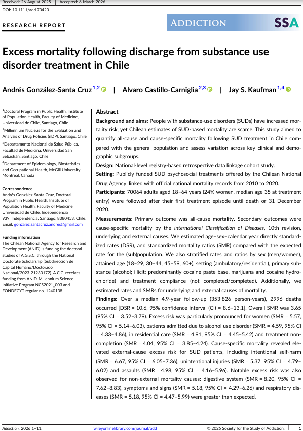
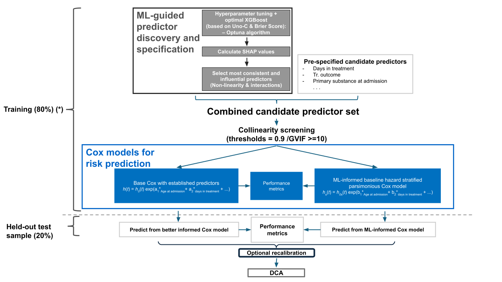
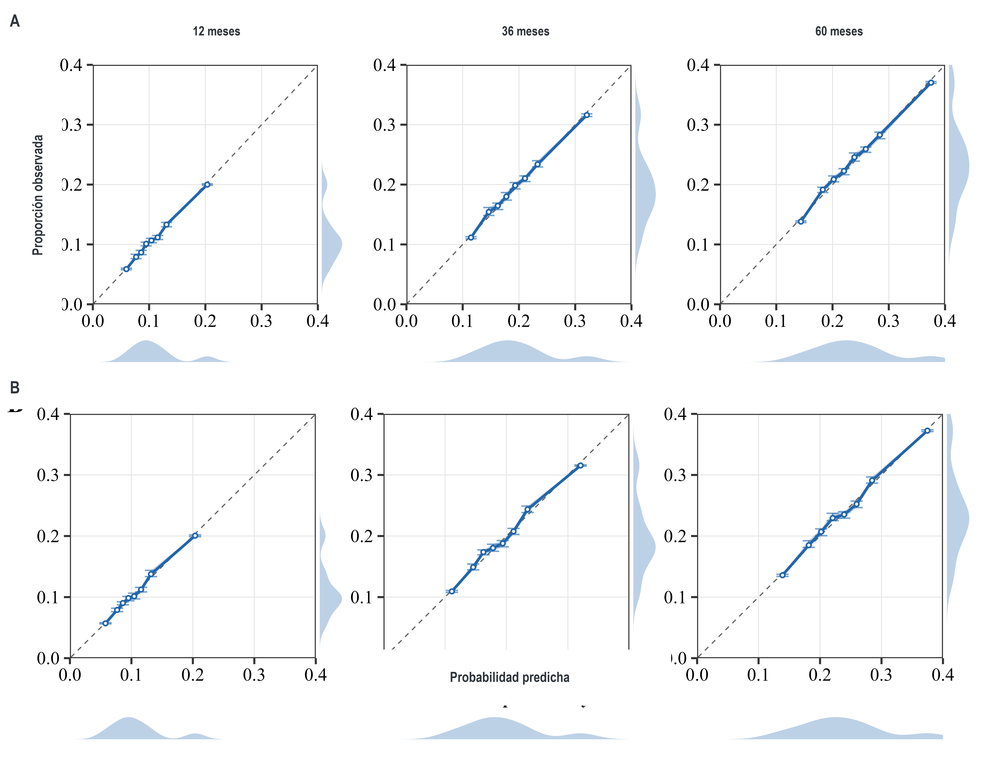
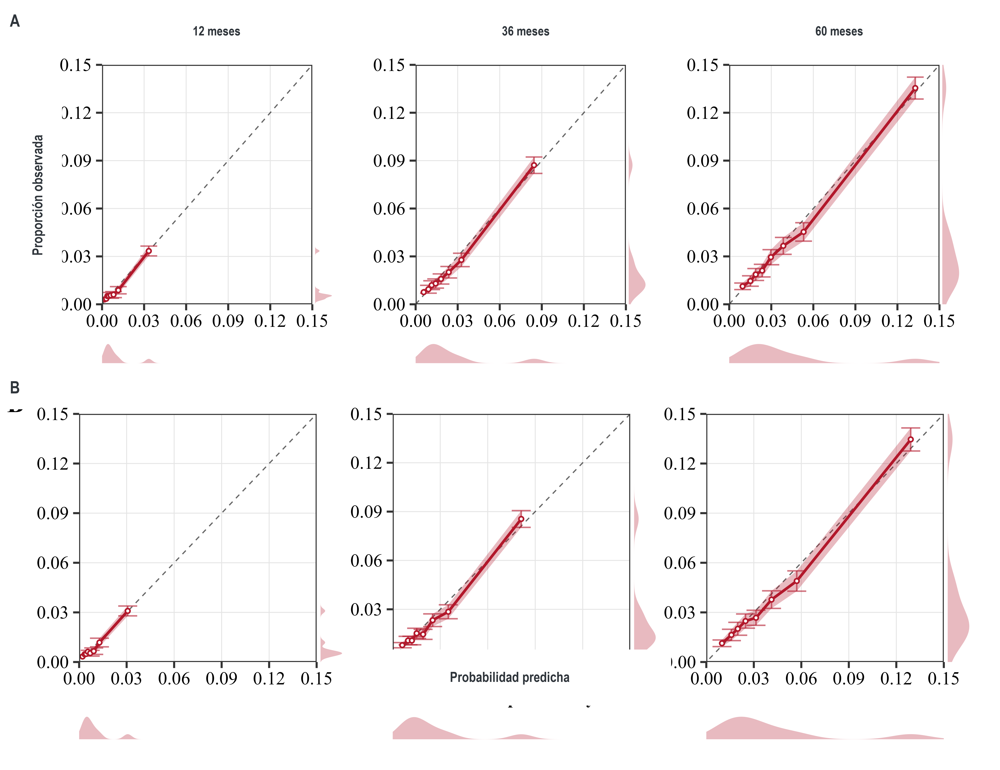

---
title: "Examen de Calificación"
subtitle: ""
author: "Andres Gonzalez"
date:  "2025-10-20" #"`r withr::with_locale(new =c('LC_TIME' = 'es_ES'), code =format(Sys.time(),'%B %d, %Y'))`"
encoding: utf-8 #I finally found the source of this error -- a bib file outside my project that was imported and not checked. Yet, it took me over 2 days, and could have been avoided if pandoc returned filename and file location information in its error message.   
output:
  xaringan::moon_reader:
    chakra: libs/remark-latest.min.js
    includes:
#      in_header: mylibs/math.html
      after_body: ['mylibs/collapseoutput.js', 'mylibs/zoom.html', 'mylibs/timer.html']
    transition: slide
    lib_dir: libs
    css: ['animate.min.css', 'ninjutsu', 'mylibs/animate.css', 'mylibs/style_chatgpt.css'] # xaringan-themer has something bad '\x93', had to include them as css
    self_contained: true # if true, fonts will be stored locally
    seal: false # show a title slide with YAML information
    nature:
      countdown: 90000 #60 segundos *2
      highlightStyle: github
      highlightLines: true # {{}} o * los pondrá como muy importantes  para destacar: # <<
      slideNumberFormat: '%current%'
      countIncrementalSlides: false
      ratio: '16:9' # alternatives '16:9' or '4:3' or others e.g. 13:9
      navigation:
        scroll: false # disable slide transitions by scrolling
#knit: pagedown::chrome_print
---

class: title-slide, middle, right, animated fadeOut


```{css, echo = F}
/* -------------------------------------------------------
 *
 *     !! This file was generated by xaringanthemer !!
 *
 *  Changes made to this file directly will be overwritten
 *  if you used xaringanthemer in your xaringan slides Rmd
 *
 *  Issues or likes?
 *    - https://github.com/gadenbuie/xaringanthemer
 *    - https://www.garrickadenbuie.com
 *
 *  Need help? Try:
 *    - vignette(package = "xaringanthemer")
 *    - ?xaringanthemer::style_xaringan
 *    - xaringan wiki: https://github.com/yihui/xaringan/wiki
 *    - remarkjs wiki: https://github.com/gnab/remark/wiki
 *
 *  Version: 0.4.2
 *
 * ------------------------------------------------------- */
@import url(https://fonts.googleapis.com/css?family=Arial:400,400i&display=swap);
@import url(https://fonts.googleapis.com/css?family=Arial+Narrow&display=swap);
@import url(https://fonts.googleapis.com/css?family=Arial+Narrow&display=swap);
@import url(https://fonts.googleapis.com/css?family=Arial+Narrow&display=swap);

:root {
  /* Fonts */
  --text-font-family: Arial;
  --text-font-is-google: 1;
  --text-font-family-fallback: -apple-system, BlinkMacSystemFont, avenir next, avenir, helvetica neue, helvetica, Ubuntu, roboto, noto, segoe ui, arial;
  --text-font-base: Arial;
  --header-font-family: 'Arial Narrow';
  --header-font-is-google: 1;
  --header-font-family-fallback: Arial;
  --code-font-family: 'Arial Narrow';
  --code-font-is-google: 1;
  --base-font-size: 20px;
  --text-font-size: 1rem;
  --code-font-size: 53%;
  --code-inline-font-size: 1em;
  --header-h1-font-size: 2.75rem;
  --header-h2-font-size: 2.25rem;
  --header-h3-font-size: 1.75rem;

  /* Colors */
  --text-color: #2f353b;
  --header-color: #666666;
  --background-color: #E6E6E6;
  --link-color: #003891;
  --text-bold-color: #D3771F;
  --code-highlight-color: rgba(255,255,0,0.5);
  --inverse-text-color: #E6E6E6;
  --inverse-background-color: #003891;
  --inverse-header-color: #E6E6E6;
  --inverse-link-color: #003891;
  --title-slide-background-color: #E6E6E6;
  --title-slide-text-color: #666666;
  --header-background-color: #003891;
  --header-background-text-color: #E6E6E6;
  --primary: #E6E6E6;
  --secondary: #003891;
}
/*lo agregué yo*/

html {
  font-size: var(--base-font-size);
}

body {
  font-family: var(--text-font-family), var(--text-font-family-fallback), var(--text-font-base);
  font-weight: 400;
  color: var(--text-color);
}
h1, h2, h3 {
  font-family: var(--header-font-family), var(--header-font-family-fallback);
  font-weight: 600;
  color: var(--header-color);
}
.remark-slide-content {
  background-color: var(--background-color);
  font-size: 1rem;
  background-image: url("https://raw.githubusercontent.com/AGSCL/DSPUCH/main/_figs/2024PPT_ESP/Diapositiva2.SVG");
  background-size: contain  !important;  /* Ensures the entire image is visible : cover era la anterior */
  background-position: center !important;
  background-repeat: no-repeat !important;
  /*padding: 0.4em 2.4em 0.4em 2.4em;*/
  /*height: 100vh;  /* Ensures the slide takes full viewport height */
  /*width: 100vh;*/
  /*height: 100%;*/
}
.remark-slide-content h1 {
  font-size: var(--header-h1-font-size);
}
.remark-slide-content h2 {
  font-size: var(--header-h2-font-size);
}
.remark-slide-content h3 {
  font-size: var(--header-h3-font-size);
}
.remark-code, .remark-inline-code {
  font-family: var(--code-font-family), Menlo, Consolas, Monaco, Liberation Mono, Lucida Console, monospace;
}
.remark-code {
  font-size: var(--code-font-size);
}
.remark-inline-code {
  font-size: var(--code-inline-font-size);
  color: #003891;
}
.remark-slide-number {
  color: #2f353b;
  opacity: 1;
  font-size: 0.9rem;
}
strong {
  font-weight: bold;
  color: var(--text-bold-color);
}
a, a > code {
  color: var(--link-color);
  text-decoration: none;
}
.footnote {
  position: absolute;
  bottom: 60px;
  padding-right: 4em;
  font-size: 0.9em;
}
.remark-code-line-highlighted {
  background-color: var(--code-highlight-color);
}
.inverse {
  background-color: var(--inverse-background-color);
  color: var(--inverse-text-color);
  
}
.inverse h1, .inverse h2, .inverse h3 {
  color: var(--inverse-header-color);
}
.inverse a, .inverse a > code {
  color: var(--inverse-link-color);
}
.title-slide, .title-slide h1, .title-slide h2, .title-slide h3 {
  color: var(--title-slide-text-color);
}
.title-slide {
  background-color: var(--title-slide-background-color);
  background-image: url("https://raw.githubusercontent.com/AGSCL/DSPUCH/main/_figs/2024PPT_ESP/Diapositiva1.SVG");
  background-size: 100% auto !important; /* Ensures the entire image is visible : cover era la anterior */
  /*background-position: center top !important; */
  background-repeat: no-repeat;
  /*padding: 0.4em 2.4em 0.4em 2.4em;*/
  width: 100% !important;
  height: 100vh; 
}
.title-slide .remark-slide-number {
  display: none;
}
/* Two-column layout */
.left-column {
  width: 20%;
  height: 92%;
  float: left;
}
.left-column h2, .left-column h3 {
  color: #00389199;
}
.left-column h2:last-of-type, .left-column h3:last-child {
  color: #003891;
}
.right-column {
  width: 75%;
  float: right;
  padding-top: 1em;
}
.pull-left {
  float: left;
  width: 47%;
}
.pull-right {
  float: right;
  width: 47%;
}
.pull-right + * {
  clear: both;
}
img, video, iframe {
  max-width: 100%;
}
blockquote {
  border-left: solid 5px #00389180;
  padding-left: 1em;
}
.remark-slide table {
  margin: auto;
  border-top: 1px solid #666;
  border-bottom: 1px solid #666;
}
.remark-slide table thead th {
  border-bottom: 1px solid #ddd;
}
th, td {
  padding: 5px;
}
.remark-slide table:not(.table-unshaded) thead,
.remark-slide table:not(.table-unshaded) tfoot,
.remark-slide table:not(.table-unshaded) tr:nth-child(even) {
  background: #FCFCFC;
}
table.dataTable tbody {
  background-color: var(--background-color);
  color: var(--text-color);
}
table.dataTable.display tbody tr.odd {
  background-color: var(--background-color);
}
table.dataTable.display tbody tr.even {
  background-color: #FCFCFC;
}
table.dataTable.hover tbody tr:hover, table.dataTable.display tbody tr:hover {
  background-color: rgba(255, 255, 255, 0.5);
}
.dataTables_wrapper .dataTables_length, .dataTables_wrapper .dataTables_filter, .dataTables_wrapper .dataTables_info, .dataTables_wrapper .dataTables_processing, .dataTables_wrapper .dataTables_paginate {
  color: var(--text-color);
}
.dataTables_wrapper .dataTables_paginate .paginate_button {
  color: var(--text-color) !important;
}

/* Horizontal alignment of code blocks */
.remark-slide-content.left pre,
.remark-slide-content.center pre,
.remark-slide-content.right pre {
  text-align: start;
  width: max-content;
  max-width: 100%;
}
.remark-slide-content.left pre,
.remark-slide-content.right pre {a
  min-width: 50%;
  min-width: min(40ch, 100%);
}
.remark-slide-content.center pre {
  min-width: 66%;
  min-width: min(50ch, 100%);
}
.remark-slide-content.left pre {
  margin-left: unset;
  margin-right: auto;
}
.remark-slide-content.center pre {
  margin-left: auto;
  margin-right: auto;
}
.remark-slide-content.right pre {
  margin-left: auto;
  margin-right: unset;
}

/* Slide Header Background for h1 elements */
.remark-slide-content.header_background > h1 {
  display: block;
  position: absolute;
  top: 0;
  left: 0;
  width: 100%;
  background: var(--header-background-color);
  color: var(--header-background-text-color);
  /*padding: 2rem 2.4em 1.5rem 2.4em;*/
  margin-top: 0;
  box-sizing: border-box;
}
.remark-slide-content.header_background {
  padding-top: 7rem;
}

@page { margin: 0; }
@media print {
  .remark-slide-scaler {
    width: 100% !important;
    height: 100% !important;
    transform: scale(1) !important;
    top: 0 !important;
    left: 0 !important;
  }
}

.primary {
  color: var(--primary);
}
.bg-primary {
  background-color: var(--primary);
}
.secondary {
  color: var(--secondary);
}
.bg-secondary {
  background-color: var(--secondary);
}

.remark-slide-container {
  transition: transform 0.5s ease;
}

/* Extra CSS */
.remark-slide-scaler {
  overflow-y: auto;
}
.gray {
  color: #aaaaaa;
}
.red {
  color: #A4222B;
}
.darkgreen {
  color: #45503B;
}
.darkred {
  color: #591F0A;
}
.small {
  font-size: 90%;
}
.pull_c {
  float: center;
  width: 30%;
  height: 50%;
  padding-left: 40%;
}
.pull_c_title {
  height: 90%;
}
.pull_l_70 {
  float: left;
  width: 72%;
  font-size: 90%;
}
.pull_r_30 {
  float: right;
  width: 23%;
  font-size: 90%;
}
.pull_l_30 {
  float: left;
  width: 23%;
  font-size: 90%;
}
.pull_r_70 {
  float: right;
  width: 72%;
  font-size: 90%;
}
.pull_left {
  float: left;
  width: 47%;
  height: 100%;
  padding-right: 2%;
}
.pull_right {
  float: right;
  width: 47%;
  height: 100%;
  padding-left: 2%;
}
.small_left {
  float: left;
  width: 47%;
  height: 50%;
  padding-right: 2%;
}
.small_right {
  float: right;
  width: 47%;
  height: 50%;
  padding-left: 2%;
}
.algo_right {
  float: right;
  padding-left: 2%;
}
.left_code {
  float: left;
  width: 47%;
  height: 100%;
  padding-right: 2%;
  font: Roboto;
}
.code_out {
  float: right;
  width: 47%;
  height: 100%;
  padding-left: 2%;
  font: Roboto;
}
.text_180 {
  font-size: 180%;
}
.text_170 {
  font-size: 170%;
}
.text_160 {
  font-size: 160%;
}
.text_150 {
  font-size: 150%;
}
.text_140 {
  font-size: 140%;
}
.text_130 {
  font-size: 130%;
}
.text_120 {
  font-size: 120%;
}
.text_110 {
  font-size: 110%;
}
.text_110 {
  font-size: 110%;
}
.text_100 {
  font-size: 100%;
}
.code_10 {
  code-inline-font-size: 60%;
  overflow-y: scroll !important;
  overflow-x: scroll !important;
  max-height: 50vh !important;
  line-height: 0.75em;
}
.code_10_pre {
  code-inline-font-size: 60%;
  overflow-y: scroll !important;
  overflow-x: scroll !important;
  max-height: 15vh !important;
  line-height: 0.75em;
  min-height: 0.5em;
}
.code_15 {
  code-inline-font-size: 15%;
  overflow-y: scroll !important;
  overflow-x: scroll !important;
  max-height: 10vh !important;
}
.text_90 {
  font-size: 90%;
}
.text_80 {
  font-size: 80%;
}
.text_75 {
  font-size: 75%;
}
.text_70 {
  font-size: 70%;
}
.text_65 {
  font-size: 65%;
}
.text_62 {
  font-size: 62%;
}
.text_60 {
  font-size: 60%;
}
.text_50 {
  font-size: 50%;
}
.text_40 {
  font-size: 40%;
}
.text_30 {
  font-size: 30%;
}
.text_20 {
  font-size: 20%;
}
.line_space_15 {
  line-height: 1.5em;;
}
.line_space_13 {
  line-height: 1.3em;;
}
.line_space_11 {
  line-height: 1.1em;;
}
.line_space_15 {
  line-height: 1.5em;;
}
.line_space_09 {
  line-height: 0.9em;;
}
.line_space_07 {
  line-height: 0.7em;;
}
.line_space_05 {
  line-height: 0.5em;;
}
.largest {
  font-size: 2.488em;;
}
.larger {
  font-size: 2.074em;;
}
.large {
  font-size: 1.44em;;
}
.small {
  font-size: 0.833em;;
}
.smaller {
  font-size: 0.694em;;
}
.smallest {
  font-size: 0.579em;;
}
.limity150 {
  max-height: 150px;;
  overflow-y: auto;;
}
.tiny_text {
  font-size: 70%;
}
.large_text {
  font-size: 150%;
}
.slide_blue {
  background-color: #FEDA3F;
  color: #3C3C3B;
}
.bottom_center {
  margin: 0;
  position: absolute;
  top: 90%;
  left: 50%;
  -ms-transform: translate(-50%, -50%);
  transform: translate(-50%, -50%);
}
.bottom_center2 {
  margin: 0;
  position: fixed; /* Cambiar a 'fixed' para fijar la posición */
  bottom: 80px; /* Ajustar el valor para posicionarlo desde la parte inferior de la pantalla */
  left: 50%; /* Asegurar que esté centrado horizontalmente en la pantalla */
  transform: translateX(-50%); /* Centrarse horizontalmente */
}

.down_center {
  margin: 0;
  position: absolute;
  top: 80%;
  left: 50%;
  -ms-transform: translate(-50%, -50%);
  transform: translate(-50%, -50%);
}
.down_center2 {
  margin: 0;
  position: absolute;
  top: 98%;
  left: 50%;
  -ms-transform: translate(-50%, -50%);
  transform: translate(-50%, -50%);
}
.center_image {
  margin: 0;
  position: absolute;
  top: 50%;
  left: 50%;
  -ms-transform: translate(-50%, -50%);
  transform: translate(-50%, -50%);
}
.down_left {
  margin: 0;
  position: absolute;
  top: 80%;
  left: 22%;
  -ms-transform: translate(-50%, -50%);
  transform: translate(-50%, -50%);
}
.down_right {
  margin: 0;
  position: absolute;
  top: 80%;
  left: 72%;
  -ms-transform: translate(-50%, -50%);
  transform: translate(-50%, -50%);
}
slides > slide {
  overflow-x: auto !important;
  overflow-y: auto !important;
}
.superbigimage {
  white-space: nowrap;
  overflow-y: scroll;
}
/* https://www.garrickadenbuie.com/blog/better-progressive-xaringan/*/
.bold-last-item > ul > li:last-of-type,
.bold-last-item > ol > li:last-of-type {
  font-weight: bold;
}

.section{
  background-image: linear-gradient(#003891 90%, : #EF9D2F !important;/* background-color: #ff7f50; */
  background-size: contain  !important;  /* Ensures the entire image is visible : cover era la anterior */
  background-position: center !important;
  background-repeat: no-repeat !important;
}
.gradient-slide {
  background: linear-gradient(45deg, #003891, #EF9D2F); /* Adjust the colors and direction as needed */
  color: var(--background-color); /* Adjust text color for better contrast */
}

.scrollable-slide {
  overflow-y: auto;
  max-height: 80vh;
}

/* Incluye aquí el CSS proporcionado anteriormente */
table {
  width: 100%;
  border-collapse: collapse;
  font-size: 10px;
}

th, td {
  border: 1px solid #000;
  padding: 3px;
  margin: 0;
}

th {
  background-color: #e0e0e0;
}

th:nth-child(1), td:nth-child(1) {
  width: 20%;
}
th:nth-child(2), td:nth-child(2) {
  width: 15%;
}
th:nth-child(3), td:nth-child(3) {
  width: 65%;
}

.table-container {
  max-width: 100%;
  max-height: 500px;
  overflow-x: auto;
  overflow-y: auto;
}

.move-right {
  padding-left: 50px !important; /* Adjust the value as needed */
  padding-top: -20px !important;
  /* Alternatively, you can use margin-left */
  /* margin-left: 50px; */
}

.footnote2 {
/*  bottom: 60px;*/
  padding-right: 4em !important;
  font-size: 2.4px !important;
  font-style: italic !important;
}
/*https://pkg.garrickadenbuie.com/xaringanExtra/panelset/#1*/
.panelset {
  --panel-tab-foreground: currentColor;
  --panel-tab-active-foreground: #0051BA;
  --panel-tab-hover-foreground: #8b0000;
  --panel-tabs-border-bottom: #ddd;
  --panel-tab-inactive-opacity: 0.5;
  --panel-tab-font-family: Arial;\
}
.left-column2 {
    width: 30%;
    height: 92%;
    float: left;
}
.right-column2 {
  width: 69%;
  float: right;
  padding-top: 1em;
}
</style>

```

```{r setup_theme0, include = FALSE}
rm(list=ls());gc()
unlink("*_cache", recursive = TRUE)
if(!grepl("4.4.1",R.version.string)){stop("Different version (must be 4.4.1)")}
#, 'libs/my-theme.css'
#load(paste0(sub("$\\/","",sub("2019 \\(github\\)/SUD_CL","2022 \\(github\\)",here::here())),"/11_pres.RData"))
options(servr.daemon = TRUE)
```


```{r setup, include = FALSE}
local({r <- getOption("repos")
       r["CRAN"] <- "http://cran.r-project.org" 
       options(repos=r)
})
pacman::p_unlock(lib.loc = .libPaths()) #para no tener problemas reinstalando paquetes

if(!require(pacman)){install.packages("pacman")}
pacman::p_load(devtools, here, showtext, ggpattern, RefManageR, pagedown, magick, bibtex, DiagrammeR, xaringan, xaringanExtra, xaringanthemer, fontawesome, tidyverse, psych, cowplot, pdftools, compareGroups, tableone, ggiraph, distill, qrcode, pdftools, htmlwidgets, widgetframe, ggpubr, ggrepel, DiagrammeRsvg, rsvg, plotly, install=F)

if(!require(xaringanBuilder)){devtools::install_github("jhelvy/xaringanBuilder",upgrade = "never")}
if(!require(icons)){remotes::install_github("mitchelloharawild/icons",upgrade = "never")}

test_fontawesome<- function(x="github"){
tryCatch({
  invisible(fontawesome::fa(name = x))
  return(message("fontawesome installed"))
},
# ... but if an error occurs, tell me what happened: 
error=function(error_message) {
  message("Installing fontawesome")
  icons::download_fontawesome()  
})
}

if(!require(emo)){devtools::install_github("hadley/emo");library(emo)} #https://github.com/hadley/emo


options(scipen=2) #display numbers rather scientific number

#:#:#:#:#:#:#:#:#:#:#:#:#:#:#:#:#:#:#:#:#:#:#:#:#:#:#:#:#:#:#:#:#:#:#:#:#:#:#:#:#:#:#:#:#:#:#:#:#:#:#:#:#:#:#:
#:#:#:#:#:#:#:#:#:#:#:#:#:#:#:#:#:#:#:#:#:#:#:#:#:#:#:#:#:#:#:#:#:#:#:#:#:#:#:#:#:#:#:#:#:#:#:#:#:#:#:#:#:#:#:

  vec_col<-c("#660600","#6F3930","#745248","#786B60","#E6E6E6","#738FBC","#003891","#3C5279","#786B60","#B48448","#EF9D2F","#D99155","#E3D1C2","#E0BC9E","#ABB0BF","#835F69","#5A0D13")
plot_prueba<-barplot(1:length(vec_col), col=vec_col)

options(htmltools.preserve.raw = FALSE)

#knitr::opts_chunk$set(comment = NA) # lo saqué pa probar por si
knitr::opts_chunk$set(dpi=720)
#options(htmltools.preserve.raw = FALSE)#A recent update to rmarkdown (in version 2.6) changed how HTML widgets are included in the output file to use pandoc's raw HTML blocks. Unfortunately, this feature isn't compatible with the JavaScript markdown library used by xaringan. You can disable this feature and resolve the issue with htmlwidgets in xaringan slides by setting
#https://stackoverflow.com/questions/65766516/xaringan-presentation-not-displaying-html-widgets-even-when-knitting-provided-t/65768952#65768952

xaringanExtra::use_scribble() #son los lapices
xaringanExtra::use_tile_view()
xaringanExtra::use_panelset()
xaringanExtra::use_editable(expires = 1)
#xaringanExtra::use_fit_screen()

check_code <- function(expr, available){
  if(available){
    eval(parse(text = expr))
  } else {
    expr
  }
}
path2<-getwd()
```
```{r, load_refs, include=F, eval=T, cache=FALSE}
library(RefManageR)
BibOptions(check.entries = FALSE,
           bib.style = "numeric",
           cite.style = "numeric",
           style = "markdown",
           super = TRUE,
           hyperlink = FALSE,
           dashed = FALSE)
warning(paste0("./libreria_generica.txt"))

myBib <- ReadBib("./libreria_generica.txt", check = FALSE,  .Encoding="latin1")
```

.move-right[
.line_space_15[ 

## .text_60[Predicción del tiempo a la readmisión y mortalidad en adultos<br>en tratamiento por trastornos por uso de sustancias en Chile:<br>Un estudio de cohorte retrospectivo de 11 años]

]

.line_space_11[

.bg-text[

.text_80[Director de tesis: Jay S. Kaufman<br>Co-director de tesis: Álvaro Castillo-Carniglia<br>Estudiante: Andrés González-Santa Cruz]

.text_50[gonzalez.santacruz.andres@gmail.com] [`r fontawesome::fa(name = "github")`](https://github.com/AGSCL) [`r fontawesome::fa(name = "orcid", fill="green")`](https://orcid.org/0000-0002-5166-9121)
]
]
]

???
*#_#_#_#_#_#_#_#_#_#_
**NOTA Portada**
*#_#_#_#_#_#_#_#_#_#_

Muy Buenas tardes

Buenas tardes. Les voy a presentar el estado de avance de mi tesis doctoral sobre predicción de readmisión y mortalidad post-tratamiento en personas adultas en tratamiento por trastornos por uso de sustancias en Chile.

Acompañantes en este Proceso

- el profesor Jay kaufman
- el profesor Álvaro Castillo

---
layout: "true"
class: animated fadeIn 

## Índice

<br>

0. Objetivos

1. Primer Artículo

2. Segundo Artículo

3. ¿Qué aporta el enfoque ML?

4. Estado final y siguientes pasos

5. Reflexiones/Dudas/Instancia de conversación

???
*#_#_#_#_#_#_#_#_#_#_
**NOTA INDICE**
*#_#_#_#_#_#_#_#_#_#_

Voy a organizar la presentación en cinco partes: primero, un ajuste de objetivos; segundo, qué demostró el primer artículo; tercero, los resultados preliminares del segundo; cuarto, qué aporta realmente el enfoque informado por Machine learning; y quinto, el estado final del trabajo y algunas dudas para discusión.

---
class: animated fadeIn 
## Objetivos

...desde 2010 a <span style="color:darkred"><strong>2020</strong></span>

.small[
- Tasa de incidencia mortalidad ✅

- Identificar un conjunto de factores predictores a la primera readmisión.

- Identificar un conjunto de factores predictores a la mortalidad.

- Predecir de manera concatenada y conjunta readmisión y mortalidad.
]

???
*#_#_#_#_#_#_#_#_#_#_
**NOTA Objetivos**
*#_#_#_#_#_#_#_#_#_#_

Evaluar el papel predictivo de la duración de la estadía y del resultado del tratamiento inicial, junto con otros factores pronósticos y predictivos de predisposición, necesidad percibida y facilitadores de atención, sobre el riesgo y el tiempo hasta la ocurrencia de la primera readmisión y mortalidad por todas las causas en personas de 18 a 64 años admitidas a tratamiento por trastornos por uso de sustancias, TUS, en Chile entre 2010 y 2020.

En este avance me voy a concentrar en tres cosas: qué mostró ya el primer artículo, qué muestran los primeros resultados del segundo, y qué decisiones analíticas requieren orientación para cerrar la tesis.

Prioricé los modelos de readmisión y mortalidad por separado. El componente multiestado sigue siendo valioso, pero lo dejé como una extensión posterior.
Aunque no ignoré la dependencia entre desenlaces: para readmisión incorporé la muerte como evento competidor en la calibración y en los riesgos observados mediante Aalen–Johansen.

---
class: animated fadeIn 
## Exceso de mortalidad tras el<br>tratamiento por TUS en Chile (2010–2020)

.pull-left[

- **2.996** muertes

- **Riesgo de morir:** 3,65 veces mayor

- Mayor **exceso en mujeres** (5,6 vs. 3,4), **tasas mayores en hombres** (13,7 vs. 7,9 por 1.000 AP)

- **Exceso concentrado en:**

  - digestivas (K00–K93) RME = 8,2
  - respiratorias (J00–J99) RME = 5,2
  - suicidio (X60–X84) RME = 6,7
  - homicidio (X85–Y09) RME = 5,0
  
- **Completar tratamiento = menor riesgo**

  - Completa → 770 por 100.000 | RME 2,7
  - No completa → 1.190 por 100.000 | RME 4,0
]

.pull-right[

```{r echo=FALSE, fig.align="center", message=FALSE, warning=FALSE, dev.args=list(bg = 'transparent'), fig.cap=NULL, out.width="67%"}
#| label: screen-capture


```

]

???
*#_#_#_#_#_#_#_#_#_#_
**NOTA 1er articulo**
*#_#_#_#_#_#_#_#_#_#_

Aceptado en *Addiction*

El problema no es trivial. Después del tratamiento, la mortalidad en esta cohorte fue aproximadamente 3,65 veces mayor que en la población general comparable.

Además, el exceso fue relativamente mayor en mujeres, aunque las tasas absolutas siguieron siendo más altas en hombres. También se concentró en algunas causas específicas, como causas digestivas, respiratorias y muertes violentas. Quienes completaron tratamiento experimentaron menor riesgo relativo.

Lo que sigue es preguntarse: 

→ ¿Quiénes tienen mayor riesgo?

→ ¿Se puede predecir?

---
class: animated fadeIn 
## Segundo artículo

.pull-left[

```{r echo=F, echo=FALSE, fig.align="left", message=FALSE, warning=FALSE, dev.args=list(bg = 'transparent'), out.width=500, out.height=500}
#| label: andersen-scheme

andersen<- 
grViz("
digraph andersen_model {
  graph [layout = dot, rankdir = TB, bgcolor  = 'transparent', fontname = Helvetica]
  // --- Subgráfico: Modalidad (caja amarilla) ---
  subgraph cluster_modalidad {
    label = 'MODALIDAD\\n(Respuesta diferencial a tratamiento)'
    bgcolor = lightyellow
    color = black
    fontsize = 16
    // --- Estilo general de los nodos ---
    node [shape = rectangle, style = filled, fillcolor = lightsteelblue, fontsize = 14]
    Predisponentes [label = 'Predisponentes']
    Necesidad [label = 'Necesidad\\npercibida']
    Habilitadores [label = 'Habilitadores']
    // --- Apilado vertical invisible ---
    Predisponentes -> Necesidad [style = invis]
    Necesidad -> Habilitadores [style = invis]
  }
  // --- Título general ---
  labelloc = 't'
  fontsize = 20
  label = 'Modelo de Utilización de Servicios de Salud\\n(Ronald Andersen, 1995)'
}", width = 500, height = 500)

andersen
```
]

.pull-right[
### Plan analítico

<details open>
<summary>📦 Ocultar</summary>

```{r echo=FALSE, dev.args = list(bg = 'transparent'), error=T, fig.align="center", message=FALSE, warning=FALSE, out.width=800}
#| label: paper2-esquema


```
</details>

<details>
<summary>🔬 Info. adicional </summary>
<div class="pull-left" style="width: 32%;">
  <div class="metric-box">
    <div class="mini-label">Cohorte</div>
    <div class="big-number">88.152</div>
    <div>personas adultas</div>
  </div>
</div>
<div class="pull-left" style="width: 34%; margin-left: 1%;">
  <div class="metric-box">
    <div class="mini-label">Período</div>
    <div class="big-number">'10–'20</div>
    <div>censurado en 2020</div>
  </div>
</div>
<div class="pull-left" style="width: 32%; margin-left: 1%;">
  <div class="metric-box">
    <div class="mini-label">Desenlaces</div>
    <div class="big-number">2</div>
    <div>readmisión y mortalidad</div>
  </div>
</div>
<div style="clear: both;"></div>
<div class="card">
<b>Diseño:</b> cohorte retrospectiva nacional con registros SENDA-SISTRAT vinculados a mortalidad DEIS.<br>
<b>Estrategia:</b> imputación múltiple + XGBoost/SHAP para exploración estructural + modelo Cox final interpretable.
</div>
</details>
]

???
*#_#_#_#_#_#_#_#_#_#_
**NOTA 2do artículo**
*#_#_#_#_#_#_#_#_#_#_
DATASET: Se compone de 88k pacientes, separados en un conjunto de entrenamiento (70k) y prueba (20%, 17k). La división se estratificó por evento (ya sea readmisión o mortalidad) y modalidad de tratamiento, para que cada subconjunto esté balanceado.

Conceptualmente, se organizaron los predictores con el **modelo de Andersen**. Muy brevemente: los predisponentes son características previas de la persona, (ej., edad, sexo o condiciones sociales); la necesidad percibida recoge cuánta necesidad clínica hay, más inmediata (ej., severidad, frecuencia consumo, comorbilidad); y los habilitadores son condiciones que facilitan o dificultan la atención y su continuidad, como modalidad, derivación, duración del tratamiento o resultado del egreso.

Primero, en el conjunto de entrenamiento, se utilizó Machine learning (Extreme Gradient Boosting, entrena muchos árboles de decisión en secuencia para detectar automáticamente qué predictores importan y cómo se relacionan entre sí) para explorar la estructura de los datos y detectar patrones complejos. Se eligieron los hiperparámetros que mejoren el desempeño en términos de discriminación y calibración. A través de valores SHAP o Shapley additive values (para predicciones, descompone cuánto contribuye una variable a alejar el resultado del riesgo promedio) identifico los predictores más influyentes/importantes, incluyendo posibles no linealidades e interacciones.

Se descartaron variables colineales (generalized variance inflation factor >10, sólo evaluación proceso terapéutico, logro mínimo, para readmisión). Se generaron dos modelos por desenlace: **Full Cox tradicional** con todos los predictores establecidos, y otro modelo más parsimonioso e **informado por ML**. En ambos casos, se estratificó el baseline hazard por modalidad de tratamiento y resultado de tratamiento (incumplimiento de normas del centro) por sustancial evidencia de violaciones al supuesto de riesgos proporcionales.

Se comparó por desempeño: Uno’s C = índice de concordancia de Uno (porcentaje de ordenamiento correcto entre pares comparables (considerando censura)); IBS = integrated Brier score (error promedio de las predicciones en el tiempo, incluye calibración + discriminación e incorpora la varianza inherente a los datos); ICI = integrated calibration index (coincidencia de probabilidades predichas con observadas en el tiempo); D1 = prueba de Wald para comparar modelos anidados; AICc = criterio de información de Akaike corregido por tamaño muestral ; Valores altos de Uno’s C indican mejor discriminación , valores másbajos de IBS, ICI, y AICc indican mejor desempeño.

<div class="perf-content"> <div class="perf-two-cols"> <div class="perf-box"> <div class="perf-box-title">🔁 Readmisión — Riesgo acumulado KM</div> <table class="perf-table"> <tr> <th>Meses</th> <th>n total</th> <th>Eventos</th> <th>Censurados</th> <th>En riesgo</th> <th>Riesgo KM</th> </tr> <tr><td>3</td><td>70,521</td><td>2,875</td><td>5,320</td><td>62,326</td><td>4.4%</td></tr> <tr><td>12</td><td>70,521</td><td>7,442</td><td>8,705</td><td>54,374</td><td>11.5%</td></tr> <tr><td>24</td><td>70,521</td><td>10,531</td><td>14,905</td><td>45,085</td><td>16.8%</td></tr> <tr><td>36</td><td>70,521</td><td>12,347</td><td>21,321</td><td>36,853</td><td>20.4%</td></tr> <tr><td>60</td><td>70,521</td><td>14,154</td><td>33,538</td><td>22,829</td><td>25.0%</td></tr> <tr><td>108</td><td>70,521</td><td>15,202</td><td>50,813</td><td>4,506</td><td>30.7%</td></tr> </table> </div> <div class="perf-box"> <div class="perf-box-title">⚕️ Mortalidad — Riesgo acumulado KM</div> <table class="perf-table"> <tr> <th>Meses</th> <th>n total</th> <th>Eventos</th> <th>Censurados</th> <th>En riesgo</th> <th>Riesgo KM</th> </tr> <tr><td>3</td><td>70,521</td><td>329</td><td>5,012</td><td>65,180</td><td>0.5%</td></tr> <tr><td>12</td><td>70,521</td><td>706</td><td>8,198</td><td>61,617</td><td>1.1%</td></tr> <tr><td>24</td><td>70,521</td><td>1,246</td><td>14,610</td><td>54,665</td><td>2.0%</td></tr> <tr><td>36</td><td>70,521</td><td>1,700</td><td>21,792</td><td>47,029</td><td>2.9%</td></tr> <tr><td>60</td><td>70,521</td><td>2,379</td><td>36,465</td><td>31,677</td><td>4.5%</td></tr> <tr><td>108</td><td>70,521</td><td>2,994</td><td>60,535</td><td>6,992</td><td>7.7%</td></tr> </table> </div> </div>

---
class: basal-slide animated fadeIn

<div class="basal-header">Diseño y Cohorte del Estudio</div> <div class="basal-title">Características Basales<br>de la Cohorte<br></div> <div class="basal-sub">Cohorte de entrenamiento (n=70,521) · Todas las diferencias SMD &lt;0.05 entre entrenamiento y test</div> <div class="basal-grid"> <div class="basal-box"> <div class="basal-box-title">👥 Sociodemográficas</div> <div class="basal-row"> <span class="basal-label">Edad mediana</span> <span class="basal-val">34.2 años</span> </div> <div class="basal-row"> <span class="basal-label">Mujeres</span> <span class="basal-val">25.6%</span> </div> <div class="basal-row"> <span class="basal-label">Solteros</span> <span class="basal-val">54.8%</span> </div> <div class="basal-row"> <span class="basal-label">Empleados</span> <span class="basal-val">49.0%</span> </div> <div class="basal-row"> <span class="basal-label">Urbana</span> <span class="basal-val">81.5%</span> </div> <div class="basal-row"> <span class="basal-label">Educación ≤secundaria</span> <span class="basal-val">55.4%</span> </div> <div class="basal-row"> <span class="basal-label">Vivienda temporal familiar</span> <span class="basal-val">41.1%</span> </div> </div> <div class="basal-box"> <div class="basal-box-title">🫀 Clínicas y de Utilización de Servicios</div> <div class="basal-row"> <span class="basal-label">Policonsumo</span> <span class="basal-val">73.1%</span> </div> <div class="basal-row"> <span class="basal-label">Uso diario sustancia primaria</span> <span class="basal-val">44.1%</span> </div> <div class="basal-row"> <span class="basal-label">Comorbilidad psiquiátrica</span> <span class="basal-val">44.8%</span> </div> <div class="basal-row"> <span class="basal-label">Trastornos personalidad</span> <span class="basal-val">28.5%</span> </div> <div class="basal-row"> <span class="basal-label">Trastornos del ánimo</span> <span class="basal-val">10.2%</span> </div> <div class="basal-row"> <span class="basal-label">Violencia/abuso sexual</span> <span class="basal-val">28.2%</span> </div> <div class="basal-row"> <span class="basal-label">Comorbilidad física</span> <span class="basal-val">9.5%</span> </div> </div> <div class="basal-box-right"> <div class="basal-box"> <div class="basal-box-title">💊 Sustancias Principales</div> <div style="margin-bottom:10px;"> <div style="display:flex; justify-content:space-between; font-size:12px; margin-bottom:3px;"> <span style="color:#666;">Pasta base cocaína</span> <span style="color:#003891; font-weight:700;">37.8%</span> </div> <div class="basal-bar-track"><div class="basal-bar-fill bf-coca"></div></div> </div> <div style="margin-bottom:10px;"> <div style="display:flex; justify-content:space-between; font-size:12px; margin-bottom:3px;"> <span style="color:#666;">Alcohol</span> <span style="color:#003891; font-weight:700;">34.0%</span> </div> <div class="basal-bar-track"><div class="basal-bar-fill bf-alc"></div></div> </div> <div style="margin-bottom:10px;"> <div style="display:flex; justify-content:space-between; font-size:12px; margin-bottom:3px;"> <span style="color:#666;">Clorhidrato Cocaína</span> <span style="color:#003891; font-weight:700;">19.6%</span> </div> <div class="basal-bar-track"><div class="basal-bar-fill bf-polv"></div></div> </div> <div> <div style="display:flex; justify-content:space-between; font-size:12px; margin-bottom:3px;"> <span style="color:#666;">Marihuana</span> <span style="color:#003891; font-weight:700;">6.8%</span> </div> <div class="basal-bar-track"><div class="basal-bar-fill bf-mari"></div></div> </div> </div> <div class="basal-box"> <div class="basal-box-title">🏥 Tratamiento</div> <div class="basal-trat"> <strong>Modalidad:</strong> Ambulatorio intensivo 42.5%, Ambulatorio básico 36.6%, Residencial 11.0% </div> <div class="basal-trat"> <strong>Motivo admisión:</strong> Consulta espontánea 44.9%, Derivación sistema sanitario 31.1% </div> <div class="basal-trat"> <strong>Duración mediana:</strong> 5.6 meses (IQR: 3.0–10.0) </div> <div style="margin-top:8px; border-top:1px solid #e0e0e0; padding-top:6px;"> <div style="font-size:12px; color:#003891; font-weight:700; margin-bottom:3px;">Resultado egreso:</div> <div class="basal-res-row"> <span class="basal-res-lab">Abandono</span> <span class="basal-res-val abandono">53.3%</span> </div> <div class="basal-res-row"> <span class="basal-res-lab">Completación</span> <span class="basal-res-val completa">26.5%</span> </div> </div> </div> </div> </div>

???
*#_#_#_#_#_#_#_#_#_#_
**NOTA Diseño/Cohorte**
*#_#_#_#_#_#_#_#_#_#_

La cohorte muestra una población con alta complejidad social y clínica. La edad mediana fue cercana a 35 años; predominan los hombres; el policonsumo y el consumo diario fueron frecuentes; la comorbilidad psiquiátrica también fue alta.
Desde el punto de vista del tratamiento, la mayoría estuvo en modalidades ambulatorias, la duración mediana fue cercana a seis meses, y el abandono fue más frecuente que completar.
Lo menciono porque este contexto ayuda a entender por qué la readmisión y la mortalidad no son desenlaces fáciles de predecir.

VENTANAS DE SEGUIMIENTO PRINCIPALES: 1 , 3 y 5 años

Dando cuenta que la readmisión compite con muerte

**secundario**
DEMOGRAFÍA: edad ~35, mayoría hombres (~75%), mitad solteros, mitad trabaja, educación baja (mayoría secundaria o menos), vive con familia o propietario, 
casi todos de zonas urbanas.
CONSUMO: principal, pasta base / alcohol / cocaína, sus. inicio: alcohol > marihuana; patrón: policonsumo muy alto (~70%), consumo diario alto (~44%)
SALUD: comorbilidad psiquiátrica alta (~45%), reporta algún tipo de violencia frecuente (~28%), comorbilidad física "baja" (~10%)
TRATAMIENTO: mayoría ambulatorio, dura ~6 meses, resultado (abandono >50%, completan ~25%)

---
class: pred-slide

<div class="pred-header">Resultados: Readmisión</div> <div class="pred-title">Predictores de Readmisión: Hallazgos del<br>Modelo XGBoost-SHAP</div> <div class="pred-content"> <div class="pred-box-intro"> <strong>Hallazgo principal:</strong> El modelo XGBoost priorizó un <strong>panel multidimensional amplio</strong> que combina necesidad clínica continua, tratamiento, acceso e inestabilidad social — sin un único mecanismo dominante. </div> <div class="pred-grid"> <div class="pred-col"> <div class="pred-col-title">👥 Factores Predisponentes</div> <div class="pred-item"> <div class="pred-item-title">Edad al ingreso</div> <div class="pred-item-desc">Predictor de rango superior con efecto no lineal</div> </div> <div class="pred-item"> <div class="pred-item-title">Pobreza comunal (Índice CASEN)</div> <div class="pred-item-desc">Marcador de vulnerabilidad estructural</div> </div> <div class="pred-item"> <div class="pred-item-title">Etnia y estado de vivienda</div> <div class="pred-item-desc">Desigualdad social post-tratamiento</div> </div> <div class="pred-item"> <div class="pred-item-title">Escolaridad y sexo</div> <div class="pred-item-desc">Determinantes sociodemográficos</div> </div> </div> <div class="pred-col"> <div class="pred-col-title">🫀 Necesidades Clínicas</div> <div class="pred-item"> <div class="pred-item-title">Comorbilidad psiquiátrica</div> <div class="pred-item-desc">44.8% de la cohorte; predictor clave de readmisión</div> </div> <div class="pred-item"> <div class="pred-item-title">Sustancia primaria</div> <div class="pred-item-desc">Pasta base cocaína y alcohol entre las más relevantes</div> </div> <div class="pred-item"> <div class="pred-item-title">Severidad del TUS</div> <div class="pred-item-desc">Dependencia vs consumo problemático</div> </div> <div class="pred-item"> <div class="pred-item-title">Policonsumo</div> <div class="pred-item-desc">73.1% de la cohorte; complejidad clínica</div> </div> </div> <div class="pred-col"> <div class="pred-col-title">🏥 Facilitadores del Tratamiento</div> <div class="pred-item"> <div class="pred-item-title">Duración del tratamiento</div> <div class="pred-item-desc">Relación no lineal con riesgo de readmisión</div> </div> <div class="pred-item"> <div class="pred-item-title">Motivo de admisión</div> <div class="pred-item-desc">Consulta espontánea vs derivación</div> </div> <div class="pred-item"> <div class="pred-item-title">Evaluaciones de egreso</div> <div class="pred-item-desc">Múltiples dominios terapéuticos al alta</div> </div> <div class="pred-item"> <div class="pred-item-title">Modalidad de tratamiento</div> <div class="pred-item-desc">Variable de estratificación</div> </div> </div> </div> <div class="pred-box-footer"> <strong>💡 Interpretación:</strong> El modelo Cox final retiene un conjunto amplio y multidimensional de predictores — sociales, psiquiátricos, de severidad y del proceso de tratamiento — consistente con la complejidad de la readmisión en TUS. </div> </div>

???
*#_#_#_#_#_#_#_#_#_#_
**NOTA Predictores Readmisión**
*#_#_#_#_#_#_#_#_#_#_

En readmisión, el hallazgo principal es que no aparece un único mecanismo dominante. El riesgo parece surgir de una combinación de vulnerabilidad social, necesidad clínica persistente y características del proceso terapéutico.

Entre los predictores más relevantes aparecen edad, comorbilidad psiquiátrica, policonsumo, sustancia principal, condiciones sociales y variables del propio tratamiento, como duración, motivo de ingreso y evaluación al egreso.

---
class: calib-slide

<div class="calib-header">Resultados: Readmisión</div> <div class="calib-title">Discriminación y Calibración del Modelo <br>de Readmisión</div> <div class="calib-content"> <div class="calib-top-row"> <div class="calib-box"> <div class="calib-box-title">📊 Rendimiento Interno Validado</div> <div class="calib-metric"> <div class="calib-metric-label">Uno's C-index (global)</div> <div class="calib-metric-value">0.604 / 0.608 (full) </div> <div class="calib-metric-range">Rango empírico 95%: 0.595 – 0.615 / 0.601 - 0.617</div> </div> <div class="calib-metric"> <div class="calib-metric-label">IBS (Integrated Brier Score)</div> <div class="calib-metric-value">0.358 / 0.359</div> <div class="calib-metric-range">Rango: 0.342 – 0.369 / 0.343 - 0.369</div> </div> <div class="calib-alert"> <strong>⚠ La discriminación de readmisión fue débil</strong> con error de calibración sustancial </div> </div> <div class="calib-box"> <div class="calib-box-title">⚖️ Comparación: ML vs Full PH-Adjusted</div> <div class="calib-text"> <strong>Diferencias modestas</strong> entre enfoques en validación interna </div> <div class="calib-text" style="color:#666; font-size:11.5px; margin-bottom:10px;"> Solo diferencias marginales en discriminación y error de predicción </div> <div class="calib-subtitle">Calibración a 60 meses:</div> <div class="calib-text" style="font-size:11.5px; margin-bottom:4px;"> Modelo Full: predicho 0.2590 vs observado 0.2592 </div> <div class="calib-text" style="font-size:11.5px; margin-bottom:10px;"> Modelo ML: predicho 0.2595 vs observado 0.2522 </div> <div class="calib-text"> El modelo <strong>Full PH</strong> mostró <strong>ligeramente mejor calibración</strong> en horizontes medios y largos </div> </div> </div> <div class="calib-box" style="margin-bottom:14px;"> <div class="calib-box-title">👌 Métricas Clasificación a 5 Años (Umbral 20%)</div> <div class="calib-metrics-row"> <div class="calib-metric-block"> <div class="calib-metric-block-label">PPV</div> <div class="calib-metric-block-value">41.0%</div> <div class="calib-metric-block-desc">Precisión positiva</div> </div> <div class="calib-metric-block"> <div class="calib-metric-block-label">Sensibilidad</div> <div class="calib-metric-block-value blue">80.4%</div> <div class="calib-metric-block-desc">Tasa detección</div> </div> <div class="calib-metric-block"> <div class="calib-metric-block-label">Especificidad</div> <div class="calib-metric-block-value gray">—</div> <div class="calib-metric-block-desc">Variable según umbral</div> </div> <div class="calib-metric-block"> <div class="calib-metric-block-label">NPV</div> <div class="calib-metric-block-value gray">—</div> <div class="calib-metric-block-desc">Variable según umbral</div> </div> </div> </div> <div class="calib-footer"> <strong>💡 Desafío metodológico:</strong> La readmisión fue frecuente, dificultando el cumplimiento de riesgos proporcionales (más que en mortalidad). El modelo requirió estratificación adicional y evaluación cuidadosa de calibración. </div> </div>

???
*#_#_#_#_#_#_#_#_#_#_
**NOTA Readmisión: desempeño**
*#_#_#_#_#_#_#_#_#_#_

- El desempeño fue más bien modesto para readmisión. Un Uno’s C global de 0,604 significa, en términos simples, que Si tomo dos pacientes al azar, el modelo ordena correctamente quién tendrá antes el evento en aproximadamente 6 de cada 10 casos. Es mejor que el azar, pero no es una discriminación fuerte. capacidad limitada para separar pacientes de alto y bajo riesgo.

- Respecto del IBS global, que en esta diapositiva está en el orden de 0,35 (35% error promedio en predicciones) por lo que el error predictivo global sigue siendo importante. Ojo, que estas métricas abarcan TODO el tiempo de seguimiento

**secundario**

- el modelo SHAP sí tiene menor AICc, lo que respalda que la penalización por complejidad no anula la ventaja de la parsimonia.(AICc= 272,549.2 vs.	272,443.9)
- Full PH-adjusted mostró ligeramente mejor calibración agrupada a 36 y 60 meses (ej. para Readmisión: predicción 0.2332 vs. observado 0.2339, frente a 0.2344 vs. 0.2436 del SHAP) 
- si tomo dos pacientes al azar, el modelo ordena correctamente quién tendrá antes la readmisión en alrededor del 60% de los pares

---
class: calib-figure-slide

<div class="calib-figure-header">Resultados: Readmisión</div>
<div class="calib-figure-title">Calibración Visual del Modelo de Readmisión</div>

<div class="calib-figure-content">
  <div class="calib-figure-frame readmission">
    
  </div>
  <div class="calib-figure-caption readmission">
    <strong>Lectura:</strong> la diagonal punteada representa calibración perfecta; los puntos muestran proporción observada por estratos de riesgo predicho y las barras indican incertidumbre.
  </div>
</div>

???
*#_#_#_#_#_#_#_#_#_#_
**NOTA Readmisión, Calibración**
*#_#_#_#_#_#_#_#_#_#_

Esta figura muestra calibración: compara riesgo predicho con riesgo observado ( a 1, 3 y 5 años). Mientras más cerca están los puntos de la diagonal, mayor concordancia.
En readmisión hay concordancia razonable en varios estratos, pero también más tensión metodológica: es un evento frecuente y además compite con la mortalidad como evento competitivo. Se utilizó Aalen-Johansen para estimar la probabilidad observada, dando cuenta explícitamente de la mortalidad como competidor.

**secundario**
Panel A shows the full stratified Cox model (Full PH-adjusted model with additional stratification for rule-violation discharge), and panel B the selected machine-learning–informed Cox model (Final SHAP model with interactions and splines). Within each panel, observed risks are grouped and plotted against mean predicted risks at 12, 36, and 60 months. For readmission, observed risks were estimated using the Aalen–Johansen estimator to account for the competing risk of death. The dashed 45° line indicates perfect calibration. Points represent the grouped mean predicted and observed risks; vertical bars and shaded ribbons indicate uncertainty around the grouped observed risks. Marginal density plots display the distribution of grouped predicted risks (bottom) and grouped observed risks (right).

---
class: mort-slide

<div class="mort-header">Resultados: Mortalidad</div> <div class="mort-title">Predictores de Mortalidad:<br>Hallazgos del Modelo XGBoost-SHAP</div> <div class="mort-content"> <div class="mort-intro"> <strong>Hallazgo principal:</strong> Conjunto <strong>más parsimonioso</strong>, impulsado por vulnerabilidad biológica acumulada (edad, salud física, severidad clínica). Pocas variables de tratamiento. </div> <div class="mort-grid"> <div class="mort-col"> <div class="mort-box"> <div class="mort-box-title"> Predictores más influyentes</div> <div class="mort-item"> <span class="mort-num">1</span><span class="mort-item-title">Edad al ingreso</span> <div class="mort-item-desc">Predictor dominante; efecto no lineal con splines cúbicos</div> </div> <div class="mort-item"> <span class="mort-num">2</span><span class="mort-item-title">Comorbilidades físicas</span> <div class="mort-item-desc">9.5% de la cohorte; fuerte predictor de mortalidad</div> </div> <div class="mort-item"> <span class="mort-num">3</span><span class="mort-item-title">Frecuencia uso diario</span> <div class="mort-item-desc">44.1% de la cohorte; severidad del patrón de uso</div> </div> <div class="mort-item"> <span class="mort-num">4</span><span class="mort-item-title">Policonsumo</span> <div class="mort-item-desc">73.1% de la cohorte; complejidad clínica asociada</div> </div> <div class="mort-item"> <span class="mort-num">5</span><span class="mort-item-title">Sustancia primaria: pasta base o alcohol</span> <div class="mort-item-desc">Sustancias con mayor impacto en mortalidad</div> </div> </div> </div> <div class="mort-col"> <div class="mort-box"> <div class="mort-box-title">🏥 Variables de Tratamiento</div> <div class="mort-item"> <span class="mort-item-title">Evaluación egreso: situación ocupacional</span> <div class="mort-item-desc">Logro terapéutico en reinserción laboral</div> </div> <div class="mort-item"> <span class="mort-item-title">Evaluación egreso: salud física</span> <div class="mort-item-desc">Estado de salud somática al alta</div> </div> <div class="mort-note"> <strong>⚠️ Número limitado</strong> de variables de tratamiento entre predictores principales </div> </div> </div> </div> </div>

???
*#_#_#_#_#_#_#_#_#_#_
**NOTA Mortalidad, predictores**
*#_#_#_#_#_#_#_#_#_#_

A diferencia de la readmisión, el patrón para el modelo para mortalidad parece más concentrado. El riesgo está más dominado por edad, comorbilidad física, severidad clínica y algunos indicadores del proceso terapéutico

Sugiere que la mortalidad responde a un conjunto más compacto de vulnerabilidad acumulada, menos disperso

perfil de mortalidad parece más clínico-biológico vs. más social y del proceso de atención para readmisión

---
class: mort-slide

<div class="mort-header">Resultados: Mortalidad</div> <div class="mort-title">Discriminación y Calibración del Modelo<br>de Mortalidad</div> <div class="mort-content"> <div class="mort-top-row"> <div class="mort-box"> <div class="mort-box-title">📊 Rendimiento Interno Validado</div> <div class="mort-metric"> <div class="mort-metric-label">Uno's C-index (global)</div> <div class="mort-metric-value">0.742 / 0.733 (full)</div> <div class="mort-metric-range">Rango empírico 95%: 0.724 – 0.760 / 0.712 - 0.758</div> </div> <div class="mort-metric"> <div class="mort-metric-label">IBS (Integrated Brier Score)</div> <div class="mort-metric-value">0.091 / 0.091 (full)</div> <div class="mort-metric-range">Rango: 0.084 – 0.098 / 0.085 - 0.099 </div> </div> <div class="mort-alert"> <strong>✓ Discriminación sustancialmente mejor</strong> que el modelo de readmisión </div> </div> <div class="mort-box"> <div class="mort-box-title">⚖️ Calibración por Horizonte</div> <div class="mort-subtitle">Estrato más alto a 12 meses:</div> <div class="mort-text">ML: 0.0307 vs observado 0.0309<br>Full: 0.0333 vs observado 0.0334</div> <div class="mort-subtitle">A 60 meses:</div> <div class="mort-text">ML: 0.1291 vs observado 0.1346<br>Full: 0.1327 vs observado 0.1355</div> <div class="mort-alert" style="margin-top:10px;"> <strong>Calibración aceptable</strong> para ambos modelos; Full PH ligeramente mejor a mediano-largo plazo </div> </div> </div> <div class="mort-box" style="margin-bottom:14px;"> <div class="mort-box-title">👌 Métricas de Clasificación: Mortalidad</div> <div style="display:flex; gap:20px; margin-bottom:10px;"> <div style="flex:1; text-align:center; border-right:1px solid #f0f0f0; padding-right:20px;"> <div style="font-size:12px; color:#D3771F; font-weight:700; margin-bottom:8px;">A 12 meses (umbral 3%)</div> <div class="mort-classif-row" style="gap:8px;"> <div class="mort-classif-block"> <div class="mort-classif-block-label">NPV</div> <div class="mort-classif-block-value">99.2%</div> </div> <div class="mort-classif-block"> <div class="mort-classif-block-label">PPV</div> <div class="mort-classif-block-value orange">5.8%</div> </div> <div class="mort-classif-block"> <div class="mort-classif-block-label">Sensibilidad</div> <div class="mort-classif-block-value">35.6%</div> </div> <div class="mort-classif-block"> <div class="mort-classif-block-label">Especificidad</div> <div class="mort-classif-block-value">93.3%</div> </div> </div> </div> <div style="flex:1; text-align:center;"> <div style="font-size:12px; color:#D3771F; font-weight:700; margin-bottom:8px;">A 5 años (umbral 5%)</div> <div class="mort-classif-row" style="gap:8px;"> <div class="mort-classif-block"> <div class="mort-classif-block-label">PPV</div> <div class="mort-classif-block-value orange">17.6%</div> </div> <div class="mort-classif-block"> <div class="mort-classif-block-label">Sensibilidad</div> <div class="mort-classif-block-value">66.0%</div> </div> <div class="mort-classif-block"> <div class="mort-classif-block-label">Especificidad</div> <div class="mort-classif-block-value">76.7%</div> </div> <div class="mort-classif-block"> <div class="mort-classif-block-label">Perfil</div> <div class="mort-classif-block-value" style="color:#4a9b9b; font-size:14px;">Balanceado</div> </div> </div> </div> </div> </div> <div class="mort-footer"> <strong>⚕️ Umbral clínico:</strong> Dado el alto costo de muertes no detectadas, se priorizaron umbrales bajos (3–5% a 12 meses; 5% a 36–60 meses) que favorecen <strong>sensibilidad</strong> sobre especificidad. </div> </div>

???
*#_#_#_#_#_#_#_#_#_#_
**NOTA Mortalidad, desempeño**
*#_#_#_#_#_#_#_#_#_#_

- El modelo que predice mortalidad tuvo un mejor desempeño. Un Uno’s C cercano a 0,74 indica una discriminación moderada a buena: el modelo separa bastante mejor a quienes tienen mayor y menor riesgo. IBS también fue menor que en readmisión, lo que sugiere menos error global (aunque el evento es poco frecuente, ~4%)

- modelo Full PH-adjusted fue consistentemente favorecido frente al ML-informed. Patrón más lineal

**SECUNDARIO**
Mean AICc: 51496.24 (full) vs. 54,156.9 (ML-informed)

---
class: calib-figure-slide

<div class="calib-figure-header">Resultados: Mortalidad</div>
<div class="calib-figure-title">Calibración Visual del Modelo de Mortalidad</div>

<div class="calib-figure-content">
  <div class="calib-figure-frame mortality">
    
  </div>
  <div class="calib-figure-caption mortality">
    <strong>Lectura:</strong> la mortalidad muestra mejor separación y una calibración visualmente más estable, especialmente en horizontes medios y largos.
  </div>
</div>

???
*#_#_#_#_#_#_#_#_#_#_
**NOTA Calibración**
*#_#_#_#_#_#_#_#_#_#_

En los horizontes de seguimiento de 36 y 60 meses posterior a tratamiento, los grupos de riesgo más alto se mantienen cerca de la diagonal esperada.
Esto refuerza que el desenlace de mortalidad parece responder a un conjunto más compacto de vulnerabilidad clínica y biológica acumulada.

---
class: perf-slide

<div class="perf-header">Resultados: Readmisión y Mortalidad</div> <div class="perf-title">Mejora del Modelo: NRI e IDI<br>por Horizonte</div> <div class="perf-content"> <div class="perf-box"> <div class="perf-box-title">📈 Readmisión — NRI Continuo, Categórico e IDI</div> <table class="perf-table"> <tr> <th>Horizonte</th> <th>Cont. NRI</th> <th>Cat. NRI</th> <th>IDI</th> <th>Discrim. Slope (ref vs act)</th> </tr> <tr><td>3 meses</td><td>0.026</td><td>-0.001</td><td>0.000</td><td>0.013 vs 0.014</td></tr> <tr><td>6 meses</td><td>0.022</td><td>0.005</td><td>0.000</td><td>0.019 vs 0.019</td></tr> <tr><td>12 meses</td><td>0.023</td><td>0.001</td><td>0.001</td><td>0.025 vs 0.026</td></tr> <tr><td>24 meses</td><td>-0.009</td><td>-0.001</td><td>-0.000</td><td>0.030 vs 0.030</td></tr> <tr><td>36 meses</td><td>-0.036</td><td>-0.001</td><td>-0.001</td><td>0.033 vs 0.032</td></tr> <tr><td>60 meses</td><td>-0.068</td><td>-0.018</td><td>-0.002</td><td>0.032 vs 0.030</td></tr> <tr><td>108 meses</td><td>-0.148</td><td>-0.008</td><td>-0.005</td><td>0.020 vs 0.015</td></tr> </table> </div> <div class="perf-box"> <div class="perf-box-title">📉 Mortalidad — NRI Continuo, Categórico e IDI</div> <table class="perf-table"> <tr> <th>Horizonte</th> <th>Cont. NRI</th> <th>Cat. NRI</th> <th>IDI</th> <th>Discrim. Slope (ref vs act)</th> </tr> <tr><td>12 meses</td><td>-0.277</td><td>-0.074</td><td>-0.005</td><td>0.022 vs 0.017</td></tr> <tr><td>24 meses</td><td>-0.184</td><td>-0.061</td><td>-0.006</td><td>0.038 vs 0.032</td></tr> <tr><td>36 meses</td><td>-0.125</td><td>-0.035</td><td>-0.006</td><td>0.050 vs 0.044</td></tr> <tr><td>60 meses</td><td>-0.106</td><td>-0.027</td><td>-0.007</td><td>0.074 vs 0.067</td></tr> <tr><td>84 meses</td><td>-0.105</td><td>-0.020</td><td>-0.008</td><td>0.098 vs 0.090</td></tr> <tr><td>108 meses</td><td>-0.102</td><td>-0.017</td><td>-0.009</td><td>0.123 vs 0.114</td></tr> </table> <div class="perf-note">El modelo actual no mejora sobre el modelo de referencia en predicción de eventos (NRI).</div> </div> </div>

???
*#_#_#_#_#_#_#_#_#_#_
**NOTA NRI e IDI y DCA**
*#_#_#_#_#_#_#_#_#_#_

- ML-informed, similar a modelo Cox tradicional. En readmisión, las diferencias fueron neutras o pequeñas a corto plazo y empeoraron a largo plazo. En mortalidad, el modelo completo también tendió a verse mejor. Por tanto, el valor del enfoque ML no estuvo en superar claramente al modelo de Cox completo, sino en ayudar a descubrir estructura

Aunque las diferencias en métricas de clasificación tradicionales (PPV, sensibilidad, F1) son modestas (< 2 puntos porcentuales en la mayoría de los escenarios), el modelo informado por ML muestra un deterioro claro en capacidad de reclasificación (NRI e IDI negativos), especialmente en horizontes tardíos para readmisión y de manera consistente para mortalidad. 

- El modelo informado por ML potencialmente empeora la asignación de riesgo individual respecto a Cox tradicional. A corto plazo, similar, pero a 5 años -0.068 y a 108 meses el NRI alcanza −0.148, lo que implica que aproximadamente 7 y 15 de cada 100 pacientes son reclasificados netamente en la dirección incorrecta en readmisión, respectivamente. En mortalidad: NRI siempre negativo, hasta −0.277 a 12m (277 de mil reclasificados en una dir equivacada, 5 años, 106 de mil).

- IDI, la separación entre distribuciones es pequeña, del orden del 0.007, pérdida valor discriminativo mínima entre mortalidad y no; distingue peor entre fallecidos y sobrevivientes.

**DCA**= Las curvas de decisión muestran una utilidad potencial modesta de la estratificación por riesgo. En readmisión, el beneficio neto promedio dentro de las ventanas clínicamente plausibles aumentó desde aproximadamente 0.015 a 6 meses hasta 0.040 a 5 años. En mortalidad, el beneficio neto fue menor, alrededor de 0.003 a 12 meses y 0.017 a 60 meses, esperable por ser un evento menos frecuente. En ambos desenlaces, las curvas del modelo ML-informed y del Cox completo tradicional se superpusieron casi completamente.

**solo de ayuda**= NETO, 4 verdaderos positivos netos por cada 100 pacientes evaluados, después de descontar el “costo” de los falsos positivos.

**SECUNDARIO**

- Patrón readmisión: El spline gana ~0.2–0.9 puntos de sensibilidad pero pierde ~0.1–1.6 puntos de especificidad. En términos netos (F1), las diferencias son prácticamente nulas (−0.002 a 0.000). El impacto real aparece en reclasificación: NRI de −0.068 a 60m y −0.148 a 108m.
- Patrón mortalidad: El spline es consistentemente peor en PPV. La mayor brecha está a 12 meses, umbral 0.05: −5.0 puntos de sensibilidad y −1.7 puntos de F1. A horizontes más largos las diferencias se atenúan.
- Esto es lo que más pesa. A 5años readmisión: NRI = −0.068 (68 de mil los mueve a una categoría de riesgo equivocada, sobreestimando el riesgo de readmisión); a 108m: −0.148. En mortalidad: NRI siempre negativo, hasta −0.277 a 12m (277 de mil reclasificados en una dir equivacada, 5 años, 106 de mil).
- IDI, la separación entre distribuciones es pequeña, del orden del 0.007, pérdida valor discriminativo mínima entre mortalidad y no; distingue peor entre fallecidos y sobrevivientes.

- En readmisión, el patrón es bifásico. A corto plazo —3 a 12 meses— el modelo con splines es neutro respecto al full PH-adjusted: no mejora ni empeora la clasificación. Sin embargo, a partir de 36 meses el NRI continuo se vuelve claramente negativo, el spline comienza a clasificar como de alto riesgo a pacientes que en realidad permanecen sin readmisión. A 108 meses el NRI alcanza −0.148, lo que implica que aproximadamente 15 de cada 100 pacientes son reclasificados netamente en la dirección incorrecta.

<table>
<thead>
<tr>
<th>Tiempo</th>
<th>Umbral</th>
<th>PPV Δ</th>
<th>Sens Δ</th>
<th>Spec Δ</th>
<th>NPV Δ</th>
<th>F1 Δ</th>
</tr>
</thead>
<tbody>
<tr><td>12m</td><td>0.03</td><td>−0.3</td><td>−2.2</td><td>0.0</td><td>0.0</td><td>−0.006</td></tr>
<tr><td>12m</td><td>0.05</td><td>−0.5</td><td>−5.0</td><td>+0.4</td><td>−0.1</td><td>−0.017</td></tr>
<tr><td>36m</td><td>0.03</td><td>−0.4</td><td>+0.1</td><td>−1.4</td><td>0.0</td><td>−0.006</td></tr>
<tr><td>36m</td><td>0.05</td><td>−0.9</td><td>−0.9</td><td>−0.9</td><td>−0.1</td><td>−0.012</td></tr>
<tr><td>60m</td><td>0.03</td><td>−0.1</td><td>+0.3</td><td>−0.7</td><td>0.0</td><td>−0.002</td></tr>
<tr><td>60m</td><td>0.05</td><td>−0.5</td><td>+0.7</td><td>−1.1</td><td>0.0</td><td>−0.006</td></tr>
</tbody>
</table>

<table>
<thead>
<tr>
<th>Tiempo</th>
<th>Umbral</th>
<th>PPV Δ</th>
<th>Sens Δ</th>
<th>Spec Δ</th>
<th>NPV Δ</th>
<th>F1 Δ</th>
</tr>
</thead>
<tbody>
<tr><td>6m</td><td>0.10</td><td>0.0</td><td>+0.2</td><td>−0.1</td><td>0.0</td><td>0.000</td></tr>
<tr><td>6m</td><td>0.15</td><td>+0.4</td><td>+0.2</td><td>0.0</td><td>+0.1</td><td>+0.003</td></tr>
<tr><td>12m</td><td>0.10</td><td>−0.1</td><td>+0.3</td><td>−0.8</td><td>0.0</td><td>−0.002</td></tr>
<tr><td>12m</td><td>0.15</td><td>−0.2</td><td>+0.1</td><td>−0.3</td><td>0.0</td><td>−0.002</td></tr>
<tr><td>36m</td><td>0.20</td><td>−0.4</td><td>+0.8</td><td>−1.3</td><td>0.0</td><td>−0.002</td></tr>
<tr><td>36m</td><td>0.25</td><td>−0.5</td><td>+0.4</td><td>−0.7</td><td>−0.1</td><td>0.000</td></tr>
<tr><td>60m</td><td>0.20</td><td>−0.4</td><td>+0.4</td><td>−1.6</td><td>−0.6</td><td>−0.002</td></tr>
<tr><td>60m</td><td>0.25</td><td>−0.5</td><td>+0.9</td><td>−1.5</td><td>−0.1</td><td>0.000</td></tr>
</tbody>
</table>

**DCA**
Las curvas de decisión muestran una utilidad potencial modesta de la estratificación por riesgo. En readmisión, el beneficio neto promedio dentro de las ventanas clínicamente plausibles aumentó desde aproximadamente 0.015 a 6 meses hasta 0.040 a 60 meses. En mortalidad, el beneficio neto fue menor, alrededor de 0.003 a 12 meses y 0.017 a 60 meses, lo esperable dado que es un evento menos frecuente. En ambos desenlaces, las curvas del modelo ML-informed y del Cox completo se superpusieron casi completamente, por lo que no hay evidencia visual de una ventaja decisional relevante de un modelo sobre el otro.

<table>
  <thead>
    <tr>
      <th>Horizonte</th>
      <th>Ventana gris</th>
      <th>Beneficio neto aprox. al inicio</th>
      <th>Mitad de ventana</th>
      <th>Final de ventana</th>
      <th>Promedio aprox.</th>
    </tr>
  </thead>
  <tbody>
    <tr>
      <td>12 meses</td>
      <td>1–3%</td>
      <td>0.0043–0.0045</td>
      <td>0.0026–0.0030</td>
      <td>0.0018–0.0020</td>
      <td>0.0029–0.0032</td>
    </tr>
    <tr>
      <td>36 meses</td>
      <td>1–6%</td>
      <td>0.019</td>
      <td>0.010–0.011</td>
      <td>0.006–0.007</td>
      <td>0.011–0.012</td>
    </tr>
    <tr>
      <td>60 meses</td>
      <td>2–10%</td>
      <td>0.028</td>
      <td></td>
      <td></td>
      <td></td>
    </tr>
  </tbody>
</table>
<table>
  <thead>
    <tr>
      <th>Horizonte</th>
      <th>Ventana gris</th>
      <th>Beneficio neto aprox. al inicio</th>
      <th>Mitad de ventana</th>
      <th>Final de ventana</th>
      <th>Promedio aprox.</th>
    </tr>
  </thead>
  <tbody>
    <tr>
      <td>6 meses</td>
      <td>3–15%</td>
      <td>0.044</td>
      <td>0.010</td>
      <td>0.002</td>
      <td>0.015</td>
    </tr>
    <tr>
      <td>12 meses</td>
      <td>5–24%</td>
      <td>0.069</td>
      <td>0.013</td>
      <td>0.002</td>
      <td>0.021–0.022</td>
    </tr>
    <tr>
      <td>36 meses</td>
      <td>10–41%</td>
      <td>0.116</td>
      <td>0.017</td>
      <td>0.001–0.002</td>
      <td>0.032</td>
    </tr>
    <tr>
      <td>60 meses</td>
      <td>12–50%</td>
      <td>0.148</td>
      <td>0.019</td>
      <td>~0.0003</td>
      <td>0.040</td>
    </tr>
  </tbody>
</table>
---
class: perf-slide

<div class="perf-header">Resultados: Readmisión y Mortalidad</div> <div class="perf-title">Rendimiento de Clasificación<br>por Umbral y Horizonte</div> <div class="perf-content"> <div class="perf-box"> <div class="perf-box-title">🔁 Readmisión — Métricas de Clasificación (Modelo Full)</div> <table class="perf-table"> <tr> <th>Tiempo</th> <th>Umbral</th> <th>PPV</th> <th>Sensibilidad</th> <th>Especificidad</th> <th>NPV</th> <th>F1</th> </tr> <tr><td>6 meses</td><td>0.10</td><td>15.2%</td><td>29.8%</td><td>86.7%</td><td>93.9%</td><td>0.202</td></tr> <tr><td>6 meses</td><td>0.15</td><td>21.8%</td><td>9.3%</td><td>97.3%</td><td>93.0%</td><td>0.130</td></tr> <tr><td>12 meses</td><td>0.10</td><td>15.2%</td><td>72.5%</td><td>44.6%</td><td>92.2%</td><td>0.251</td></tr> <tr><td>12 meses</td><td>0.15</td><td>21.7%</td><td>31.4%</td><td>84.5%</td><td>90.0%</td><td>0.257</td></tr> <tr><td>36 meses</td><td>0.20</td><td>31.5%</td><td>58.3%</td><td>57.4%</td><td>80.4%</td><td>0.409</td></tr> <tr><td>36 meses</td><td>0.25</td><td>36.6%</td><td>33.1%</td><td>80.8%</td><td>78.3%</td><td>0.347</td></tr> <tr><td>60 meses</td><td>0.20</td><td>41.4%</td><td>80.0%</td><td>29.7%</td><td>70.5%</td><td>0.545</td></tr> <tr><td>60 meses</td><td>0.25</td><td>44.5%</td><td>55.2%</td><td>57.2%</td><td>67.3%</td><td>0.493</td></tr> </table> </div> <div class="perf-box"> <div class="perf-box-title">⚕️ Mortalidad — Métricas de Clasificación (Modelo Full)</div> <table class="perf-table"> <tr> <th>Tiempo</th> <th>Umbral</th> <th>PPV</th> <th>Sensibilidad</th> <th>Especificidad</th> <th>NPV</th> <th>F1</th> </tr> <tr><td>12 meses</td><td>0.03</td><td>6.1%</td><td>37.8%</td><td>93.3%</td><td>99.2%</td><td>0.105</td></tr> <tr><td>12 meses</td><td>0.05</td><td>9.3%</td><td>21.3%</td><td>97.6%</td><td>99.1%</td><td>0.130</td></tr> <tr><td>36 meses</td><td>0.03</td><td>8.8%</td><td>67.4%</td><td>74.7%</td><td>98.4%</td><td>0.155</td></tr> <tr><td>36 meses</td><td>0.05</td><td>12.7%</td><td>52.2%</td><td>87.0%</td><td>98.1%</td><td>0.204</td></tr> <tr><td>60 meses</td><td>0.03</td><td>12.7%</td><td>79.2%</td><td>59.2%</td><td>97.4%</td><td>0.219</td></tr> <tr><td>60 meses</td><td>0.05</td><td>18.1%</td><td>65.3%</td><td>77.8%</td><td>96.8%</td><td>0.283</td></tr> </table> <div class="perf-note">Umbrales ilustrativos. No existe umbral clínicamente validado establecido.</div> </div> </div>

???
*#_#_#_#_#_#_#_#_#_#_
**NOTA Umbrales y clasificación**
*#_#_#_#_#_#_#_#_#_#_

- Esta diapositiva muestra algo importante para una eventual implementación: cómo cambia el rendimiento cuando uno fija umbrales de riesgo

- Umbrales exploratorios. Los de readmisión van de 0.10 a 0.25, De mortalidad, de 0.03 a 0.05

- Readmisión= A 60 meses, el umbral 0.20 ofrece el mejor equilibrio con F1 ~0.54: captura al 80% de las readmisiones futuras, aunque con una especificidad modesta del 30%.
- Mortalidad= Si una intervención es barata, puedo aceptar más falsos positivos; si es costosa, necesito un umbral más estricto. Para mortalidad, por ejemplo, umbral 0.05 con mayor especificidad. Un umbral 3%, para una intervención más barata.

PPV = De cada 100 que el modelo marca como "alto riesgo", XX realmente son readmitidos
Sensibilidad = De cada 100 que se readmiten, el modelo detecta XX
Especificidad = De cada 100 que no se readmiten, el modelo detecta XX
NPV = De cada 100 que el modelo marca como "bajo riesgo", XX realmente no se readmiten
F1 = Balance entre PPV y sensibilidad.

**SECUNDARIO**

- El NPV de ~70% a 60 meses (umbral 0.20) indica que 7 de cada 10 pacientes clasificados como de 'bajo riesgo' efectivamente no se readmiten. Esto es clínicamente valioso: nos permite identificar quién NO necesita seguimiento intensivo, liberando recursos para los de mayor riesgo

- En mortalidad, los PPV son intrínsecamente bajos debido a la rareza del evento: 4.5% a 60 meses. Un PPV del 12.6% (umbral 0.03 a 60m) significa que 1 de cada 8 pacientes clasificados como alto riesgo efectivamente muere. Esto no es un fallo del modelo, sino una propiedad matemática de los eventos raros. Por eso el NPV es >96%: la mayoría sobrevive, y el modelo lo sabe

- Para mortalidad, el umbral 0.03 a 60 meses tiene una sensibilidad del ~80%, lo que permite identificar a la mayoría de pacientes con riesgo elevado. Sin embargo, el costo es una especificidad del 59%, lo que implica que ~4 de cada 10 pacientes clasificados como de alto riesgo no experimentarán el evento. La decisión del umbral dependerá del costo de la intervención preventiva: si es barata (ej. llamada telefónica de seguimiento), aceptamos más falsos positivos; si es costosa (ej. internación domiciliaria), preferimos el umbral 0.05 con mayor especificidad.

- Es crucial enfatizar que estos umbrales son exploratorios y no han sido validados clínicamente. La elección del umbral óptimo requiere un análisis de costo-efectividad que integre: (1) la carga de la enfermedad, (2) el costo de la intervención, (3) el costo de los falsos positivos (sobrediagnóstico) y (4) el costo de los falsos negativos (eventos perdidos). Alcance fuera de la tesis

---
class: ml-slide

<div class="ml-header">Qué Aporta el Enfoque ML</div> <div class="ml-title">Aporte del Enfoque ML:<br>Descubrimiento y Parsimonia</div> <div class="ml-content"> <div class="ml-box"> <div class="ml-box-title">💡 Hallazgo Central</div> <div class="ml-text"> El pipeline ML <strong>no mejoró claramente</strong> la precisión predictiva sobre Cox PH completos. Validación interna mostró <strong>solo diferencias modestas</strong>. Su valor radica en <strong>descubrir estructuras complejas</strong> y generar modelos mejor especificados. </div> </div> <div class="ml-grid"> <div class="ml-card"> <div class="ml-card-title"><span class="ml-num">1</span>Especificación Parsimoniosa</div> <div class="ml-card-text">Identificó un <strong>conjunto compacto de predictores</strong> relevantes, reduciendo carga de medición y mejorando factibilidad de implementación.</div> </div> <div class="ml-card"> <div class="ml-card-title"><span class="ml-num">2</span>Descubrimiento de No-Linealidades</div> <div class="ml-card-text">Detectó <strong>formas funcionales complejas</strong> y <strong>efectos umbral</strong> en variables ordinales, guiados por SHAP dependence plots.</div> </div> <div class="ml-card"> <div class="ml-card-title"><span class="ml-num">3</span>Identificación de Interacciones</div> <div class="ml-card-text">Encontró <strong>interacciones candidatas</strong> emergentes (ej. Edad × Cohabitación, Pasta base × Policonsumo) difíciles de hipotizar tradicionalmente.</div> </div> </div> <div class="ml-box"> <div class="ml-box-title">⚖️ Comparación vs. Full PH-Adjusted</div> <div class="ml-text"> • <strong>Mortalidad:</strong> Full model favorecido consistentemente (NRI/IDI negativos para spline).<br> • <strong>Readmisión:</strong> Neutral a corto plazo; empeora a largo plazo (NRI −0.148 a 108m).<br> • <strong>Conclusión:</strong> ML es mejor como <strong>herramienta exploratoria</strong> que como reemplazo del Cox tradicional. </div> </div> <div class="ml-footer"> <strong>Visión:</strong> El valor del ML está en <strong>apoyar especificación parsimoniosa y descubrir desviaciones de linealidad e interacciones</strong> — no en entregar mejoras marcadas de precisión predictiva. Es consistente con la literatura emergente de ML como herramienta de exploración de predictores y generación de modelos finales mejor especificados. </div> </div>

???
*#_#_#_#_#_#_#_#_#_#_
**NOTA ¿Para qué ML?**
*#_#_#_#_#_#_#_#_#_#_

**Entonces, ¿para qué sirvió el modelo informado por ML?**

**1. HALLAZGO CENTRAL**

- El modelo informado por ML no ganó en predicción agregada vs. modelo Cox completo
- Diferencias modestas en Uno's C e IBS.
- No es fallo del ML: en cohortes grandes con predictores conocidos, ML rara vez supera a regresión tradicional.

**2. UTILIDAD**

- Descubrir qué variables realmente importan o influyen.
- Detectar curvas no lineales (splines).
- Encontrar interacciones plausibles difíciles de hipotetizar. Por ejemplo, emergieron interacciones como edad con convivencia o pasta base con policonsumo.

**3. RESULTADO PRÁCTICO**

- Modelo más compacto.
- Menos carga de medición.
- Más fácil de implementar en distintos servicios SENDA.

**SECUNDARIO**

No es mejor predictivamente. Full PH calibra un poquito mejor a 36 y 60 meses (ej: Readmisión 0.2332 vs 0.2339 Full, vs 0.2344 vs 0.2436 SHAP). Para muerte, Full PH tiene AICc mucho menor (51.496 vs 54.157). Discriminación (Uno's C) = casi igual en ambos.

**4. INTERACCIONES CLAVE**
Mortalidad: Edad x Desempleo
Mortalidad: Edad x Vivir solo
Mortalidad: Policonsumo x Pasta base
Readmisión: Pasta base x Policonsumo
Readmisión: Evaluación consumo x Derivación
- Criterios: |r| mayor o igual a 0.10, SMD mayor o igual a 0.20, plausibilidad clínica.
**5. FULL PH VS. SHAP**
- Mortalidad: Full PH gana (NRI/IDI negativos para SHAP; mejor E/O).
- Readmisión: Empate a corto plazo; Full PH ligeramente mejor a muy largo plazo.
- Discriminación: virtualmente igual en ambos.

**Transportabilidad a otros programas SENDA**

- **Alta compatibilidad:** C3 (calle), C5–C6 (privados de libertad / tribunales), y en menor medida C4 (libertad vigilada). Las variables clave se pueden reconstruir o armonizar.
- **Baja compatibilidad:** C2 (adolescentes en conflicto con la ley). Población distinta y variables faltantes o con otra codificación.
- **Conclusión:** La transportabilidad es plausible, pero requiere armonización de datos, validación externa y posibles proxies según el contexto programático.

---
class: conc-slide

<div class="conc-header">Cierre, Nudos y Plan Futuro</div> <div class="conc-title">Conclusiones Principales</div> <div class="conc-content"> <div class="conc-grid"> <div class="conc-row"> <div class="conc-box"> <div class="conc-box-title">🎯 1: Riesgo Estimable</div> <div class="conc-text"> El riesgo post-tratamiento puede estimarse con una <strong>combinación de variables sociales, clínicas y del tratamiento</strong>. Es viable la predicción individualizada en el sistema chileno de TUS. </div> </div> <div class="conc-box"> <div class="conc-box-title">📊 2: Variables Críticas</div> <div class="conc-text"> <strong>Duración del tratamiento y resultado de egreso</strong> contribuyen sustancialmente a las predicciones a 1, 3 y 5 años. Son clave para la estratificación de riesgo post-egreso. </div> </div> </div> <div class="conc-box-wide"> <div class="conc-box-title">🤖 3: Valor del ML</div> <div class="conc-text"> El ML fue más valioso como <strong>herramienta de descubrimiento y simplificación</strong>, no como garantía de mejor rendimiento. Su fortaleza: explorar estructuras complejas y generar modelos mejor especificados e interpretables. </div> </div> <div class="conc-row"> <div class="conc-box"> <div class="conc-box-title">⚕️ 4: Utilidad Clínica</div> <div class="conc-text"> Los modelos son más útiles como <strong>apoyo a decisiones</strong> que como instrumentos con un único umbral universal.<br><br> <strong>Umbrales sugeridos:</strong><br> • Mortalidad: 3–5% (favorece sensibilidad)<br> • Readmisión: 10–25% según intensidad de intervención </div> </div> <div class="conc-box"> <div class="conc-box-title">🔁 5: Naturaleza de los Outcomes</div> <div class="conc-text"> <strong>Readmisión:</strong> refleja una mezcla de necesidad clínica, engagement, acceso e inestabilidad social — <strong>mecanismos múltiples</strong>, no uno dominante.<br><br> <strong>Mortalidad:</strong> impulsada por un subconjunto compacto de <strong>vulnerabilidad biológica y clínica acumulada</strong> — edad, comorbilidad física, severidad del uso. </div> </div> </div> <div class="conc-footer"> <strong>💡 Implicación para políticas públicas:</strong> El sistema de salud debe diseñar <strong>planes de seguimiento</strong> que apunten a los nódulos críticos del paciente (factores estructurales y determinantes sociales). </div> </div> </div>

???
*#_#_#_#_#_#_#_#_#_#_
**NOTA Conclusiones**
*#_#_#_#_#_#_#_#_#_#_

En síntesis, primero, el riesgo post-tratamiento sí puede estimarse con variables disponibles en registros rutinarios. Segundo, duración del tratamiento y resultado del egreso siguen siendo variables centrales para estratificar riesgo. Y tercero, el ML fue útil para descubrir estructura y simplificar, pero no mostró una ganancia predictiva contundente.

---
class: limit-slide

<div class="limit-header">Cierre, Nudos y Plan Futuro</div> <div class="limit-title">Nudos Críticos y Limitaciones</div> <div class="limit-content"> <div class="limit-grid"> <div class="limit-col-left"> <div class="limit-box"> <div class="limit-box-title">⚠️ Nudos Metodológicos</div> <div class="limit-item"> <span class="limit-num">1</span><strong>Diseño retrospectivo</strong><br> Sensible a sesgo de selección y error de medición en predictores administrativos. </div> <div class="limit-item"> <span class="limit-num">2</span><strong>Tratamientos en curso</strong><br> 128 pacientes con tratamiento ongoing al cierre; limita generalización a episodios cortos. </div> <div class="limit-item"> <span class="limit-num">3</span><strong>Historial previo no capturado</strong><br> Bajo rendimiento de imputación para tratamientos previos (OOB error 0.87). </div> <div class="limit-item"> <span class="limit-num">4</span><strong>Supuestos de riesgos proporcionales</strong><br> Más difíciles de satisfacer para readmisión; requirieron estratificación adicional. </div> <div class="limit-item"> <span class="limit-num">5</span><strong>SHAP como descriptivo</strong><br> No evidencia de mecanismos causales; limitado en settings de supervivencia. </div> </div> </div> <div class="limit-col-right"> <div class="limit-box"> <div class="limit-box-title">⚙️ Limitaciones de Implementación</div> <div class="limit-item"> <strong>Transportabilidad no evaluada</strong><br> Solo programas adultos Convenio 1 de SENDA. </div> <div class="limit-item"> <strong>Extensión a otras poblaciones</strong><br> Requiere validación externa; no asumir generalización a adolescentes. </div> <div class="limit-item"> <strong>Sistema heterogéneo</strong><br> Múltiples modalidades con flujos clínicos y disponibilidad variable. </div> </div> <div class="limit-box"> <div class="limit-box-title">🛡️ Fortalezas del Estudio</div> <div class="limit-item"><span class="limit-check">✓</span> Gran registro nacional vinculado a mortalidad DEIS.</div> <div class="limit-item"><span class="limit-check">✓</span> Outcomes post-tratamiento clínicamente relevantes.</div> <div class="limit-item"><span class="limit-check">✓</span> ML para descubrimiento + modelos de supervivencia interpretables.</div> <div class="limit-item"><span class="limit-check">✓</span> Estrategia parsimoniosa con mejor factibilidad de implementación.</div> <div class="limit-item"><span class="limit-check">✓</span> Validación interna rigurosa con cross-validation repetida.</div> </div> </div> </div> </div>

???
*#_#_#_#_#_#_#_#_#_#_
**NOTA Limitaciones**
*#_#_#_#_#_#_#_#_#_#_

Las principales limitaciones tienen que ver con el uso de datos administrativos: variables no medidas, posible error de registro y desafíos de especificación, especialmente en readmisión.”

También hubo decisiones analíticas para hacer el problema abordable, como priorizar los modelos principales por separado antes que cerrar el multiestado.

Más que debilidades fatales, las veo como condiciones reales del tipo de datos con los que se construyen modelos aplicables en salud pública.

**SECUNDARIO**

**SHAP** método de interpretabilidad basado en la teoría de juegos cooperativos (valores de Shapley). ayuda a interpretar predicción, no a establecer causalidad. Los valores SHAP indican cuánto aporta cada variable a una predicción específica.
Es decir, muestran qué variables empujan el riesgo hacia arriba o hacia abajo en cada paciente. SHAP permite interpretar modelos complejos asignando una contribución individual a cada predictor en cada predicción.

SHAP calcula cuánto pesa cada variable viendo qué pasa cuando esa variable entra o sale del modelo, pero no lo hace una sola vez, sino en muchas combinaciones posibles con otras variables.

Por ejemplo, toma un paciente y evalúa:

qué pasa con la predicción si uso solo la edad,
luego edad + policonsumo,
luego edad + tratamiento completado,
y así sucesivamente.

Entonces, para cada variable, mide cuánto cambia la predicción cuando se agrega, comparado con escenarios donde no está.

Finalmente, promedia esos cambios en todas las combinaciones posibles, y ese promedio es el valor SHAP.

Por eso es una contribución ‘justa’: no depende del orden ni de con qué otras variables la mire

Aditividad: La suma de los SHAP values de todas las características más el valor base (promedio) equivale a la predicción del modelo.
Equidad: Características con el mismo impacto reciben el mismo valor.
Consistencia: Si un modelo cambia y una característica tiene más influencia, su SHAP value no disminuye.

---
class: impl-slide

<div class="impl-header">Plan Futuro y Próximos Pasos</div> <div class="impl-title">Hacia la Implementación Práctica</div> <div class="impl-subtitle">Validación externa, recalibración y traducción a herramientas de apoyo clínico</div> <div class="impl-content"> <div class="impl-grid"> <div class="impl-card"> <div class="impl-num">1</div> <div class="impl-card-title">Validación Externa</div> <div class="impl-card-text">Evaluar transportabilidad en otras modalidades SENDA y contextos latinoamericanos.</div> </div> <div class="impl-card"> <div class="impl-num">2</div> <div class="impl-card-title">Recalibración</div> <div class="impl-card-text">Ajustar bajo condiciones reales de implementación para asegurar rendimiento en settings clínicos heterogéneos.</div> </div> <div class="impl-card"> <div class="impl-num">3</div> <div class="impl-card-title">Herramientas Prácticas</div> <div class="impl-card-text">Traducir a aplicaciones web y a nivel de servicio para apoyo post-egreso y toma de decisiones.</div> </div> <div class="impl-card"> <div class="impl-num">4</div> <div class="impl-card-title">Políticas Basadas en Percentiles</div> <div class="impl-card-text">Explorar fracciones de mayor riesgo como alternativa a umbrales absolutos fijos.</div> </div> <div class="impl-card"> <div class="impl-num">5</div> <div class="impl-card-title">Métodos Alternativos</div> <div class="impl-card-text">Comparar con enfoques que relajen supuestos de riesgos proporcionales más completamente.</div> </div> <div class="impl-card"> <div class="impl-num">6</div> <div class="impl-card-title">Modelos Interpretables</div> <div class="impl-card-text">Evaluar CoxNAM y modelos intrínsecamente interpretables como comparadores futuros.</div> </div> </div> <div class="impl-vision"> <strong>💡 Visión:</strong> Los modelos individualizados pueden ayudar al sistema de salud chileno a <strong>estratificar riesgo y asignar mejor recursos</strong> para intervenciones de seguimiento post-tratamiento, reduciendo la carga de TUS en América Latina. </div> </div>

???
*#_#_#_#_#_#_#_#_#_#_
**NOTA Plan futuro y próximos pasos**
*#_#_#_#_#_#_#_#_#_#_

Para una aplicación práctica, el siguiente es validarlo externamente y recalibrarlo en otros contextos de atención. En este caso, sólo se validará en el 20% "dejado afuera" para prueba

Si el desempeño resulta razonable, este trabajo podría traducirse en herramientas simples de apoyo, por ejemplo un nomograma, una aplicación web o un reporte automatizado para seguimiento post-egreso. Tengo bastante experiencia diseñando aplicaciones web y me gustaría darle ese producto a SENDA, al menos como prototipo muy rudimentario.

Pero hoy lo responsable es presentarlo como una base prometedora, no como una herramienta lista para uso clínico.

**SECUNDARIO**

1. Validación Externa El modelo fue desarrollado y validado internamente en adultos del Convenio 1 de SENDA (tratamiento ambulatorio y residencial). El siguiente paso es validar en otras modalidades (tratamiento en comunidad terapéutica, programas de reducción de daño) y en otros países latinoamericanos con sistemas de registro similares. Esto evaluará si los predictores y sus coeficientes se transportan a poblaciones con diferentes perfiles epidemiológicos y estructurales.

2. Recalibración Un modelo bien calibrado en el desarrollo puede perder calibración al implementarse en un setting real con diferente prevalencia de riesgo, prácticas clínicas variables o cambios en la población a lo largo del tiempo. La recalibración (ajuste de la intersección y pendiente de predicción vs. observado) es un paso técnico obligatorio antes del despliegue, especialmente considerando la heterogeneidad de modalidades dentro de SENDA.

3. Herramientas Prácticas La traducción del modelo a herramientas usables implica: (a) una aplicación web donde el clínico ingrese variables del paciente y obtenga riesgos a 1, 3 y 5 años; (b) integración con los sistemas de información de SENDA; (c) reportes automáticos de estratificación para equipos post-egreso. El objetivo no es reemplazar la decisión clínica, sino informarla con probabilidades individuales bien calibradas.

4. Políticas Basadas en Percentiles En lugar de fijar un umbral único (ej. 20%), se puede priorizar una fracción fija de la población de mayor riesgo (ej. el decil superior). Esto es útil cuando el presupuesto de intervenciones es fijo: en vez de preguntar "¿quién supera el umbral?", se pregunta "¿quiénes son los N pacientes de mayor riesgo?". Evaluaremos si esta estrategia mejora la eficiencia del programa.

5. Métodos Alternativos El modelo Cox asume riesgos proporcionales, que fueron más difíciles de satisfacer para readmisión. Métodos alternativos como modelos de tiempo discreto, DeepSurv o modelos Aalen aditivos podrían relajar estos supuestos. Sin embargo, el trade-off es la interpretabilidad: el Cox es más fácil de explicar a clínicos y gestores.

6. Modelos Interpretables CoxNAM (Neural Additive Models) ofrece una vía intermedia: mantiene la estructura interpretable del Cox pero permite relaciones no lineales aprendidas de datos. Comparar CoxNAM con nuestro enfoque XGBoost→Cox evaluará si la ganancia en flexibilidad compensa la pérdida de transparencia en un contexto de política pública donde la explicabilidad es clave.

VISIÓN AMPLIADA La tesis demuestra que es factible predecir riesgo post-tratamiento con datos administrativos rutinarios. La visión es que SENDA y sistemas similares en Latinoamérica usen estos modelos para: (a) identificar quién necesita seguimiento intensivo; (b) asignar recursos limitados de manera más eficiente; (c) diseñar intervenciones que apunten a los determinantes sociales del riesgo, no solo al consumo. Esto alinea con la evidencia internacional de que el tratamiento por TUS debe integrarse con apoyo social y de salud física para reducir readmisión y mortalidad.

---
class: animated fadeIn 
## Comentarios finales

.pull-left[

### Plan de trabajo
```{r echo=F, echo=FALSE, fig.align="left", message=FALSE, warning=FALSE, dev.args=list(bg = 'transparent'), out.width=350, out.height=200}
#| label: plan

planificacion <- magick::image_read("_figs/planificacion (2).svg")|>
    magick::image_convert(format = "png")|>   
    magick::image_background("white", flatten = TRUE)|> # <- asegura fondo visible|>
    magick::image_trim(fuzz = 10)|>                      # recorta bordes casi blancos (opcional)
    magick::image_transparent("white", fuzz = 15)|>      # un solo paso p/ blancos y grises claros
    magick::image_background("none")          # conserva transparencia
print(planificacion, info="none")
```

- **Pasantía (ANID-FOVI N°240124)**

  - intercambio académico
  - observación de servicios
  - participación en actividades científicas
  - outline Chile–Québec
]

.pull-right[

### Reflexiones

- Multiestado

- Held-out

]

???
*#_#_#_#_#_#_#_#_#_#_
**NOTA Conclusiones finales**
*#_#_#_#_#_#_#_#_#_#_

Finalmente, quisiera mencionar brevemente que la pasantía doctoral realizada en Québec entre mayo y julio de 2025 en el marco de un Fondo de Vinculación Internacional (FOVI) adjudicado por el Dr. Castillo-Carniglia, que fortaleció esta tesis en tres niveles: conceptual, al situarla mejor en la discusión entre abstinencia y reducción de daños; metodológico, al reforzar la reflexión sobre trayectorias post-tratamiento; y analítico, al aportar insumos para interpretar los hallazgos en clave de política pública.

En este punto, considero que el núcleo empírico de la tesis está bastante consolidado: el primer artículo cuantificó el problema, y el segundo ya permite discutir hasta dónde ese riesgo podría anticiparse, al margen de haber postpuesto un modelo multiestado como tal. Los resultados que presento hoy corresponden a la fase de desarrollo del modelo. La evaluación en la muestra de test independiente fue reservada deliberadamente para una etapa posterior, para incorporar esta retroalimentación antes de fijar la especificación final y así preservar la independencia de esa validación. Lo que sigue es cerrar la discusión general, afinar las decisiones analíticas finales y proyectar un producto aplicable y validable. Y ahora, más que seguir agregando resultados, me gustaría recibir orientación sobre los puntos metodológicos y de presentación que todavía están abiertos

lógica de bloqueo analítico

reserva de la muestra de test como evaluación final independiente

**pasantía**
Durante mi estadía doctoral en Québec, entre mayo y julio de 2025, sostuve reuniones de trabajo con el Dr. Ignacio Nazif-Muñoz y la Dra. Karen Domínguez-Cancino, visité un centro de tratamiento en Montréal y participé como oyente en instancias vinculadas con consumo de sustancias y embarazo.

En lo conceptual, la estadía me permitió situar mejor mi tesis en la discusión entre modelos de abstinencia y reducción de daños. En lo metodológico, reforzó la reflexión sobre trayectorias post-tratamiento e indicadores como retención, completar y readmisión. En lo analítico, aportó insumos para interpretar los hallazgos del estudio en clave de políticas públicas.

Además, la estadía derivó en la elaboración de un outline preliminar para un proyecto comparativo Chile–Québec liderada por investigadores Dr. Castillo y Dr. Nazif,en el marco de un Fondo de Vinculación Internacional (FOVI) adjudicado por ellos, que proyecta una futura línea internacional coherente con los objetivos de mi tesis.
---
class: center, middle, animated fadeIn

# Agradezco la instancia de preguntas y retroalimentación

<br>
  
<div class="centered"> Contacto: gonzalez.santacruz.andres@gmail.com </div>

<br>

<br>

<br>

.down_right[

```{r echo=FALSE, include=F, fig.show='hide', dev.args = list(bg = 'transparent'), error=T, fig.align="center", message=FALSE, warning=FALSE, out.width=200}
#| label: qr

par(mar=c(0,0,0,0))
par(bg=NA)
image(qrcode::qr_code("https://agscl.github.io/DSPUCH/avance2.html"), asp=1, col=c("white", "black"), axes=FALSE, alpha =c(.0,1), 
      xlab="", ylab="")
dev.copy(png,'_figs/qrcode_avance2.png')
dev.off()

magick::image_write(magick::image_transparent(magick::image_read("_figs/qrcode_avance2.png"), "white"), path = "_figs/qrcode_avance2.png", format = "png")

#"`r plot(qrcode::qr_code('https://fondecytacc.github.io/nDP/'))`" magick::image_write(magick::image_transparent(magick::image_read("_figs/qrcode.png"), "white"), path = "_figs/qrcode.png", format = "png")
```
```{r echo=FALSE, dev.args = list(bg = 'transparent'), error=T, fig.align="center", message=FALSE, warning=FALSE, out.width=200}
#| label: qr2


```
]

.down_left[

```{r echo=FALSE, fig.align="center", out.width=200, error=T}
#| label: nDP logo


```

]

```{r eval=F,echo=F, results="asis"}
#| label: exp

library(pagedown)

to_pdf_complex <- function(input, output_file, partial_slides, delay) {
  if (!requireNamespace("chromote", quietly = TRUE)) {
    stop("`chromote` is required: devtools::install_github('rstudio/chromote')")
  }
  if (!requireNamespace("pdftools", quietly = TRUE)) {
    stop("`pdftools` is required: install.packages('pdftools')")
  }

pagedown::chrome_print(gsub(".Rmd",".html",rstudioapi::getSourceEditorContext()$path),output="avance1.pdf")
xaringanBuilder::build_pdf(gsub(".Rmd",".Rmd",rstudioapi::getSourceEditorContext()$path),complex_slides = TRUE,output_file="avance1_alt.pdf")
```
