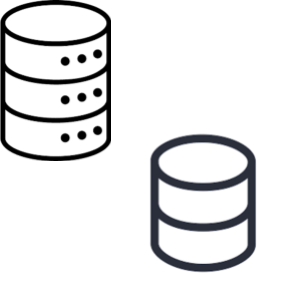

class: title-slide, middle, right, animated fadeOut


```{css, echo = F}
/* -------------------------------------------------------
 *
 *     !! This file was generated by xaringanthemer !!
 *
 *  Changes made to this file directly will be overwritten
 *  if you used xaringanthemer in your xaringan slides Rmd
 *
 *  Issues or likes?
 *    - https://github.com/gadenbuie/xaringanthemer
 *    - https://www.garrickadenbuie.com
 *
 *  Need help? Try:
 *    - vignette(package = "xaringanthemer")
 *    - ?xaringanthemer::style_xaringan
 *    - xaringan wiki: https://github.com/yihui/xaringan/wiki
 *    - remarkjs wiki: https://github.com/gnab/remark/wiki
 *
 *  Version: 0.4.2
 *
 * ------------------------------------------------------- */
@import url(https://fonts.googleapis.com/css?family=Arial:400,400i&display=swap);
@import url(https://fonts.googleapis.com/css?family=Arial+Narrow&display=swap);
@import url(https://fonts.googleapis.com/css?family=Arial+Narrow&display=swap);
@import url(https://fonts.googleapis.com/css?family=Arial+Narrow&display=swap);

:root {
  /* Fonts */
  --text-font-family: Arial;
  --text-font-is-google: 1;
  --text-font-family-fallback: -apple-system, BlinkMacSystemFont, avenir next, avenir, helvetica neue, helvetica, Ubuntu, roboto, noto, segoe ui, arial;
  --text-font-base: Arial;
  --header-font-family: 'Arial Narrow';
  --header-font-is-google: 1;
  --header-font-family-fallback: Arial;
  --code-font-family: 'Arial Narrow';
  --code-font-is-google: 1;
  --base-font-size: 20px;
  --text-font-size: 1rem;
  --code-font-size: 53%;
  --code-inline-font-size: 1em;
  --header-h1-font-size: 2.75rem;
  --header-h2-font-size: 2.25rem;
  --header-h3-font-size: 1.75rem;

  /* Colors */
  --text-color: #2f353b;
  --header-color: #666666;
  --background-color: #E6E6E6;
  --link-color: #003891;
  --text-bold-color: #EF9D2F;
  --code-highlight-color: rgba(255,255,0,0.5);
  --inverse-text-color: #E6E6E6;
  --inverse-background-color: #003891;
  --inverse-header-color: #E6E6E6;
  --inverse-link-color: #003891;
  --title-slide-background-color: #E6E6E6;
  --title-slide-text-color: #666666;
  --header-background-color: #003891;
  --header-background-text-color: #E6E6E6;
  --primary: #E6E6E6;
  --secondary: #003891;
}
/*lo agregué yo*/

html {
  font-size: var(--base-font-size);
}

body {
  font-family: var(--text-font-family), var(--text-font-family-fallback), var(--text-font-base);
  font-weight: 400;
  color: var(--text-color);
}
h1, h2, h3 {
  font-family: var(--header-font-family), var(--header-font-family-fallback);
  font-weight: 600;
  color: var(--header-color);
}
.remark-slide-content {
  background-color: var(--background-color);
  font-size: 1rem;
  background-image: url("https://raw.githubusercontent.com/AGSCL/DSPUCH/main/_figs/2024PPT_ESP/Diapositiva2.SVG");
  background-size: contain  !important;  /* Ensures the entire image is visible : cover era la anterior */
  background-position: center !important;
  background-repeat: no-repeat !important;
  /*padding: 0.4em 2.4em 0.4em 2.4em;*/
  /*height: 100vh;  /* Ensures the slide takes full viewport height */
  /*width: 100vh;*/
  /*height: 100%;*/
}
.remark-slide-content h1 {
  font-size: var(--header-h1-font-size);
}
.remark-slide-content h2 {
  font-size: var(--header-h2-font-size);
}
.remark-slide-content h3 {
  font-size: var(--header-h3-font-size);
}
.remark-code, .remark-inline-code {
  font-family: var(--code-font-family), Menlo, Consolas, Monaco, Liberation Mono, Lucida Console, monospace;
}
.remark-code {
  font-size: var(--code-font-size);
}
.remark-inline-code {
  font-size: var(--code-inline-font-size);
  color: #003891;
}
.remark-slide-number {
  color: #2f353b;
  opacity: 1;
  font-size: 0.9rem;
}
strong {
  font-weight: bold;
  color: var(--text-bold-color);
}
a, a > code {
  color: var(--link-color);
  text-decoration: none;
}
.footnote {
  position: absolute;
  bottom: 60px;
  padding-right: 4em;
  font-size: 0.9em;
}
.remark-code-line-highlighted {
  background-color: var(--code-highlight-color);
}
.inverse {
  background-color: var(--inverse-background-color);
  color: var(--inverse-text-color);
  
}
.inverse h1, .inverse h2, .inverse h3 {
  color: var(--inverse-header-color);
}
.inverse a, .inverse a > code {
  color: var(--inverse-link-color);
}
.title-slide, .title-slide h1, .title-slide h2, .title-slide h3 {
  color: var(--title-slide-text-color);
}
.title-slide {
  background-color: var(--title-slide-background-color);
  background-image: url("https://raw.githubusercontent.com/AGSCL/DSPUCH/main/_figs/2024PPT_ESP/Diapositiva1.SVG");
  background-size: 100% auto !important; /* Ensures the entire image is visible : cover era la anterior */
  /*background-position: center top !important; */
  background-repeat: no-repeat;
  /*padding: 0.4em 2.4em 0.4em 2.4em;*/
  width: 100% !important;
  height: 100vh; 
}
.title-slide .remark-slide-number {
  display: none;
}
/* Two-column layout */
.left-column {
  width: 20%;
  height: 92%;
  float: left;
}
.left-column h2, .left-column h3 {
  color: #00389199;
}
.left-column h2:last-of-type, .left-column h3:last-child {
  color: #003891;
}
.right-column {
  width: 75%;
  float: right;
  padding-top: 1em;
}
.pull-left {
  float: left;
  width: 47%;
}
.pull-right {
  float: right;
  width: 47%;
}
.pull-right + * {
  clear: both;
}
img, video, iframe {
  max-width: 100%;
}
blockquote {
  border-left: solid 5px #00389180;
  padding-left: 1em;
}
.remark-slide table {
  margin: auto;
  border-top: 1px solid #666;
  border-bottom: 1px solid #666;
}
.remark-slide table thead th {
  border-bottom: 1px solid #ddd;
}
th, td {
  padding: 5px;
}
.remark-slide table:not(.table-unshaded) thead,
.remark-slide table:not(.table-unshaded) tfoot,
.remark-slide table:not(.table-unshaded) tr:nth-child(even) {
  background: #FCFCFC;
}
table.dataTable tbody {
  background-color: var(--background-color);
  color: var(--text-color);
}
table.dataTable.display tbody tr.odd {
  background-color: var(--background-color);
}
table.dataTable.display tbody tr.even {
  background-color: #FCFCFC;
}
table.dataTable.hover tbody tr:hover, table.dataTable.display tbody tr:hover {
  background-color: rgba(255, 255, 255, 0.5);
}
.dataTables_wrapper .dataTables_length, .dataTables_wrapper .dataTables_filter, .dataTables_wrapper .dataTables_info, .dataTables_wrapper .dataTables_processing, .dataTables_wrapper .dataTables_paginate {
  color: var(--text-color);
}
.dataTables_wrapper .dataTables_paginate .paginate_button {
  color: var(--text-color) !important;
}

/* Horizontal alignment of code blocks */
.remark-slide-content.left pre,
.remark-slide-content.center pre,
.remark-slide-content.right pre {
  text-align: start;
  width: max-content;
  max-width: 100%;
}
.remark-slide-content.left pre,
.remark-slide-content.right pre {a
  min-width: 50%;
  min-width: min(40ch, 100%);
}
.remark-slide-content.center pre {
  min-width: 66%;
  min-width: min(50ch, 100%);
}
.remark-slide-content.left pre {
  margin-left: unset;
  margin-right: auto;
}
.remark-slide-content.center pre {
  margin-left: auto;
  margin-right: auto;
}
.remark-slide-content.right pre {
  margin-left: auto;
  margin-right: unset;
}

/* Slide Header Background for h1 elements */
.remark-slide-content.header_background > h1 {
  display: block;
  position: absolute;
  top: 0;
  left: 0;
  width: 100%;
  background: var(--header-background-color);
  color: var(--header-background-text-color);
  /*padding: 2rem 2.4em 1.5rem 2.4em;*/
  margin-top: 0;
  box-sizing: border-box;
}
.remark-slide-content.header_background {
  padding-top: 7rem;
}

@page { margin: 0; }
@media print {
  .remark-slide-scaler {
    width: 100% !important;
    height: 100% !important;
    transform: scale(1) !important;
    top: 0 !important;
    left: 0 !important;
  }
}

.primary {
  color: var(--primary);
}
.bg-primary {
  background-color: var(--primary);
}
.secondary {
  color: var(--secondary);
}
.bg-secondary {
  background-color: var(--secondary);
}

.remark-slide-container {
  transition: transform 0.5s ease;
}

/* Extra CSS */
.remark-slide-scaler {
  overflow-y: auto;
}
.gray {
  color: #aaaaaa;
}
.red {
  color: #A4222B;
}
.darkgreen {
  color: #45503B;
}
.darkred {
  color: #591F0A;
}
.small {
  font-size: 90%;
}
.pull_c {
  float: center;
  width: 30%;
  height: 50%;
  padding-left: 40%;
}
.pull_c_title {
  height: 90%;
}
.pull_l_70 {
  float: left;
  width: 72%;
  font-size: 90%;
}
.pull_r_30 {
  float: right;
  width: 23%;
  font-size: 90%;
}
.pull_left {
  float: left;
  width: 47%;
  height: 100%;
  padding-right: 2%;
}
.pull_right {
  float: right;
  width: 47%;
  height: 100%;
  padding-left: 2%;
}
.small_left {
  float: left;
  width: 47%;
  height: 50%;
  padding-right: 2%;
}
.small_right {
  float: right;
  width: 47%;
  height: 50%;
  padding-left: 2%;
}
.algo_right {
  float: right;
  padding-left: 2%;
}
.left_code {
  float: left;
  width: 47%;
  height: 100%;
  padding-right: 2%;
  font: Roboto;
}
.code_out {
  float: right;
  width: 47%;
  height: 100%;
  padding-left: 2%;
  font: Roboto;
}
.text_180 {
  font-size: 180%;
}
.text_170 {
  font-size: 170%;
}
.text_160 {
  font-size: 160%;
}
.text_150 {
  font-size: 150%;
}
.text_140 {
  font-size: 140%;
}
.text_130 {
  font-size: 130%;
}
.text_120 {
  font-size: 120%;
}
.text_110 {
  font-size: 110%;
}
.text_110 {
  font-size: 110%;
}
.text_100 {
  font-size: 100%;
}
.code_10 {
  code-inline-font-size: 60%;
  overflow-y: scroll !important;
  overflow-x: scroll !important;
  max-height: 50vh !important;
  line-height: 0.75em;
}
.code_10_pre {
  code-inline-font-size: 60%;
  overflow-y: scroll !important;
  overflow-x: scroll !important;
  max-height: 15vh !important;
  line-height: 0.75em;
  min-height: 0.5em;
}
.code_15 {
  code-inline-font-size: 15%;
  overflow-y: scroll !important;
  overflow-x: scroll !important;
  max-height: 10vh !important;
}
.text_90 {
  font-size: 90%;
}
.text_80 {
  font-size: 80%;
}
.text_75 {
  font-size: 75%;
}
.text_70 {
  font-size: 70%;
}
.text_65 {
  font-size: 65%;
}
.text_62 {
  font-size: 62%;
}
.text_60 {
  font-size: 60%;
}
.text_50 {
  font-size: 50%;
}
.text_40 {
  font-size: 40%;
}
.text_30 {
  font-size: 30%;
}
.text_20 {
  font-size: 20%;
}
.line_space_15 {
  line-height: 1.5em;;
}
.line_space_13 {
  line-height: 1.3em;;
}
.line_space_11 {
  line-height: 1.1em;;
}
.line_space_15 {
  line-height: 1.5em;;
}
.line_space_09 {
  line-height: 0.9em;;
}
.line_space_07 {
  line-height: 0.7em;;
}
.line_space_05 {
  line-height: 0.5em;;
}
.largest {
  font-size: 2.488em;;
}
.larger {
  font-size: 2.074em;;
}
.large {
  font-size: 1.44em;;
}
.small {
  font-size: 0.833em;;
}
.smaller {
  font-size: 0.694em;;
}
.smallest {
  font-size: 0.579em;;
}
.limity150 {
  max-height: 150px;;
  overflow-y: auto;;
}
.tiny_text {
  font-size: 70%;
}
.large_text {
  font-size: 150%;
}
.slide_blue {
  background-color: #FEDA3F;
  color: #3C3C3B;
}
.bottom_center {
  margin: 0;
  position: absolute;
  top: 90%;
  left: 50%;
  -ms-transform: translate(-50%, -50%);
  transform: translate(-50%, -50%);
}
.bottom_center2 {
  margin: 0;
  position: fixed; /* Cambiar a 'fixed' para fijar la posición */
  bottom: 80px; /* Ajustar el valor para posicionarlo desde la parte inferior de la pantalla */
  left: 50%; /* Asegurar que esté centrado horizontalmente en la pantalla */
  transform: translateX(-50%); /* Centrarse horizontalmente */
}

.down_center {
  margin: 0;
  position: absolute;
  top: 80%;
  left: 50%;
  -ms-transform: translate(-50%, -50%);
  transform: translate(-50%, -50%);
}
.down_center2 {
  margin: 0;
  position: absolute;
  top: 98%;
  left: 50%;
  -ms-transform: translate(-50%, -50%);
  transform: translate(-50%, -50%);
}
.center_image {
  margin: 0;
  position: absolute;
  top: 50%;
  left: 50%;
  -ms-transform: translate(-50%, -50%);
  transform: translate(-50%, -50%);
}
.down_left {
  margin: 0;
  position: absolute;
  top: 80%;
  left: 22%;
  -ms-transform: translate(-50%, -50%);
  transform: translate(-50%, -50%);
}
.down_right {
  margin: 0;
  position: absolute;
  top: 80%;
  left: 72%;
  -ms-transform: translate(-50%, -50%);
  transform: translate(-50%, -50%);
}
slides > slide {
  overflow-x: auto !important;
  overflow-y: auto !important;
}
.superbigimage {
  white-space: nowrap;
  overflow-y: scroll;
}
/* https://www.garrickadenbuie.com/blog/better-progressive-xaringan/*/
.bold-last-item > ul > li:last-of-type,
.bold-last-item > ol > li:last-of-type {
  font-weight: bold;
}

.section{
  background-image: linear-gradient(#003891 90%, : #EF9D2F !important;/* background-color: #ff7f50; */
  background-size: contain  !important;  /* Ensures the entire image is visible : cover era la anterior */
  background-position: center !important;
  background-repeat: no-repeat !important;
}
.gradient-slide {
  background: linear-gradient(45deg, #003891, #EF9D2F); /* Adjust the colors and direction as needed */
  color: var(--background-color); /* Adjust text color for better contrast */
}

/* Incluye aquí el CSS proporcionado anteriormente */
table {
  width: 100%;
  border-collapse: collapse;
  font-size: 10px;
}

th, td {
  border: 1px solid #000;
  padding: 3px;
  margin: 0;
}

th {
  background-color: #e0e0e0;
}

th:nth-child(1), td:nth-child(1) {
  width: 20%;
}
th:nth-child(2), td:nth-child(2) {
  width: 15%;
}
th:nth-child(3), td:nth-child(3) {
  width: 65%;
}

.table-container {
  max-width: 100%;
  max-height: 500px;
  overflow-x: auto;
  overflow-y: auto;
}

.move-right {
  padding-left: 50px !important; /* Adjust the value as needed */
  padding-top: -20px !important;
  /* Alternatively, you can use margin-left */
  /* margin-left: 50px; */
}

.footnote2 {
/*  bottom: 60px;*/
  padding-right: 4em !important;
  font-size: 2.4px !important;
  font-style: italic !important;
}
/*https://pkg.garrickadenbuie.com/xaringanExtra/panelset/#1*/
.panelset {
  --panel-tab-foreground: currentColor;
  --panel-tab-active-foreground: #0051BA;
  --panel-tab-hover-foreground: #8b0000;
  --panel-tabs-border-bottom: #ddd;
  --panel-tab-inactive-opacity: 0.5;
  --panel-tab-font-family: Arial;\
}
.left-column2 {
    width: 30%;
    height: 92%;
    float: left;
}
.right-column2 {
  width: 69%;
  float: right;
  padding-top: 1em;
}
</style>

```

```{r setup_theme0, include = FALSE}
rm(list=ls());gc()
unlink("*_cache", recursive = TRUE)
if(!grepl("4.4.0",R.version.string)){stop("Different version (must be 4.4.0)")}
#, 'libs/my-theme.css'
#load(paste0(sub("$\\/","",sub("2019 \\(github\\)/SUD_CL","2022 \\(github\\)",here::here())),"/11_pres.RData"))
options(servr.daemon = TRUE)
```


```{r setup, include = FALSE}
local({r <- getOption("repos")
       r["CRAN"] <- "http://cran.r-project.org" 
       options(repos=r)
})
pacman::p_unlock(lib.loc = .libPaths()) #para no tener problemas reinstalando paquetes

if(!require(pacman)){install.packages("pacman")}
pacman::p_load(devtools, here, showtext, ggpattern, RefManageR, pagedown, magick, bibtex, DiagrammeR, xaringan, xaringanExtra, xaringanthemer, fontawesome, tidyverse, psych, cowplot, pdftools, mstate, showtext, compareGroups, chilemapas, choroplethrAdmin1,  choroplethr, choroplethrMaps, ggiraph, sf, distill, qrcode, pdftools, dagitty, ggdag, geepack, survey, ipw, reshape, widgetframe, geeM, MuMIn, pagedown, ggpubr, plotly, ggrepel, install=F)

if(!require(xaringanBuilder)){devtools::install_github("jhelvy/xaringanBuilder",upgrade = "never")}
if(!require(icons)){remotes::install_github("mitchelloharawild/icons",upgrade = "never")}

test_fontawesome<- function(x="github"){
tryCatch({
  invisible(fontawesome::fa(name = x))
  return(message("fontawesome installed"))
},
# ... but if an error occurs, tell me what happened: 
error=function(error_message) {
  message("Installing fontawesome")
  icons::download_fontawesome()  
})
}

if(!require(rnaturalearth)){install.packages("rnaturalearth");library(rnaturalearth)}
if(!require(rnaturalearthdata)){install.packages("rnaturalearthdata");library(rnaturalearthdata)}
if(!require(rnaturalearthhires)){install.packages("rnaturalearthhires",repos="http://packages.ropensci.org", type = "source");library(rnaturalearthhires)}
if(!require(pagedown)){install.packages("pagedown");library(pagedown)}
if(!require(ggpubr)){install.packages("ggpubr");library(ggpubr)}
if(!require(plotly)){install.packages("plotly");library(plotly)}
if(!require(htmlwidgets)){install.packages("htmlwidgets");library(htmlwidgets)}
if(!require(ggrepel)){install.packages("ggrepel");library(ggrepel)}
if(!require(pROC)){install.packages("pROC");library(pROC)}
if(!require(Epi)){install.packages("Epi");library(Epi)}
if(!require(emo)){devtools::install_github("hadley/emo");library(emo)} #https://github.com/hadley/emo
if(!require(etm)){install.packages("etm");library(etm)}
if(!require(ggraph)){install.packages("ggraph");library(ggraph)}
if(!require(tidygraph)){install.packages("tidygraph");library(tidygraph)}
if(!require(igraph)){install.packages("igraph");library(igraph)}
if(!require(scatterpie)){install.packages("scatterpie");library(scatterpie)}


options(scipen=2) #display numbers rather scientific number

#:#:#:#:#:#:#:#:#:#:#:#:#:#:#:#:#:#:#:#:#:#:#:#:#:#:#:#:#:#:#:#:#:#:#:#:#:#:#:#:#:#:#:#:#:#:#:#:#:#:#:#:#:#:#:
#:#:#:#:#:#:#:#:#:#:#:#:#:#:#:#:#:#:#:#:#:#:#:#:#:#:#:#:#:#:#:#:#:#:#:#:#:#:#:#:#:#:#:#:#:#:#:#:#:#:#:#:#:#:#:

vec_col<-c("#660600","#6F3930","#745248","#786B60","#E6E6E6","#738FBC","#003891","#3C5279","#786B60","#B48448","#EF9D2F","#D99155","#E3D1C2","#E0BC9E","#ABB0BF","#835F69","#5A0D13")
plot_prueba<-barplot(1:length(vec_col), col=vec_col)

#https://github.com/yihui/xaringan/issues/260
#https://coolors.co/21177a-fe4a17-788aa3-45503b
# style_duo( 
#   primary_color = "#E6E6E6", ##E6E6E6
#   secondary_color = "#003891",
#   text_color = "#2f353b", 
#   text_bold_color = "#EF9D2F", ##92B6B1   #fdecef  #F9C784   ##CAE7B9 ##BDC667 ##B9D8C2 ##591F0A ##D6FFF6 #45503B
#   #base_color = '#aaaaaa',
# #  background_color = 'white',
#   background_position = 'center',
#   header_font_google = google_font("Arial Narrow"),
#   text_font_google   = google_font("Arial", "400", "400i"),
#   code_font_google   = google_font("Arial Narrow"),
#   code_font_size = '53%', #sirve
#   padding = "0.4em 2.4em 0.4em 2.4em",
#   extra_fonts = list(google_font("Arial Narrow")),
#   title_slide_background_image = "./_figs/2024PPT_ESP/Diapositiva1.svg",
#   title_slide_background_size = "cover",
#   background_image = "./_figs/2024PPT_ESP/Diapositiva2.svg",
#   background_size = "cover",
#   extra_css =
#   list(
#   ".remark-slide-scaler" = list("overflow-y" = "auto"), # para no tener limites de extensión
#  # ".remark-slide-number" = list("display" = "none"), #oculta el reloj también
#  # "pre"= list("line-height"= "0.2em"),
#   ".gray"   = list(color = "#aaaaaa"),
#   ".red"   = list(color = "#A4222B"),
#   ".darkgreen"   = list(color = "#45503B"),
#   ".darkred"   = list(color = "#591F0A"),
#   ".small" = list("font-size" = "90%"),
#   ".pull_c" = list("float" = "center","width" = "30%", "height" = "50%", "padding-left" = "40%"),
#   ".pull_c_title" = list("height" = "90%"),
#   ".pull_l_70" = list("float"= "left","width"= "72%", "font-size"= "90%"),
#   ".pull_r_30" = list("float"= "right","width"= "23%", "font-size"= "90%"),
#   ".pull_left"  = list("float"= "left","width"= "47%", "height"= "100%", "padding-right"= "2%"),
#   ".pull_right" = list("float"= "right","width"= "47%", "height"= "100%", "padding-left"= "2%"),
#   ".small_left"  = list("float"= "left", "width"= "47%", "height"= "50%", "padding-right"= "2%"),
#   ".small_right" = list("float"= "right","width"= "47%", "height"= "50%", "padding-left"= "2%"),
#   ".left_code" = list("float"="left","width"="47%","height"="100%","padding-right"="2%",    "font"="Roboto"),
#   ".code_out"  = list("float"="right","width"="47%","height"="100%","padding-left"="2%",    "font"="Roboto"),
#   ".text_180" = list("font-size" = "180%"),
#   ".text_170" = list("font-size" = "170%"),
#   ".text_160" = list("font-size" = "160%"),    
#   ".text_150" = list("font-size" = "150%"),
#   ".text_140" = list("font-size" = "140%"),  
#   ".text_130" = list("font-size" = "130%"),
#   ".text_120" = list("font-size" = "120%"),
#   ".text_110" = list("font-size" = "110%"),
#   ".text_110" = list("font-size" = "110%"),
#   ".text_100" = list("font-size" = "100%"),
#   ".code_10" = list("code-inline-font-size"= "60%",
#                     "overflow-y" = "scroll !important",
#                     "overflow-x" = "scroll !important",
#                     "max-height" = "50vh !important",# 50% altura viewport
#                     "line-height"= "0.75em"),
#    ".code_10_pre" = list("code-inline-font-size"= "60%",
#                     "overflow-y" = "scroll !important",
#                     "overflow-x" = "scroll !important",
#                     "max-height" = "15vh !important",
#                     "line-height"= "0.75em",
#                     "min-height"="0.5em"
#                     ),
#   ".code_15" = list("code-inline-font-size"= "15%",
#                     "overflow-y" = "scroll !important",
#                     "overflow-x" = "scroll !important",
#                     "max-height" = "10vh !important"),
#   ".text_90" = list("font-size" = "90%"),
#   ".text_80" = list("font-size" = "80%"),
#   ".text_70" = list("font-size" = "70%"),
#   ".text_65" = list("font-size" = "65%"),
#   ".text_60" = list("font-size" = "60%"),
#   ".text_50" = list("font-size" = "50%"),
#   ".text_40" = list("font-size" = "40%"),
#   ".text_30" = list("font-size" = "30%"),
#   ".text_20" = list("font-size" = "20%"),
#   ".line_space_15" = list("line-height" = "1.5em;"),
#   ".line_space_13" = list("line-height" = "1.3em;"),
#   ".line_space_11" = list("line-height" = "1.1em;"),
#   ".line_space_15" = list("line-height" = "1.5em;"),
#   ".line_space_09" = list("line-height" = "0.9em;"),
#   ".line_space_07" = list("line-height" = "0.7em;"),
#   ".line_space_05" = list("line-height" = "0.5em;"),
#   ".largest" =  list("font-size" = "2.488em;"),
#   ".larger" =  list("font-size" = "2.074em;"),
#   ".large" =  list("font-size" = "1.44em;"),
#   ".small" =  list("font-size" = "0.833em;"),
#   ".smaller" =  list("font-size" = "0.694em;"),
#   ".smallest" =  list("font-size" = "0.579em;"),
#   ".limity150" = list("max-height" = "150px;",
#                      "overflow-y" = "auto;"
#       ),
#     ".tiny_text" = list(
#       "font-size"= "70%"
#       ),
#     ".large_text" = list(
#       "font-size"= "150%"
#       ),
#     ".slide_blue" = list(
#       "background-color" = "#FEDA3F",
#       "color" = "#3C3C3B"
#       ),
#       ".bottom_center" = list(
#     margin  = "0",
#     position = "absolute",
#     top      = "90%",
#     left     = "50%",
#     '-ms-transform' = "translate(-50%, -50%)",
#     transform = "translate(-50%, -50%)"
#     ),
#       ".down_center" = list(
#     margin  = "0",
#     position = "absolute",
#     top      = "80%",
#     left     = "50%",
#     '-ms-transform' = "translate(-50%, -50%)",
#     transform = "translate(-50%, -50%)"
#     ),
#   ".center_image" = list(
#     margin  = "0",
#     position = "absolute",
#     top      = "50%",
#     left     = "50%",
#     '-ms-transform' = "translate(-50%, -50%)",
#     transform = "translate(-50%, -50%)"
#     ),
#     ".down_left" = list(
#     margin  = "0",
#     position = "absolute",
#     top      = "80%",
#     left     = "22%",
#     '-ms-transform' = "translate(-50%, -50%)",
#     transform = "translate(-50%, -50%)"
#     ),
#      ".down_right" = list(
#     margin  = "0",
#     position = "absolute",
#     top      = "80%",
#     left     = "72%",
#     '-ms-transform' = "translate(-50%, -50%)",
#     transform = "translate(-50%, -50%)"
#     ),
#     "slides > slide" = list(
#     "overflow-x"  = "auto !important",
#     "overflow-y" = "auto !important"
#     ),
#  #   "pre" = list(
# #    "white-space"  = "pre !important",
# #    "overflow-y" = "scroll !important",
# #    "max-height" = "40vh !important",
# #    "font-size" = "0.8em"
# #    ),
#     ".superbigimage" = list(
#     "white-space"  = "nowrap",
#     "overflow-y" = "scroll"
#     )
#   )
# )

options(htmltools.preserve.raw = FALSE)

#knitr::opts_chunk$set(comment = NA) # lo saqué pa probar por si
knitr::opts_chunk$set(dpi=720)
#options(htmltools.preserve.raw = FALSE)#A recent update to rmarkdown (in version 2.6) changed how HTML widgets are included in the output file to use pandoc's raw HTML blocks. Unfortunately, this feature isn't compatible with the JavaScript markdown library used by xaringan. You can disable this feature and resolve the issue with htmlwidgets in xaringan slides by setting
#https://stackoverflow.com/questions/65766516/xaringan-presentation-not-displaying-html-widgets-even-when-knitting-provided-t/65768952#65768952

xaringanExtra::use_scribble() #son los lapices
xaringanExtra::use_tile_view()
xaringanExtra::use_panelset()
xaringanExtra::use_editable(expires = 1)
#xaringanExtra::use_fit_screen()

check_code <- function(expr, available){
  if(available){
    eval(parse(text = expr))
  } else {
    expr
  }
}
path2<-getwd()
```
```{r, load_refs, include=F, eval=T, cache=FALSE}
library(RefManageR)
BibOptions(check.entries = FALSE,
           bib.style = "numeric",
           cite.style = "numeric",
           style = "markdown",
           super = TRUE,
           hyperlink = FALSE,
           dashed = FALSE)
warning(paste0("./libreria_generica.txt"))

myBib <- ReadBib("./libreria_generica.txt", check = FALSE,  .Encoding="latin1")
```

.move-right[
.line_space_15[ 
## .text_60[Predicción del tiempo a la readmisión y mortalidad en adultos<br>en tratamiento por trastornos por uso de sustancias en Chile:<br>Un estudio de cohorte retrospectivo de 12 años]
]

.line_space_11[

.bg-text[

.text_80[Director de tesis: Jay Kaufman<br>Co-director de tesis: Álvaro Castillo-Carniglia<br>Estudiante: Andrés González-Santa Cruz]

.text_50[gonzalez.santacruz.andres@gmail.com] [`r fontawesome::fa(name = "github")`](https://github.com/AGSCL) [`r fontawesome::fa(name = "orcid", fill="green")`](https://orcid.org/0000-0002-5166-9121)
]
]
]

???
*#_#_#_#_#_#_#_#_#_#_
**NOTA**
*#_#_#_#_#_#_#_#_#_#_

Muy Buenos días

A continuación, les voy a presentar mi proyecto de tesis doctoral titulado **Predicción del tiempo a la readmisión y mortalidad en adultos en tratamiento por trastornos por uso de sustancias en Chile: Un estudio de cohorte retrospectivo de 12 años**.

Acompañantes en este Proceso

- Tutor: Jay kaufman, quien por motivos de agenda no pudo asistir 
- Co-Tutor: Álvaro Castillo, quien se encuentra aquí

---
layout: true
class: animated fadeIn 
---
class: animated fadeIn 
## Índice

<br>

1. Contextualización

2. Objetivos

3. Métodos

4. Potenciales limitaciones

5. Plan de trabajo

???
*#_#_#_#_#_#_#_#_#_#_
**NOTA INDICE**
*#_#_#_#_#_#_#_#_#_#_
A continuación mostraré la estructura de mi presentación: 

Esta es la estructura clásica del proyecto de investigación; introducción, objetivos, métodos y resultados

---
class: animated fadeIn 
## ¿Qué es un trastorno por uso<br>de sustancias (TUS)?

.pull-left[
**Definición** $`r Cite(myBib, c("Volkow2023","APA2013"))`$

.line_space_11[.small[
- Trastornos psicológicos o comportamentales
  
- Consumo regular e intencional
  
- Sustancias legales e ilegales
]]

**Comportamientos**

.line_space_11[.small[
- Recurrentes y disfuncionales
  
- Plancenteros y que se refuerzan
  
- Efectos negativos
]]

]

.pull-left[
**Síntomas**

.line_space_11[.small[
- *Craving*
  
- Tolerancia y recaídas
  
- Interferencia actividades
]]

**Criterios de severidad según DSM-5**

.line_space_11[.small[
- Al menos 2 en los últimos 12 meses
]]

]

???
*#_#_#_#_#_#_#_#_#_#_
**NOTA**
*#_#_#_#_#_#_#_#_#_#_

**Definición** - Si bien la definición es problemática y no del todo unívoca, diríamos a grandes razgos que refiere a trastornos psicológicos o comportamentales causados principalmente por el consumo regular e intencional de sustancias psicoactivas, legales o ilegales.

- Se caracteriza por comportamientos recurrentes y disfuncionales, placenteros y que se refuerzan, aunque con efectos negativos

- En TUS, sustancias interfieren en la vida, el manual de diagnóstico de trastornos mentales, quinta versión, identifica 11 criterios ( entre los que destaca la compulsión a consumir, deseo abrumador o craving, la interferencia en actividades cotidianas o roles laborales y recaídas). 

- Cumpliendo 2, se indica la presencia del trastorno. Se divide en alto, medio y bajo.

---
class: bold-last-item, animated fadeIn 
## Magnitud y consecuencias<br>del TUS

--

- Vínculos con trastornos neuropsiquiátricos, físicos y factores de riesgo social $`r Cite(myBib, c("national_institute_on_drug_abusenida_part_nodate"))`$

???
*#_#_#_#_#_#_#_#_#_#_
**NOTA**
*#_#_#_#_#_#_#_#_#_#_
**¿Qué son esos efectos negativos? ¿es problema de salud pública?**
- Abarcan trastornos neuropsiquiátricos y físicos, junto con factores de riesgo social (p. ej., comportamientos sexuales de riesgo, participación en accidentes de tráfico e incidentes violentos). 

--

- Morbimortalidad

???
*#_#_#_#_#_#_#_#_#_#_
**NOTA**
*#_#_#_#_#_#_#_#_#_#_
- A nivel mundial y en nuestro continente, representan el 0.52% de la mortalidad global (2019) y 1.38% de años de vida ajustados por discapacidad. En nuestra región, es la novena causa de pérdida de años de vida ajustados por discapacidad y edad (AVISA)

--

- Impacto en el norte global, diferencias con Latinoamérica

  - Mayor mortalidad, otras sustancias, otras vías de administración... hasta ahora
  
  - Chile, Opinión pública, una mirada a las "causas de las causas" más allá del populismo penal
  
  - Chile, mayor necesidad de tratamiento a futuro, alta mortalidad por sustancias 

???
*#_#_#_#_#_#_#_#_#_#_
**NOTA**
*#_#_#_#_#_#_#_#_#_#_
Américas:

- EE.UU. y Canadá: Donde hay una crisis de opioides, que últimamente está mutando desde inyectada a fumada. [https://www.cdc.gov/mmwr/volumes/73/wr/mm7306a2.htm]
- Latinoamérica: Predominan alcohol, marihuana, cocaína, y pasta base. Emergencia de 2CB (tusi). Ingreso de fentanilo, cobertura mediática.
-  Percepción Pública (Ramírez-Bontá et al., 2023):

Chile: Según encuesta IPSOS el 2023
- Segundo país, después de Suecia, que considera la salud mental como principal problema (62% vs. promedio global de 36%).
- Mayor percepción de aumento de delincuencia (63% vs. 31% global). Principal causa: abuso de drogas y alcohol (vs. percepción de pobreza y desempleo a nivel mundial).

Chile: Situación Actual:
- Alta carga de enfermedad psiquiátrica.
- Dependencia de alcohol: una de las mayores causas de AVISA. Comparado con el continente, alto consumo de alcohol.
- Tendencias decrecientes o estables en consumo general (marihuana, cocaína, pasta base).
- En 2016, alta prevalencia de consumo en estudiantes de enseñanza superior. Proyecciones indican potencial aumento en necesidad de tratamiento.
- COVID-19 e inmigración podrían exacerbar la situación.
- Mortalidad atribuida a sustancias ilícitas: incremento del 170% entre 2010 y 2019 (junto con Brasil y Rep. Dominicana).
- ENPG 2020: 6% cumplen criterios para abuso o dependencia de alcohol, marihuana, cocaína o pasta base (12-64 años).

--

- De ahí que...

.center[
.darkred[ **Debemos entender predictores de desenlaces de salud negativos** ]
]

???
*#_#_#_#_#_#_#_#_#_#_
**NOTA**
*#_#_#_#_#_#_#_#_#_#_
- Se deben entender predictores de resultados y desenlaces de salud negativos en personas con TUS, y apuntar a reducir la demanda.

---
class: animated fadeIn 
## Tratamientos- <br>Situación general

.left-column[
Principales objetivos $`r Cite(myBib, c("babor2021","White2012", "world_health_organization_world_2023"))`$ 
.small[
- ¿abstinencia? ¿reducción daños/consumo? ¿recaídas?
- **Recuperación** (Gomez-Restrepo)
]
Modalidades e intervenciones $`r Cite(myBib, c("babor2021","White2012"))`$ 
.small[
- Farmacológica, psicológica y comunitaria
- Ambulatoria, internación y residencial
]

]

.right-column[
```{r "image-lousiana-trtmnts", echo=FALSE,  fig.align="left", out.width=250}
image_colorize(opacity = 70, image_read(path = 'https://drughelpline.org/wp-content/uploads/2023/07/Louisiana3-1024x683.jpg'), "#666666") 
```
```{r "trtmnts-quality-stds", echo=FALSE, eval=F,  fig.align="right", out.width=250, dev.args = list(bg = 'transparent')}

library(ggplot2)
library(grid)# Definición de las etiquetas para las dimensiones de calidad
labels <- c("Segura",
            "Efectiva",
            "Centrada en\nel paciente",
            "Oportuna",
            "Eficiente",
            "Equitativa")

# Coordenadas para el hexágono
points <- data.frame(x = c(0.5, 1, 1, 0.5, 0, 0), 
                     y = c(0, 0.25, 0.75, 1, 0.75, 0.25))

# Creación del gráfico
ggplot() + 
  geom_polygon(data = points, aes(x, y), fill = '#66666624', alpha = 0.24) +
  # geom_text(data = points, aes(x, y, label = labels), 
  #           hjust = 0.5, vjust = 0.5, size = 6) +
  geom_text(data = points, aes(x, y, label = labels), color="#2f353b",
            hjust = c(0.5, 1.2, 1.2, 0.5, -0.2, -0.2), 
            vjust = c(-0.5, 0.5, 0.5, 1.5, 0.5, 0.5), size = 12) +
  theme_void() + 
  theme(plot.title = element_text(hjust = 0.5, size = 20, face = "bold"))+
  labs(caption="Fuente: Elaboración propia a partir de WHO-UNODC. 2020.\nInternational Standards for the Treatment of Drug Use Disorders. Traducción no oficial. Obtenida desde:\n https://www.unodc.org/documents/drug-prevention-and-treatment/ES_UNODC-WHO_International_Standards_Treatment_Drug_Use_Disorders_April_unoff_2020.pdf")

# <div style="width: 500px; height: 100px; padding: 0px; font-size: x-small; font-style: italic; line-height: 1;">
# </div>
```
```{r "goal-trtmnts", eval=T, echo=FALSE, fig.align="right", message=FALSE, warning=FALSE, dev.args = list(bg = 'transparent'), out.width=250}
par(mar=c(0,0,0,0))
par(bg=NA)

nodes <- data.frame(
    name = c("Metas", "Mejorar calidad de\nvida y bienestar", "Reducir consumo\nproblemático", 
             "Mitigar síntomas\nasociados a recaídas", "Mejorar estatus de\nsalud y funcionalidad", 
             "Considerar factores\nde riesgo contextuales", "Prevenir consumo\nfuturo perjudicial")
)

edges <- data.frame(
    from = rep("Metas", 6),
    to = c("Mejorar calidad de\nvida y bienestar", "Reducir consumo\nproblemático", 
             "Mitigar síntomas\nasociados a recaídas", "Mejorar estatus de\nsalud y funcionalidad", 
             "Considerar factores\nde riesgo contextuales", "Prevenir consumo\nfuturo perjudicial")
)

# Convertir a objeto tbl_graph
graph <- tbl_graph(nodes = nodes, edges = edges, directed = TRUE)
# Aplicar el layout con un número alto de iteraciones
layout <- layout_with_fr(graph, niter = 5e6)

# Convertir el layout a data frame para su uso en ggraph
V(graph)$x <- layout[,1]
V(graph)$y <- layout[,2]

# Ajustar las posiciones para acercar los nodos al centro
V(graph)$x <- V(graph)$x * 0.01
V(graph)$y <- V(graph)$y * 0.01

# Crear el gráfico de red con ggraph
p <- ggraph(graph, layout = 'manual', x = V(graph)$x, y = V(graph)$y) + 
  geom_edge_link(aes(), 
                 arrow = arrow(length = unit(3, 'mm')), 
                 start_cap = circle(3, 'mm'), 
                 end_cap = circle(3, 'mm'), # Ajusta la longitud de la flecha aquí
                 color = "#ABB0BF", 
                 linewidth = 1) +
  geom_node_label(aes(label = name,  fontface = ifelse(name == "Metas", "bold", "plain")), repel = TRUE, size = 7.5, check_overlap =T) +
    theme_void() +
    theme(
    legend.position = 'none',
    plot.margin = unit(c(0, 0, 0, 0), "cm"),  # Eliminar márgenes
    panel.spacing = unit(0, "cm")             # Eliminar espaciado del panel
  ) +
  ggtitle(NULL)

p
```
]

???
*#_#_#_#_#_#_#_#_#_#_
**NOTA**
*#_#_#_#_#_#_#_#_#_#_

- **Objetivos**: Una respuesta social organizada a este problema han sido los programas de tratamiento. Estos conviven con otras políticas más punitivistas.

**Metas de los Programas**
- Mejorar calidad de vida y bienestar.
- Reducir consumo problemático.
- Mitigar síntomas asociados a recaídas.
- Mejorar estatus de salud y funcionalidad.
- Considerar factores de riesgo contextuales.
- Prevenir consumo futuro perjudicial.

*(Referencia: WHO y UNODC. International standards for the treatment of drug use disorders)*

**Finalidades de los Tratamientos**
- Abstinencia.
- Reducción de daños y patrones de consumo.
- Reducción de recaídas.

**Definición de Recuperación**
- Según Restrepo-Guzmán et al., "un estado de vida sin limitaciones o consecuencias negativas derivadas del consumo de sustancias".
- Algunas personas dejan las sustancias de forma natural, otras requieren tratamiento estructurado.

- **Objetivos**: Una respuesta social organizada a este problema han sido los programas de tratamiento. Estos conviven con otras políticas más punitivistas.

**Metas de los Programas** : - Mejorar calidad de vida y bienestar. ; - Reducir consumo problemático.; - Mitigar síntomas asociados a recaídas.; - Mejorar estatus de salud y funcionalidad.; - Considerar factores de riesgo contextuales; - Prevenir consumo futuro perjudicial.
*(Referencia: WHO y UNODC. International standards for the treatment of drug use disorders)*

- **Tipos y modalidades**: Existen múltiples tipos, tanto farmacológicos, de base psicológica y comunitaria. Se entregan en viarias configuraciones (por ej., ambulatoria [menos disruptiva], internación [para síntomas de abstinencia severos y alto riesgo de recaídas] y residencial [de mayor duración, para casos severos, con mayor compromiso]) dependiendo de factores contextuales y patrones de consumo.

- Se busca que los tratamientos se entiendan en un continuo de cuidados, de cuidado escalonado. También hay intervenciones de menor intensidad o en tecnológica que se encuentran en auge.

---
class: animated fadeIn 
## Tratamientos- <br>Hispanoamérica y Chile

.left-column[
Situación en hispanoamérica y Chile $`r Cite(myBib, c("Marin2018","servicio_nacional_para_la_prevencion_y_rehabilitacion_del_consumo_de_drogas_y_alcohol_senda_decimo_2022-1","oecd_health_2023", "vicente_prevalencias_2016","inter-american_drug_abuse_control_commission_cicad_report_2019", "PrezGmez2016", "ToroDevia2023"))`$ 
.small[
- Personal especializado
- Alcance áreas rurales
- Cobertura
]
Instituciones y lineamientos  $`r Cite(myBib, c("RN155", "mateo-pinones_evidence-based_2022"))`$  
.small[
- SENDA, tratamientos, FONASA
- Define estándares, compra y supervisa 
]

]

.right-column[
```{r "qalat", eval=T, echo=FALSE, fig.align="right", message=FALSE, warning=FALSE, dev.args = list(bg = 'transparent'), out.width=150}
magick::image_transparent(magick::image_transparent(image_read(path = './_figs/qalat.png'), "white"), "lightgray")
```
```{r "senda", eval=T, echo=FALSE, fig.align="left", message=FALSE, warning=FALSE, dev.args = list(bg = 'transparent'), out.width=150}
magick::image_transparent(magick::image_transparent(image_read(path = './_figs/LogoSENDA.png'), "white"), "lightgray")
```
]

???
*#_#_#_#_#_#_#_#_#_#_
**NOTA**
*#_#_#_#_#_#_#_#_#_#_
- **Situación en latinoamérica y chile**: Sistemas de salud fragmentados (en público y privado), acceso limitado a recursos y tratamiento para ambos. Los tratamientos de base comunitaria son dominantes, aunque se han constatado algunas pocas terapias basasdas en la fe y coercitivas.

- **Particularmente en chile**: fuerza de trabajo insuficiente en cuidados de salud vs. promedios OECD; limitada disponibilidad de servicios especializados en áreas rurales, cobertura limitada (si bien no del todo comparables, 1/10 consumidores problemáticos de sustancias recibe tratamiento de los que lo requieren de acuerdo a estimaciones de la Encuesta de población general al 2018, vs. globalmente es 1/8 y para alcohol 1/5), existen desafíos a la coordinación entre instituciones

[World Health Organization. World health statistics 2023: monitoring health for the SDGs, Sustainable Development Goals. Genève, Switzerland: World Health Organization; 2023.]

- **Respecto a las instituciones en Chile**: SENDA (Servicio Nacional para la Prevención y Rehabilitación de Drogas y Alcohol), tiene una importante cobertura de tratamientos TUS (tratamientos con financiamiento público, que representan al 81% de la población), son tratamientos de carácter voluntario con opciones de derivación. SENDA define estándares, compra y supervisa la entrega tratamientos [20].

- - - - - - - - - - - - - - - - - - - - - - - - - - - - - - - - - - - - - - - - - - - -

La definición de consumo problemático de drogas considera a quienes presentan síntomas de abuso de alcohol según DSM-IV y/o presencia de síntomas de abuso DSM-IV o dependencia según CIE-10 para usuarios de último año de marihuana, cocaína y/o pasta base.

[21] Ministerio de Salud[MINSAL]. Norma y orientaciones técnicas de los planes de tratamiento y rehabilitación para personas adultas con problemas derivados del consumo de drogas. Legal Rule or Regulation.
URL: https://www.senda.gob.cl/wp-content/uploads/2012/08/OrientacionesTecnicas_CentrosdeTratamiento.pdf.

---
class: bold-last-item, animated, fadeIn 
## Desenlaces posteriores<br>al tratamiento evitables

### Mediciones imperfectas pero útiles:

???
*#_#_#_#_#_#_#_#_#_#_
**NOTA**
*#_#_#_#_#_#_#_#_#_#_
Mediciones imperfectas de **impacto** del tratamiento a posteriori, pero útiles:

- A **nivel general** y globalmente, el impacto del tratamiento se ha medido en reducción de patrones de consumo, sintomatología psicológica y vinculados con el funcionamiento social (ej., conducta delictiva, educación, ocupación). El foco ha estado puesto en indicadores clínicos y de seguimiento a corto plazo (hasta 2 años), junto con beneficios económicos asociados (ej., uso de servicios de urgencia y criminalidad)

- no hay un gold standard para ver resultados. Se recomienda recurrir a más de uno. Si bien son imperfectas, son útiles para ver consecuencias sobre pacientes, familiares, sistemas de salud, particularmente si son no planeados y evitables.

--

- Readmisiones $`r Cite(myBib, c("Moss2020","RN246", "RN223", "RN438", "Donisi2016"))`$

???
*#_#_#_#_#_#_#_#_#_#_
**NOTA**
*#_#_#_#_#_#_#_#_#_#_

**Readmisión**: Si bien es parte de la administración de una enfermedad crónica más que una falla de un tratamiento, puede indicar la dificultad para derivar a una persona a un tratamiento de menor intensidad o en la que falla el dispositivo de tratamiento escalonado o continuo de tratamientos. Particularmente, puede ser útil como proxy de si los centros entregan herramientas efectivas para reducir las necesidades o como un criterio de desempeño, mientras no se utilice para retención prolongada. Por ej., entre los criterios de desempeño para el tratamiento de los trastornos por consumo de alcohol según la **Sociedad Americana de Medicina de Adicción (ASAM)**, la medida número siete apunta a la readmisión hospitalaria y residencial tras los episodios de tratamiento. 

- La readmisión se vincula a múltiples resultados negativos post-tratamiento, incluida la mortalidad, que viene a continuación
[
140. 	Donisi V, Tedeschi F, Wahlbeck K, Haaramo P, Amaddeo F. Pre-discharge factors predicting readmissions of psychiatric patients: a systematic review of the literature. BMC Psychiatry. 16 de diciembre de 2016;16(1):449.
141. 	Andersson HW, Wenaas M, Nordfjærn T. Relapse after inpatient substance use treatment: A prospective cohort study among users of illicit substances. Addict Behav. 2019;90:222–8.
142. 	Eastwood B, Peacock A, Millar T, Jones A, Knight J, Horgan P, et al. Effectiveness of inpatient withdrawal and residential rehabilitation interventions for alcohol use disorder: A national observational, cohort study in England. J Subst Abuse Treat. 2018/04/03 ed. mayo de 2018;88:1–8.
143. 	Hansen EM, Mejldal A, Nielsen AS. Predictors of Readmission Following Outpatient Treatment for Alcohol Use Disorder. Alcohol Alcohol Oxf Oxfs. 2020;55(3):291–8.
144. 	Moon SJE, Lee H. Relapse to substance use: A concept analysis. Nurs Forum (Auckl). 2020;55(3):523–30.
]

--

- Mortalidad $`r Cite(myBib, c("Peacock2020","Laine2022", "Vallersnes2018", "RN438", "Donisi2016"))`$

???
*#_#_#_#_#_#_#_#_#_#_
**NOTA**
*#_#_#_#_#_#_#_#_#_#_

- La mortalidad es un componente clave si se consideran ciertas limitaciones. Ha sido estudiado mayormente en consumidores de opioides en las últimas décadas, junto con personas con comorbilidades psiquiátricas. También han utilizado registros de hospitalizaciones y de mortalidad para ello. No siempre indican calidad del tratamiento; muchas veces los tratamientos no contemplan individuos no tratados con patrones de consumo severos y otras condiciones asociadas a mayor mortalidad (Bargagli et al.).

- Se ha encontrado que el tratamiento se ha vinculado a menores tasas de mortalidad.

- El foco ha estado en mortalidad por todas las causas, causas específicas, daño autoinflingido y sobredosis. Identificar factores asociados más allá de estilos de vida saludables es clave.

- Las ventanas de tiempo de estudio han sido variadas, desde un mes posterior a tratamiento hasta 10 años.

---
class: bold-last-item, animated, fadeIn 
## Factores capaces de predecir<br>desenlaces post-tratamiento adversos

.pull-left[
- Modelo de Ronald Andersen de utilización de servicios de salud (1995) $`r Cite(myBib, c("portilla_huidobro_factores_2015", "Andersen1995"))`$

- Predisponentes

- Necesidad percibida

- Habilitadores

  - MODALIDAD
]

.pull-right[
```{r "diagrama", echo=FALSE, fig.align="center", message=FALSE, warning=FALSE, dev.args=list(bg = 'transparent'), out.width=300}
par(mar=c(0,0,0,0))
par(bg=NA)
magick::image_transparent(magick::image_transparent(image_read(path = './_figs/diagram.webp'), "white"), "lightgray")
```
]

???
*#_#_#_#_#_#_#_#_#_#_
**NOTA**
*#_#_#_#_#_#_#_#_#_#_

Se ha utilizado el modelo de **Ronald anderson**, por su generalizabilidad y la utilidad de su un modelo de agrupación de predictores.

- En base a una tesis previa para identificar predictores, para Magíster en salud pública, elaborada por Rodrigo Portilla Huidobro, se replicó la agrupación en factores de Predisposición, de Necesidad y Facilitadores de atención

- **Predisposición**:Factores que influyen en la probabilidad de que un usuario utilice servicios de salud. Ej., edad (+,- readmisiones, + mortalidad), sexo (hombres, + mortalidad; mujeres, - adherencia), NSE (desempleo, inestabilidad habitacional, + readmisión y mortalidad), estado civil (solteros, + readmisión)

- **Necesidad**: Determinan *directamente* la demanda de asistencia sanitaria. Ej., comorbilidades (+ readmisión y mortalidad), severidad TUS (peores resultados post-tratamiento), policonsumo (+ tasas de readmisión y mortalidad)

- **Habilitadores**: Relacionados con las dinámicas de tto. y logística que facilitan el acceso y la continuidad. Ej., duración (tto. más largo, no tiempre es mejor, hay un punto decreciente; duración óptima para efectividad; estancias muy cortas, peores resultados; 90 días ha sido un marcador bastante utilizado), completar tratamiento (mejores resultados post-tratamiento)

- Por último, factores como la **modalidad** de tratamiento, pueden asociarse a una respuesta diferencial a tratamiento, ya que están dirigidos a poblaciones que se presentan con características biopsicosociales distintas. Pueden estar dirigidos a población general, donde hay tratamientos ambulatorios y residenciales; o, desde 2015, dirigidos específicamente a mujeres cuyas necesidades (hijos, embarazo) hace que requieran un tratamiento que responda a esas necesidades. este abarca ambulatorio intensivo y residencial.

---
class: animated, fadeIn 
## Estado y brechas en la<br>investigación

- Escasa investigación en el Sur Global 

- Poco extrapolables  $`r Cite(myBib, c("Pacurucu2019","Reyes2013","Silva2009", "Castro2021"))`$ 

  - Especialización de tratamientos $`r Cite(myBib, c("Stephen2012", "SantisB2007"))`$

  - Policonsumo $`r Cite(myBib, c("Font-Mayolas2022", "Liu2018"))`$ 

???
*#_#_#_#_#_#_#_#_#_#_
**NOTA**
*#_#_#_#_#_#_#_#_#_#_

- **escasa**: atribuida a distintos contextos epidemiológicos, sociales y de sistemas de salud. El contexto global vs. el latinoamericano es bastante distinto

- hacerlo es engañoso: estudios centrados en sustancias menos prevalentes (ej., heroina y otros opioides vs. alcohol, cocaina, derivados como la pasta base y marihuana)

- en general, en el norte global hay intervenciones especializadas para sustancias específicas, vs. intervenciones menos especializadas; el policonsumo hace que intervenciones enfocadas en una sola sustancia puede que no sea óptima

---
class: animated, fadeIn 
## Oportunidades, proyecciones y<br>relevancia

- Sistema centralizado de información a nivel nacional $`r Cite(myBib, c("Marin2018"))`$ 

- Ejemplo de datos administrativos e interconectados internacionales

- Enfoque longitudinal

- Alineación con objetivos sanitarios $`r Cite(myBib, c("nuevo2"))`$

- Enfoque en personas con alto riesgo

  - Focalizar  $`r Cite(myBib, c("nuevo1"))`$

???
*#_#_#_#_#_#_#_#_#_#_
**NOTA**
*#_#_#_#_#_#_#_#_#_#_

- **centralizado**: Avances en Chile; en respuesta, a principios de la década pasada SENDA creó SISTRAT (sistema de monitoreo de tratamiento e información relevante por TUS de alcance nacional), incorpora información sociodemográfica, estado de salud y antecedentes de uso de sustancias de pacientes en programas públicos de tratamiento por TUS. Permite la investigación y gestión de programa de tratamiento por TUS (posiblemente al 2023 llegue al 85%). Asimismo, los registros de mortalidad cumplen con estándares internacionales y son altamente fiables.

[21] Ministerio de Salud[MINSAL]. Norma y orientaciones técnicas de los planes de tratamiento y rehabilitación para personas adultas con problemas derivados del consumo de drogas. Legal Rule or Regulation.

- **Datos Interconectados**: gestión de sistemas interoperables con datos de diferentes fuentes. hay ejemplos de combinación de datos rutinarios, por ej., el TEDS en estados unidos, o el National Drug Treatment Monitoring System (UK) // mecanismo de monitoreo y vigilancia epidemiológica, en línea con las mejores prácticas basadas en mediciones (measurement-based practices)

- **trayectorias**: enfoque longitudinal, importancia de identificar combinaciones de factores que produzcan mejores resultados a largo plazo. A futuro, avanzar en explicar mecanismos causales. El desafío está en considerar la dependencia de los desenlaces y el riesgo competidor de la mortalidad. 

- **alto riesgo**: permite a futuro desarrollar planes especializados adaptados a necesidades específicas; ej., prevención de recaídas y seguimiento post-tratamiento; por ej., generando sistemas de alerta temprana para quienes cursan tratamiento, ofreciendo a futuro, por ej., tratamientos de menor intensidad (u ofrecer programa de apoyo a la integración social) o alocar esfuerzos en ellos para aplicar otros mecanismos de seguimiento que no han resultado para ser aplicados a todos después de tratamiento (Treatment outcomes profile, instrumentos para medir resultados de tratamiento)

- Los TUS se encuentran en el cuarto y quinto objetivo sanitario del eje de objetivos de estilos de vida y conductuales de la Estrategia Nacional de Salud 2021-2030.48 // A pesar de ello, los tratamientos no sobran, por lo que las readmisiones deben entregarse de manera **focalizada** // Esta tesis puede ser un primer paso, por su alcance nacional y un seguimiento de +10 años //  La investigación será abierta y de código público disponible para revisión y escrutinio, permitiendo actualización y replicación a diferentes tratamientos a futuro.

---
class: bold-last-item, animated, fadeIn 
## Objetivos

<br>

.center[
Evaluar el rol predictivo de la duración de la estadía y el resultado del tratamiento inicial, junto con otros factores pronósticos y predictivos de predisposición, necesidad percibida y facilitadores de atención, en la predicción del riesgo y el tiempo transcurrido a la primera readmisión y mortalidad por todas las causas en pacientes entre 18 y 64 años admitidos a tratamientos por TUS en Chile, desde 2010 a 2022.
]

.small[
- Describir la **tasa de incidencia** de muerte de pacientes entre pacientes de 18 a 64 años en tratamientos iniciales por TUS en Chile entre 2010 y 2022, en **comparación con la población general**.

- **Identificar un conjunto clave** de factores pronósticos y predictivos capaces de predecir el riesgo y tiempo a la **primera readmisión** a tratamientos por TUS en pacientes de 18 a 64 años en tratamientos iniciales por TUS en Chile entre 2010 y 2022.

- **Identificar un conjunto clave** de factores pronósticos y predictivos capaces de predecir el riesgo y tiempo a la **mortalidad por todas las causas** en pacientes de 18 a 64 años en tratamientos iniciales por TUS en Chile entre 2010 y 2022.

- **Predecir** el riesgo y tiempo al evento de la **primera readmisión** a tratamientos por TUS y **mortalidad** por todas las causas de manera **concatenada y conjunta** (es decir, dando cuenta de riesgos semi-competidores) en pacientes de 18 a 64 años en tratamientos iniciales por TUS en Chile entre 2010 y 2022.
]

---
class: partial-bg inverse, center, middle, animated, fadeIn

background-image: linear-gradient(45deg, #aaaaaa, #003891)

# Métodos

---
class: animated fadeIn 
## Diseño y participantes

- Observacional, cohorte retrospectiva, vinculada con datos de mortalidad

- RUN (Rol Único Nacional) encriptado
.pull-left[
```{r "disenio", echo=FALSE, fig.align="center", message=FALSE, warning=FALSE, dev.args=list(bg = 'transparent'), fig.cap="Estructura hipotética de los datos", out.width=460}
set.seed(2125)
# Create data
datasamp <- data.frame(
  y=abs(rpois(1:250,15)),
  y2=abs(rpois(1:250,15))
) %>% 
  dplyr::filter(y2>y, y>=8, y2<=24) %>%
  dplyr::mutate(Paciente=row_number()) %>% 
  #filtrar tratamientos más largos que 3 años
  dplyr::mutate(diff_treat=y2-y) %>% 
  dplyr::filter(diff_treat<=3)
for (i in 1:nrow(datasamp)){
  datasamp$y3[i]<-base::sample(x=seq(from=datasamp$y2[i]+1,to=24),1)
  datasamp$y3[i]<-ifelse(datasamp$y3[i]<=datasamp$y2[i],22,datasamp$y3[i])
  datasamp$y3[i]<-ifelse(datasamp$y3[i]>=25,24,datasamp$y3[i])
  datasamp$y4[i]<-ifelse(!is.na(datasamp$y3[i]),base::sample(x=seq(from=datasamp$y3[i]+1,to=24),1),24)
  datasamp$y4[i]<-ifelse(datasamp$y4[i]<=datasamp$y3[i],24,datasamp$y4[i])
  datasamp$y4[i]<-ifelse(datasamp$y4[i]>=25,24,datasamp$y4[i])
}
set.seed(2125)
pac_aleatorio1<-sample(1:max(datasamp$Paciente),40)
pac_aleatorio2<-setdiff(sample(1:max(datasamp$Paciente),40), pac_aleatorio1)
# Horizontal version, antes era 1985
end_plot<-23

data_mod<-
datasamp %>%
  dplyr::mutate(y42 = y3 + 3, resta = y4 - y3) %>% 
  dplyr::mutate(y4=ifelse(resta>3,y42,y4)) %>%
  dplyr::filter(Paciente >= 20 & Paciente <= 80)  # Filtrar pacientes con IDs menores a 20 y mayores a 80

fig_trans<-ggplot(data_mod) 
###>=10
#datos de tratamiento en periodo de seguimiento, posterior al 2010
fig_trans<-try(fig_trans+geom_segment(data=dplyr::filter(data_mod,y>=10,y2<=end_plot), aes(x=Paciente, xend=Paciente, y=y, yend=y2), color="gray15", alpha=.6, size=.8))
#datos de tratamiento en periodo de seguimiento, exceden el seguiemiento. linea entera hasta el 2020
fig_trans<-try(fig_trans+ geom_segment(data=dplyr::filter(data_mod,y>=10,y2>end_plot), aes(x=Paciente, xend=Paciente, y=y, yend=end_plot), color="gray15", alpha=.6, size=.8))
#datos de tratamiento en periodo de seguimiento, exceden el seguiemiento. linea entrecortada despues del 2020
fig_trans<-try(fig_trans+geom_segment(data=dplyr::filter(data_mod,y>=10,y2>end_plot), aes(x=Paciente, xend=Paciente, y=end_plot, yend=y2), color="gray15", alpha=.6, linetype="dotted", size=.8))
###<10
#datos de tratamiento en periodo de seguimiento, exceden el seguiemiento. linea entrecortada despues del 2020
fig_trans<-try(fig_trans+geom_segment(data=dplyr::filter(data_mod,y<10), aes(x=Paciente, xend=Paciente, y=y, yend=10), color="gray15", alpha=.6, linetype="dotted", size=.8))
#datos de tratamiento en periodo de seguimiento, menos de 2010 pero sólo y1
fig_trans<-try(fig_trans+geom_segment(data=dplyr::filter(data_mod,y<10,y2>=10,y2<=end_plot), aes(x=Paciente, xend=Paciente, y=10, yend=y2), color="gray15", alpha=.6,  size=.8))
#datos de tratamiento en periodo de seguimiento, exceden el seguiemiento. linea entera hasta el 2020
# fig_trans<-try(fig_trans+geom_segment(data=dplyr::filter(data,y<10,y2>end_plot), aes(x=Paciente, xend=Paciente, y=10, yend=end_plot), color="#21177A", alpha=.6, size=.8))
# CONTACTO: VICTIMARIO: debo saber si y3 está dentro o no del seguimiento
###>=10
#datos de justicia en periodo de seguimiento, linea solida
fig_trans<-try(fig_trans+geom_segment(data=dplyr::filter(data_mod,y3<=end_plot, y4<=end_plot, Paciente%in% pac_aleatorio1), aes(x=Paciente, xend=Paciente, y=y3, yend=y4), color="gray70", alpha=.6, size=.8))
#datos de justicia en periodo de seguimiento, exceden el seguiemiento pero parten en él. linea solida hasta el 2020
fig_trans<-try(fig_trans+geom_segment(data=dplyr::filter(data_mod,y3<=end_plot, y4>end_plot, Paciente%in% pac_aleatorio1), aes(x=Paciente, xend=Paciente, y=y3, yend=end_plot), color="gray70", alpha=.6, size=.8))
#si estoy dentro de los datos en y, peroen end plot no, tengo q hacer el interlineado afuera
fig_trans<-try(fig_trans+geom_segment(data=dplyr::filter(data_mod,y3<=end_plot, y4>end_plot, Paciente%in% pac_aleatorio1), aes(x=Paciente, xend=Paciente, y=end_plot, yend=y4), color="gray70", alpha=.6,linetype="dotted",  size=.8))
#datos de tratamiento en periodo de seguimiento, exceden el seguiemiento. linea entrecortada despues del 2020
fig_trans<-try(fig_trans+geom_segment(data=dplyr::filter(data_mod,y3>end_plot, y4>end_plot, Paciente%in% pac_aleatorio1), aes(x=Paciente, xend=Paciente, y=y3, yend=y4), color="gray70", alpha=.6, linetype="dotted", size=.8))


fig_trans_final_esp<-
  #Puntos
  fig_trans+
  #Tratamientos completados
  geom_point(data=dplyr::filter(data_mod,Paciente%in% sample(c(pac_aleatorio1,pac_aleatorio2),15)), aes(x=Paciente, y=y2), color="gray15", size=3, alpha=.6) +
  #Victimario
  geom_point(data=dplyr::filter(data_mod,Paciente%in% pac_aleatorio1), aes(x=Paciente, y=y3), color="gray15", size=3, alpha=.6, shape=15)+
  #víctima (no necesita tiempo de seguimiento)
  geom_point(data=dplyr::filter(data_mod,Paciente%in% pac_aleatorio2), aes(x=Paciente, y=y3), color="gray15", size=3, alpha=.6, shape=17)+
  theme_light() +
  coord_flip() +
  #fechas donde yo tomo gente
  annotate("rect", xmin=-Inf, xmax=Inf, ymin=9.5, ymax=10,
           alpha = .2, fill="gray40")+
  annotate("rect", xmin=-Inf, xmax=Inf, ymin=23, ymax=23.5,
           alpha = .2, fill="gray40")+
  theme(
    panel.grid.major.y = element_blank(),
    panel.border = element_blank(),
    axis.ticks.y = element_blank(),
    panel.grid.major = element_blank(), 
    panel.grid.minor = element_blank()
  )+
  scale_x_continuous(breaks=seq(1,max(data_mod$Paciente),by=10))+
  scale_y_continuous(breaks=seq(min(data_mod$y),max(data_mod$y4),by=2), labels=seq(min(data_mod$y),max(data_mod$y4),by=2)+2000)+
  labs(y="Tiempo de seguimiento (en años)", x="Individuos (ID)")+
  #labs(y="Follow-up (in quarters)",x="Individual(ID)", caption="Note. Dot= Complete treatment;\nSquare= Contact w/ justice system (imputed);\nTriangle= Contact w/ justice system (victim);\nBlue line= Time in treatment;\nOrange line= Time in conctact w/justice system;\nShared area=Follow-up window")+
  theme(plot.caption = element_text(hjust = 0, face= "italic"))

ggsave(paste0(getwd(),"/_figs/situacion_hipotética2_esp.png"),fig_trans_final_esp,width = 7*.8, height = 5*.8, dpi = 600)

img<-
image_read(path = './_figs/situacion_hipotética2_esp.png')
#Definir las propiedades del marco
# Obtener las dimensiones de la imagen
width <- image_info(img)$width
height <- image_info(img)$height

# Definir las propiedades de la franja
frame_color <- "#FF000097"  # Color rojo con 50% de transparencia (en formato RGBA hexadecimal)
frame_thickness <- 12  # Grosor de la franja en píxeles

# Crear una imagen en blanco del tamaño de la franja horizontal
horizontal_frame <- image_blank(width-180, frame_thickness, color = frame_color)

# Superponer la franja horizontal en el medio de la imagen
middle_y <- ((height - frame_thickness) / 2)+602
img_with_frame <- image_composite(img, horizontal_frame, offset = paste0("+180+", middle_y))
img_with_frame_mod <-magick::image_transparent(magick::image_transparent(img_with_frame , "white"), "lightgray")

img_with_frame_mod
```
<div style="width: 900px; height: 100px; padding: 0px; font-size: x-small; font-style: italic; line-height: 1;">
Nota. Punto= Completa tratamiento; cuadrado= readmisión; triángulo= fallecimiento; líneas verticales color gris= truncado a la izquierda (tratamientos antes de 2010) y censura administrativa (tratamientos después del 31 de Diciembre de 2022); líneas horizontales gris oscuro= tiempo en tratamiento; líneas horizontales gris claro= tiempo en segundo tratamiento. Líneas punteadas= no monitoreado en este estudio. Fuente: elaboración propia.
</div>
]
.pull-right[
```{r "piechart", eval=T, echo=FALSE, fig.align="right", message=FALSE, warning=FALSE, dev.args = list(bg = 'transparent'), out.width=450}
par(mar=c(0,0,0,0))
par(bg=NA)

df <- data.frame(A = c(69, 89), B = c(31, 11),
                 group = c('A', 'B'),
                 xpos = c(1, 5), ypos = c(1, 2), size = c(2, 1))

# Define darker versions of the original colors
darker_color1 <- adjustcolor("#3C5279", alpha = 0.7) 
darker_color2 <- adjustcolor("#666666", alpha = 0.7)

ggplot(df) +
  geom_scatterpie(aes(x = xpos, y = ypos, r = size, group = group),
                  data = df, cols = LETTERS[1:2], color = NA) + # Eliminar bordes
  geom_path(data = data.frame(x = c(1.3, 4.6), y = c(3.02, 2.95)), aes(x, y),
            color = 'gray30') +
  geom_path(data = data.frame(x = c(2.1, 5), y = c(-.7, .95)), aes(x, y),
            color = 'gray30') +
  geom_label(aes(x = .2, y = 1.4, label = "Readmisiones\n31%"),
             size = 7, color = "black", fontface = "bold", fill = "white",
             label.size = 0.5, label.r = unit(0.2, "lines")) +
  geom_label(aes(x = 5, y = 1.75, label = "Una\nreadmisión\n89%"),
             size = 7, color = "black", fontface = "bold", fill = "white",
             label.size = 0.5, label.r = unit(0.2, "lines")) +
  coord_equal() +
  theme_void() +
    theme(
    legend.position = 'none',
    plot.margin = unit(c(0, 0, 0, 0), "cm"),  # Eliminar márgenes
    panel.spacing = unit(0, "cm")             # Eliminar espaciado del panel
  ) +
  ggtitle(NULL)+
  scale_fill_manual(values = c("A" = darker_color1, "B" = darker_color2))
```
]


???
*#_#_#_#_#_#_#_#_#_#_
**NOTA**
*#_#_#_#_#_#_#_#_#_#_

- Estudio de tipo Observacional utilizando datos de una cohorte retrospectiva de alcance nacional, vinculado con datos de mortalidad, entre 2010 y 2022

- Mediante una vinculación determinística, a través de una versión encriptada del RUN, identificador único e irrepetible, y encriptado

- Las principal fuente de datos son los datos administrativos de Pacientes en tratamiento por TUS, adultos, Convenio 1: Programa con mayor antigüedad y seguimiento, registrado en SISTRAT.

- Según datos Registrados en 2022: Aproximadamente 15 mil personas atendidas al 2022, aprox. 103 mil (en edades entre 18 y 64), 31 mil pacientes con readmisiones, 4 mil pacientes fallecieron durante el período de estudio, 

- Episodios de Tratamiento: Promedio de 1.5 por paciente. **89% con dos o menos tratamientos**. 2.5% con 4o+

- Los datos son recolectados por fichas clínicas conducidas por el equipo clínico al egreso y seguimiento al egreso o cierre de la ficha.

- Ej., el paciente 50 no registra censura a la izquierda (no hay tratamientos previos no cubiertos por SENDA antes de 2010), tiene de 2011 al 2014 un tratamiento que no completa (no hay punto); luego, del 2016 al 2019 tiene un tto. (parte con un cuadrado que simboliza readmisión), luego, no registra muertes (triángulo); por último, no hay censura administrativa  (tratamientos iniciando después del 31 de Diciembre de 2022)

---
class: bold-last-item, animated fadeIn 
## Variables

```{r, echo=FALSE}
data <- list(
  Variables = c("De resultado / desenlace", "Tiempo a la primera readmisión (meses)", "Tiempo a la mortalidad (meses)", 
                "Factores predictores candidatos", "De predisposición", "Edad al ingreso", 
                "Sexo", "Situación de vivienda", "Condición ocupacional", "Estado conyugal", 
                "Índice de pobreza de la comuna de residencia", "Clasificación de urbanización de la comuna de residencia", 
                "Escolaridad", "De necesidad", "Estado de convivencia y cohabitación", 
                "Comorbilidad psiquiátrica", "Severidad del TUS", "Sustancia principal al ingreso", 
                "Frecuencia de consumo de la sustancia principal al ingreso", "Policonsumo", 
                "Facilitadores de atención", "Tiempo de estadía en tratamiento (meses)", 
                "Resultado del tratamiento", "Origen de ingreso a tratamiento", 
                "Factores que se asocian a una respuesta diferencial a tratamiento", "Modalidad de tratamiento"),
  Tipo = c("", "Numérica", "Numérica", "", "", "Numérica", "Dicótomica", 
           "Politómica", "Politómica", "Politómica", "Numérica", 
           "Politómica", "Politómica", "", "Politómica", "Politómica", 
           "Dicótomica", "Politómica", "Politómica", "Dicótomica", 
           "", "Numérica", "Dicotómica", "Politómica", "", "Politómica"),
  Operacionalización = c("", "1 si $T_i$ $\\in$  {0, ..., 120} \\,\\, 0 si $T_i > C_i$", "1 si $T_i$ $\\in$  {0, ..., 120} \\,\\, 0 si $T_i > C_i$", "", "", 
                         "{18, …, 64}", "\"Mujer\" y \"Hombre\"", 
                         "\"Allegada\", \"Arrienda\", \"Ocupación irregular\", \"Vivienda propia/Cedida/Paga dividendo\", y \"Otros\"", 
                         "\"Empleado\", \"Desempleado\" e \"Inactivo\"", 
                         "\"Casado/conviviente/conviviente civil\", \"Separado/divorciado\", \"Soltero\", \"Viudo\"", 
                         "{0, …, 1}", "\"Rural\", \"Urbana\" y \"Mixta\"", 
                         "\"Hasta primaria completa\", \"Hasta secundaria completa\" y \"Mayor que secundaria completa\"", 
                         "", "\"Solo\", \"Familia de origen\" y \"Solamente con pareja y/o hijos\"", 
                         "p. ej., \"Trastornos de la alimentación (F50)\"", "\"dependencia\" o \"consumo problemático\"", 
                         "\"Alcohol\", \"clorhidrato de cocaína (aspirada)\", \"marihuana\", \"pasta base de cocaína\", \"Otras\"", 
                         "\"Menos de un día a la semana\" / \"Un día a la semana\" / \"2-3 días por semana\" / \"4-6 días por semana\" / \"Diario\"", 
                         "Presencia y Ausencia", "", "{0, …, 36}", "\"Completa\" / \"No completa\" ",
                         "\"Consulta espontánea\", \"Sistema sanitario\", \"red SENDA\", \"Sistema judicial\" y \"Otros\"", 
                         "", "\"Ambulatorio población general\", \"Ambulatorio intensivo específico mujeres\", \"Ambulatorio intensivo población general\", \"Residencial específico mujeres\" y \"Residencial población general\"")
)

# Convertir la lista a un data frame
df <- data.frame(
  Variables = data$Variables,
  Tipo = data$Tipo,
  Operacionalización = data$Operacionalización,
  stringsAsFactors = FALSE
)
df$Variables <- ifelse(df$Variables %in% c("De resultado / desenlace", "Factores predictores candidatos", "De predisposición", "De necesidad", "Facilitadores de atención", "Factores que se asocian a una respuesta diferencial a tratamiento"), kableExtra::cell_spec(df$Variables, "html", bold = TRUE), df$Variables)

# Mostrar la tabla usando kable
knitr::kable(df, format = "html", escape = FALSE) %>%
  kableExtra::kable_styling(full_width = FALSE, font_size=12) %>%
  kableExtra::scroll_box(height = "450px", width = "100%")
  
```

???
*#_#_#_#_#_#_#_#_#_#_
**NOTA**
*#_#_#_#_#_#_#_#_#_#_

---
class: bold-last-item, animated fadeIn 
## Plan de análisis

.panelset.sideways[
.panel[.panel-name[Objetivo 1]
.pull-left[

#### Estimar la tasa de incidencia

+ Tasas de incidencia

+ Kaplan-Meier $`r Cite(myBib, c("In2019"))`$

+ Razones de mortalidad estandarizadas $`r Cite(myBib, c("instituto_nacional_de_estadisticasine_tablas_2023", "szklo_epidemiology_2019","CastilloCarniglia2015"))`$

]

.pull-right[

```{r "", echo=FALSE,   dev.args = list(bg = 'transparent'), fig.align="center", out.width=350, message=F, warning=F}
set.seed(2125)
n <- 100

# Generar datos para el grupo 1
group1 <- data.frame(
  time = rexp(n, rate = 0.1), # tiempos de supervivencia
  status = sample(0:1, n, replace = TRUE), # estado: 1 = evento, 0 = censurado
  group = "Grupo 1"
)

# Generar datos para el grupo 2
group2 <- data.frame(
  time = rexp(n, rate = 0.05), # tiempos de supervivencia
  status = sample(0:1, n, replace = TRUE), # estado: 1 = evento, 0 = censurado
  group = "Grupo 2"
)

# Combinar los datos
data <- rbind(group1, group2)

# Ajustar el modelo de Kaplan-Meier
fit <- survfit(Surv(time, status) ~ group, data = data)

# Extraer los datos de supervivencia
surv_data <- data.frame(
  time = fit$time,
  surv = fit$surv,
  strata = rep(names(fit$strata), fit$strata)
)
surv_data$strata<-ifelse(grepl("1",surv_data$strata),"Grupo 1","Grupo 2")

# Crear el gráfico con ggplot2
ggplot(surv_data, aes(x = time, y = surv, color = strata)) +
  geom_step(linewidth=1.5) +
  labs(x = "Tiempo (en meses)",
       y = "Prob supervivencia",
       color = "Grupo") +
      theme_minimal()+ #
  scale_color_manual(values = c("Grupo 1" = "#666666", "Grupo 2" = "#003891")) +
  theme(
    #plot.title = element_text(hjust = 0.5),
    axis.title.x = element_text(color = "#666666", size=23),
    axis.text.x = element_text(color = "#666666", size=23),
    axis.title.y = element_text(color = "#666666", size=23),
    axis.text.y = element_text(color = "#666666", size=23)
   # caption = element_text(hjust = 0.5)
  )+theme(legend.title = element_text(size = 23), legend.text = element_text(size = 23))

```

]

]

.panel[.panel-name[Objetivos 2 y 3]

.pull-left[

#### Predicción de desenlaces post-tratamiento por separado

+ Modelo de riesgos proporcionales de Cox y extensiones $`r Cite(myBib, c("RN692","RN735"))`$ 

- *Best subset selection*

+ Medición de desempeño: $`r Cite(myBib, c("RN672","Steyerberg2010"))`$ 

  - Validación interna
  - Calibración
  - Discriminación
  - Utilidad clínica

+ Sensibilidad a valores perdidos

]

.pull-right[

```{r "ROC", echo=FALSE,   dev.args = list(bg = 'transparent'), fig.align="center", out.width=225, message=F, warning=F}
# Create sample data for ROC curve with high AUC
set.seed(42)
observed <- rbinom(500, 1, 0.8)  # High probability of positive outcome
predicted_prob <- observed + rnorm(500, mean = 0, sd = 0.5)  # Add small noise
predicted_prob <- pmin(pmax(predicted_prob, 0), 1)  # Ensure probabilities are between 0 and 1

# Create a data frame
data <- data.frame(observed, predicted_prob)

# Generate ROC curve
roc_obj <- roc(data$observed, data$predicted_prob)

# Extract ROC curve data
roc_data <- data.frame(
  Specificity = rev(roc_obj$specificities),
  Sensitivity = rev(roc_obj$sensitivities)
)
# Define colors based on the provided gradient
gradient_colors <- c("#666666", "#003891")

# Create the ROC plot using ggplot2
roc_plot <- ggplot(roc_data, aes(x = 1 - Specificity, y = Sensitivity)) +
  geom_line(color = gradient_colors[1], size = 4) +
  geom_abline(slope = 1, intercept = 0, linetype = "dashed", color = gradient_colors[2], size=4) +
  labs(
    x = "1 - Especificidad",
    y = "Sensibilidad"
  #  title = "ROC Curve for Survival Model",
   # caption = paste("AUC =", round(auc(roc_obj), 2))
  ) +
  theme_minimal() +
  theme(
    #plot.title = element_text(hjust = 0.5),
    axis.title.x = element_text(color = gradient_colors[1], size=23),
    axis.text.x = element_text(color = gradient_colors[1], size=23),
    axis.title.y = element_text(color = gradient_colors[1], size=23),
    axis.text.y = element_text(color = gradient_colors[1], size=23)
   # caption = element_text(hjust = 0.5)
  )

# Print the plot
print(roc_plot)
```

```{r "calibration", echo=FALSE,   dev.args = list(bg = 'transparent'), fig.align="center", out.width=225, message=F, warning=F}
par(mar=c(0,0,0,0))
par(bg=NA)
# Create sample data for calibration plot
set.seed(2125)
observed_prob <- runif(100)
predicted_prob <- observed_prob + rnorm(100, mean = 0, sd = 0.1)

# Create a data frame
data <- data.frame(observed_prob, predicted_prob)

# Define colors based on the provided gradient
gradient_colors <- c("#666666", "#003891")

# Create the calibration plot using ggplot2
calibration_plot <-
  ggplot(data, aes(x = predicted_prob, y = observed_prob)) +
  geom_point(color = gradient_colors[1], alpha = 0.7, size= 3) +
  geom_abline(slope = 1, intercept = 0, linetype = "dashed", color = gradient_colors[2], size = 3) +
  scale_x_continuous(labels = scales::percent_format()) +
  scale_y_continuous(labels = scales::percent_format()) +
  labs(
    x = "Prob predicha",
    y = "Prob observada",
    #title = "Calibration Plot for Survival Model"
  ) +
  theme_minimal() +
  theme(
    plot.title = element_text(hjust = 0.5),
    axis.title.x = element_text(color = gradient_colors[1], size=23),
    axis.text.x = element_text(color = gradient_colors[1], size=23),
    axis.title.y = element_text(color = gradient_colors[1], size=23),
    axis.text.y = element_text(color = gradient_colors[1], size=23)
  )

# Print the plot
print(calibration_plot)
```

]

]

.panel[.panel-name[Objetivo 4]

.pull-left[

#### Predicción de desenlaces post-tratamiento concatenados

+ Modelos multiestado  $`r Cite(myBib, c("RN667", "RN700"))`$

+ Illness-death $`r Cite(myBib, c("RN672"))`$

+ Cumplimiento de supuesto de Markov $`r Cite(myBib, c("RN676", "RN689"))`$

+ Simulación $`r Cite(myBib, c("RN667", "RN700"))`$

]

.pull-right[
```{r "multiestado", echo=FALSE,   dev.args = list(bg = 'transparent'), fig.align="center", out.width=650, message=F, warning=F}
#magick::image_transparent(magick::image_transparent(image_read(path = './_figs/transmat_tesis_esp.png'), "white"), "lightgray")
par(mar=c(0,0,0,0))
par(bg=NA)
## Figura modelo multiestado  -------------------------------------------------------

library(etm)
#Definimos la matriz de transicion
states_trans<-c("Completa/no completa", "Readmisión", "Fallecimiento")

trans_matrix <- matrix(c(NA, 1, 2,
                         NA, NA, 3,
                         NA, NA, NA),
                       nrow=3, ncol=3,byrow=TRUE,dimnames=list(from=states_trans,to=states_trans))

#generar una figura
Epi::boxes.Lexis(trans_matrix, 
                 wmult = 1.5, # Aumentar el ancho de las cajas
                 hmult = 1.5, # Aumentar la altura de las cajas
                 cex = 1.2, # Aumentar el tamaño de la fuente dentro de las cajas
                 txt.cex = 1.2, # Aumentar el tamaño de la fuente de las transiciones
                 boxpos = list(y = c(25, 75, 25),
                               x = ((20 + (1:3) * 30 - 15))-15), # Ajustar la disposición de las cajas
                 txt.arr = c(expression("1) " * lambda['12']),
                             expression("2) " * lambda['13']),
                             expression("3) " * lambda['23'])
                 ))

#Definimos un vector de los estados y transiciones
states_trans_lab<-paste0(1:3,") ",states_trans)
attr(states_trans_lab,"names")<-1:3
```
<div style="width: 500px; height: 100px; padding: 0px; font-size: x-small; font-style: italic; line-height: 1;">
  Meira-Machado, L., & Sestelo, M. Estimation in the progressive illness-death model: A nonexhaustive review. Biometrical Journal, 61(2), 2019. 245-263. https://doi.org/10.1002/bimj.201700200
</div>

]

]

]

---
class: animated fadeIn 
## Potenciales limitaciones

- Datos administrativos

  - Datos no recopilados
  
  - Medidas agregadas vs. individuales

- Tratamientos en Curso

- Red SENDA

- Modelo cox: limitada precisión vs. mayor simplicidad

???
*#_#_#_#_#_#_#_#_#_#_
**NOTA**
*#_#_#_#_#_#_#_#_#_#_

- **Datos administrativo**: Ausencia de datos sobre etapa de cambio, experiencias traumáticas o severidad del trastorno (vinculados a la satisfacción o que ahonden en motivos de tratamiento); Comorbilidad psiquiátrica, Relacionada con días en tratamiento; diagnósticos pueden no estar confirmados si el paciente abandona temprano; Índice de pobreza y clasificación de urbanización pueden tener errores de medición.

- **Tratamientos en Curso**: Fallecimientos en el transcurso del tratamiento y observaciones con tratamientos en curso, descartados. Se realizará un análisis de sensibilidad caracterizándolos para ver eventuales sesgos de selección

- **Red SENDA**: Sólo observamos la readmisión al interior de la red SENDA, incluso, en tratamientos para adultos. Por lo que otras modalidades o programas como adolescentes, libertad vigilada, o prestaciones valoradas del MINSAL no están contempladas.

-**Cox**: si bien el incumplimiento de supuestos asociados podría limitar precisión, no así con la capacidad disciminativa. Lo bueno es que ofrece mayor interpretabilidad.

---
class: animated fadeIn 
## Consideraciones éticas

- Datos secundarios deidentificados ~~`r emo::ji("key")`

- Evaluación Comité de ética

- Procedimientos para asegurar su no identificabilidad

- Disposición de datos segura

```{r "vector-bases datos", echo=FALSE, dev.args = list(bg = 'transparent'), fig.align="center", out.width=250, message=F, warning=F}

```

???
*#_#_#_#_#_#_#_#_#_#_
**NOTA**
*#_#_#_#_#_#_#_#_#_#_

- Si bien usar datos de salud individual sin consentimiento explícito es un tema controvertido, 

- en temáticas de salud pública, los derechos individuales se contraponen con el derecho de las personas a que dichos datos recopilados de la población estén al servicio de la mejora de sus tratamientos

- Los identificadores, aunque no comprometen la privacidad al encontrarse enmascarados; de caer en manos incorrectas podrían ser utilizados incorrectamente ya que contienen información identificable. 

- Por lo mismo, el plan de gestión de datos compromete un cifrado del RUN que ni siquiera es accesible para el autor de este proyecto, sumado al almacenamiento en la nube en repositorios privados y que poseen altos estándares de seguridad. Por último, los resultados siempre se presentarán de forma agregada, en estratos no identificables mediante ejemplos específicos, por ej.

- normativa HIPAA según la Ley de Portabilidad y Responsabilidad de Seguros de Salud de los EEUU

---
class: animated fadeIn 
## Plan de trabajo

- Núcleo Milenio para la Evaluación y Análisis de Políticas de Drogas- N° NCS2021_003 (Castillo-Carniglia) 

- Estructurar y limpiar base de datos

- Vínculo con mortalidad

- Análisis exploratorios

- Cumplimiento de objetivos

- Proyecciones: Retroalimentar SENDA, generar aplicación prototípica

```{r "plan", echo=FALSE, dev.args = list(bg = 'transparent'), fig.align="center", out.width=700}
magick::image_transparent(magick::image_transparent(image_read(path = './_figs/planificacion.svg'), "white"), "lightgray")
```

???
*#_#_#_#_#_#_#_#_#_#_
**NOTA**
*#_#_#_#_#_#_#_#_#_#_

Envío de 2 Artículos:
- A revistas indexadas en Web of Science.
Presentaciones:
- Conferencia internacional (e.g., Society for Epidemiologic Research).
- Actividades científicas en la Universidad de Chile y otras instituciones.

---
class: center, middle, animated fadeIn

# Agradezco poder responder sus preguntas

<br>
  
<div class="centered"> Contacto: gonzalez.santacruz.andres@gmail.com </div>

<br>

<br>

<br>

.down_right[

```{r echo=FALSE, include=F, fig.show='hide', dev.args = list(bg = 'transparent'), error=T, fig.align="center", message=FALSE, warning=FALSE, out.width=200}
par(mar=c(0,0,0,0))
par(bg=NA)
image(qrcode::qr_code("https://agscl.github.io/DSPUCH/candidatura2.html"), asp=1, col=c("white", "black"), axes=FALSE, alpha =c(.0,1), 
      xlab="", ylab="")
dev.copy(png,'_figs/qrcode_candidatura.png')
dev.off()

magick::image_write(magick::image_transparent(magick::image_read("_figs/qrcode_candidatura.png"), "white"), path = "_figs/qrcode_candidatura.png", format = "png")

#"`r plot(qrcode::qr_code('https://fondecytacc.github.io/nDP/'))`" magick::image_write(magick::image_transparent(magick::image_read("_figs/qrcode.png"), "white"), path = "_figs/qrcode.png", format = "png")
```
```{r echo=FALSE, dev.args = list(bg = 'transparent'), error=T, fig.align="center", message=FALSE, warning=FALSE, out.width=200}


```
]

.down_left[

```{r, echo=FALSE, fig.align="center", out.width=200, error=T}
knitr::include_graphics('./_style/Logo_nDP_color_hz_en.png')
```

]
  
---
## Referencias (1)

.text_50[
  
```{r refs1, echo=FALSE, results="asis", eval=T}
suppressWarnings(PrintBibliography(myBib, start= 1, end= 13))
#https://github.com/ropensci/RefManageR/blob/master/R/rmdCite.R
```

]

---
## Referencias (2)

.text_50[

```{r refs2, echo=FALSE, results="asis", eval=T}
suppressWarnings(PrintBibliography(myBib, start= 14, end= 26))
```

]

---
## Referencias (3)

.text_50[

```{r refs3, echo=FALSE, results="asis", eval=T}
suppressWarnings(PrintBibliography(myBib, start= 27, end= 39))
```

]

---
## Referencias (4)

.text_50[

```{r refs4, echo=FALSE, results="asis", eval=T}
suppressWarnings(PrintBibliography(myBib, start= 40, end= 52))
```

]


```{r exp, eval=F,echo=F, results="asis"}
library(pagedown)

to_pdf_complex <- function(input, output_file, partial_slides, delay) {
  if (!requireNamespace("chromote", quietly = TRUE)) {
    stop("`chromote` is required: devtools::install_github('rstudio/chromote')")
  }
  if (!requireNamespace("pdftools", quietly = TRUE)) {
    stop("`pdftools` is required: install.packages('pdftools')")
  }

pagedown::chrome_print(gsub(".Rmd",".html",rstudioapi::getSourceEditorContext()$path),output="candidatura.pdf")
xaringanBuilder::build_pdf(gsub(".Rmd",".Rmd",rstudioapi::getSourceEditorContext()$path),complex_slides = TRUE,output_file="candidatura2.pdf")
```

---
## Ecuaciones (1)

- Kaplan-Meier

$$ S(t) = \prod _{j:t_j\leq1}(1-\frac{d_j}{n_j})$$

donde $t_j$ son los tiempos hasta el tiempo de interés $j$; $d_j$ denota el número de eventos en el tiempo $j$, $n_j$ indica el número de personas en riesgo en el tiempo y que no experimentó el evento hasta jsuto antes del tiempo $j$


- Ajuste indirecto


$$\frac{\sum_{i}\,x_{\,Ai\,}\,}{\sum \left[ M_i \times n_{\,Ai\,} \right]}$$

donde $n_{Ai}$ son el número de muertes observadas en la subpoblación, $x_{Ai}$ son las muertes observadas, $M_i$ es la tasa de mortalidad de la población de referencia.

---
## Ecuaciones (2)

- Modelo de regresión de riesgos proporcionales de Cox

$$ h(t)= h_0(t)e^{\beta_1 x_1+\beta_2x_2+\dots+\beta_p x_p }$$

donde $h_0(t)$ son los riesgos basales (tasas basales), no paramétricos; predictores lineales $x_p$ (donde $\beta_p$ alude a cualquier parámetro), paramétricos en escala log, por lo que actúan de forma multiplicativa sobre los riesgos basales.

- Criterio de akaike

$$ AIC = -2* \log(verosimilitud)+2(p+k)$$
donde $p$ y $k$ son el número de parámetros y coeficientes, respectivamente

- Criterio de akaike ajustado por el tamaño de la muestra/subpoblación ( $n$ )

$$ AICc= AIC + \frac{2k(k+1)}{n-k-1}$$

---
## Ecuaciones (3)

**Brier score integrado**: El promedio de la suma de las distintas al cuadrado del estado de supervivencia observado para los individuos que no han $\left( 0 - \hat{S}(t, \mathbf{x}_i) \right)^2$ (donde el evento ya ha ocurrido $t(T_i\leq t\,y\,\delta=1)$ , lo que explica el 0) y han experimentado $( 1 - \hat S (t, x_i))^2$ el evento al tiempo de interés (no han experimentado el evento, $T_i > t$ , por eso =1); y la probabilidad predicha $\hat S (t, x_i)$. Va de 1 a 0, siendo más cercano a 0 más preciso. Éstas a su vez, ponderadas por la función de supervivencia condicional $\hat G (T_i)$ 
  
$$BS(t) = \frac{1}{N} \sum_{i=1}^{N} \left( \frac{ \left( 0 - \hat{S}(t, \mathbf{x}_i) \right)^2 \cdot \mathbf{1}_{\{T_i \leq t, \delta_i = 1\}} }{\hat{G}(T_i)} + \frac{ \left( 1 - \hat{S}(t, \mathbf{x}_i) \right)^2 \cdot \mathbf{1}_{\{T_i > t\}} }{\hat{G}(t)} \right)$$

donde $x_i$ ,  $\delta_i$ y $T_i$ es un vector de covariables, indicador de la ocurrencia del evento o censura y el tiempo observado transcurrido hasta el evento o censura para cada observación, respectivamente; $\hat G (t) = P(C>t)$ el estimador de la función de supervivencia condicional a los tiempos de censura, usando Kaplan-Meier, donde $C$ son los tiempos de censura (prob de que una obs. esté censurada más allá del tiempo $t$ ).

Considerando que apuntamos a analizar la precisión en todo el rango hasta un tiempo $\tau$  más allá de un punto específico $t$ en donde se evalúa la calibración, integramos el brier score (IBS):

$$IBS = \int_{0}^{\tau} BS(t) \, dt$$

```{r, echo=F}
#https://www.universiteitleiden.nl/binaries/content/assets/science/mi/scripties/mastertsouprou.pdf
#
#IBS = \int_{0}^{\tau} BS(t) \, dt
```


---
## Ecuaciones (4)

**Prueba de concordancia C de Uno**: Evalúa la capacidad del modelo para discriminar entre pares de observaciones ( $i$ , $j$ ) según el tiempo a un evento. Una concordancia de 0.5 indica que el modelo no discrimina mejor que el azar, mientras que uno indica una capacidad de discriminación perfecta.

```{r, echo=F}
#Rahman, M. S., Ambler, G., Choodari-Oskooei, B., & Omar, R. Z. (2017). Review and evaluation of performance measures for survival prediction models in external validation settings. BMC medical research methodology, 17(1), 60. https://doi.org/10.1186/s12874-017-0336-2

```

$$C = \frac{\sum \mathbf{1}(h_i > h_j) \cdot \mathbf{1}(T_i < T_j) \cdot \delta_i}{\sum \mathbf{1}(T_i < T_j) \cdot \delta_i}$$
donde $h$ es el riesgo predicho y $T$ es el tiempo al evento observado, y $\delta$ permite considerar sólo las observaciones en las que el evento ha ocurrido en el numerador. 

???
*#_#_#_#_#_#_#_#_#_#_
**NOTA**
*#_#_#_#_#_#_#_#_#_#_

- de los pares de obs. en que el evento ha ocurrido antes en j que  i, (ambos experimentaron el evento), se ve cuantos tenían efectivamente más riesgo predicho.

- C-index General: Mejor para análisis rápidos y preliminares, conjuntos de datos sin empates y baja censura.

- C-index de Harrell: Mejor para estudios clínicos, alta precisión, y conjuntos de datos con alta censura y empates en las predicciones de riesgo. Más robusto.

---
## Ecuaciones (5)

### Multiestado

La ecuación de transición en el contexto de un modelo semi-Markov se puede expresar de la siguiente forma  $`r Cite(myBib, c("RN667", "RN700"))`$ :

$$P_{ij}(s,t) = P(X(t) = j \mid X(s) = i, F_{ij}(s))$$

Donde $X(t)$ es el estado en el que los pacientes se encuentran al tiempo $t$ y $F$ es la función de distribución acumulada del tiempo sojourn en el estado $i$ antes de transitar al estado $j$ , en un intervalo de tiempo $[s, t]$

---
## Ecuaciones (6)

### Kaplan-Meier para suceso doble

- Suseso principal: muerte antes de resultar readmitidos $D_M(t)$

$$\sum_{t_j \leq t} \frac{R_j}{n_j} \prod_{t_i \leq t} \left(1 - \frac{\,M_{\,s_i\,}+ R_i}{n_i} \right)$$

```{r, include=F}
#no permite subscript doble, tuve que poner espacios
#
#D_M(t)= \sum_{t_j\leq t}\frac{R_j}{n_j}\prod_{t_i\leq t}\left(1-\frac{M_{s_i}+R_i}{n_i}\right)

```


donde $R_i$ (n de readmitidos) y $n_j$ (n de sometidos a riesgo) antes del instante $t_j$ , $M_{s_i}$ (n de fallecidos antes de la readmisión), $R_i$ (n de readmitidos) y n de individuos sometidos a riesgo $n_i$ justo antes del instante $t_i$ . 

- Suseso secundario: muerte tras resultar readmitidos $D_{M[S]}(t)$

$$\sum_{t_j \leq t} \frac{\,M_{\,R_j\,}\,}{n_j} \prod_{t_i \leq t} \left(1 - \frac{\,M_{\,s_i\,}\,+ R_i}{n_i}\right)$$

```{r, include=F}
#D_{M[S]}(t) = \sum_{t_j \leq t} \frac{M_{R_j}}{n_j} \prod_{t_i \leq t} \left(1 - \frac{M_{s_i} + R_i}{n_i}\right)
```


donde $M_{s_i}$ es el n de que fallecen posterior a ser readmitidos justo antes del instante $t_i$ .