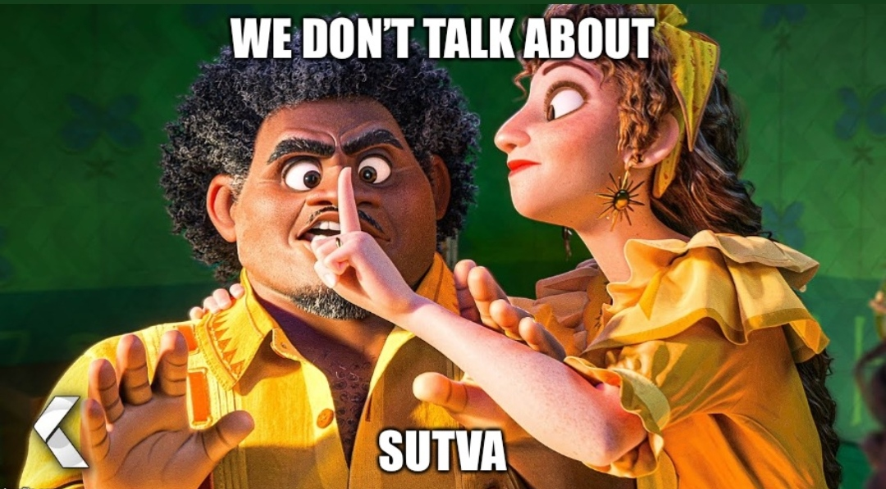

```{r setup_theme0, include = FALSE}
rm(list=ls());gc()
if(!grepl("4.1.2",R.version.string)){stop("Different version (must be 4.1.2)")}
#, 'libs/my-theme.css'
#load(paste0(sub("$\\/","",sub("2019 \\(github\\)/SUD_CL","2022 \\(github\\)",here::here())),"/11_pres.RData"))
options(servr.daemon = TRUE)
```

```{r setup, include = FALSE}
local({r <- getOption("repos")
       r["CRAN"] <- "http://cran.r-project.org" 
       options(repos=r)
})

if(!require(pacman)){install.packages("pacman")}
pacman::p_load(devtools, here, showtext, ggpattern, RefManageR, pagedown, magick, bibtex, DiagrammeR, xaringan, xaringanExtra, xaringanthemer, fontawesome, widgetframe, datapasta, tidyverse, psych, cowplot, coxphw, future, timereg, flexsurv, pdftools, mstate, showtext, compareGroups, chilemapas, choroplethrAdmin1,  choroplethr, choroplethrMaps, ggiraph, sf,distill, qrcode, pdftools, dagitty, ggdag, geepack, survey, ipw, reshape, widgetframe, geeM, MuMIn, install=F)

if(!require(xaringanBuilder)){devtools::install_github("jhelvy/xaringanBuilder",upgrade = "never")}
if(!require(icons)){remotes::install_github("mitchelloharawild/icons",upgrade = "never")}

test_fontawesome<- function(x="github"){
tryCatch({
  invisible(fontawesome::fa(name = x))
  return(message("fontawesome installed"))
},
# ... but if an error occurs, tell me what happened: 
error=function(error_message) {
  message("Installing fontawesome")
  icons::download_fontawesome()  
})
}
vec_col<-c("#660600","#6F3930","#745248","#786B60","#E6E6E6","#738FBC","#003891","#3C5279","#786B60","#B48448","#EF9D2F","#D99155","#E3D1C2","#E0BC9E","#ABB0BF","#835F69","#5A0D13")
plot_prueba<-barplot(1:length(vec_col), col=vec_col)

#https://github.com/yihui/xaringan/issues/260
#https://coolors.co/21177a-fe4a17-788aa3-45503b
style_duo( 
  primary_color = "#E6E6E6", ##E6E6E6
  secondary_color = "#003891",
  text_color = "#2f353b", 
  text_bold_color = "#EF9D2F", ##92B6B1   #fdecef  #F9C784   ##CAE7B9 ##BDC667 ##B9D8C2 ##591F0A ##D6FFF6 #45503B
  #base_color = '#aaaaaa',
#  background_color = 'white',
  background_position = 'center',
  header_font_google = google_font("Arial Narrow"),
  text_font_google   = google_font("Arial", "400", "400i"),
  code_font_google   = google_font("Arial Narrow"),
  code_font_size = '53%', #sirve
  padding = "0.4em 2.4em 0.4em 2.4em",
  extra_fonts = list(google_font("Arial Narrow")),
  title_slide_background_image = "./_figs/bg_portada.svg",
  title_slide_background_size = "cover",
  background_image = "./_figs/bg.svg",
  background_size = "cover",
  extra_css =
  list(
  ".remark-slide-scaler" = list("overflow-y" = "auto"), # para no tener limites de extensión
 # ".remark-slide-number" = list("display" = "none"), #oculta el reloj también
 # "pre"= list("line-height"= "0.2em"),
  ".gray"   = list(color = "#aaaaaa"),
  ".red"   = list(color = "#A4222B"),
  ".darkgreen"   = list(color = "#45503B"),
  ".darkred"   = list(color = "#591F0A"),
  ".small" = list("font-size" = "90%"),
  ".pull_c" = list("float" = "center","width" = "30%", "height" = "50%", "padding-left" = "40%"),
  ".pull_c_title" = list("height" = "90%"),
  ".pull_l_70" = list("float"= "left","width"= "72%", "font-size"= "90%"),
  ".pull_r_30" = list("float"= "right","width"= "23%", "font-size"= "90%"),
  ".pull_left"  = list("float"= "left","width"= "47%", "height"= "100%", "padding-right"= "2%"),
  ".pull_right" = list("float"= "right","width"= "47%", "height"= "100%", "padding-left"= "2%"),
  ".small_left"  = list("float"= "left", "width"= "47%", "height"= "50%", "padding-right"= "2%"),
  ".small_right" = list("float"= "right","width"= "47%", "height"= "50%", "padding-left"= "2%"),
  ".left_code" = list("float"="left","width"="47%","height"="100%","padding-right"="2%",    "font"="Roboto"),
  ".code_out"  = list("float"="right","width"="47%","height"="100%","padding-left"="2%",    "font"="Roboto"),
  ".text_180" = list("font-size" = "180%"),
  ".text_170" = list("font-size" = "170%"),
  ".text_160" = list("font-size" = "160%"),    
  ".text_150" = list("font-size" = "150%"),
  ".text_140" = list("font-size" = "140%"),  
  ".text_130" = list("font-size" = "130%"),
  ".text_120" = list("font-size" = "120%"),
  ".text_110" = list("font-size" = "110%"),
  ".text_110" = list("font-size" = "110%"),
  ".text_100" = list("font-size" = "100%"),
  ".code_10" = list("code-inline-font-size"= "60%",
                    "overflow-y" = "scroll !important",
                    "overflow-x" = "scroll !important",
                    "max-height" = "50vh !important",# 50% altura viewport
                    "line-height"= "0.75em"),
   ".code_10_pre" = list("code-inline-font-size"= "60%",
                    "overflow-y" = "scroll !important",
                    "overflow-x" = "scroll !important",
                    "max-height" = "15vh !important",
                    "line-height"= "0.75em",
                    "min-height"="0.5em"
                    ),
  ".code_15" = list("code-inline-font-size"= "15%",
                    "overflow-y" = "scroll !important",
                    "overflow-x" = "scroll !important",
                    "max-height" = "10vh !important"),
  ".text_90" = list("font-size" = "90%"),
  ".text_80" = list("font-size" = "80%"),
  ".text_70" = list("font-size" = "70%"),
  ".text_65" = list("font-size" = "65%"),
  ".text_60" = list("font-size" = "60%"),
  ".text_50" = list("font-size" = "50%"),
  ".text_40" = list("font-size" = "40%"),
  ".text_30" = list("font-size" = "30%"),
  ".text_20" = list("font-size" = "20%"),
  ".line_space_15" = list("line-height" = "1.5em;"),
  ".line_space_13" = list("line-height" = "1.3em;"),
  ".line_space_11" = list("line-height" = "1.1em;"),
  ".line_space_15" = list("line-height" = "1.5em;"),
  ".line_space_09" = list("line-height" = "0.9em;"),
  ".line_space_07" = list("line-height" = "0.7em;"),
  ".line_space_05" = list("line-height" = "0.5em;"),
  ".largest" =  list("font-size" = "2.488em;"),
  ".larger" =  list("font-size" = "2.074em;"),
  ".large" =  list("font-size" = "1.44em;"),
  ".small" =  list("font-size" = "0.833em;"),
  ".smaller" =  list("font-size" = "0.694em;"),
  ".smallest" =  list("font-size" = "0.579em;"),
  ".limity150" = list("max-height" = "150px;",
                     "overflow-y" = "auto;"
      ),
    ".tiny_text" = list(
      "font-size"= "70%"
      ),
    ".large_text" = list(
      "font-size"= "150%"
      ),
    ".slide_blue" = list(
      "background-color" = "#FEDA3F",
      "color" = "#3C3C3B"
      ),
      ".bottom_center" = list(
    margin  = "0",
    position = "absolute",
    top      = "90%",
    left     = "50%",
    '-ms-transform' = "translate(-50%, -50%)",
    transform = "translate(-50%, -50%)"
    ),
      ".down_center" = list(
    margin  = "0",
    position = "absolute",
    top      = "80%",
    left     = "50%",
    '-ms-transform' = "translate(-50%, -50%)",
    transform = "translate(-50%, -50%)"
    ),
  ".center_image" = list(
    margin  = "0",
    position = "absolute",
    top      = "50%",
    left     = "50%",
    '-ms-transform' = "translate(-50%, -50%)",
    transform = "translate(-50%, -50%)"
    ),
    ".down_left" = list(
    margin  = "0",
    position = "absolute",
    top      = "80%",
    left     = "22%",
    '-ms-transform' = "translate(-50%, -50%)",
    transform = "translate(-50%, -50%)"
    ),
     ".down_right" = list(
    margin  = "0",
    position = "absolute",
    top      = "80%",
    left     = "72%",
    '-ms-transform' = "translate(-50%, -50%)",
    transform = "translate(-50%, -50%)"
    ),
    "slides > slide" = list(
    "overflow-x"  = "auto !important",
    "overflow-y" = "auto !important"
    ),
 #   "pre" = list(
#    "white-space"  = "pre !important",
#    "overflow-y" = "scroll !important",
#    "max-height" = "40vh !important",
#    "font-size" = "0.8em"
#    ),
    ".superbigimage" = list(
    "white-space"  = "nowrap",
    "overflow-y" = "scroll"
    )
  )
)

options(htmltools.preserve.raw = FALSE)

#knitr::opts_chunk$set(comment = NA) # lo saqué pa probar por si
knitr::opts_chunk$set(dpi=720)
#options(htmltools.preserve.raw = FALSE)#A recent update to rmarkdown (in version 2.6) changed how HTML widgets are included in the output file to use pandoc's raw HTML blocks. Unfortunately, this feature isn't compatible with the JavaScript markdown library used by xaringan. You can disable this feature and resolve the issue with htmlwidgets in xaringan slides by setting
#https://stackoverflow.com/questions/65766516/xaringan-presentation-not-displaying-html-widgets-even-when-knitting-provided-t/65768952#65768952

xaringanExtra::use_progress_bar(color = "#12636B", location = "top")#, height = "550px")
xaringanExtra::use_animate_css()
xaringanExtra::use_scribble() #son los lapices
xaringanExtra::use_tile_view()
xaringanExtra::use_panelset()
xaringanExtra::use_editable(expires = 1)
xaringanExtra::use_fit_screen()

#https://gist.github.com/gadenbuie/61b27108ceec6c7a55cd9966609128d7

# padding-top: 0.4em;
# padding-right: 2.4em;
# padding-bottom: 0.4em;
# padding-left: 2.4em;
invisible("https://www.youtube.com/watch?v=M3skTMQbCD0")
invisible("https://zane.lol/slides/adirondack/#39")
#https://titanwolf.org/Network/Articles/Article?AID=3896fe2c-1b3b-4ebd-9906-1f9ed1675b35#gsc.tab=0
#https://annakrystalli.me/talks/xaringan/xaringan.html#55
#https://bookdown.org/yihui/rmarkdown/some-tips.html
#https://arm.rbind.io/slides/xaringan.html#90
#https://stackoverflow.com/questions/62069400/font-size-of-figure-in-xaringan-slide-too-small
#https://irene.vrbik.ok.ubc.ca/blog/2021-07-14-xaringan-slides/

#https://evamaerey.github.io/doublecrochet/
#devtools::install_github("paulhendricks/anonymizer")
check_code <- function(expr, available){
  if(available){
    eval(parse(text = expr))
  } else {
    expr
  }
}
path2<-dirname(rstudioapi::getSourceEditorContext()$path)
#knitr::opts_chunk$set(message = FALSE,warning = FALSE, error = FALSE)

```


```{r, load_refs, include=F, eval=T, cache=FALSE}
library(RefManageR)
BibOptions(check.entries = FALSE,
           bib.style = "numeric",
           cite.style = "numeric",
           style = "markdown",
           super = TRUE,
           hyperlink = FALSE,
           dashed = FALSE)
warning(paste0("./_bib/My Collection.txt"))

myBib <- ReadBib("./_bib/My Collection.txt", check = FALSE)

```


class: title-slide, middle, right 

<br>

<br> 


<br> 

.line_space_15[ 
## .text_80[Modelos estructurales marginales para el control de<br>sesgos en estudios observacionales con factores de<br>riesgo y exposición tiempo-dependientes]
]

<br>

.line_space_11[
    
<br>

.text_70[[Código en: `r fontawesome::fa(name = "github")`](https://github.com/AGSCL/DSPUCH)]

.text_110[Seminario Métodos de Investigación en Salud Pública]

]

.bg-text[
`r withr::with_locale(new = c('LC_TIME' = 'es_ES'), code =format(Sys.time(),'%d de %B, %Y'))`

.text_100[Andrés González Santa Cruz]

.text_50[gonzalez.santacruz.andres@gmail.com] [`r fontawesome::fa(name = "github")`](https://github.com/AGSCL) [`r fontawesome::fa(name = "orcid", fill="green")`](https://orcid.org/0000-0002-5166-9121)
]
```{r echo=FALSE, out.width = '15%'}
knitr::include_graphics('./_style/Logo_nDP_monotono_vertical_en.png')
```

???
*#_#_#_#_#_#_#_#_#_#_
**NOTA**
*#_#_#_#_#_#_#_#_#_#_

- Mi nombre es andrés gonzález y en esta instancia presentaré sobre los modelos estructurales marginales
- Decidí abordar un tema metodológico no tratado en clases, que les será útil para mi tesis y que podría ser útil para otros.
- 

---
layout: true
class: animated, fadeIn
---
## Índice

<br>

1. Problemática

2. Causalidad

3. Ajuste confusión

4. Marginal Structural Models

5. Aplicación

6. Desafíos

???
*#_#_#_#_#_#_#_#_#_#_
**NOTA INDICE**
*#_#_#_#_#_#_#_#_#_#_
Primeras dos, repaso:
1- **Origen de mi interés y problemática**: factores de riesgo y exposición tiempo-dependientes: Ejemplo de arbol de decisiones y que al final obtenía puros efectos condicionales.
2- **Causalidad**: La tarea de la epidemiología, definicion de causalidad y de confusión. Distribución marginal vs. conjunta, etc. Datos observacionales. Supuestos: SUTVA; Sesgos.Supuestos a la base, amenazas, sesgos, y particularmente sesgos que ocurren para este diseño de datos.
3- **Ajuste confusión**: Las formas. En una de esas, mostrar gif y animaciones (https://youtu.be/j8J2L_g76c4?t=68 o https://twitter.com/nickchk/status/1068215492458905600 / https://github.com/NickCH-K/causalgraphs/blob/master/Animation%20of%20IV.R / https://nickchk.com/causalgraphs.html). Explicar las diferencias entre estandarización y restricción --> ir poniendo el código paso por paso
4- **MSM**, los tipos.Explicar por qué son **estructurales** (1) y **marginales**(2), explicar las situaciones en que se ocupan y son útiles. Incluso con datos aleatorizados. Sesgos que resuelven
5- **Aplicación**: Explicar estructura hipotética de los datos, aplicación de un modelo simple.
6- **Desafíos y aproximaciones más complejas**

---
## Problemática

.panelset.sideways[

.panel[.panel-name[Estructura hipotética más cercana a lo real]

.details-code[

```{r p1-est, eval=T,  dev.args = list(bg = 'transparent'), echo=T, warning=FALSE, include=T, paged.print=TRUE, fig.align="center", fig.width = 7, fig.height = 5, out.width="70%", out.height="70%", error=T, dpi=750, fig.showtext=T}
# Libraries
library(ggplot2)

set.seed(2125)
# Create data
data <- data.frame(
  y=abs(rpois(1:250,15)),
  y2=abs(rpois(1:250,15))
) %>% 
  dplyr::filter(y2>y, y>=8, y2<=22) %>%
  dplyr::mutate(Paciente=row_number()) %>% 
  #filtrar tratamientos más largos que 3 años
  dplyr::mutate(diff_treat=y2-y) %>% 
  dplyr::filter(diff_treat<=3)

for (i in 1:nrow(data)){
   data$y3[i]<-base::sample(x=seq(from=data$y2[i]+1,to=22),1)
   data$y3[i]<-ifelse(data$y3[i]<=data$y2[i],22,data$y3[i])
   data$y3[i]<-ifelse(data$y3[i]>=23,22,data$y3[i])
   data$y4[i]<-ifelse(!is.na(data$y3[i]),base::sample(x=seq(from=data$y3[i]+1,to=22),1),22)
   data$y4[i]<-ifelse(data$y4[i]<=data$y3[i],22,data$y4[i])
   data$y4[i]<-ifelse(data$y4[i]>=23,22,data$y4[i])
}

set.seed(2125)
pac_aleatorio1<-sample(1:max(data$Paciente),40)
pac_aleatorio2<-setdiff(sample(1:max(data$Paciente),40), pac_aleatorio1)

set.seed(2125)
pac_aleatorio3<-unique(data$Paciente)[sample(1:length(data$Paciente),15)]

# Horizontal version, antes era 1985
end_plot<-20

  fig_trans<-ggplot(data) 
  ###>=10
  #datos de tratamiento en periodo de seguimiento, posterior al 2010
fig_trans<-try(fig_trans+geom_segment(data=dplyr::filter(data,y>=10,y2<=end_plot, Paciente %in% pac_aleatorio3), aes(x=Paciente, xend=Paciente, y=y, yend=y2), color="#EF9D2F", alpha=.6, size=.8))
fig_trans<-try(fig_trans+geom_segment(data=dplyr::filter(data,y>=10,y2<=end_plot, !Paciente %in% pac_aleatorio3), aes(x=Paciente, xend=Paciente, y=y, yend=y2), color="#21177A", alpha=.6, size=.8))
  #datos de tratamiento en periodo de seguimiento, exceden el seguiemiento. linea entera hasta el 2020
fig_trans<-try(fig_trans+ geom_segment(data=dplyr::filter(data,y>=10,y2>end_plot), aes(x=Paciente, xend=Paciente, y=y, yend=end_plot), color="#21177A", alpha=.6, size=.8))
  #datos de tratamiento en periodo de seguimiento, exceden el seguiemiento. linea entrecortada despues del 2020
fig_trans<-try(fig_trans+geom_segment(data=dplyr::filter(data,y>=10,y2>end_plot), aes(x=Paciente, xend=Paciente, y=end_plot, yend=y2), color="#21177A", alpha=.6, linetype="dotted", size=.8))
  ###<10
  #datos de tratamiento en periodo de seguimiento, exceden el seguiemiento. linea entrecortada despues del 2020
fig_trans<-try(fig_trans+geom_segment(data=dplyr::filter(data,y<10), aes(x=Paciente, xend=Paciente, y=y, yend=10), color="#21177A", alpha=.6, linetype="dotted", size=.8))
  #datos de tratamiento en periodo de seguimiento, menos de 2010 pero sólo y1
fig_trans<-try(fig_trans+geom_segment(data=dplyr::filter(data,y<10,y2>=10,y2<=end_plot, Paciente %in% pac_aleatorio3), aes(x=Paciente, xend=Paciente, y=10, yend=y2), color="#EF9D2F", alpha=.6,  size=.8))
#fig_trans<-try(fig_trans+geom_segment(data=dplyr::filter(data,y<10,y2>=10,y2<=end_plot, !Paciente %in% pac_aleatorio3), aes(x=Paciente, xend=Paciente, y=10, yend=y2), color="#21177A", alpha=.6,  size=.8))

  #datos de tratamiento en periodo de seguimiento, exceden el seguiemiento. linea entera hasta el 2020
# fig_trans<-try(fig_trans+geom_segment(data=dplyr::filter(data,y<10,y2>end_plot), aes(x=Paciente, xend=Paciente, y=10, yend=end_plot), color="#21177A", alpha=.6, size=.8))
# CONTACTO: VICTIMARIO: debo saber si y3 está dentro o no del seguimiento
  ###>=10
  #datos de justicia en periodo de seguimiento, linea solida
fig_trans<-try(fig_trans+geom_segment(data=dplyr::filter(data,y3<=end_plot, y4<=end_plot, Paciente%in% pac_aleatorio1), aes(x=Paciente, xend=Paciente, y=y3, yend=y4), color="#21177A", alpha=.6, size=.8))
  #datos de justicia en periodo de seguimiento, exceden el seguiemiento pero parten en él. linea solida hasta el 2020
fig_trans<-try(fig_trans+geom_segment(data=dplyr::filter(data,y3<=end_plot, y4>end_plot, Paciente%in% pac_aleatorio1), aes(x=Paciente, xend=Paciente, y=y3, yend=end_plot), color="#21177A", alpha=.6, size=.8))
#si estoy dentro de los datos en y, peroen end plot no, tengo q hacer el interlineado afuera
fig_trans<-try(fig_trans+geom_segment(data=dplyr::filter(data,y3<=end_plot, y4>end_plot, Paciente%in% pac_aleatorio1), aes(x=Paciente, xend=Paciente, y=end_plot, yend=y4), color="#21177A", alpha=.6,linetype="dotted",  size=.8))
  #datos de tratamiento en periodo de seguimiento, exceden el seguiemiento. linea entrecortada despues del 2020
 fig_trans<-try(fig_trans+geom_segment(data=dplyr::filter(data,y3>end_plot, y4>end_plot, Paciente%in% pac_aleatorio1), aes(x=Paciente, xend=Paciente, y=y3, yend=y4), color="#21177A", alpha=.6, linetype="dotted", size=.8))
 
 fig_trans_final<-
   #Puntos
fig_trans+
     #Tratamientos completados
    geom_point(data=dplyr::filter(data,Paciente%in% sample(c(pac_aleatorio1,pac_aleatorio2),15), Paciente %in% pac_aleatorio3), aes(x=Paciente, y=y2), color="#EF9D2F", size=3, alpha=.6) +
    #geom_point(data=dplyr::filter(data,Paciente%in% pac_aleatorio1, Paciente %in% pac_aleatorio3), aes(x=Paciente, y=y4),color="#EF9D2F",size=3,alpha=.6)+
   geom_point(data=dplyr::filter(data,Paciente%in% sample(c(pac_aleatorio1,pac_aleatorio2),15), !Paciente %in% pac_aleatorio3), aes(x=Paciente, y=y2), color="#21177A", size=3, alpha=.6) +
    geom_point(data=dplyr::filter(data,Paciente%in% pac_aleatorio1, !Paciente %in% pac_aleatorio3), aes(x=Paciente, y=y4),color="#21177A",size=3,alpha=.6)+
   
    theme_light() +
    coord_flip() +
    #fechas donde yo tomo gente
     annotate("rect", xmin=-Inf, xmax=Inf, ymin=10, ymax=10.5,
          alpha = .2, fill="blue")+
    annotate("rect", xmin=-Inf, xmax=Inf, ymin=19.5, ymax=20,
          alpha = .2, fill="blue")+
    theme(
      panel.grid.major.y = element_blank(),
      panel.border = element_blank(),
      axis.ticks.y = element_blank()
    )+
    scale_x_continuous(breaks=seq(1,max(data$Paciente),by=10))+
    scale_y_continuous(breaks=seq(min(data$y),max(data$y4),by=2), labels=seq(min(data$y),max(data$y4),by=2)+2000)+
   labs(y="Tiempo de seguimiento (en trimestres)", x="Individuos (ID)")+
  #labs(y="Follow-up (in quarters)",x="Individual(ID)", caption="Note. Dot= Complete treatment;\nSquare= Contact w/ justice system (imputed);\nTriangle= Contact w/ justice system (victim);\nBlue line= Time in treatment;\nOrange line= Time in conctact w/justice system;\nShared area=Follow-up window")+
  theme(plot.caption = element_text(hjust = 0, face= "italic"))+
   labs(caption="Punto= Completa treatmento;\nAzul= Tratamiento ambulatorio;\nAmarillo= Tratamiento residencial; \nLínea= Tiempo en tratamiento;\nArea sombreada=Inicio y término seguimiento")+
  theme(
  panel.background = element_rect(fill = "transparent",
                                  colour = NA_character_), # necessary to avoid drawing panel outline
  #panel.grid.major = element_blank(), # get rid of major grid
  #panel.grid.minor = element_blank(), # get rid of minor grid
  plot.background = element_rect(fill = "transparent",
                                 colour = NA_character_), # necessary to avoid drawing plot outline
  legend.background = element_rect(fill = "transparent"),
  legend.box.background = element_rect(fill = "transparent"),
  legend.key = element_rect(fill = "transparent"))
 
 invisible("Paciente 49: 2011 al 2014 cursa un primer tratamiento que abandona, luego del 2016 al 2018 completó un tratamiento")
 fig_trans_final
```
]

]

.panel[.panel-name[Primera aproximación]

Objetivo:

**Estimar el efecto de la modalidad de tratamiento por trastornos por uso de sustancias (ambulatorios vs. residenciales) a la base en la probabilidad de experimentar subsiguientes readmisiones a TUS**


Análisis propuestos en esa oportunidad:

.superbigimage[
.text_50[
$$readmisión\sim A_{1 (Modalidad\,base)}+X_{2 (Completa\,tto.\,base)}+\epsilon$$
$$2^{da}\,readmisión\sim A_{1(Modalidad\,base)}+L_{2 (Completa\,tto.\,base)}+L_{3 (Completa\,2^{do}\,tto.)}+L_{4 (Días\,desde\,1^{er}\,ingreso)}+ \epsilon$$
$$3^{era}\,readmisión\sim A_{1(Modalidad\,base)}+ L_{2 (Completa\,tto.\,base)}+ L_{3 (Completa\,2^{do}\,tto.)}+ L_{4 (Completa\,3^{er}\,tto.)}+ L_{5 (Días\,desde\,1^{er}\,ingreso)}+\epsilon$$
$$4^{ta}\,readmisión\sim A_{1 (Modalidad\,base)}+ L_{2 (Completa\,tto.\,base)}+ L_{3 (Completa\,2^{do}\,tto.)}+ L_{4 (Completa\,3^{er}\,tto.)}+ L_{5 (Completa\,4^{to}\,tto.)}+ L_{6 (Días\,desde\,1^{er}\,ingreso)}+\epsilon$$
]
]

.center[**¿Cómo se reflejaría en un diagrama?**]

]

.panel[.panel-name[Diagrama Causal Simplificado]

.details-code[

```{r p2-dag, eval=T,  dev.args = list(bg = 'transparent'), echo=T, warning=FALSE, include=T, paged.print=TRUE, fig.align="center", out.height=450, error=T, dpi=750, fig.showtext=T}
dag23 <- dagitty('dag {
bb="0,0,1,1"
"A0 (Modalidad tto. basal)" [exposure,pos="0.184,0.608"]
"A1 (Modalidad tto. 2)" [pos="0.451,0.605"]
"A2 (Modalidad tto. 3)" [pos="0.734,0.605"]
"L0 (Vector car. individuales)- Pareamiento" [adjusted,pos="0.121,0.397"]
"L1 (Días previos a la readmisión 2)" [adjusted,pos="0.507,0.341"]
"L2 (Días previos a la readmisión 3)" [adjusted,pos="0.691,0.365"]
"LM0(Completa tto. basal)" [adjusted,pos="0.269,0.707"]
"LM1 (completa tto. 2)" [adjusted,pos="0.566,0.714"]
"LM2 (completa tto. 3)" [adjusted,pos="0.838,0.722"]
"U0 (ej., factores genéticos)" [latent,pos="0.124,0.273"]
"U1 Car. indivudales (ej., patrón de consumo)" [latent,pos="0.444,0.829"]
"U2 Car. individuales T2" [latent,pos="0.733,0.814"]
"Y1(Readmisión)" [outcome,pos="0.355,0.604"]
"Y2(2da Readmisión)" [outcome,pos="0.626,0.605"]
"Y3(4ta Readmisión)" [outcome,pos="0.960,0.607"]
"A0 (Modalidad tto. basal)" -> "LM0(Completa tto. basal)"
"A0 (Modalidad tto. basal)" -> "Y3(4ta Readmisión)"
"A1 (Modalidad tto. 2)" -> "LM1 (completa tto. 2)"
"A2 (Modalidad tto. 3)" -> "LM2 (completa tto. 3)"
"L0 (Vector car. individuales)- Pareamiento" -> "A0 (Modalidad tto. basal)"
"L0 (Vector car. individuales)- Pareamiento" -> "Y1(Readmisión)"
"L1 (Días previos a la readmisión 2)" -> "Y2(2da Readmisión)"
"L2 (Días previos a la readmisión 3)" -> "Y3(4ta Readmisión)"
"LM0(Completa tto. basal)" -> "U1 Car. indivudales (ej., patrón de consumo)"
"LM0(Completa tto. basal)" -> "Y1(Readmisión)"
"LM0(Completa tto. basal)" -> "Y2(2da Readmisión)"
"LM0(Completa tto. basal)" -> "Y3(4ta Readmisión)"
"LM1 (completa tto. 2)" -> "U2 Car. individuales T2"
"LM1 (completa tto. 2)" -> "Y2(2da Readmisión)"
"LM1 (completa tto. 2)" -> "Y3(4ta Readmisión)"
"LM2 (completa tto. 3)" -> "Y3(4ta Readmisión)"
"U0 (ej., factores genéticos)" -> "L0 (Vector car. individuales)- Pareamiento"
"U0 (ej., factores genéticos)" -> "Y1(Readmisión)"
"U0 (ej., factores genéticos)" -> "Y2(2da Readmisión)"
"U0 (ej., factores genéticos)" -> "Y3(4ta Readmisión)"
"U1 Car. indivudales (ej., patrón de consumo)" -> "A1 (Modalidad tto. 2)"
"U1 Car. indivudales (ej., patrón de consumo)" -> "LM1 (completa tto. 2)"
"U2 Car. individuales T2" -> "A2 (Modalidad tto. 3)"
"U2 Car. individuales T2" -> "LM2 (completa tto. 3)"
"Y1(Readmisión)" -> "A1 (Modalidad tto. 2)"
"Y1(Readmisión)" -> "U1 Car. indivudales (ej., patrón de consumo)"
"Y2(2da Readmisión)" -> "A2 (Modalidad tto. 3)"
"Y2(2da Readmisión)" -> "U2 Car. individuales T2"
}')

tidy_dag23 <- tidy_dagitty(dag23) %>% 
  dplyr::mutate(label=dplyr::case_when(grepl("A0",as.character(name))~"A0",
                                       grepl("A1",as.character(name))~"A1",
                                       grepl("A2",as.character(name))~"A2",
                                       grepl("L0",as.character(name))~"L0",
                                       grepl("L1",as.character(name))~"L1",
                                       grepl("L2",as.character(name))~"L2",
                                       grepl("LM0",as.character(name))~"LM0",
                                       grepl("LM1",as.character(name))~"LM1",
                                       grepl("LM2",as.character(name))~"LM2",
                                       grepl("U0",as.character(name))~"U0",
                                       grepl("U1",as.character(name))~"U1",
                                       grepl("U2",as.character(name))~"U2",
                                       grepl("Y1",as.character(name))~"Y1",
                                       grepl("Y2",as.character(name))~"Y2",
                                       grepl("Y3",as.character(name))~"Y3",
                                       T~as.character(name))) %>% 
  dplyr::mutate(label2=dplyr::case_when(grepl("U",name)~"latent",grepl("L|LM",name)~"adj",grepl("LM",name)~"white",
                                       T~"black")) %>% 
  dplyr::mutate(adjusted=factor(dplyr::case_when(grepl("L|LM",name)~"adjusted",T~"unadjusted")))

  edge_function <- ggdag:::edge_type_switch("link_arc")
  
  dag23_plot<-
ggdag:::if_not_tidy_daggity(tidy_dag23) %>% ggdag:::node_status() %>% 
  ggplot2::ggplot(ggplot2::aes(x = x, y = y, xend = xend, 
                                 yend = yend, color = status, shape=factor(adjusted)))+ 
    #edge_function()+
    scale_adjusted()+ 
    ggdag:::breaks(c("exposure", "outcome","latent"))+
    geom_dag_edges_arc(curvature = c(0,5,rep(0,26)))+
   ggdag:::geom_dag_point(size = 16)+
  ggdag:::geom_dag_label_repel(ggplot2::aes_string(label = "label", 
            fill = "status"), size = 4.88, col = "white", 
            show.legend = FALSE)+
    theme_dag()+
    scale_shape_manual(values = c(15, 16), name="Ajustado", labels=c("Sí", "No"))+ 
  scale_fill_manual(values = c("#003891", "#EF9D2F","gray30"), name="Estatus",na.value="black", labels=c("Exposición", "Resultado","No observado"), limits = c('exposure', 'outcome','latent'))+
  scale_color_manual(values = c("#003891", "#EF9D2F","gray30"), name="Estatus",na.value="black", labels=c("Exposición", "Resultado","No observado"), limits = c('exposure', 'outcome','latent'))+#E6E6E6
  guides(linetype="none", edge_alpha="none", shape="none")+
  guides(color=guide_legend(override.aes = list(arrow = NULL)))+#,guide_colourbar(order = 1)
  theme(plot.caption = element_text(hjust = 0))+
  theme(legend.position = "bottom", aspect.ratio=6/10)+
    labs(caption="Nota. Ak= Modalidad (Residencial/Ambulatoria); LMk= Completa tratamiento;\nL0= Confusores, características individuales y del centro a la base;Lk+= Días previos a la readmisión;\nYk= Resultadotratamiento; Uk=Car. no observadas para cada tiempo")

  dag23_plot
```
]
<div class="center"> ¿Qué ocurre con las modalidades en los tratamientos sucesivos?, ¿Confunden la asociación entre $A_0$ ` e` $Y_3$ `? `, ¿Sigue siendo causal en presencia de { $A_1\,, A_2\,,A_3$ `}? 
</div>
<!--- U puede tener relación con derivaciones no observadas posterior al tratamiento, que sería como un U1.5--->
<!--- U puede tener relación con derivaciones no observadas posterior al tratamiento, que sería como un U1.5--->
]

.panel[.panel-name[Entonces...]

- Varias puertas traseras sin cerrar, confusión residual, abandono/pérdida, sobreajuste, etc.

- El diseño y la estrategia analítica hasta el momento no permite responder a una pregunta causal de manera adecuada (muchos contrastes condicionales a la trayectoria de tratamientos y del mediador)

- Debiesen analizarse otras estrategias que capturen efectos longitudinales

<br>

.pull_r_30[
.text_60[
***"In longitudinal studies with time-dependent confounding, identifying the structure allows us to detect situations in which stratification-based methods would adjust for confounding at the expense of introducing selection bias (p. 622)"*** $`r Cite(myBib, c("Hernan2004"))`$
]
]

<br>

<br>

<br>
.down_center[
<div class="red"> 
¿Se puede responder a la pregunta de si haber asistido a tratamiento residencial a la base ( $A_0$ `) es beneficioso?, y si lo es, ¿qué régimen/estrategia es óptima o casi óptima? $`r Cite(myBib, c("Robins1986"))`$ 

</div>
]
]

]

???
*#_#_#_#_#_#_#_#_#_#_
**NOTA**
*#_#_#_#_#_#_#_#_#_#_

1.	Mi interés principalmente proviene de una **investigación en la que estoy participando, en que analizo trayectorias de tratamientos de drogas del 2010-2019.** Por ejemplo, en este caso, el Paciente N°55 completa tto. residencial y experimenta el evento de interés (readmisión), en ambos completa el tratamiento.
2.	El objetivo de ese estudio era **estimar ese efecto mediante 4 regresiones secuenciales y estratificado por la presencia de cada evento** (ej., se partió con 22.000 1era readmisión; 4ta = 200 usuarios).Hay varios problemas.
3.	 Hernan señala que no es posible representar en un diagrama un **pareamiento** (Al margen de eso, ya también es discutible su implicancia causal, ya que agrupa al 90% de los tratamientos residenciales, pero al **18% de los ambulatorios**. Es un efecto en los tratados. Se puede observar que hay muchos colliders (en LM) y puertas traseras no cerradas ().**The total effect cannot be estimated due to adjustment for an intermediate or a descendant of an intermediate**.).
4.	OR LO VISTO, SON **EFECTOS ANIDADOS PRODUCTO DE LA COMBINACIÓN DE CADA UNO Y POR TANTO  CONDICIONALES** (EJ., QUIEN PRESENTA UN REGIMEN EN QUE COMPLETA UN RESIDENCIAL A LA BASE, SEGUIDO DE COMPLETAR EL SEGUNDO TRATAMIENTO RESIDENCIAL,VA A TENER UN RIESGO DE READMISIÓN DISTINTO  DE AHÍ QUE EL EFECTO ES CONDICIONAL A ESTE REGIMEN DE EXPOSICION Y MEDIACION

**Hasta el momento es encesario hacer modificaciones al diseño y la estrategia analítica**

(por si ... )
- Que no haya Ajuste por variables intermedias o descendientes de una variable intermedia ("the mantra not to control for factors affected by exposure".- Overadjustment)Schisterman2009
- Control for `W` by seeing what `W` explains (perhaps with a regression) and taking it out
- *crossover effects

---
class: center, middle

## Objetivo

Este proyecto apunta a servir como un material introductorio sobre modelos estructurales marginales para el control de sesgos en estudios observacionales con factores de riesgo y/o exposición tiempo-dependientes. 

--
- Se mostrará su estimación paso a paso y mediante un ejercicio reproducible. 

--
- Se utilizará una base de datos simulada para ilustrar el proceso.

???
*#_#_#_#_#_#_#_#_#_#_
**NOTA**
*#_#_#_#_#_#_#_#_#_#_

Ejemplos de publicaciones de este tipo hay:

- Tutoriales de herramientas analíticas innovadoras en "Psychological Methods" (APA) https://www.apa.org/pubs/journals/met/call-for-papers-tutorials

- Bradburn, M., Clark, T., Love, S. et al. Survival Analysis Part I: Multivariate data analysis – an introduction to concepts and methods. British Journal of Cancer 89, 431–436 (2003). https://doi.org/10.1038/sj.bjc.6601119

- Zhang, Z., Abarda, A., Contractor, A., Wang, J., & Dayton, C. (2018). Exploring heterogeneity in clinical trials with latent class analysis. Annals Of Translational Medicine, 6(7), 9. doi:10.21037/atm.2018.01.24

---
## Causalidad (1)

.pull_left[

- Salud pública- epidemiología  $`r Cite(myBib, c("Kaufman2020"))`$

- Qué pasaría si... // Qué causa ...  $`r Cite(myBib, c("gelman2013","Hernan2020"))`$

```{r, echo=FALSE, dev.args = list(bg = 'transparent'), out.width= 350, fig.align="left", error=T}
translogo25 <-magick::image_read('./_figs/el mundo si.jpg')%>% 
             magick::image_transparent('#eeeeee')
translogo25
```

- Asociación vs. Causalidad  $`r Cite(myBib, c("gelman2013","Pearl2003"))`$

- Inferencia  $`r Cite(myBib, c("Pearl2003"))`$

- RCTs: gold-standard $`r Cite(myBib, c("Muriel2011"))`$

- Estudios observacionales

.text_70[
***"It’s much easier to get a result than it is to get an answer"*** $`r Cite(myBib, c("Aschwanden2015"))`$
]
]

.pull_right[

.

```{r, echo=FALSE, dev.args = list(bg = 'transparent'), fig.align="right",  out.width= 350, error=T}
translogo2 <-magick::image_read('./_figs/ejemplo_dag_complejo.jpg')%>% 
             magick::image_transparent('#eeeeee') %>% 
            magick::image_transparent('#f1edec') %>%
            magick::image_transparent('#efeff0') %>% 
  magick::image_transparent('#eeeeed') %>% 
  magick::image_transparent('#efefed') %>% 
  magick::image_transparent('#f3edeb') %>%
  magick::image_transparent('#f0eeec') %>% 
  magick::image_transparent('#ecf0f2') %>% 
  magick::image_transparent('#edf0ec') %>% 
  magick::image_transparent('#ededed') %>%
  magick::image_transparent('#eff1ec') %>% 
  magick::image_transparent('#efeef2') 
translogo2
```
.line_space_05[
.text_60[
.footnote[
Riseberg,E., Melamed, R., James, K., Alderete, T. & Corlin, L. (2021). Development and application of an evidence-based directed acyclic graph to evaluate the associations between metal mixtures and cardiometabolic  outcomes. doi: https://doi.org/10.1101/2021.03.05.21252993
]
]
]
]

???
*#_#_#_#_#_#_#_#_#_#_
**NOTA** (1)
*#_#_#_#_#_#_#_#_#_#_

2- **Causalidad**:
-	Muchas preguntas en salud pública se remiten a cuestiones epidemiológicas. Desde determinantes (ej., vulnerabilidad, PP PP), pasando por **PP PP, factores de riesgo, procesos biológicos/mecanismos etiológicos**, etc.
-	Una **asociación no siempre es causal**, en esta presentación me remitiré a preguntas que apuntan a la identificación o a cuantificar relaciones causales.
-	Hay asociación cuando el tener información sobre una variable me permite predecir mejor en promedio el resultado de Y, incluso si esa variable no causa Y. El mecanismo no lo sabemos.
-	**Uno de los desafíos es poder determinar si por sí sola una variable X causa Y**
-	**El control de la confusión (terceras variables que podrían explicar las asociaciones de interés) es uno de los pasos más desafiantes en la conducción de estudios observacionales (MANSOURNIA) y a menudo puede ocurrir también en ensayos clínicos**
-	**Ensayos clínicos** controlados patrón **oro** de evidencia, aleatorizados (NEFRO) aunque a veces no SON FACTIBLES O ÉTICOS
-	El marco de inferencia contrafactual (potential outcomes framework) (Neyman, 1923; Rubin, 1974), iniciado por Neyman y continuado por Rubin, busca comparar teóricamente **qué ocurriría si todos los pacientes hubieran sido tratados frente a si ningún paciente hubiese sido tratado**
-	Una asociación puede definirse en términos de una distribución conjunta de variables observadas, mientras que un concepto causal no puede definirse solamente de la distribución. (Pearl 2003). 
-	La cita se vincula con que, **para Pearl, el dato de por sí no es suficiente para señalar que una relación es causal**(Pearl, 2003) Y eso nos da paso a la siguiente diapositiva.


---
## Causalidad (2)

**SUTVA** $`r Cite(myBib, c("rubin1980", "imbens_rubin_2015","tompsett_gesttools_2022"))`$

```{r, echo=FALSE, dev.args = list(bg = 'transparent'), out.width= 300, fig.align="left", error=T}

```

???
*#_#_#_#_#_#_#_#_#_#_
**NOTA** (21)
*#_#_#_#_#_#_#_#_#_#_
potential outcomes framework (Neyman, 1923; Rubin, 1974).  ATE = E[Y (1) -Y(0)]

-	supuesto **stable-unit-treatment-value** (SUTVA)” (Rubin 1980). La validez de nuestras inferencias causales requieren dichas condiciones:
-	Nos obliga a pensar el mecanismo de asignación (assignment mechanism) para identificar/definir efectos causales

--

- *Consistencia*


???
*#_#_#_#_#_#_#_#_#_#_
**NOTA** (22)
*#_#_#_#_#_#_#_#_#_#_

-	Consistencia: Si un individuo tiene una exposición A=a, entonces su resultado Y = Y(a). **¿Todos recibieron el tratamiento en medida similar? ¿Lo mismo ocurre con quienes no lo recibieron?**
-	Nos permite homologar los resultados de quienes recibieron una exposición al resultado potencial que se habría observado con ese valor de exposición

--

- *Positividad*

???
*#_#_#_#_#_#_#_#_#_#_
**NOTA** (22)
*#_#_#_#_#_#_#_#_#_#_ 

-	Positividad: **¿La distribución de las covariables L en tratados es similar con no-tratados?**, la probabilidad de asignación está entre 0 y 1, por lo que se puede tener tratados y no tratados. Cuando **hay expuestos y no expuestos en todos los niveles de confusión**  Esto a menudo nos e ve en las regresiones.

--

- *Intercambiabilidad*

???
*#_#_#_#_#_#_#_#_#_#_
**NOTA** (23)
*#_#_#_#_#_#_#_#_#_#_


-	Intercambiabilidad: Debiese ser la primera, pero la dejé al final por ser la **más importante**. Fuera de contextos aleatorios, la intercambiabilidad será **condicional a los confusores** ¿Son comparables los grupos, dada la confusión?
-	**¿Los tratados y no tratados habrían experimentado en promedio el mismo riesgo de muerte de haber recibido el mismo nivel de tratamiento?**
-	¿Sigue siendo informativo para el resultado observado saber si son tratados o no, condicional a los niveles de confusión?
-	los resultados son **independientes de la asignación a tratamiento dado que se tienen las covariables?**
-	Sesgos como el error de medición, variables no-observadas también podrían	 afectar el cumplimiento de estos supuestos.

---
## Ajuste confusión

- **Estratificación / Regresiones**  

- **Estandarización** $`r Cite(myBib, c("Vansteelandt2011", "Hernan2020", "Naimi2016"))`$


???
*#_#_#_#_#_#_#_#_#_#_
**NOTA**
*#_#_#_#_#_#_#_#_#_#_
**NO CREO NECESARIO GRAFICAR LA DIFERENCIA ENTRE UNO Y OTRO (AL FINAL FUE MUY DIFÍCIL, PORQUE LOS EJEMPLOS NO ERAN SUFICIENTEMENTE BUENOS**
-	Asumiendo en gran parte SUTVA, abordaremos las **estrategias analíticas para cerrar puertas traseras que pudiesen confundir el efecto del tratamiento en resultado**.
-	La manera que los manejamos los (Lit) puede introducir sesgo (2021 04 21 Marginal Structural Models)
-	Están los modelos condicionales (Vansteelandt2011) y los basados en la estandarización.
-	Los primeros agrupan
o	Estratificación: El riesgo causal específico al estrato es igual al asociacional. Por ejemplo, las regresiones hacen un análisis por cada estrato y de ahí se agrupan; las medidas de resumen (centrar en los niveles de la covariable), o estratificar (restringir el análisis a un nivel de una covariable) (Hernan CURSO) --> Es relativo a...
o	Estandarización: **pseudio-poblacion** en que la exposición es independiente de confusores, permitiendo la estimación de parámetros marginales estructurales, es decir, **en toda la población de haber recibido el tratamiento.**

*#_#_#_#_#

-	No obstante, cuando se quiere analizar efectos longitudinales. **No basta con el cumplimiento de los supuestos planteados arriba. Muchas exposiciones en epidemiología y salud pública son tiempo-variables** (Mansournia2017)
-	 Se suman otras fuentes de confusión y sesgo. Es aquí que son de utilidad los modelos marginales estructurales. Por ejemplo, se generan sesgos de selección en el seguimiento, se introducen confusores tiempo-dependientes (valores que toman más de un valor en el tiempo, algunos producto del tratamiento anterior - -	treatment confounder feedback) o tratamientos que son dependientes del tiempo, ajustes que van en un camino desde la exposición al resultado (condicioanr en mediadores) (sobreajuste) u estratificación por colliders
-	De ahí que la **intercambiabilidad** pasa a ser secuencial (no sólo en el vector de confusión) Ya0,a1 _||_ A0

---
## Marginal structural models

- ¿Por qué el nombre?

- Tres principales:
 
 - IPTW
 
 - Fórmula G paramétrica
 
 - Estimación G

???
*#_#_#_#_#_#_#_#_#_#_
**NOTA**
*#_#_#_#_#_#_#_#_#_#_

- IPTW (probabilidad inversa de asignación a tratamiento). Es un modelo en 2 etapas, en que primero estimamos la probabilidad de recibir tratamiento en base a un vector de confusores L. Luego en una segunda etapa se estima el modelo de regresión como tal, pero ya no existiendo la asociación entre confusor y tratamiento, ya que la pseudopoblación ponderada se encuentra balanceada en estos términos.  Lo problemático de este modelo es que algunas veces los tratados y no tratados tienen características muy distintas en los niveles de L, lo que puede generar problemas para asignar pesos (ej., asignaría pesos muy extremos e irrealistas).

- Fórmula G paramétrica: Tiene un sesgo llamado G-null paradox, en que tiende a rechazar H0 en muestras muy grandes. 

- La fórmula G es intensiva computacionalmente, al igual la estimación G, requieren más programación y e


(por si...)
- estandarizar el riesgo de la distribución conjunta (joint distribution) de los confusores en todo el seguimiento densidad conjunta de los datos observados para generar resultados potenciales bajo distintos escenarios de resultados

---
## Aplicación (1)

Se generó una base de datos de 1.000 observaciones con las siguientes características $`r Cite(myBib, c("Bounthavong2018"))`$ :
- t1 = `Tratamiento residencial Tiempo 0 ` ( $A_0$ ) `    ∼ Bernoulli(p=.23)
- t2 = `Tratamiento residencial Tiempo 1 ` ( $A_1$ ) `    ∼ Bernoulli(p=.22)
- t3 = `Tratamiento residencial Tiempo 2 ` ( $A_2$ ) `    ∼ Bernoulli(p=.15)
- c1 = `Policonsumo`                                      ∼ Bernoulli(p=.32)
- c2 = `Edad de inicio consumo de sustancias `            ∼ N(3,0.5)
- dt1 = `Meses sin readmisión Primer tto.`           ∼ Poisson(λ=4)  
- dt2 = `Meses sin readmisión Segundo tto.`          ∼ Poisson(λ=3)
- dt3 = `Meses sin readmisión Tercer tto.`           ∼ Poisson(λ=2)  
- v1 = `Confusor tiempo-dependiente (t1)`                 ∼ $5+ 0.4\beta_{Tto\,residencial\,basal} +0.78\beta_{Meses\,sin\,readmision\,1}+ N(0, \sqrt{0.99})$
- v2 = `Confusor tiempo-dependiente (t2)`                 ∼ $5+ 0.4\beta_{Tto\,residencial\,(2^{do})} +0.78\beta_{Meses\,sin\,readmision\,1}+ N(0, \sqrt{0.55})$
- v3 = `Confusor tiempo-dependiente (t3)`                 ∼ $5+ 0.4\beta_{Tto\,residencial\,(3^{er})} +0.78\beta_{Meses\,sin\,readmision\,1}+ N(0, \sqrt{0.33})$ `

.details-code[
```{r tab-comp0, echo=T, cache= T, paged.print=TRUE, message=F, error=T, warning=F, include=T}
#Semilla para replicar los resultados
set.seed(2125)
#definir confusor c1 (policonsumo al ingreso==1)
policonsumo <-rbinom(1000,1,0.32)
#definir confusor c2 (edad de inicio de consumo)
edad_ini <-round(exp(rnorm(1000, 3, 0.5)))
#definir tratamiento residencial al tiempo 0
t1 <-rbinom(1000,1,0.23)
#definir tratamiento residencial al tiempo 1
t2 <-rbinom(1000,1,0.22)
#definir tratamiento residencial al tiempo 2
t3 <-rbinom(1000,1,0.15)
#meses libre de readmisión T1
dt1 <-rpois(1000,4)
#meses libre de readmisión T2
dt2 <-rpois(1000,3)
#meses libre de readmisión T3
dt3 <-rpois(1000,1)
#definir el confusor tiempo-dependiente v1 como una función de t1 y dt1
v1 <- (0.4*t1 + 0.78*dt1 + rnorm(1000, 0, sqrt(0.99))) + 5
#definir el confusor tiempo-dependiente v2 como una función de t2 y dt2
v2 <- (0.4*t2 + 0.78*dt2 + rnorm(1e3, 0, sqrt(0.55))) + 5
#definir el confusor tiempo-dependiente v3 como una función de t3 y dt3
v3 <- (0.4*t3 + 0.78*dt3 + rnorm(1e3, 0, sqrt(0.33))) + 5

datos <- data.frame(policonsumo, edad_ini, v1, v2, v3, t1, t2, t3, dt1, dt2, dt3) %>% 
# Generamos una columna id para cada sujeto
   dplyr::mutate(id = row_number()) %>%
# Convertimos la base de datos desde formato ancho a largo de todas las variables tiempo-dependientes. Aclaramos que la estructura de los nombres lleva inscrito primero el valor de interés, seguido por el tiempo/ola de aplicación. Y obtenemos el tiempo tomando el valor dígito de cada columna
  tidyr::pivot_longer(cols=c("v1", "v2", "v3", "t1", "t2", "t3", "dt1", "dt2", "dt3"), names_to = c('.value',"time"), names_pattern = "(.*)(\\d+)$") %>% 
# Ordenamos la base de datos por id y tiempo/ola
  dplyr::arrange(id, time) %>% 
# reordenamos las columnas
  dplyr::select(id, time, policonsumo, edad_ini, t, v, dt) %>% 
# formateamos la base de datos como data.frame
  as.data.frame() %>% 
  dplyr::mutate(time=as.numeric(time))
#Primeros 4 filas
head(datos,4) %>% 
  knitr::kable("html", caption="Muestra de la base de datos (Primeras 4 filas)") %>%
  kableExtra::kable_classic(bootstrap_options = c("striped", "hover"),font_size = 10)
```
]

???
*#_#_#_#_#_#_#_#_#_#_
**NOTA**
*#_#_#_#_#_#_#_#_#_#_

- Se asume que todos cursaron el tratamiento y no hay censura, que la velocidad es constante y los riesgos son constantes y proporcionales (Pierce)
 Auto-regressive (AR1) correlation structure ...  correlation to decay as the outcome values were farther away from the time of interest.

---
## Aplicación (2)


.details-code[

```{r tab-comp0_dag, eval=T,  dev.args = list(bg = 'transparent'), echo=T, warning=FALSE, include=T, paged.print=TRUE, fig.align="center", out.height=450, error=T, dpi=750, fig.showtext=T}
#```{r, echo=F, dev.args = list(bg = 'transparent'), fig.align="center", out.width=550, error=T}
#fig.width = 7, fig.height = 5 muy grande
dag34 <- dagitty('dag {
bb="0,0,1,1"
L1_policonsumo [pos="0.117,0.205"]
L2_edad_ini [pos="0.222,0.112"]
dt1 [outcome,pos="0.294,0.491"]
dt2 [outcome,pos="0.572,0.491"]
dt3 [outcome,pos="0.838,0.491"]
t1 [exposure,pos="0.092,0.491"]
t2 [exposure,pos="0.380,0.491"]
t3 [exposure,pos="0.657,0.491"]
v1 [pos="0.289,0.686"]
v2 [pos="0.576,0.668"]
v3 [pos="0.849,0.657"]
L1_policonsumo -> dt1
L1_policonsumo -> dt2
L1_policonsumo -> dt3
L1_policonsumo -> t1
L1_policonsumo -> t2
L1_policonsumo -> t3
L2_edad_ini -> dt1
L2_edad_ini -> dt2
L2_edad_ini -> dt3
L2_edad_ini -> t1
L2_edad_ini -> t2
L2_edad_ini -> t3
t1 -> dt1
t1 -> t2 [pos="0.210,0.652"]
t2 -> dt2
t2 -> t3 [pos="0.514,0.677"]
t3 -> dt3
v1 -> dt1
v1 -> t1
v1 -> t2
v2 -> dt2
v2 -> t2
v2 -> t3
v3 -> dt3
v3 -> t3
dt1 -> dt2
dt2 -> dt3
}')

tidy_dag34 <- tidy_dagitty(dag34) %>% 
  dplyr::mutate(label=dplyr::case_when(grepl("A0",as.character(name))~"A0",
                                       T~as.character(name))) %>% 
  dplyr::mutate(label2=dplyr::case_when(grepl("L|v",name)~"adj",grepl("LM",name)~"white",
                                       T~"black")) %>% 
  dplyr::mutate(adjusted=factor(dplyr::case_when(grepl("L|v",name)~"adjusted",T~"unadjusted")))

  edge_function <- ggdag:::edge_type_switch("link_arc")
dag34_plot<-
ggdag:::if_not_tidy_daggity(tidy_dag34) %>% ggdag:::node_status() %>% 
  ggplot2::ggplot(ggplot2::aes(x = x, y = y, xend = xend, 
                                 yend = yend, color = status, shape=factor(adjusted)))+ 
  #edge_function()+
  scale_adjusted()+ ggdag:::breaks(c("exposure", "outcome","latent"))+
      theme_dag()+
  geom_dag_edges_arc(curvature = c(rep(0,12),5,5,0,5,0,5,rep(0,9)))+ #14 y 16 de 24
   ggdag:::geom_dag_point(size = 16)+
  ggdag:::geom_dag_label_repel(ggplot2::aes_string(label = "label", 
            fill = "status"), size = 4.88, col = "white", 
            show.legend = FALSE)+

    scale_shape_manual(values = c(15, 16), name="Ajustado", labels=c("Sí", "No"))+ 
  scale_fill_manual(values = c("#003891", "#EF9D2F","gray30"), name="Estatus",na.value="black", labels=c("Exposición", "Resultado"), limits = c('exposure', 'outcome'))+  
  scale_color_manual(values = c("#003891", "#EF9D2F","gray30"), name="Estatus",na.value="black", labels=c("Exposición", "Resultado"), limits = c('exposure', 'outcome'))+#E6E6E6
  guides(linetype="none", edge_alpha="none", shape="none")+
  guides(color=guide_legend(override.aes = list(arrow = NULL)))+#,guide_colourbar(order = 1)
  theme(plot.caption = element_text(hjust = 0))+
  theme(legend.position = "bottom", aspect.ratio=6/10)+
    labs(caption="Nota. Ak= Modalidad (Residencial/Ambulatoria); dtk= Meses libre de readmisión;\nvk= Confusor tiempo-dependiente")

dag34_plot
```
]

???
*#_#_#_#_#_#_#_#_#_#_
**NOTA**
*#_#_#_#_#_#_#_#_#_#_
- E[Treatment=1, time=1 | Treatment=1, time=(time-1)]

- Generamos una muestra de 1000 casos con las siguientes características. En este ejemplo hipotético tenemos el proceso de generación de los datos y **queremos estimar el efecto de tratamiento residencial en los meses libre de readmisión**
- Lo anterior, aplicando un modelo de ponderación inversa de la probabilidad de asignación de tratamiento

Estimamos el modelo de probabilidad inversa con el numerador (elementos invariantes en el tiempo) y el denominador todos los confusores de interés.

, y luego un modelo marginal estructural en base a un modelo - GEE (generalized estimating ecuations) con errores estándar robustos  poisson, con estructura de correlación autorregresiva 1 para datos anidados por paciente (para reflejar la dependencia en los resultados del tratamiento anterior).

---
## Aplicación (3)

.

- Se estima una ponderación inversa al tratamiento que tiene en cuenta exposición y/o confusores tiempo-dependientes $`r Cite(myBib, c("ipw2011"))`$

.details-code[
```{r tab-comp1, echo=T, cache= T, paged.print=TRUE, message=F, error=T, warning=F, include=T, results='hide'}
#Paquetes necesarios para generar los análisis
library(geepack)
library(survey)
library(ipw)
library(reshape)
library(MuMIn)

#Estimamos el modelo de probabilidad inversa con el numerador (elementos invariantes en el tiempo) y el denominador todos los confusores de interés.
w <- ipwtm(
  exposure = t,
  family = "binomial",
  link = "logit",
  # Time invariant stuff
  numerator = ~ factor(policonsumo) + edad_ini,
  # All confounders
  denominator = ~ v + factor(policonsumo) + edad_ini,
  id = id,
  timevar=time,
  type="first",
  data = datos)
summary(w$ipw.weights)

#Se incorporan los pesos a la base de datos
datos<-
dplyr::bind_cols(datos, ipw=w$ipw.weights)

###########################################################################################
# Para obtener las salidas de los coeficientes
###########################################################################################
summary.geem <- function(object, ...)  {
  Coefs <- matrix(NA,nrow=length(object$beta),ncol=5)
  Coefs[,1] <- c(object$beta)
  naive <- is.character(object$var)
  if(!naive && any(diag(object$var) < 0) ){
    naive <- TRUE
    warning("Some elements of robust variance estimate < 0.  Reporting model based SE.")
  }
  Coefs[,2] <- sqrt(diag(object$naiv.var))
  if(naive){Coefs[,3] <- rep(NA, length(object$beta))}else{Coefs[,3] <- sqrt(diag(object$var))}
  if(naive){Coefs[,4] <- Coefs[,1]/Coefs[,2]}else{Coefs[,4] <- Coefs[,1]/Coefs[,3]}
  Coefs[,5] <- round(2*pnorm(abs(Coefs[,4]), lower.tail=F), digits=8)
  colnames(Coefs) <- c("Estimates","Model SE","Robust SE", "wald", "p")
  
  summ <<- list(beta = Coefs[,1], se.model = Coefs[,2], se.robust = Coefs[,3], wald.test = Coefs[,4], p = Coefs[,5],
               alpha = object$alpha, corr = object$corr, phi = object$phi, niter = object$niter, clusz = object$clusz,
               coefnames = object$coefnames, weights=object$weights, biggest.R.alpha = object$biggest.R.alpha)
  class(summ) <- 'summary.geem'
  return(summ)
}

###########################################################################################
# Primer modelo GEE - GEE con errores estándar robustos  (no IPTW)
###########################################################################################
mod1<-geem(dt~ t+ time+ factor(policonsumo)+ edad_ini, id=id ,data = data.frame(datos), family=poisson,
corstr="ar1") 
summary(mod1)
summ_mod1<-
cbind.data.frame(cc=summ$coefnames,
  Estimate=summ$beta,Std.err=summ$se.robust) %>% 
  dplyr::mutate(lwr=Estimate-qnorm((1+0.95)/2)*Std.err,upr=Estimate+qnorm((1+0.95)/2)*Std.err) %>% 
  dplyr::mutate(across(where(is.numeric),~round(exp(.),2)))

invisible("Quasipoisson")

mod2<-geem(dt~ t+ time+ factor(policonsumo)+ edad_ini, id=id, data = datos, 
     family = MASS::negative.binomial(2), corstr = "ar1")  #The known value of the additional parameter, theta.
mod3<-geem(dt~ t+ time+ factor(policonsumo)+ edad_ini, id=id, data = datos, 
     family = MASS::negative.binomial(1), corstr = "ar1") 
mod4<-geepack::geese(dt~ t+ time+ factor(policonsumo)+ edad_ini, id=id, data = datos, 
               corstr = "ar1", family=poisson) 
```
]

- Una vez que se genera el modelo de ecuaciones de estimación generalizadas (GEE) sin considerar la probabilidad inversa de asignación a tratamiento, se contrasta con el modelo en el que se pondera por dicha probabilidad inversa. 

Se seleccionó el modelo con menor QIC.

.details-code[
```{r tab-comp2, echo=T, cache= T, paged.print=TRUE, message=F, error=T, warning=F, include=T, results='hide'}
#https://gist.github.com/avallecam/56af06f46e5544c3af0f46344df20989 
#https://stackoverflow.com/questions/49089476/any-updates-to-model-negative-binomial-distribution-data-with-gee-in-r
#https://www.rdocumentation.org/packages/geepack/versions/1.3.4/topics/geese
#https://stackoverflow.com/questions/13946540/negative-binomial-in-gee?rq=1
mod1b<- geem(dt~ t+ time+ factor(policonsumo)+ edad_ini, id=id ,weights=ipw, data = data.frame(datos), family=poisson,
corstr="ar1") 
summary.geem(mod1b)
summ_mod1b<-
cbind.data.frame(cc=summ$coefnames,
  Estimate=summ$beta,Std.err=summ$se.robust) %>% 
  dplyr::mutate(lwr=Estimate-qnorm((1+0.95)/2)*Std.err,upr=Estimate+qnorm((1+0.95)/2)*Std.err) %>% 
  dplyr::mutate(across(where(is.numeric),~round(exp(.),2)))

mod2b<- geem(dt~ t+ time+ factor(policonsumo)+ edad_ini, id=id, weights=ipw, data = datos, 
     family = MASS::negative.binomial(2), corstr = "ar1")  #The known value of the additional parameter, theta.
summary(mod2b)
summ_mod2b<-
cbind.data.frame(cc=summ$coefnames,
  Estimate=summ$beta,Std.err=summ$se.robust) %>% 
  dplyr::mutate(lwr=Estimate-qnorm((1+0.95)/2)*Std.err,upr=Estimate+qnorm((1+0.95)/2)*Std.err) %>% 
  dplyr::mutate(across(where(is.numeric),~round(exp(.),2)))

mod3b<- geem(dt~ t+ time+ factor(policonsumo)+ edad_ini, id=id, weights=ipw, data = datos, 
     family = MASS::negative.binomial(1), corstr = "ar1") 
summary(mod3b)
summ_mod3b<-
cbind.data.frame(cc=summ$coefnames,
  Estimate=summ$beta,Std.err=summ$se.robust) %>% 
  dplyr::mutate(lwr=Estimate-qnorm((1+0.95)/2)*Std.err,upr=Estimate+qnorm((1+0.95)/2)*Std.err) %>% 
  dplyr::mutate(across(where(is.numeric),~round(exp(.),2)))

#You can use the quasi-likelihood under the independence model criterion (QIC; Pan, 2001) to assess the model fit.
model.sel(mod1b, mod2b, mod3b, rank = QIC)
```
]

Por último, una tabla comparativa de las estimaciones del tratamiento.

.details-code[
```{r tab-comp3, echo=T, cache= T, paged.print=TRUE, message=F, error=T, warning=F, include=T}
mt<-
rbind.data.frame(
summ_mod1[which(summ_mod1$cc=="t"),],
summ_mod1b[which(summ_mod1$cc=="t"),]
)
rownames(mt) <- c("Modelo sin IPTW", "Modelo con IPTW")

mt %>% 
  knitr::kable("html", caption="Comparación resultados") %>%
  kableExtra::kable_classic(bootstrap_options = c("striped", "hover"),font_size = 10)
```
]

???
*#_#_#_#_#_#_#_#_#_#_
**NOTA**
*#_#_#_#_#_#_#_#_#_#_
-  applying inverse probability of treatment weights (IPTW) to the observations, which are then fitted to a marginal structural model (MSM).

- Se generaron los **ponderadores de asignación a tratamiento**, mediante un **modelo de probabilidad inversa de tratamiento** con una estructura, de exposición y confusión tiempo-dependientes. Within each unit under observation this function computes inverse probability weights at each time point during follow-up. T
- Se probaron las distribuciones binomiales negativa para ver el grado de sobredispersión de los datos, pero “oh!, qué sorpresa”, parece que no existía tal (bueno, yo construí los datos).
- El modelo generalizado simple señala que no hay diferencias en el número de meses libre de de reingresar a tratamiento, entre los tratamientos residenciales y ambulatorios ya que los intervalos de confianza se superponen el valor nulo. No obstante, el modelo que presenta ponderación por el tratamiento indica que los tratamientos residenciales presentan 1/0.88 o un **riesgo 14% menor de estar más meses libre de readmisión, por lo que serían readmitidos 14%más rápido.**


*#_#_#_#_#_#_#_#_#_#_
(por si...)

Estimate ipw weights (time-varying)
Estimate inverse probability weights to fit marginal structural models, with a time-varying exposure and time-varying confounders. Within each unit under observation this function computes inverse probability weights at each time point during follow-up. The exposure can be binomial, multinomial, ordinal or continuous. Both stabilized and unstabilized weights can be estimated.
estimate inverse probability weights (time-varying) using a logistic regression
https://search.r-project.org/CRAN/refmans/ipw/html/ipwtm.html

---
## Desafíos

- Structural Nested Models

- Confusores tiempo-modificados (*time-modified confounding*) $`r Cite(myBib, c("platt2009"))`$ 

- Generar modelos estructurales de análisis de supervivencia (incluir probabilidad inversa de censura)

- Variaciones

- Modelos doble o triplemente robustos

- Machine Learning (bagging, boosting, random forests, neural networks)

???
*#_#_#_#_#_#_#_#_#_#_
**NOTA**
*#_#_#_#_#_#_#_#_#_#_

- Structural nested me permitiría ver cómo los distintos niveles en un tratamiento condicionan mediadores, etc.

- Métodos robustos: g-formula y IPTW

- ML: Más inteligentes por ejemplo en generar un espacio de comparación razonable entre tratados y no tratados (no asigna ponderadores muy extremos, actúa mejor cuando son muy distintos en covariables los tratados y no tratados etc.)

---
class: center, middle

# Gracias!

<br>
  
<div class="centered"> Contacto: gonzalez.santacruz.andres@gmail.com </div>

<br>

<br>

<br>

.down_right[

```{r echo=FALSE, dev.args = list(bg = 'transparent'), error=T, fig.align="center", message=FALSE, warning=FALSE, out.width=200}
par(mar=c(0,0,0,0))
image(qrcode::qr_code("https://agscl.github.io/DSPUCH/seminario.html"), 
      asp=1, col=c("white", "black"), axes=FALSE, alpha =c(.0,1), 
      xlab="", ylab="")
```

]

.down_left[

```{r, echo=FALSE, fig.align="center", out.width=200, error=T}
knitr::include_graphics('./_style/Logo_nDP_color_hz_en.png')
```

]
  
---
## Referencias

.  
  
```{r refs1, echo=FALSE, results="asis"}
suppressWarnings(PrintBibliography(myBib, start= 1, end= 6))
#https://github.com/ropensci/RefManageR/blob/master/R/rmdCite.R
```

---
## Referencias (2)

.

```{r refs2, echo=FALSE, results="asis"}
suppressWarnings(PrintBibliography(myBib, start= 7, end= 12))
```

---
## Referencias (3)

.

```{r refs3, echo=FALSE, results="asis"}
suppressWarnings(PrintBibliography(myBib, start= 13, end= 20))
```

```{r exp, eval=F,echo=F, results="asis"}
library(pagedown)

pagedown::chrome_print(gsub(".Rmd",".html",rstudioapi::getSourceEditorContext()$path),output="pres_2022_3.pdf")
xaringanBuilder::build_pdf(gsub(".Rmd",".Rmd",rstudioapi::getSourceEditorContext()$path),complex_slides = TRUE,output_file="pres_2022_4.pdf")
xaringanBuilder::build_pdf(gsub(".Rmd",".Rmd",rstudioapi::getSourceEditorContext()$path),complex_slides = TRUE,output_file="pres_2022_5.pdf")
```
