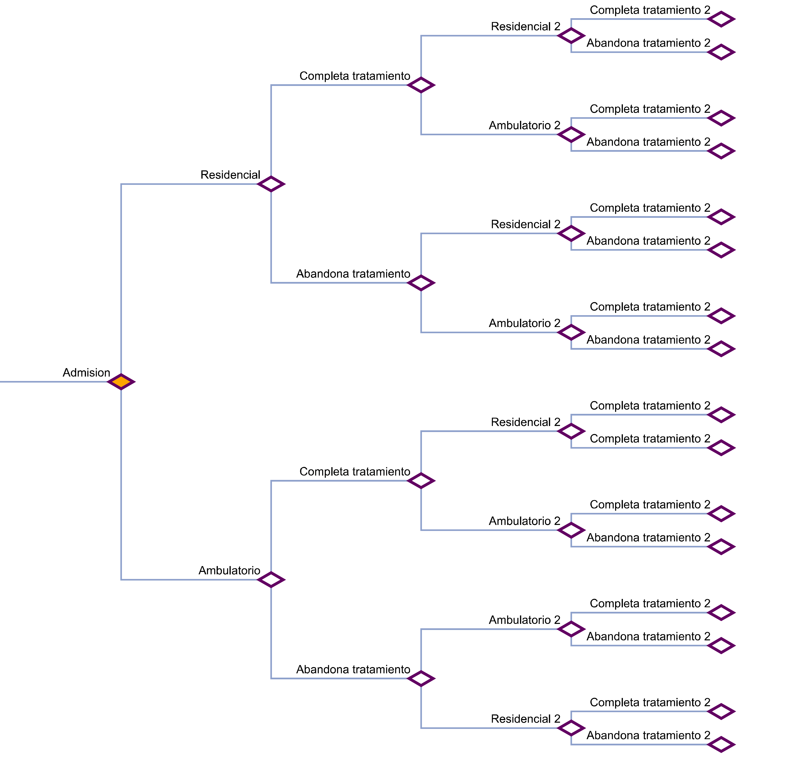

```{r setup_theme0, include = FALSE}
rm(list=ls());gc()
if(!grepl("4.1.2",R.version.string)){stop("Different version (must be 4.1.2)")}
#, 'libs/my-theme.css'
#load(paste0(sub("$\\/","",sub("2019 \\(github\\)/SUD_CL","2022 \\(github\\)",here::here())),"/11_pres.RData"))
options(servr.daemon = TRUE)
```

```{r setup, include = FALSE}
local({r <- getOption("repos")
       r["CRAN"] <- "http://cran.r-project.org" 
       options(repos=r)
})

if(!require(pacman)){install.packages("pacman")}
pacman::p_load(devtools, here, showtext, ggpattern, RefManageR, pagedown, magick, bibtex, DiagrammeR, xaringan, xaringanExtra, xaringanthemer, fontawesome, widgetframe, datapasta, tidyverse, psych, cowplot, coxphw, future, timereg, flexsurv, pdftools, mstate, showtext, compareGroups, chilemapas, choroplethrAdmin1,  choroplethr, choroplethrMaps, ggiraph, sf,distill, qrcode, pdftools, dagitty, ggdag,
               widgetframe, install=F)

if(!require(xaringanBuilder)){devtools::install_github("jhelvy/xaringanBuilder",upgrade = "never")}
if(!require(icons)){remotes::install_github("mitchelloharawild/icons",upgrade = "never")}

test_fontawesome<- function(x="github"){
tryCatch({
  invisible(fontawesome::fa(name = x))
  return(message("fontawesome installed"))
},
# ... but if an error occurs, tell me what happened: 
error=function(error_message) {
  message("Installing fontawesome")
  icons::download_fontawesome()  
})
}
vec_col<-c("#660600","#6F3930","#745248","#786B60","#E6E6E6","#738FBC","#003891","#3C5279","#786B60","#B48448","#EF9D2F","#D99155","#E3D1C2","#E0BC9E","#ABB0BF","#835F69","#5A0D13")
plot_prueba<-barplot(1:length(vec_col), col=vec_col)

#https://github.com/yihui/xaringan/issues/260
#https://coolors.co/21177a-fe4a17-788aa3-45503b
style_duo( 
  primary_color = "#E6E6E6", ##E6E6E6
  secondary_color = "#003891",
  text_color = "#2f353b", 
  text_bold_color = "#EF9D2F", ##92B6B1   #fdecef  #F9C784   ##CAE7B9 ##BDC667 ##B9D8C2 ##591F0A ##D6FFF6 #45503B
  #base_color = '#aaaaaa',
#  background_color = 'white',
  background_position = 'center',
  header_font_google = google_font("Arial Narrow"),
  text_font_google   = google_font("Arial", "400", "400i"),
  code_font_google   = google_font("Arial Narrow"),
  code_font_size = '53%', #sirve
  padding = "0.4em 2.4em 0.4em 2.4em",
  extra_fonts = list(google_font("Arial Narrow")),
  title_slide_background_image = "./_figs/bg_portada.svg",
  title_slide_background_size = "cover",
  background_image = "./_figs/bg.svg",
  background_size = "cover",
  extra_css =
  list(
  ".remark-slide-scaler" = list("overflow-y" = "auto"), # para no tener limites de extensión
 # ".remark-slide-number" = list("display" = "none"), #oculta el reloj también
 # "pre"= list("line-height"= "0.2em"),
  ".gray"   = list(color = "#aaaaaa"),
  ".red"   = list(color = "#A4222B"),
  ".darkgreen"   = list(color = "#45503B"),
  ".darkred"   = list(color = "#591F0A"),
  ".small" = list("font-size" = "90%"),
  ".pull_c" = list("float" = "center","width" = "30%", "height" = "50%", "padding-left" = "40%"),
  ".pull_c_title" = list("height" = "90%"),
  ".pull_l_70" = list("float"= "left","width"= "72%", "font-size"= "90%"),
  ".pull_r_30" = list("float"= "right","width"= "23%", "font-size"= "90%"),
  ".pull_left"  = list("float"= "left","width"= "47%", "height"= "100%", "padding-right"= "2%"),
  ".pull_right" = list("float"= "right","width"= "47%", "height"= "100%", "padding-left"= "2%"),
  ".small_left"  = list("float"= "left", "width"= "47%", "height"= "50%", "padding-right"= "2%"),
  ".small_right" = list("float"= "right","width"= "47%", "height"= "50%", "padding-left"= "2%"),
  ".left_code" = list("float"="left","width"="47%","height"="100%","padding-right"="2%",    "font"="Roboto"),
  ".code_out"  = list("float"="right","width"="47%","height"="100%","padding-left"="2%",    "font"="Roboto"),
  ".text_180" = list("font-size" = "180%"),
  ".text_170" = list("font-size" = "170%"),
  ".text_160" = list("font-size" = "160%"),    
  ".text_150" = list("font-size" = "150%"),
  ".text_140" = list("font-size" = "140%"),  
  ".text_130" = list("font-size" = "130%"),
  ".text_120" = list("font-size" = "120%"),
  ".text_110" = list("font-size" = "110%"),
  ".text_110" = list("font-size" = "110%"),
  ".text_100" = list("font-size" = "100%"),
  ".code_10" = list("code-inline-font-size"= "60%",
                    "overflow-y" = "scroll !important",
                    "overflow-x" = "scroll !important",
                    "max-height" = "5vh !important",
                    "line-height"= "0.75em"),
   ".code_10_pre" = list("code-inline-font-size"= "60%",
                    "overflow-y" = "scroll !important",
                    "overflow-x" = "scroll !important",
                    "max-height" = "15vh !important",
                    "line-height"= "0.75em",
                    "min-height"="0.5em"
                    ),
  ".code_15" = list("code-inline-font-size"= "15%",
                    "overflow-y" = "scroll !important",
                    "overflow-x" = "scroll !important",
                    "max-height" = "10vh !important"),
  ".text_90" = list("font-size" = "90%"),
  ".text_80" = list("font-size" = "80%"),
  ".text_70" = list("font-size" = "70%"),
  ".text_65" = list("font-size" = "65%"),
  ".text_60" = list("font-size" = "60%"),
  ".text_50" = list("font-size" = "50%"),
  ".text_40" = list("font-size" = "40%"),
  ".text_30" = list("font-size" = "30%"),
  ".text_20" = list("font-size" = "20%"),
  ".line_space_15" = list("line-height" = "1.5em;"),
  ".line_space_13" = list("line-height" = "1.3em;"),
  ".line_space_11" = list("line-height" = "1.1em;"),
  ".line_space_15" = list("line-height" = "1.5em;"),
  ".line_space_09" = list("line-height" = "0.9em;"),
  ".line_space_07" = list("line-height" = "0.7em;"),
  ".line_space_05" = list("line-height" = "0.5em;"),
  ".largest" =  list("font-size" = "2.488em;"),
  ".larger" =  list("font-size" = "2.074em;"),
  ".large" =  list("font-size" = "1.44em;"),
  ".small" =  list("font-size" = "0.833em;"),
  ".smaller" =  list("font-size" = "0.694em;"),
  ".smallest" =  list("font-size" = "0.579em;"),
  ".limity150" = list("max-height" = "150px;",
                     "overflow-y" = "auto;"
      ),
    ".tiny_text" = list(
      "font-size"= "70%"
      ),
    ".large_text" = list(
      "font-size"= "150%"
      ),
    ".slide_blue" = list(
      "background-color" = "#FEDA3F",
      "color" = "#3C3C3B"
      ),
  ".center_image" = list(
    margin  = "0",
    position = "absolute",
    top      = "50%",
    left     = "50%",
    '-ms-transform' = "translate(-50%, -50%)",
    transform = "translate(-50%, -50%)"
    ),
    ".down_left" = list(
    margin  = "0",
    position = "absolute",
    top      = "80%",
    left     = "22%",
    '-ms-transform' = "translate(-50%, -50%)",
    transform = "translate(-50%, -50%)"
    ),
     ".down_right" = list(
    margin  = "0",
    position = "absolute",
    top      = "80%",
    left     = "72%",
    '-ms-transform' = "translate(-50%, -50%)",
    transform = "translate(-50%, -50%)"
    ),
    "slides > slide" = list(
    "overflow-x"  = "auto !important",
    "overflow-y" = "auto !important"
    ),
 #   "pre" = list(
#    "white-space"  = "pre !important",
#    "overflow-y" = "scroll !important",
#    "max-height" = "40vh !important",
#    "font-size" = "0.8em"
#    ),
    ".superbigimage" = list(
    "white-space"  = "nowrap",
    "overflow-y" = "scroll"
    )
  )
)

options(htmltools.preserve.raw = FALSE)


#knitr::opts_chunk$set(comment = NA) # lo saqué pa probar por si
knitr::opts_chunk$set(dpi=720)
#options(htmltools.preserve.raw = FALSE)#A recent update to rmarkdown (in version 2.6) changed how HTML widgets are included in the output file to use pandoc's raw HTML blocks. Unfortunately, this feature isn't compatible with the JavaScript markdown library used by xaringan. You can disable this feature and resolve the issue with htmlwidgets in xaringan slides by setting
#https://stackoverflow.com/questions/65766516/xaringan-presentation-not-displaying-html-widgets-even-when-knitting-provided-t/65768952#65768952


xaringanExtra::use_progress_bar(color = "#12636B", location = "top")#, height = "550px")
xaringanExtra::use_animate_css()
xaringanExtra::use_scribble() #son los lapices
xaringanExtra::use_tile_view()
xaringanExtra::use_panelset()
xaringanExtra::use_editable(expires = 1)
xaringanExtra::use_fit_screen()

#https://gist.github.com/gadenbuie/61b27108ceec6c7a55cd9966609128d7

# padding-top: 0.4em;
# padding-right: 2.4em;
# padding-bottom: 0.4em;
# padding-left: 2.4em;
invisible("https://www.youtube.com/watch?v=M3skTMQbCD0")
invisible("https://zane.lol/slides/adirondack/#39")
#https://titanwolf.org/Network/Articles/Article?AID=3896fe2c-1b3b-4ebd-9906-1f9ed1675b35#gsc.tab=0
#https://annakrystalli.me/talks/xaringan/xaringan.html#55
#https://bookdown.org/yihui/rmarkdown/some-tips.html
#https://arm.rbind.io/slides/xaringan.html#90
#https://stackoverflow.com/questions/62069400/font-size-of-figure-in-xaringan-slide-too-small
#https://irene.vrbik.ok.ubc.ca/blog/2021-07-14-xaringan-slides/

#https://evamaerey.github.io/doublecrochet/
#devtools::install_github("paulhendricks/anonymizer")
check_code <- function(expr, available){
  if(available){
    eval(parse(text = expr))
  } else {
    expr
  }
}
path2<-dirname(rstudioapi::getSourceEditorContext()$path)
#knitr::opts_chunk$set(message = FALSE,warning = FALSE, error = FALSE)

```


```{r, load_refs, include=F, eval=T, cache=FALSE}
library(RefManageR)
BibOptions(check.entries = FALSE,
           bib.style = "numeric",
           cite.style = "numeric",
           style = "markdown",
           super = TRUE,
           hyperlink = FALSE,
           dashed = FALSE)
warning(paste0("./_bib/My Collection.txt"))

myBib <- ReadBib("./_bib/My Collection.txt", check = FALSE)

```


class: title-slide, middle, right 

<br>

<br> 


<br> 

.line_space_15[ 
## .text_80[Modelos estructurales marginales para el control de<br>sesgos en estudios observacionales con factores de<br>riesgo y exposición tiempo-dependientes]
]

<br>

.line_space_11[
    
<br>

.text_70[[Código en: `r fontawesome::fa(name = "github")`](https://github.com/AGSCL/DSPUCH)]

.text_110[Seminario Métodos de Investigación en Salud Pública]

]

.bg-text[
`r withr::with_locale(new = c('LC_TIME' = 'es_ES'), code =format(Sys.time(),'%d de %B, %Y'))`

.text_100[Andrés González Santa Cruz]

.text_50[gonzalez.santacruz.andres@gmail.com] [`r fontawesome::fa(name = "github")`](https://github.com/AGSCL) [`r fontawesome::fa(name = "orcid", fill="green")`](https://orcid.org/0000-0002-5166-9121)
]
```{r echo=FALSE, out.width = '15%'}

```

???
*#_#_#_#_#_#_#_#_#_#_
**NOTA**
*#_#_#_#_#_#_#_#_#_#_

- Mi nombre es andrés gonzález y en esta instancia presentaré sobre los modelos estructurales marginales
- Decidí abordar un tema metodológico no tratado en clases, que les será útil para mi tesis y que podría ser útil para otros.
- 

---
layout: true
class: animated, fadeIn
---
## Índice

<br>

1. Problemática

2. Causalidad

3. Ajuste

4. Supuestos de aplicación

5. Aplicación hipotética

???
*#_#_#_#_#_#_#_#_#_#_
**NOTA INDICE**
*#_#_#_#_#_#_#_#_#_#_
Primeras dos, repaso:
1- Origen de mi interés y problemática: factores de riesgo y exposición tiempo-dependientes: Ejemplo de arbol de decisiones y que al final obtenía puros efectos condicionales.
2- La tarea de la epidemiología, definicion de causalidad y de confusión. Distribución marginal vs. conjunta, etc. Datos observacionales.
3- Las formas. En una de esas, mostrar gif y animaciones (https://youtu.be/j8J2L_g76c4?t=68 o https://twitter.com/nickchk/status/1068215492458905600 / https://github.com/NickCH-K/causalgraphs/blob/master/Animation%20of%20IV.R / https://nickchk.com/causalgraphs.html).
4- Supuestos: SUTVA; Sesgos.Supuestos a la base, amenazas, sesgos, y particularmente sesgos que ocurren para este diseño de datos.
5- 

---
## Problemática

.panelset.sideways[

.panel[.panel-name[Estructura hipotética]

```{r p1-est, eval=T,  dev.args = list(bg = 'transparent'), echo=F, warning=FALSE, include=T, paged.print=TRUE, fig.align="center", fig.width = 7, fig.height = 5, out.width="70%", out.height="70%", error=T, dpi=750, fig.showtext=T}
# Libraries
library(ggplot2)

set.seed(2125)
# Create data
data <- data.frame(
  y=abs(rpois(1:250,15)),
  y2=abs(rpois(1:250,15))
) %>% 
  dplyr::filter(y2>y, y>=8, y2<=22) %>%
  dplyr::mutate(Paciente=row_number()) %>% 
  #filtrar tratamientos más largos que 3 años
  dplyr::mutate(diff_treat=y2-y) %>% 
  dplyr::filter(diff_treat<=3)

for (i in 1:nrow(data)){
   data$y3[i]<-base::sample(x=seq(from=data$y2[i]+1,to=22),1)
   data$y3[i]<-ifelse(data$y3[i]<=data$y2[i],22,data$y3[i])
   data$y3[i]<-ifelse(data$y3[i]>=23,22,data$y3[i])
   data$y4[i]<-ifelse(!is.na(data$y3[i]),base::sample(x=seq(from=data$y3[i]+1,to=22),1),22)
   data$y4[i]<-ifelse(data$y4[i]<=data$y3[i],22,data$y4[i])
   data$y4[i]<-ifelse(data$y4[i]>=23,22,data$y4[i])
}


set.seed(2125)
pac_aleatorio1<-sample(1:max(data$Paciente),40)
pac_aleatorio2<-setdiff(sample(1:max(data$Paciente),40), pac_aleatorio1)
# Horizontal version, antes era 1985
end_plot<-20

fig_trans<-ggplot(data) 
  ###>=10
  #datos de tratamiento en periodo de seguimiento, posterior al 2010
fig_trans<-try(fig_trans+geom_segment(data=dplyr::filter(data,y>=10,y2<=end_plot), aes(x=Paciente, xend=Paciente, y=y, yend=y2), color="#21177A", alpha=.6, size=.8))
  #datos de tratamiento en periodo de seguimiento, exceden el seguiemiento. linea entera hasta el 2020
fig_trans<-try(fig_trans+ geom_segment(data=dplyr::filter(data,y>=10,y2>end_plot), aes(x=Paciente, xend=Paciente, y=y, yend=end_plot), color="#21177A", alpha=.6, size=.8))
  #datos de tratamiento en periodo de seguimiento, exceden el seguiemiento. linea entrecortada despues del 2020
fig_trans<-try(fig_trans+geom_segment(data=dplyr::filter(data,y>=10,y2>end_plot), aes(x=Paciente, xend=Paciente, y=end_plot, yend=y2), color="#21177A", alpha=.6, linetype="dotted", size=.8))
  ###<10
  #datos de tratamiento en periodo de seguimiento, exceden el seguiemiento. linea entrecortada despues del 2020
fig_trans<-try(fig_trans+geom_segment(data=dplyr::filter(data,y<10), aes(x=Paciente, xend=Paciente, y=y, yend=10), color="#21177A", alpha=.6, linetype="dotted", size=.8))
  #datos de tratamiento en periodo de seguimiento, menos de 2010 pero sólo y1
fig_trans<-try(fig_trans+geom_segment(data=dplyr::filter(data,y<10,y2>=10,y2<=end_plot), aes(x=Paciente, xend=Paciente, y=10, yend=y2), color="#21177A", alpha=.6,  size=.8))

 fig_trans_final<-
   #Puntos
fig_trans+
     #Tratamientos completados
    geom_point(data=dplyr::filter(data,Paciente%in% sample(c(pac_aleatorio1,pac_aleatorio2),15)), aes(x=Paciente, y=y2), color="#21177A", size=3, alpha=.6) +
    theme_light() +
    coord_flip() +
    #fechas donde yo tomo gente
     annotate("rect", xmin=-Inf, xmax=Inf, ymin=10, ymax=10.5,
          alpha = .2, fill="blue")+
    annotate("rect", xmin=-Inf, xmax=Inf, ymin=19.5, ymax=20,
          alpha = .2, fill="blue")+
    theme(
      panel.grid.major.y = element_blank(),
      panel.border = element_blank(),
      axis.ticks.y = element_blank()
    )+
    scale_x_continuous(breaks=seq(1,max(data$Paciente),by=10))+
    scale_y_continuous(breaks=seq(min(data$y),max(data$y4),by=2), labels=seq(min(data$y),max(data$y4),by=2)+2000)+
   labs(y="Tiempo de seguimiento (en trimestres)", x="Individuos (ID)")+
  theme(plot.caption = element_text(hjust = 0, face= "italic"))+
   labs(caption="Punto= Completa treatmento;\nLínea azul= Tiempo en tratamiento;\nArea sombreada=Inicio y término seguimiento")+
  theme(
  panel.background = element_rect(fill = "transparent",
                                  colour = NA_character_), # necessary to avoid drawing panel outline
  #panel.grid.major = element_blank(), # get rid of major grid
  #panel.grid.minor = element_blank(), # get rid of minor grid
  plot.background = element_rect(fill = "transparent",
                                 colour = NA_character_), # necessary to avoid drawing plot outline
  legend.background = element_rect(fill = "transparent"),
  legend.box.background = element_rect(fill = "transparent"),
  legend.key = element_rect(fill = "transparent"))
 
 fig_trans_final
```

]

.panel[.panel-name[Árbol causal]
```{r, echo=FALSE, dev.args = list(bg = 'transparent'), fig.align="center", out.width=550, error=T}
#pdf_convert(paste0(getwd(),"/_figs/tree.pdf"), page = 1,dpi=1e3, filenames=paste0(getwd(),"/_figs/tree.jpg"))
#
translogo <- magick::image_read_pdf(paste0(getwd(),"/_figs/tree.pdf"),density=6e2,pages=1) %>% 
             magick::image_crop("4100x3900+700+500") %>% 
             magick::image_transparent('white') 
translogo
```

]

.panel[.panel-name[Análisis propuestos en esa oportunidad]

.superbigimage[
.text_50[
$$readmisión\sim A_{1 (Modalidad\,base)}+X_{2 (Completa\,tto.\,base)}+\epsilon$$
$$2^{da}\,readmisión\sim A_{1(Modalidad\,base)}+L_{2 (Completa\,tto.\,base)}+L_{3 (Completa\,2^{do}\,tto.)}+L_{4 (Días\,desde\,1^{er}\,ingreso)}+ \epsilon$$
$$3^{era}\,readmisión\sim A_{1(Modalidad\,base)}+ L_{2 (Completa\,tto.\,base)}+ L_{3 (Completa\,2^{do}\,tto.)}+ L_{4 (Completa\,3^{er}\,tto.)}+ L_{5 (Días\,desde\,1^{er}\,ingreso)}+\epsilon$$
$$4^{ta}\,readmisión\sim A_{1 (Modalidad\,base)}+ L_{2 (Completa\,tto.\,base)}+ L_{3 (Completa\,2^{do}\,tto.)}+ L_{4 (Completa\,3^{er}\,tto.)}+ L_{5 (Completa\,4^{to}\,tto.)}+ L_{6 (Días\,desde\,1^{er}\,ingreso)}+\epsilon$$
]
]

.center[**¿Cómo se reflejaría en un diagrama?**]

]

.panel[.panel-name[Esquema Diagrama Causal Simplificado]

```{r p2-dag, eval=T,  dev.args = list(bg = 'transparent'), echo=F, warning=FALSE, include=T, paged.print=TRUE, fig.align="center", out.width="60%", out.height="60%", error=T, dpi=750, fig.showtext=T}
#```{r, echo=F, dev.args = list(bg = 'transparent'), fig.align="center", out.width=550, error=T}
dag23 <- dagitty('dag {
bb="0,0,1,1"
"A0 (Modalidad tto. basal)" [exposure,pos="0.184,0.608"]
"A1 (Modalidad tto. 2)" [pos="0.451,0.605"]
"A2 (Modalidad tto. 3)" [pos="0.734,0.605"]
"L0 (Vector car. individuales)- Pareamiento" [adjusted,pos="0.121,0.397"]
"L1 (Días previos a la readmisión 2)" [adjusted,pos="0.507,0.341"]
"L2 (Días previos a la readmisión 3)" [adjusted,pos="0.691,0.365"]
"LM0(Completa tto. basal)" [adjusted,pos="0.269,0.707"]
"LM1 (completa tto. 2)" [adjusted,pos="0.566,0.714"]
"LM2 (completa tto. 3)" [adjusted,pos="0.838,0.722"]
"U0 (ej., factores genéticos)" [latent,pos="0.124,0.273"]
"U1 Car. indivudales (ej., patrón de consumo)" [latent,pos="0.444,0.829"]
"U2 Car. individuales T2" [latent,pos="0.733,0.814"]
"Y1(Readmisión)" [outcome,pos="0.355,0.604"]
"Y2(2da Readmisión)" [outcome,pos="0.626,0.605"]
"Y3(4ta Readmisión)" [outcome,pos="0.960,0.607"]
"A0 (Modalidad tto. basal)" -> "LM0(Completa tto. basal)"
"A0 (Modalidad tto. basal)" -> "Y3(4ta Readmisión)"
"A1 (Modalidad tto. 2)" -> "LM1 (completa tto. 2)"
"A2 (Modalidad tto. 3)" -> "LM2 (completa tto. 3)"
"L0 (Vector car. individuales)- Pareamiento" -> "A0 (Modalidad tto. basal)"
"L0 (Vector car. individuales)- Pareamiento" -> "Y1(Readmisión)"
"L1 (Días previos a la readmisión 2)" -> "Y2(2da Readmisión)"
"L2 (Días previos a la readmisión 3)" -> "Y3(4ta Readmisión)"
"LM0(Completa tto. basal)" -> "U1 Car. indivudales (ej., patrón de consumo)"
"LM0(Completa tto. basal)" -> "Y1(Readmisión)"
"LM0(Completa tto. basal)" -> "Y2(2da Readmisión)"
"LM0(Completa tto. basal)" -> "Y3(4ta Readmisión)"
"LM1 (completa tto. 2)" -> "U2 Car. individuales T2"
"LM1 (completa tto. 2)" -> "Y2(2da Readmisión)"
"LM1 (completa tto. 2)" -> "Y3(4ta Readmisión)"
"LM2 (completa tto. 3)" -> "Y3(4ta Readmisión)"
"U0 (ej., factores genéticos)" -> "L0 (Vector car. individuales)- Pareamiento"
"U0 (ej., factores genéticos)" -> "Y1(Readmisión)"
"U0 (ej., factores genéticos)" -> "Y2(2da Readmisión)"
"U0 (ej., factores genéticos)" -> "Y3(4ta Readmisión)"
"U1 Car. indivudales (ej., patrón de consumo)" -> "A1 (Modalidad tto. 2)"
"U1 Car. indivudales (ej., patrón de consumo)" -> "LM1 (completa tto. 2)"
"U2 Car. individuales T2" -> "A2 (Modalidad tto. 3)"
"U2 Car. individuales T2" -> "LM2 (completa tto. 3)"
"Y1(Readmisión)" -> "A1 (Modalidad tto. 2)"
"Y1(Readmisión)" -> "U1 Car. indivudales (ej., patrón de consumo)"
"Y2(2da Readmisión)" -> "A2 (Modalidad tto. 3)"
"Y2(2da Readmisión)" -> "U2 Car. individuales T2"
}')

tidy_dag23 <- tidy_dagitty(dag23) %>% 
  dplyr::mutate(label=dplyr::case_when(grepl("A0",as.character(name))~"A0",
                                       grepl("A1",as.character(name))~"A1",
                                       grepl("A2",as.character(name))~"A2",
                                       grepl("L0",as.character(name))~"L0",
                                       grepl("L1",as.character(name))~"L1",
                                       grepl("L2",as.character(name))~"L2",
                                       grepl("LM0",as.character(name))~"LM0",
                                       grepl("LM1",as.character(name))~"LM1",
                                       grepl("LM2",as.character(name))~"LM2",
                                       grepl("U0",as.character(name))~"U0",
                                       grepl("U1",as.character(name))~"U1",
                                       grepl("U2",as.character(name))~"U2",
                                       grepl("Y1",as.character(name))~"Y1",
                                       grepl("Y2",as.character(name))~"Y2",
                                       grepl("Y3",as.character(name))~"Y3",
                                       T~as.character(name))) %>% 
  dplyr::mutate(label2=dplyr::case_when(grepl("U",name)~"latent",grepl("L|LM",name)~"adj",grepl("LM",name)~"white",
                                       T~"black")) %>% 
  dplyr::mutate(adjusted=factor(dplyr::case_when(grepl("L|LM",name)~"adjusted",T~"unadjusted")))

dag23_plot<-
ggdag_status(tidy_dag23, text=F, shadow = T,use_labels="label") +#node_size = 12,text_size = 2.5, $ 
    theme_dag()+
#    coord_flip() +
    #scale_x_reverse(expand = expansion(c(0.1, 0.1)))+  
  #expand_plot(c(0.05, 0.05),c(0.2, 0.7))+
  scale_shape_manual(values = c(15, 16), name="Ajustado", labels=c("Sí", "No"))+ 
  scale_fill_manual(values = c("#003891", "#EF9D2F","gray30"), name="Estatus",na.value="black", labels=c("Exposición", "Resultado","No observado"), limits = c('exposure', 'outcome','latent'))+  
  scale_color_manual(values = c("#003891", "#EF9D2F","gray30"), name="Estatus",na.value="black", labels=c("Exposición", "Resultado","No observado"), limits = c('exposure', 'outcome','latent'))+#E6E6E6
  guides(linetype="none", edge_alpha="none")+
  guides(color=guide_legend(override.aes = list(arrow = NULL)))+#,guide_colourbar(order = 1)
  theme(plot.caption = element_text(hjust = 0))+
    labs(caption="Nota. Ak= Modalidad (Residencial/Ambulatoria); LMk= Completa tratamiento;\nL0= Confusores, características individuales y del centro a la base;Lk+= Días previos a la readmisión;\nYk= Resultadotratamiento; Uk=Car. no observadas para cada tiempo")

dag23_plot
```
<div class="centered"> ¿Qué ocurre con las modalidades en los tratamientos sucesivos?, ¿Confunden la asociación entre $A_0$ e $Y_3$?, ¿Sigue siendo causal en presencia de { $A_1$, $A_2$, $A_3$ }? </div>


]

.panel[.panel-name[Entonces...]

Debiesen analizarse otras estrategias que capturen efectos longitudinales, 

.text_60[
***"In longitudinal studies with time-dependent confounding, identifying the structure allows us to detect situations in which stratification-based methods would adjust for confounding at the expense of introducing selection bias (p. 622)"*** $`r Cite(myBib, c("Hernan2004"))`$
]

.red[¿Se puede responder a la pregunta de si haber asistido a tratamiento residencial a la base (A0) es beneficioso?, y si lo es, ¿qué régimen/estrategia es óptima o casi óptima? ] $`r Cite(myBib, c("Robins1986"))`$

]

]

???
*#_#_#_#_#_#_#_#_#_#_
**NOTA**
*#_#_#_#_#_#_#_#_#_#_
- Reviewer comment y respuesta
- Causal tree graph, L=0 y L=1 son los resultados del tratamiento (completa/no-completa), y los A son residencial/ambulatorio. Y= es readmisión
- Washout window, no hay


- La figura muestra distintas trayectorias de la cohorte. La entrada de paciente a la cohorte retrospectiva empieza a la fecha en que es admitido por primera vez en un tratamiento por uso de sustancias en el período de 2010-2019 y figura en las listas anuales del SENDA al 2010 al 2019 (independientemente si tienen tratamientos previos).
- **Punto**= Completa tratamiento;**Area sombreada**: Ventana de seguimiento;**Azul**=Tiempo en tratamiento

- **Censura administrativa**: entrega información SENDA (2019-11-13), 
- Otra censura ocurre después que se produce un evento de resultado competidor
- Cuando un paciente deja la cohorte sin experimentar resultados (ej, si se va fuera del país). 
- **Eventuales competidores**: tiempo en tratamiento (especialmente residenciales) o una sentencia **aunque debemos ver si es posible conocer este tiempo de censura**

- Tener presente esto para hacer gráficos lollipop
https://mail.google.com/mail/u/0/?shva=1#inbox/QgrcJHrtsHBpsxdHtqFBpKpBwvhZLdvTzZv?projector=1&messagePartId=0.1

---
class: center, middle

## Objetivos

Este proyecto apunta a introducir sobre modelos estructurales marginales para el control de sesgos en estudios observacionales con factores de riesgo y exposición tiempo-dependientes


???
*#_#_#_#_#_#_#_#_#_#_
**NOTA**
*#_#_#_#_#_#_#_#_#_#_

We simulate a simple dataset with a time-varying exposure. The data, collected at two time points, t = (0, 1), include a binary outcome measured at the end of follow up Y (1), a binary exposure at two time points {X(0),X(1)}, and a binary confounder of the exposure-outcome relationship that is also affected by prior exposure L(1). L(1) is related to the outcome by the common cause U, which we consider to be unmeasured. This particular simulation setup has been used previously to illustrate other causal inference methods.(Robins y Hernan, 2009) It addresses a central feature of the Bayesian g-formula: control of confounding by covariates that may also be affected by exposure.


- The data are simulated as follows:

U ~ uniform(0.4, 0.5)
X(0) ~ Bernoulli(0.5)
L(1) ~ Bernoulli(logit−1(−1 + X(0) + U))
X(1) ~ Bernoulli(logit−1(−1 + X(0) + L(1)))
Y ~ Bernoulli(U + (X(0) + X(1))/2 * rd(1̄ ,0̄ ))

---
## Causalidad


???
*#_#_#_#_#_#_#_#_#_#_
**NOTA**
*#_#_#_#_#_#_#_#_#_#_

potential outcomes framework (Neyman, 1923; Rubin, 1974).
AT E = E[Y (1) -Y(0)]
- estimates of effect that may fail to have a causal interpretation,
 even when confounding by unmeasured factors and model specification are absent
- assuming exchangeability, consistency, and positivity
https://www.ucl.ac.uk/population-health-sciences/sites/population_health_sciences/files/daniel.pdf

- assumes “stable-unit-treatment-value assumption (SUTVA)” (Rubin 1980) [PONER EL MEME]
- falta de intercambiabilidad entre expuestos y no-expuestos, no-comparabilidad (A structural approach to selection bias) -noncomparability (also referred to as lack of exchangeability) between the exposed and the unexposed.

- Consistency: If an individual has observed exposure A = a then their observed outcome Y is equal to Y(a). 
- Positivity: There must be a non zero chance of being assigned to each exposure value A = a.
- Conditional Exchangability: Since Y(a) is unobserved, it is necessary to assume conditional exhangability. That is the counterfactual outcome is independent of the exposure, given the confounders L of the data. (Y(a) ⊥⊥ A|L)
What would have happened if the research assistants had misinterpreted our instructions and had treated the grey group rather the white group?
How does this reversal of treatment status affect our conclusions?
Not at all.
The counterfactual outcome and the observed treatment are independent
Treated and untreated would have experienced the same risk of death if they had received the same treatment.

- Asumimos NO Measurement Bias

- Explicar causal approach, contrafactual, ajustre por confusión, hay métodos que restringen y otros que estandarizan
- En las clases abordamos a structural approach to selection bias y en What if se mencionó someramente sobre estos mecanismos.
- De ahí que surgieron algunas dudas

---
## Mecanismos de identificación

<br>


???
*#_#_#_#_#_#_#_#_#_#_
**NOTA**
*#_#_#_#_#_#_#_#_#_#_


---
## Aplicación

```{r tab-comp, echo=T, cache= T, paged.print=TRUE, message=F, error=T, warning=F, include=F}
dataurls <- list()
dataurls[[1]] <- 
  "https://cdn1.sph.harvard.edu/wp-content/uploads/sites/1268/2012/10/nhefs_sas.zip"
dataurls[[2]] <- 
  "https://cdn1.sph.harvard.edu/wp-content/uploads/sites/1268/2012/10/nhefs_stata.zip"
dataurls[[3]] <- 
  "https://cdn1.sph.harvard.edu/wp-content/uploads/sites/1268/2017/01/nhefs_excel.zip"
dataurls[[4]] <- 
  "https://cdn1.sph.harvard.edu/wp-content/uploads/sites/1268/1268/20/nhefs.csv"
temp <- tempfile()
for (i in 1:3) {
  download.file(dataurls[[i]], temp)
  unzip(temp, exdir = "data")
}
download.file(dataurls[[4]], here::here("data", "nhefs.csv"))

nhefs <- haven::read_dta("data/nhefs.dta")


# some preprocessing of the data
nhefs$survtime <- ifelse(nhefs$death==0, NA, (nhefs$yrdth-83)*12+nhefs$modth) # * yrdth ranges from 83 to 92

# model to estimate E[A|L]
modelA <- glm(qsmk ~ sex + race + age + I(age*age)
              + as.factor(education) + smokeintensity
              + I(smokeintensity*smokeintensity) + smokeyrs
              + I(smokeyrs*smokeyrs) + as.factor(exercise)
              + as.factor(active) + wt71 + I(wt71*wt71),
              data=nhefs, family=binomial())

nhefs$p.qsmk <- predict(modelA, nhefs, type="response") 
d <- nhefs[!is.na(nhefs$survtime),] # select only those with observed death time
n <- nrow(d)

# define the estimating function that needs to be minimized
sumeef <- function(psi){
  
  # creation of delta indicator
  if (psi>=0){
    delta <- ifelse(d$qsmk==0 | 
                      (d$qsmk==1 & psi <= log(120/d$survtime)), 
                    1, 0)
  } else if (psi < 0) {
    delta <- ifelse(d$qsmk==1 | 
                      (d$qsmk==0 & psi > log(d$survtime/120)), 1, 0)
  }
  
  smat <- delta*(d$qsmk-d$p.qsmk)
  sval <- sum(smat, na.rm=T)
  save <- sval/n
  smat <- smat - rep(save, n)
  
  # covariance
  sigma <- t(smat) %*% smat
  if (sigma == 0){
    sigma <- 1e-16
  }
  estimeq <- sval*solve(sigma)*t(sval)
  return(estimeq)
}

res <- optimize(sumeef, interval = c(-0.2,0.2))
psi1 <- res$minimum
objfunc <- as.numeric(res$objective)


# Use simple bisection method to find estimates of lower and upper 95% confidence bounds
increm <- 0.1
for_conf <- function(x){
  return(sumeef(x) - 3.84)
}

if (objfunc < 3.84){
  # Find estimate of where sumeef(x) > 3.84
  
  # Lower bound of 95% CI
  psilow <- psi1
  testlow <- objfunc
  countlow <- 0
  while (testlow < 3.84 & countlow < 100){
    psilow <- psilow - increm
    testlow <- sumeef(psilow)
    countlow <- countlow + 1
  }
  
  # Upper bound of 95% CI
  psihigh <- psi1
  testhigh <- objfunc
  counthigh <- 0
  while (testhigh < 3.84 & counthigh < 100){
    psihigh <- psihigh + increm
    testhigh <- sumeef(psihigh)
    counthigh <- counthigh + 1
  }
  
  # Better estimate using bisection method
  if ((testhigh > 3.84) & (testlow > 3.84)){
    
    # Bisection method
    left <- psi1
    fleft <- objfunc - 3.84
    right <- psihigh
    fright <- testhigh - 3.84
    middle <- (left  + right) / 2
    fmiddle <- for_conf(middle)
    count <- 0
    diff <- right - left
    
    while (!(abs(fmiddle) < 0.0001 | diff < 0.0001 | count > 100)){
      test <- fmiddle * fleft
      if (test < 0){
        right <- middle
        fright <- fmiddle
      } else {
        left <- middle
        fleft <- fmiddle
      }
      middle <- (left + right) / 2
      fmiddle <- for_conf(middle)
      count <- count + 1
      diff <- right - left
    }
    
    psi_high <- middle
    objfunc_high <- fmiddle + 3.84
    
    # lower bound of 95% CI
    left <- psilow
    fleft <- testlow - 3.84
    right <- psi1
    fright <- objfunc - 3.84
    middle <- (left + right) / 2
    fmiddle <- for_conf(middle)
    count <- 0
    diff <- right - left
    
    while(!(abs(fmiddle) < 0.0001 | diff < 0.0001 | count > 100)){
      test <- fmiddle * fleft
      if (test < 0){
        right <- middle
        fright <- fmiddle
      } else {
        left <- middle
        fleft <- fmiddle
      }
      middle <- (left + right) / 2
      fmiddle <- for_conf(middle)
      diff <- right - left
      count <- count + 1
    }
    psi_low <- middle
    objfunc_low <- fmiddle + 3.84
    psi <- psi1
  }
}
round(c(psi, psi_low, psi_high),2)

1/exp(psi)

# the g-estimate ˆ from the rank-preserving structural AFT model was -0.05
#The number exp ³−ˆ= 105 can be interpreted as the median survival time that would havw been observed if  all individuals in the study had recieved a=1/(median survival time, si todos hubieran recibido a=0), survival time ratio.
#s little effect of smoking cessation  on the time to death.


#the few published applications of this method tend to use simplistic AFT models that do not allow for the treatment effect to vary across covariate values
```


---
class: center, middle

# Gracias!

<br>
  
<div class="centered"> Contacto: gonzalez.santacruz.andres@gmail.com </div>

<br>

<br>

<br>

.down_right[

```{r echo=FALSE, error=T, fig.align="center", message=FALSE, warning=FALSE, out.width=200}
par(mar=c(0,0,0,0))
image(qrcode::qr_code("https://agscl.github.io/DSPUCH/seminario.html"), 
      asp=1, col=c("white", "black"), axes=FALSE, alpha =c(.0,1), 
      xlab="", ylab="")
```

]

.down_left[

```{r, echo=FALSE,  fig.align="center", out.width=200, error=T}

```

]
  
---
## Referencias
  
```{r refs1, echo=FALSE, results="asis"}
PrintBibliography(myBib, start= 1, end= 7)
#https://github.com/ropensci/RefManageR/blob/master/R/rmdCite.R
```

---
## Referencias (2)
  
```{r refs2, echo=FALSE, results="asis"}
PrintBibliography(myBib, start= 8, end= 15)
#https://github.com/ropensci/RefManageR/blob/master/R/rmdCite.R
```

---
## Referencias (3)
  
```{r refs3, echo=FALSE, results="asis"}
PrintBibliography(myBib, start= 16, end= 24)
#https://github.com/ropensci/RefManageR/blob/master/R/rmdCite.R
```

```{r exp, eval=F,echo=F, results="asis"}
library(pagedown)

pagedown::chrome_print(gsub(".Rmd",".html",rstudioapi::getSourceEditorContext()$path),output="pres_2022_3.pdf")
xaringanBuilder::build_pdf(gsub(".Rmd",".Rmd",rstudioapi::getSourceEditorContext()$path),complex_slides = TRUE,output_file="pres_2022_4.pdf")
xaringanBuilder::build_pdf(gsub(".Rmd",".Rmd",rstudioapi::getSourceEditorContext()$path),complex_slides = TRUE,output_file="pres_2022_5.pdf")
```
